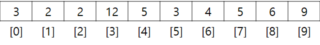
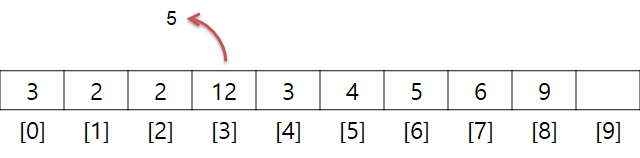
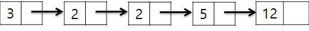
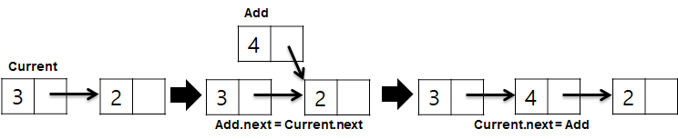
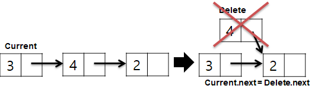

# 배열 vs. 링크드 리스트

## 요약

---

## 배열

- 논리적 저장 순서와 물리적 저장 순서가 일치하는 자료구조
- 인덱스`Index`를 통해 해당 원소`Element`에 접근 가능
- 인덱스는 `0`부터 시작하며, 크기가 `n`일 경우 접근할 수 있는 인덱스의 최댓값은 `n-1`
- 인덱스를 통해 찾을 수 있다는 것은 찾고자 하는 위치만 알고 있다면 `O(1)` 속도로 접근 가능하며, 이는 임의 접근`Random Access`이 가능한 것을 의미

### 배열의 문제점
- 배열은 한번 생성한 후 원소의 추가/삭제 수행 시 작업을 따로 해줘야 함

- 삭제를 예로 들면, 3번째 원소를 지우려고 할 시, 삭제한 인덱스보다 큰 원소들을 우측으로 shift 처리해야 함
- 배열 개수도 이에 맞춰 주고 싶다면 기존 배열보다 1 작은 크기로 새로 생성, 복제를 수행
- 이 경우 최악의 경우 모든 원소를 shift해야 하기 때문에 `O(n)`이 발생 -> 삽입도 동일

## 링크드 리스트(Linked List)

- 배열과 달리 추가/삭제가 용이한 자료구조 각 원소들은 자기 자신 다음 원소가 어떤 것인지만 기억
- 여기서 다음 것만 기억하고 이전 것을 기억하지 못하는 것을 단일 연결 리스트`Single Linked List`라 함

### 추가

- 배열과 달리 다음 원소 정보를 기억하는 `next`를 가지는데, 이것을 노드`Node`라 함
- 해당 위치에 추가를 원할 경우,
  - 위치에 있는 노드`Current`와 `next`를 추가하려는 노드`Add`의 `next`가 참조
  - 노드`Current`의 `next`가 `Add`를 참조하면 됨

### 삭제

- `Current`가 삭제하려는 노드`Delete`의 `next`를 참조하면 됨
- 결과적으로 추가/삭제가 `O(1)`이 됨

### 문제점

- 링크드 리스트의 단점은 배열과 달리 임의 접근이 아닌 순차적 접근 => **특정 위치의 원소를 찾는데 필요한 시간은 `O(n)`**
- 이는 배열과 달리 논리적 저장 순서와 물리적 저장 순서가 일치하지 않기 때문
- 이로 인해 찾아서 추가/삭제를 수행하기 때문에 `O(n)`의 수행 시간을 거침
- 그렇다고 마냥 의미 없는 자료구조는 아님, 트리`Tree` 등 유용한 알고리즘의 근간이 되기 때문에 기본적으로 학습이 필요한 자료구조 중 하나