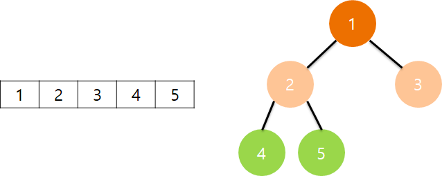
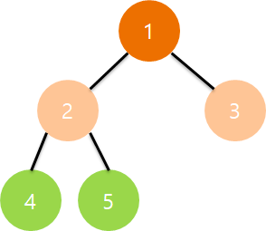

# 트리(Tree)

## 요약

- 비선형 자료 구조로, 원소가 계층으로 나뉘어진 방향성 있는 비순환 그래프이다
- 트리는 데이터를 담고 있는 노드와 노드 간 연결 짓는 간선으로 구성되어 있다

---

## 트리 구조

- 비선형 자료구조
- 일반적으로 배열은 원소가 순차적으로 나열되어 있으나, 트리`Tree`는 원소가 계층으로 나뉘어져 있음
- 배열의 경우, 원소를 찾기 위해 순차적으로 확인 => `O(n)`
- 트리의 경우 분기를 나눠서 찾기 때문에 `O(logn)`
  - ex. 5를 찾을 경우
    - `1 -> 2 -> 5` 과정을 거침
    - 이때마다 검색 범위가 반토막으로 건너 뛰게 됨
    - 따라서 `log_{2}` 단위의 검색 속도가 나오는 것

## 트리 구성 요소

- 트리는 원소를 담고 있는 노드`Node`가 있음 => 데이터의 단위
- 그리고 각 노드를 잇는 선을 간선`Edge`라 함
- 노드는 위치에 따라 명칭이 존재
  - 루트 노드`Root Node`: 최상위 노드
  - 단말 노드`Leaf Node`: 가장 아래에 다른 노드가 연결되지 않은 노드
  - 내부 노드`Internal Node`: 단말 노드를 제외한 모든 노드(루트 노드도 포함)

## 트리 특징
- 그래프의 한 종류, 방향성이 있는 비순환 그래프`Directed Acyclic Graph(DAG)`
- 사이클이 불가능해, 자체 간선(자기 자신을 연결`Self-loop`)이 불가능
- 임의의 두 쌍의 노드를 잇는 간선은 `유일함` => 노드의 개수가 `n`개면 간선의 개수는 `n-1`개