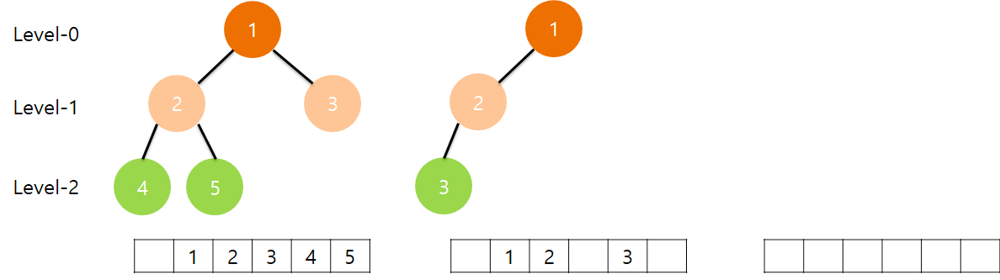
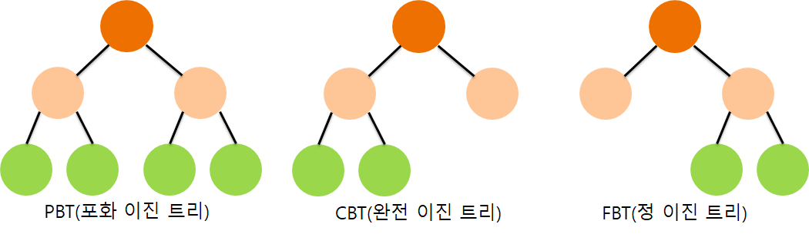

# 이진 트리(Binary Tree)

## 요약

- 루트 노드를 중심으로 두개의 서브 트리로 나눠지는 트리형 자료 구조
- 트리는 Level을 통해 가장 얕은 깊이를 기준으로 0부터 시작하고, 전체 깊이를 의미하는 높이라는 개념이 있다
- 트리가 잘 구성되어 있다면 탐색 속도를 빠르게 높일 수 있다

---

- 루트 노드`Root Node`를 중심으로 두개의 서브 트리`Sub-tree`(큰 트리에 속하는 작은 트리)로 나뉘어지는 트리

## 구성

- 일반적으로 트리는 최대 2개의 노드를 가지는 이진 트리를 많이 사용
  - 루트 노드를 기준으로 깊이`Depth`를 `Level-0`이라 표현 -> Level은 트리의 층을 의미
  - 그리고 트리의 최고 레벨은 높이`Height`라고 함 -> 위 그림의 **높이는 2**
  - 또한 자식 노드가 2개가 아니더라도 이진 트리라고 할 수 있으며, **노드가 아예 존재하지 않는 공집합도 이진트리에 포함**
- 이진 트리는 배열로도 표현이 가능
  - 노드가 없는 경우 배열 값을 넣지 않음
  - 노드의 개수가 n개라 가정, 
    - 루트 노드가 인덱스 `1`부터 시작한다면,
      - `i번째 노드`에 대해서, 부모=`i/2`, 좌측 자식=`2i`, 우측 자식=`2i+1`
    - 루트 노드가 인덱스 `0`부터 시작한다면,
      - `i번째 노드`에 대해서, 부모=`(i-1)/2`, 좌측 자식=`2i+1`, 우측 자식=`2i+2`

## 종류

- 포화 이진 트리`PBT`: 모든 레벨이 꽉찬 트리
- 완전 이진 트리`CBT`: 좌측부터 우측까지 순서대로 쌓인 트리
- 정 이진 트리`FBT`: 모든 노드가 0개이거나, 2개의 자식 노드를 가지는 트리 -> 적정 이진 트리`Proper Binary Tree(PBT)`라고도 함

## 사용처
- 탐색에 용이하게 사용됨
- 트리 구성이 잘되어 있다면 탐색을 하는데 모든 요소를 찾지 않고, **절반에 가까운 원소를 배제해서 찾아** 순회해서 찾는 것보다 훨씬 효율적으로 찾게 됨
