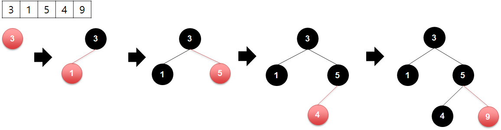
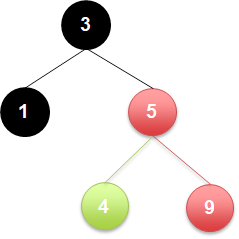
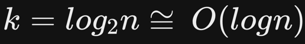
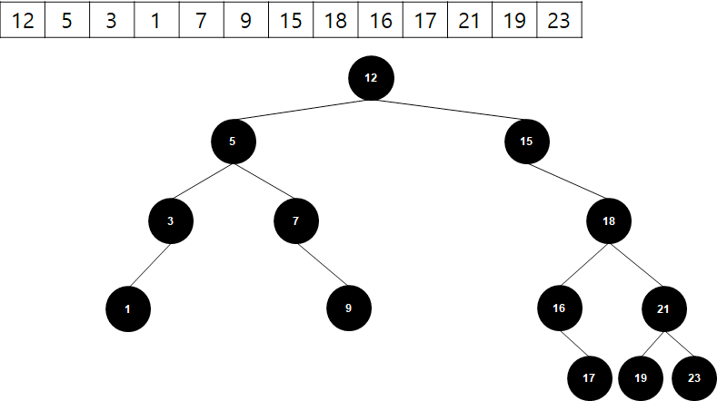
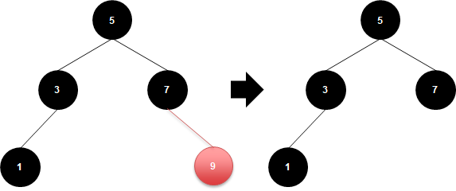
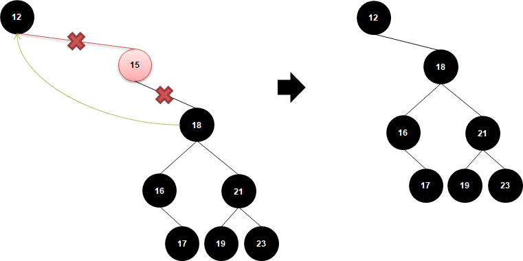
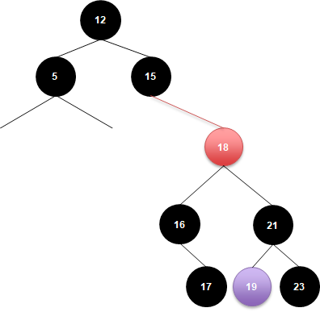
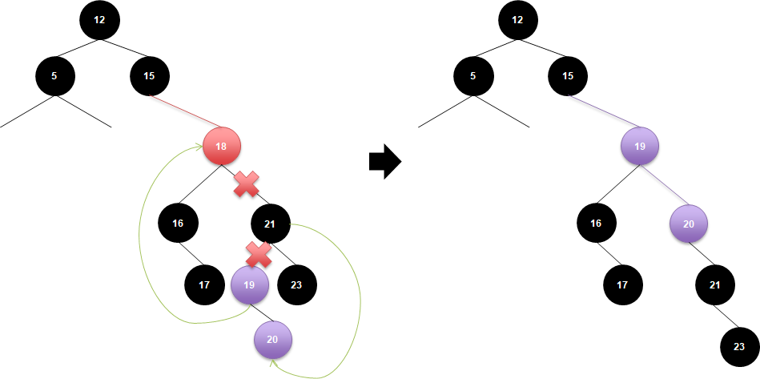

# 이진 탐색 트리(삽입, 검색, 삭제)

- 이진 탐색`Binary Search`과 링크드 리스트`Linked List`를 결합한 자료구조의 일종
- 두개의 자식 노드를 가졌으며(하나를 `left`, 하나를 `right`라 명명), 현재 노드의 `left` 노드 값은 현재보다 작으며, `right` 노드 값은 현재보다 크도록 구성

## 삽입


- 트리가 `left`는 부모보다 작고, `right`는 부모보다 크게 구성해야 함


### 삽입 코드

```java
public void add(int value){
    if (rootNode == null) {
        rootNode = new DoubleLinkedList();
        rootNode.setValue(value);
        return;
    }

    if (rootNode.getValue() >= value) {
        if (null != rootNode.getLeftNode()) {
            add(rootNode.getLeftNode(), value);
        }
        else {
            rootNode.setLeftNode(new DoubleLinkedList());
            rootNode.getLeftNode().setParentNode(rootNode);
            rootNode.getLeftNode().setValue(value);
        }
    } else {
        if(null != rootNode.getRightNode()) {
            add(rootNode.getRightNode(), value);
        }
        else {
            rootNode.setRightNode(new DoubleLinkedList());
            rootNode.getRightNode().setParentNode(rootNode);
            rootNode.getRightNode().setValue(value);
        }
    }
}

private void add(DoubleLinkedList node, int value){
    if (null == node)
        return;

    if (node.getValue() >= value){
        if (null != node.getLeftNode()) {
            add(node.getLeftNode(), value);
        }
        else { 
            node.setLeftNode(new DoubleLinkedList());
            node.getLeftNode().setParentNode(node);
            node.getLeftNode().setValue(value);
        }
    } else {
        if (null != node.getRightNode()) {
            add(node.getRightNode(), value);
        }
        else {
            node.setRightNode(new DoubleLinkedList());
            node.getRightNode().setParentNode(node);
            node.getRightNode().setValue(value);
        }
    }
}
```

## 검색

- 구성된 트리에서 `4`를 찾는다 가정
  1. 트리 진입 시 `3`을 봄
  2. `4`는 `3`보다 크기 때문에 `left` 노드를 스킵, `right` 노드 진입
  3. 다음 노드에서 `5`를 보고, `4`는 `5`보다 작기 때문에 `right` 노드 스킵, `left` 노드 진입
  4. `4`를 찾을 수 있음
- 이러한 방식으로 진행 시 순회하며 검색`O(n)` 보다, 한번 검색할 때마다 검색 범위가 절반으로 줄어듦
- 노드의 개수가 `2^k(트리 높이)`라 가정할 때, 한번 진입할 때마다 높이를 빼고 내려가므로 높이 개수`k`만큼만 검색을 수행
- 따라서 아래와 같은 수식의 속도를 기대할 수 있음
  
- 코드를 보면 아래와 같음

### 검색 코드
```java
private DoubleLinkedList findNode(int value){
    if(rootNode.getValue() == value)
        return rootNode;

    DoubleLinkedList node = null;
    if(rootNode.getValue() > value){
        node = findNode(rootNode.getLeftNode(), value);
    }
    else if(rootNode.getValue() < value){
        node = findNode(rootNode.getRightNode(), value);
    }

    return node;
}
private DoubleLinkedList findNode(DoubleLinkedList node, int value){
    if(null == node)
        return null;

    DoubleLinkedList node2 = null;
    if(node.getValue() > value){
        node2 = findNode(node.getLeftNode(), value);
    }
    else if(node.getValue() < value){
        node2 = findNode(node.getRightNode(), value);
    }
    else{
        node2 = node;
    }
    return node2;
}
```

## 삭제
- 3가지 전제 조건을 가지고 처리
  1. 삭제하려는 노드의 자식 개수 0
  2. 삭제하려는 노드의 자식 개수 1
  3. 삭제하려는 노드의 자식 개수 2



### 자식 개수 0개

- 간단하게 해당 노드 삭제

### 자식 개수 1개

- 이 경우 해당 노드의 부모와 자식 노드를 연결하고 삭제해야할 노드 연결을 끊어주면 됨
- 예제를 기준으로 설명하자면, 부모 노드인 `12`가 삭제 노드의 `right` 자식인 `18`을 참조하면 됨

### 자식 개수 2개
- 기준을 먼저 정해야 함
  1. 삭제해야할 노드의 `left`에 있는 **가장 높은 수**를 가진 노드
  2. 삭제해야할 노드의 `right`에 있는 **가장 작은 수**를 가진 노드
- 일반적으로 `2번` 안을 선택



- 예제로 본다면 `18`을 가진 노드의 right 중 가장 작은 노드는 `19`



1. 삭제해야할 노드에 위치할 노드를 정함
   1. left 노드 내 가장 큰 노드
   **2. right 노드 내 가장 작은 노드**
2. 정해진 노드(기준 노드라 명명)를 삭제해야할 노드의 위치에 포지셔닝
3. 기준 노드에 삭제된 노드의 `left`, `right` 노드들을 추가 -> 자동으로 이진 탐색 트리의 규칙을 준수한 상태로 포지셔닝

### 삭제 코드
```java
public void delete(int value){
    DoubleLinkedList deleteNode = findNode(value);
    if(null == deleteNode)
        return;

    // 1. 자식이 없음
    if(deleteNode.getLeftNode() == null && deleteNode.getRightNode() == null){
        if(deleteNode == rootNode){
            rootNode = null;
            return;
        }

        var parentNode = deleteNode.getParentNode();
        if(deleteNode == parentNode.getLeftNode())
            parentNode.setLeftNode(null);
        else if(deleteNode == parentNode.getRightNode())
            parentNode.setRightNode(null);
        deleteNode.setParentNode(null);
    }
    // 2-1. 좌측에만 존재
    else if(deleteNode.getLeftNode() != null && deleteNode.getRightNode() == null){
        var leftNode= deleteNode.getLeftNode();
        if(deleteNode == rootNode){
            rootNode = leftNode;
        }else{
            var parentNode = deleteNode.getParentNode();
            if(deleteNode == parentNode.getLeftNode()){
                parentNode.setLeftNode(leftNode);

            }
            else if(deleteNode == parentNode.getRightNode()){
                parentNode.setRightNode(leftNode);
            }

            deleteNode.setParentNode(null);
            deleteNode.setLeftNode(null);
            deleteNode.setRightNode(null);
        }
    }
    // 2-2. 우측에만 존재
    else if(deleteNode.getLeftNode() == null && deleteNode.getRightNode() != null){
        var rightNode= deleteNode.getRightNode();
        if(deleteNode == rootNode){
            rootNode = deleteNode.getRightNode();
        }else{
            var parentNode = deleteNode.getParentNode();
            if(deleteNode == parentNode.getLeftNode()){
                parentNode.setLeftNode(rightNode);

            }
            else if(deleteNode == parentNode.getRightNode()){
                parentNode.setRightNode(rightNode);
            }

            deleteNode.setParentNode(null);
            deleteNode.setLeftNode(null);
            deleteNode.setRightNode(null);
        }
    }
    // 3. 자식이 두개 존재
    else{
        // 1. 기준 노드 -> 삭제 노드의 우측 자식 중 가장 작은 노드
        var minNode = deleteNode.getRightNode();
        while(null != minNode.getLeftNode())
            minNode = minNode.getLeftNode();

        if(null == minNode)
            return;

        // 2-1. 기준 노드 좌측에 삭제 노드의 좌측 노드 배치
        if(deleteNode.getLeftNode() != minNode){
            minNode.setLeftNode(deleteNode.getLeftNode());
        }
        // 2-2. 기준 노드 우측에 삭제 노드의 '최'우측 노드 배치
        if(deleteNode.getRightNode() != minNode){
            var minestNode = minNode;
            while(null != minestNode.getRightNode())
                minestNode = minestNode.getRightNode();
            minestNode.setRightNode(deleteNode.getRightNode());
            // 삭제 노드 좌측 노드 삭제
            deleteNode.getRightNode().setLeftNode(null);
        }
        // 2-3. 기준 노드를 삭제 노드 위치에 배치(삭제 노드의 부모 위치)
        if(null != deleteNode.getParentNode()){
            var parentNode = deleteNode.getParentNode();
            if(deleteNode == parentNode.getLeftNode()){
                parentNode.setLeftNode(minNode);
            }
            else if(deleteNode == parentNode.getRightNode()){
                parentNode.setRightNode(minNode);
            }
        }

        deleteNode.setParentNode(null);
        deleteNode.setLeftNode(null);
        deleteNode.setRightNode(null);
    }

}

private DoubleLinkedList findNode(int value){
    if(rootNode.getValue() == value)
        return rootNode;

    DoubleLinkedList node = null;
    if(rootNode.getValue() > value){
        node = findNode(rootNode.getLeftNode(), value);
    }
    else if(rootNode.getValue() < value){
        node = findNode(rootNode.getRightNode(), value);
    }

    return node;
}
private DoubleLinkedList findNode(DoubleLinkedList node, int value){
    if(null == node)
        return null;

    DoubleLinkedList node2 = null;
    if(node.getValue() > value){
        node2 = findNode(node.getLeftNode(), value);
    }
    else if(node.getValue() < value){
        node2 = findNode(node.getRightNode(), value);
    }
    else{
        node2 = node;
    }
    return node2;
}
```

# 소스 코드

[Github - Binary Search Tree](https://github.com/pray92/practice-algorithm/tree/master/Java/src/Utils)
