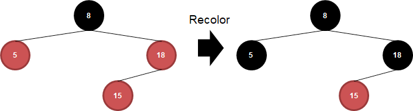

# Red-black Tree

- 이진 탐색 트리`Binary Search Tree`는 트리 구조로 원소를 저장하여 `O(logn)`의 검색 속도를 보여줌
- 그러나 **원소가 정렬된 상태로 들어오게 되면 위 그림처럼 저장되어 `O(n)`의 검색 속도를 보임**
- 이는 원소의 개수와 트리의 높이가 동일하기 때문

- 이를 개선하기 위해 나온 개념이 바로 적흑 트리`Red-black Tree`라고 함
- 각 노드에 색을 저장하는 공간을 추가해, 이를 기준으로 균형 이진 트리`Balanced Binary Tree`를 구성

## 구성 요소와 규칙

- 노드의 `red`와 `black` 색상을 추가로 가지고 있음
  - 마지막 단말 노드`Leaf Node`는 `nil`이라는 `black` 색의 빈 노드로 구성
  - `nil`의 경우 하나의 노드로 관리해서 메모리 절약도 가능
- 아래와 같은 규칙을 통해 균형을 맞춤
  1. **Root Property**: 루트 노드`Root Node`는 `black`
  2. **External Property**: 모든 단말 노드`Leaf Node`는 `black`
  3. **Internal Property**: `red` 노드의 자식 노드는 항상 `black` -> **Double red 불가**
  4. **Depth Property**: 각 노드로부터 해당 노드의 단말 노드로 가는 경로는 모두 `black` 개수가 일치

## 전략
- 루트 노드를 제외하고 모든 노드는 추가될 때마다 red로 초기화된 상태로 추가가 됨
- 그러다 보면 3번 규칙이 위배가 됨
- 이를 해결하기 위해 2가지 조건을 가지고 전략을 취함
  1. **Recoloring**
     - 조건: 삽입된 노드의 부모와 부모의 형제(삼촌이라 명명) 노드가 **서로 같을** 경우(둘 다 `red`)
     - 전략: 부모와 삼촌 노드를 `black`, 부모의 부모 노드를 `red`로 바꿔줌
  2. **Restructuring**
     - 조건: 삽입된 노드의 부모와 삼촌 노드가 **서로 다를** 경우
     - 전략: 삽입된, 부모, 부모의 부모 노드를 오름차순 정렬해, 중간 노드를 부모로 하고 `black`을, 나머지를 자식으로 하고 `red`로 바꿔줌

## 예제
- [8, 18, 5, 15, 17, 25, 40, 80]으로 `Red-black Tree` 구성

### Step 1: 8

- 루트 노드 추가 후 `black` 처리

### Step 2: 18

- 이후 무조건 `red`로 추가

### Step 3: 5

### Step 4: 15

- `15`가 추가되면서 `Double Red` 발생
- 이 경우 부모와 삼촌 노드 색이 같으므로 `Recoloring` 전략을 취함 -> 부모와 삼촌을 `black`
- 부모의 부모 노드도 `red`로 바꿔줘야 하나, 루트 노드이므로 `black` 유지

### Step 5: 17

- `17`이 추가되면서 `Double Red` 발생
- 이 경우 부모와 삼촌 색이 다름 -> `nil`은 항상 `black`
- `Restructuring` 전략을 통해,
  1. 삽입된, 부모, 부모의 부모 노드를 정렬
  2. 정렬된 결과에서 중간 노드를 부모로 하고 `black` 변경, 나머진 자식 처리 및 `red`로 변경

### Step 6: 25

- `Double Red` 발생, 부모와 삼촌 노드 색이 같으므로 `Recoloring`
- 이때는 부모의 부모 노드도 `red`으로 변경

### Step 7: 40

- `Double Red` 발생, 부모와 삼촌 노드 색이 같으므로 `Restructuring`

### Step 8: 80

- `Double Red` 발생, 부모와 삼촌 노드 색이 같으므로 `Recoloring`

- 여기서, `17`과 `25`에 `Double Red`가 또 발생, 이떄는 부모와 삼촌 노드 색이 서로 다르기 때문에 `Restruturing`

## 복잡도
| Algorithm | Average | Worst Case |
|:----------|:--------|:-----------|
| Space     | O(n)    | O(n)       |
| Search    | O(logn) | O(logn)    |
| Insert    | O(logn) | O(logn)    |
| Delete    | O(logn) | O(logn)    |

# Reference
[RedBlack Tree에 대해](https://nesoy.github.io/articles/2018-08/Algorithm-RedblackTree)

[알고리즘 ) Red-Black Tree](http://zeddios.tistory.com/237)