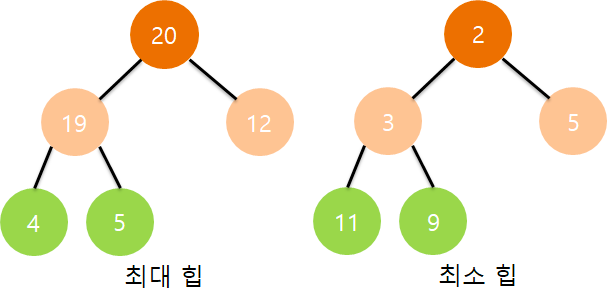

# 힙 트리

- 배열의 원소를 정렬하기 위한 구조 
- 우선순위 큐`Priority Queue` 구현에 핵심 개념
  - 큐와 동일하게 가장 앞에 있는 것을 빼오는 자료구조
  - 차이가 있다면 우선순위가 가장 높은 원소를 먼저 가져옴
- 힙`Heap`의 특성은,
  1. 완전 이진 트리`Complete Binary Tree`
  2. '반'정도 정렬된 상태, 노드의 부모는 자식 노드보다 우선순위가 높음

## 힙 종류

- 최대 힙`Max Heap`과 최소 힙`Min Heap`으로 나뉨
  - 최대 힙: 부모 노드의 키 값이 자식 노드의 키 값보다 크거나 같은 완전 이진 트리
  - 최소 힙: 부모 노드의 키 값이 자식 노드의 키 값보다 작거나 같은 완전 이진 트리

## 노드 관계
### 0-base
- 노드: `i`
- 부모: `i/2-1`
- 좌측 자식: `2i+1`
- 우측 자식: `2i+2`

### 1-base(구현을 편하게 하기 위해 0번 인덱스를 사용하지 않는 경우가 있음)
- 노드: `i`
- 부모: `i/2`
- 좌측 자식: `2i`
- 우측 자식: `2i+1`


## 삽입
```java
// 대표적인 정렬 로직 중 하나인 힙 소트(Heap Sort)는 최대 힙을 활용
// 현 로직은 최대 힙을 기준으로 작성(1-base)
public void insert(T x) {
    heap[size] = x;
    for(int i = size; i > 0; i /= 2) {
        if(heap[i] > heap[i / 2]) {
            swap(heap[i], heap[i / 2]);
        } else {
            break;
        }
    }
    ++size;
}
```
1. 힙에 새로운 요소가 들어오면 새로운 노드를 마지막에 삽입
2. 새로운 노드와 부모 노드를 우선순위를 비교해 타고 올라감

## 삭제
```java
T pop() {
    T ret = heap[1];
    heap[1] = heap[size];
    for(int i = 1; 2 * i < size; ) {
        if(heap[i] > heap[2 * i] && heap[i] > heap[2 * i + 1]) {
            break;
        }    
        
        if(heap[2 * i] >= heap[2 * i + 1]) {        // 좌측이 더 큰 경우
            swap(heap[i], heap[2 * i]);
            i = 2 * i;
        } else {                                    // 우측이 더 큰 경우
            swap(heap[i], heap[2 * i + 1]);
            i = 2 * i + 1;
        }
    }
    --size;
    return ret;
}
```
1. 최대 힙에서 최대 값은 루트 노드이므로 루트 노드를 삭제(그전에 결과를 보고 싶다면 삭제하기 전에 변수 저장 후 반환)
2. 삭제된 루트 노드에 마지막 노드를 가져옴
3. 힙 재구성

## heapify
- 힙을 구성하는데 통상적으로 쓰이는 메서드 이름
- 기준 인덱스를 매개변수로 받아와 해당 시점부터 힙을 구성하는 로직
- `n` 변수가 있는데, `해당 인덱스 - 1`까지만 구성한다 이해하면 됨 -> `Heap Sort`에 응용

```java
// heapify를 활용한 insert와 pop
public void insert(T x) {
    heap[++size] = x;
    for(int i = size / 2; i > 0; --i) {
        heapify(size, i);    
    }
}

public T pop() {
    T ret = heap[1];
    heap[1] = heap[size];
    heap[size--] = 0;
    
    heapify(size, 1);
    
    return ret;
}

private void heapify(int n, int i) {
    int parent = i;
    int lChild = 2 * i;
    int rChild = 2 * i + 1;


    if(lChild <= n && heap[parent] < heap[lChild]) {
        parent = lChild;
    }
    if(rChild <= n && heap[parent] < heap[rChild]) {
        parent = rChild;
    }

    if(i != parent) {
        swap(heap[i], heap[parent]);
        heapify(n, parent);
    }
}
```

## Java로 구현한 Heap 클래스
```java
public class Heap {
    private int[] heap = new int[1_000_000];
    private int size = 0;

    public void add(int x) {
        heap[++size] = x;
        for(int i = size / 2; i > 0; --i) {
            heapify(size, i);
        }
    }

    public int pop() {
        int ret = heap[1];
        heap[1] = heap[size];
        heap[size--] = 0;

        heapify(size, 1);

        return ret;
    }

    private void heapify(int n, int i) {
        int parent = i;
        int lChild = 2 * i;
        int rChild = 2 * i + 1;

        if(lChild <= n && heap[parent] < heap[lChild]) {
            parent = lChild;
        }
        if(rChild <= n && heap[parent] < heap[rChild]) {
            parent = rChild;
        }
        
        if(i != parent) {
            int tmp = heap[parent];
            heap[parent] = heap[i];
            heap[i] = tmp;
            heapify(n, parent);
        }
    }

    public boolean isEmpty() { return size == 0; }
}
```
