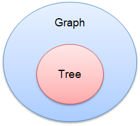
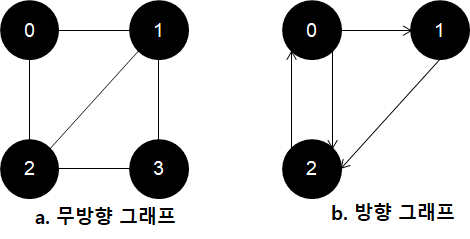
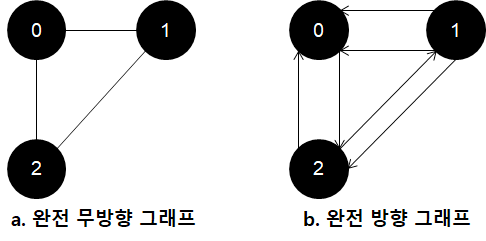
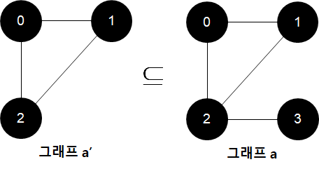
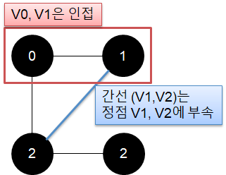
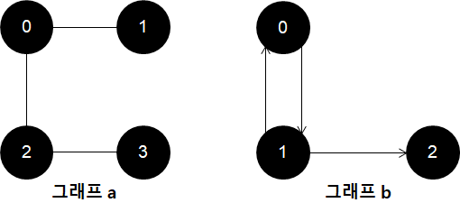
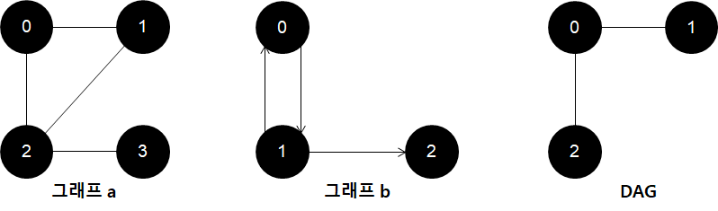
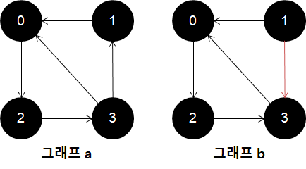
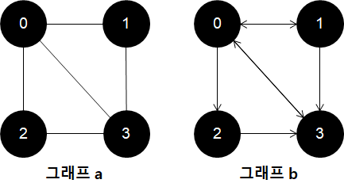

# 그래프

- 정점`Vertex`와 간선`Edge`의 집합 -> `G(V,E)`로 정의됨
  - `V`: 공백이 아닌 노드`Node` 혹은 정점`Vertex`의 유한 집합 -> 정점만 표기 시 `G(V)`
  - `E`: 서로 다른 두 정점을 잇는 간선`Edge`의 유한 집합 -> 간선만 표기 시 `G(E)`
  

- 트리`Tree`에도 있는 노드`Node`가 언급되면서 짐작할 수 있듯이, 트리도 그래프의 일종

## 방향/무방향 그래프

- V(a) = {0, 1, 2, 3}, E(a) = {(0, 1), (0, 2), (1, 2), (1, 3), (2, 3)}
- V(b) = {0, 1, 2}, E(b) = {<0, 1>, <0, 2>, <2, 0>, <1, 2>}

### 무방향 그래프
- 간선에 방향이 없는 그래프
- V0, V1라는 정점을 간선으로 이엇을 때, 간선 `(V0, V1)`, `(V1, V0)`는 똑같은 간선을 나타냄

### 방향 그래프
- 간선에 방향이 있는 그래프
- 모든 간선에 순서가 존재해, `V0`, `V1`라는 정점을 간선으로 이었을 때, `V0 -> V1`, `V1 -> V0`이 따로 존재
  - `V0 -> V1`는 `<V0, V1>`, `V1 -> V0`는 `<V1, V0>`라 표기

## 완전 그래프(Complete Graph)

- 간선을 최대한으로 가진 그래프
  - `n`개의 정점을 가진 **무방향 그래프**의 최대 간선 수는 `n(n-1)/2` 개
  - `n`개의 정점을 가진 **방향 그래프**의 최대 간선 수는 `n(n-1)` 개
- 방향 그래프의 최대 간선 수는 무향방 그래프의 2배라 생각하면 됨

## 부분 그래프(Sub-graph)

- 그래프`a`가 주어졌을 때 정점 `V(a')⊆V(a)`, `E(a')⊆E(a)` 경우, 그래프`a'`는 그래프`a`의 부분 그래프라고 함

## 인접(Adjacent), 부속(Incident)

- 무방향 그래프에 나오는 개념

### 인접
- 간선 `(V0, V1)`가 무방향 그래프`G`의 간선일 때 정점 `V0`, `V1`는 서로 **인접**

### 부속
- 간선 `(V0, V1)`가 무방향 그래프`G`의 간선일 때 간선 `(V0, V1)`는 정점 `V0`, `V1`에 **부속**

## 경로(Path)

- 그래프`a`와 같이 정점 `V0`부터 `V3`까지 간선으로 연결된 정점의 순서 리스트 `V0, V1, V2, V3`를 **경로**라 함
- 그래프`b`의 경우 **방향 경로**라 함

### 단순 경로
- 모두 상이한 간선으로 구성된경로
- 그래프`b`에선 `V0, V1, V2`는 **단순 경로**, `V0, V1, V0, V1, V2`는 단순 경로가 아님

## 사이클(Cycle)

- 첫번째 정점과 마지막 정점이 동일한 단순 경로를 의미
- 따라서 무방향 그래프에선 `사이클의 길이>=3`, 방향 그래프에선 `사이클의 길이>=2`
- 여기서 사이클이 존재하지 않는 그래프를 Direct Acyclic Graph`DAG`
- 예시에선 그래프`a`의 `V0 -> V1 -> V2 -> V0`이 사이클, 그래프`b`에선 `V0 -> V1 -> V0`이 사이클

## 강한&약한 연결

- 방향 그래프에서 나오는 개념

### 강한 연결
- 방향 그래프`G`에서 `V(G)`에 있는 서로 다른 모든 정점의 쌍 `u`와 `v`에 대해 `u -> v` 그리고 `v -> u`에 대한 방향 경로가 있는 경우
- 그래프`a`의 경우 모든 정점이 양방향으로 경로가 있어 강한 연결

### 약한 연결
- 강한 연결과 달리 둘 중 하나만 있는 경우
- 그래프`b`의 경우 `V1 -> V0`은 되나, `V0 -> V1`은 연결되지 않아 약한 연결

## 차수(Degree)

- 정점의 차수`Degree of Vertex`는 그래프에서 그 `정점에 부속된 간선의 수`를 의미

### 진입 차수(In-degree)&진출 차수(Out-degree)
- 방향 그래프에서 나오는 개념
- 정점`V`의 진입 차수`In-degree`는 정점`V`를 `head`로 하는 간선의 수
- 정점`V`의 진출 차수`Out-degree`는 정점`V`를 `tail`로 하는 간선의 수
- 예제 기준 그래프`a`의 정점 `V0`의 차수는 `3`, 그래프`b`의 정점 `V0`의 진입 차수는 `2`, 진출 차수는 `3` 