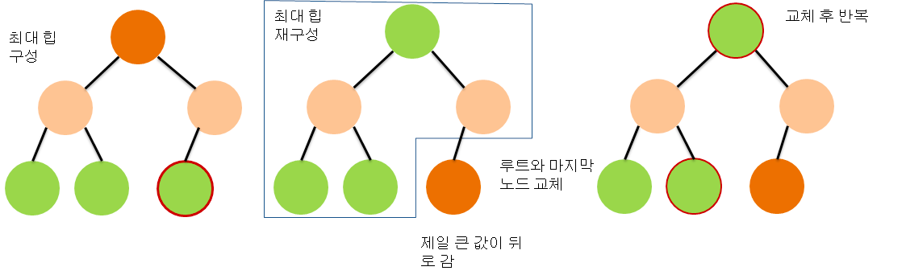

# 힙 정렬(Heap Sort)
- 자료구조 중 하나인 힙 트리`Heap Tree`를 응용해서 정렬하는 방식

## 힙 응용 방식

- 최대 힙`Max Heap`을 응용
- 최대 힙의 특성 중 하나인 **루트 노드 값이 다른 노드들 중에 제일 큰 값**이 있음
  1. 최대 힙으로 구성된 이진 트리의 루트 노드 값을 가장 뒤에 존재하는 노드와 값을 바꿈
     - 이때 가장 큰 값은 가장 뒤로 위치하게 됨 => 적절한 위치에 배치가 된 상태
  2. 가장 뒤에 있는 노드를 제외하고 힙을 재구성
  3. 현 시점의 마지막 노드 인덱스보다 한 칸 아래 쪽 노드와 루트 노드를 바꿈
  4. `1~3`번을 **0-base 기준 1번째 인덱스** 까지 반복
- 결국 최대 힙으로 구성되면 루트 노드가 가장 큰 수라는 점을 활용
  - 가장 큰 값을 가장 뒤로 위치시킴
  - 그 원소를 제외하고 힙 트리 구성을 반복

## 시간 복잡도
- 힙을 구성하는데 필요한 시간 복잡도: `O(logn)`
- 정렬의 시간 복잡도(힙 구성 `n`번 수행): `O(nlogn)`

## 소스 코드
```java
public void heapSort(int[] arr) {
    for(int i = n / 2 - 1; i >= 0; --i) {
        heapify(arr, n, i);    
    }    
    
    for(int i = n - 1; i > 0; --i) {
        swap(arr[0], arr[i]);
        heapify(arr, i, 0);
    }
}

private void heapify(int[] arr, int n, int i) {
    int parent = i;
    int lChild = 2 * i + 1;
    int rChild = 2 * i + 2;

    if(lChild < n && arr[parent] < arr[lChild]) {
        parent = lChild;
    }
    if(rChild < n && arr[parent] < arr[rChild]) {
        parent = rChild;
    }
    
    if(i != parent) {
        swap(arr[i], arr[parent]);
        heapify(arr, n, parent);
    }
}
```

## 활용성
- 힙 정렬은 시간 복잡도가 최선, 평균, 최악 모두 `O(nlogn)`
- 거기다 추가 메모리도 필요하지 않은 이상적인 알고리즘
- 그러나 실제로는 퀵 정렬(혹은 이를 기반한 팀 소트)을 사용
