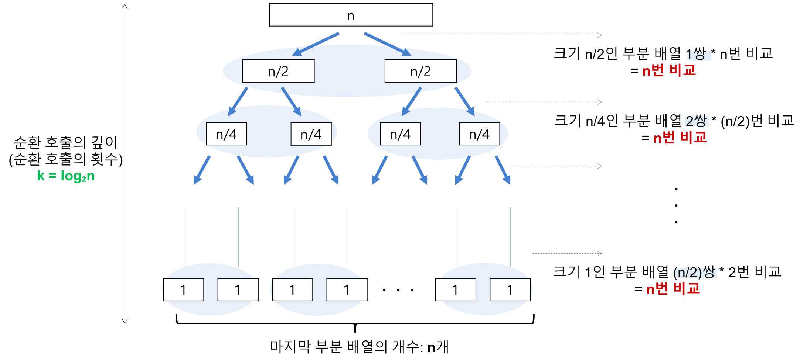
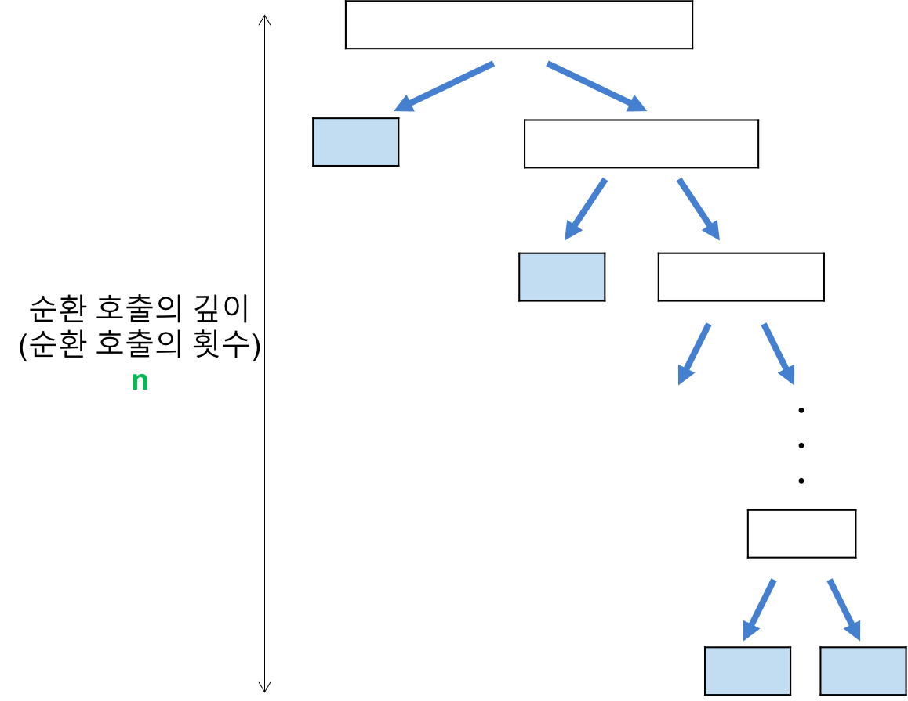

# 퀵 정렬
- 기준 원소`pivot`를 정해, **`pivot`보다 작은 것은 좌측으로, 큰 것은 우측으로 정렬**
  1. `pivot` 원소 지정
  2. 좌측 원소가 `pivot` 원소보다 작거나 같을 때까지 `left` 인덱스 증가, 우측 원소가 `pivot`보다 클때까지 `right` 인덱스 감소, 이후 `left`와 `right`번째 원소 위치 swap
  3. `left < right`할 때까지 `1~2`반복
  4. 마지막에 pivot과 right번째 원소를 swap, `0~right-1`과 `right~end`로 나눠 로직 재전개
- 4번으로 진입하고 나눠서 전개하기 직전 원소를 보면 **`right`를 기준으로 좌측은 항상 `right`번째 원소보다 작고, 우측은 항상 `right` 원소보다 큰 것**을 알 수 있음
- 즉, 해당 로직을 계속 나눠서 수행하다보면 결국 완전한 정렬을 수행할 수 있다는 것을 알 수 있음

## 그림


## 특징

- 시간 복잡도는 최선 및 평균은 `O(nlogn)`
- 배열 개수 `n`개라 가정, 이를 `n^k`로 표현하면 `n=2^3`일 경우, `n=2^3 -> n=2^2 -> n=2^1...`순으로 줄어듬
- 이를 일반화하면 `n=2^k`일 경우 `k=logn`임을 알 수 있음
- 퀵 정렬은 이런 방식을 약 n회 수행하기 때문에 평균 시간 복잡도가 `O(nlogn)`


- 그러나 주어진 배열이 정렬된 경우 위 그림처럼 수행되어 `O(n^2)`이 됨
- `left` 또는 `right` 인덱스가 치우쳐져서 `n`번의 비교를 거치고, 이를 `n`번 수행
- 퀵 정렬은 따로 배열을 추가하지 않아 `In-place`하고 `Unstable`함

## 소스 코드
```java
public void quickSort(int[] arr) {
    sort(arr, 0, arr.length - 1);    
}

private void sort(int[] arr, int start, int end) {
    if(start >= end) { 
        return;    
    }    
    
    int pivot = start;
    int left = start + 1;
    int right = end;
    while(left <= right) {
        while(left < end && arr[pivot] >= arr[left]) ++left;
        while(start <= right && arr[pivot] < arr[right]) --right;
        
        if(left < right) {
            swap(arr[left], arr[right]);
        } else {
            swap(arr[pivot], arr[right]);
        }
    }
    sort(arr, start, right - 1);
    sort(arr, right + 1, end);
}
```

## 활용성
- 힙 정렬`Heap Sort`처럼 퀵 정렬보다 최악의 케이스에 빠른 정렬들이 존재
- 그럼에도 퀵 정렬이 이보다 더 활용됨 => 참조 지역성`Locality of Reference` 때문

> **참조 지역성 원리**<br>
> CPU가 미래에 원하는 데이터를 예측하여 속도가 빠른 장치인 캐시 메모리에 담아 놓는데, 이때의 예측률을 높이기 위해 사용하는 원리. 쉽게 말하자면, 최근에 참조한 메모리나 그 메모리와 인접한 메모리를 다시 참조할 확률이 높다는 이론을 기반으로 캐시 메모리에 담아 놓는 것. 메모리를 연속으로 읽는 작업은 캐시 메모리에서 읽어오기에 빠른 반면, 무작위로 읽는 작업은 메인 메모리에서 읽어오기에 속도의 차이가 있음. -[네이버 D2 -](https://d2.naver.com/helloworld/0315536)

- 쉽게 말하자면 현재 참조한 원소를 기준으로 인접 인덱스의 원소 접근 캐시 메모리에 따로 저장되어 빠르게 접근 가능
- 힙 정렬은 트리로 구성된 것을 전제로 하기 때문에 원소를 임의 접근하는 반면, 퀵 정렬은 인접한 원소를 접근하는 방식으로 전개
- 따라서 실제론 힙 정렬보다 빠른 처리 속도를 보여줌

# Reference

[Gyoogle님의 블로그 - 퀵 정렬(Quick Sort)](https://gyoogle.dev/blog/algorithm/Quick%20Sort.html)