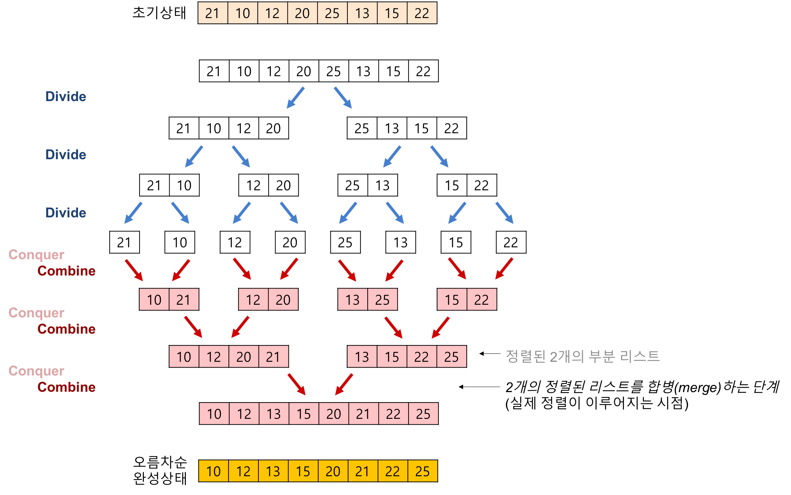

# 병합 정렬(Merge Sort)
- 대표적인 분할 정복`Divide-and-Conquer` 알고리즘
  - 분할 정복: 큰 문제를 작은 문제로 나눠 해결하는 방식



- 정렬 알고리즘 중 빠른 알고리즘에 속하며, 퀵 정렬`Quick Sort`보다 빠를 때도 있고, `Stable`함
  1. 배열을 반으로 나눌 수 없을 때까지 쪼갬
  2. 이후 쪼갠 배열을 '새로운 배열'에 나눠서 정렬 -> `Merge`
  3. 정렬이 완료되면 쪼갠 영역을 다시 붙여 `Merge`를 수행

## 특징
- 최선, 평균, 최악이 모두 `O(nlogn)` -> 퀵 정렬보다 빠름
- 빠르면서 `Stable`하나, 병합하는 과정에서 추가로 배열을 생성해서 `In-place`하지 못함

## 소스 코드
```java
public void mergeSort(int[] arr) {
    sort(arr, 0, arr.length - 1);    
}

private void sort(int[] arr, int start, int end) {
    if(start >= end) {
        return;    
    }
    
    int mid = (start + end) >> 1;
    sort(arr, start, mid);
    sort(arr, mid + 1, end);
    merge(arr, start, end);
}

private void merge(int[] arr, int start, int end) {
    if(start >= end) {
        return;    
    }

    int mid = (start + end) >> 1;
    
    int[] lArr = new int[mid - start + 1];
    System.arraycopy(arr, start, lArr, 0, mid - start + 1);
    
    int[] rArr = new int[end - mid];
    System.arraycopy(arr, mid + 1, rArr, 0, end - mid);

    int ll = lArr.length, rl = rArr.length;
    int i = 0, j = 0, k = start;
    
    while(i < ll && j < rl) {
        if(lArr[i] <= rArr[j]) {
            arr[k++] = lArr[i++];
        } else {
            arr[k++] = rArr[j++];
        }
    }
    while(i < ll) arr[k++] = lArr[i++];
    while(j < rl) arr[k++] = rArr[j++];
    
}

```

# Reference

[[알고리즘] 합병 정렬(merge sort)이란 - Heee's Development Blog](https://gmlwjd9405.github.io/2018/05/08/algorithm-merge-sort.html)

[Gyoogle 블로그 - 병합 정렬(Merge Sort)](https://gyoogle.dev/blog/algorithm/Merge%20Sort.html)