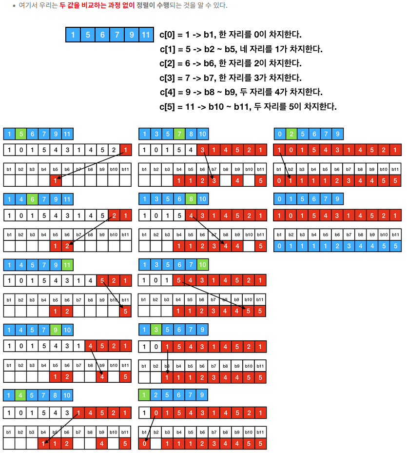

# 계수 정렬(Counting Sort)

- 비교를 하지 않는 정렬
- 그래서 `O(nlogn)`을 극복해, 시간 복잡도가 `O(n)`

> **Comparison Sort**<br>
> `N`개의 원소의 배열이 있을 때 이를 모두 정렬하는 가짓수는 `N!`개<br>
> 따라서, Comparison Sort를 통해 생기는 트리의 리프 노드가 `N!` 이상의 노드 개수를 갖기 위해선 `2^h >= N!`를 만족하는 `h`를 가져야 하고, 이 식을 `h > O(nlogn)`을 가져야 함<br>
> (`h`는 트리의 높이, 즉 Comparison Sort의 시간 복잡도)

## 전략

1. 원소 중 제일 큰 숫자 정도 크기의 배열을 생성 -> `counting` 배열
2. 배열을 순회하면서 각 `counting[숫자]`를 증가
3. `counting` 배열을 누적합
4. 역순으로 배열을 돌면서 해당하는 값의 인덱스에 값을 넣어줌
   - 여기서 배열은 0-base이므로 이미 빼줄 필요가 있음

## 특징
- 시간 복잡도는 정확힌 `O(n+k)`, 여기서 k는 원소 중 최댓값
- 속도는 빠르나 특수한 상황에서 밖에 사용 불가
- `counting` 배열과 정렬 결과를 담은 결과를 따로 만들기 때문에 `In-place`하지 않음
- 그리고 최댓값이 크면 그만큼 불필요한 배열의 크기를 초기화하기 때문에 메모리를 많이 잡아 먹음
- 그래도 이따금씩 활용할 문제가 존재하며, 기수 정렬`Radix Sort`에서도 활용하니 알아두면 좋음

## 소스 코드
```java
public void coutingSort(int[] arr) {
   int[] ret = new int[arr.length];
   int[] counting = new int[Arrays.stream(arr).max().getAsInt()];
   
   for(int i = 0; i < arr.length; ++i) {
        ++counting[arr[i]];    
   } 
   
   for(int i = 1; i < counting.length; ++i) {
        counting[i] += counting[i - 1];    
   } 
   
   for(int i = arr.length - 1; i >= 0; --i) {
       ret[--counting[arr[i]]] = arr[i];
   } 
   
   arr = ret;
}
```

# Reference

[계수 정렬 (Counting Sort)](https://soobarkbar.tistory.com/101)

[Gyoogle 블로그 - 계수 정렬(Counting Sort)](https://gyoogle.dev/blog/algorithm/Counting%20Sort.html)