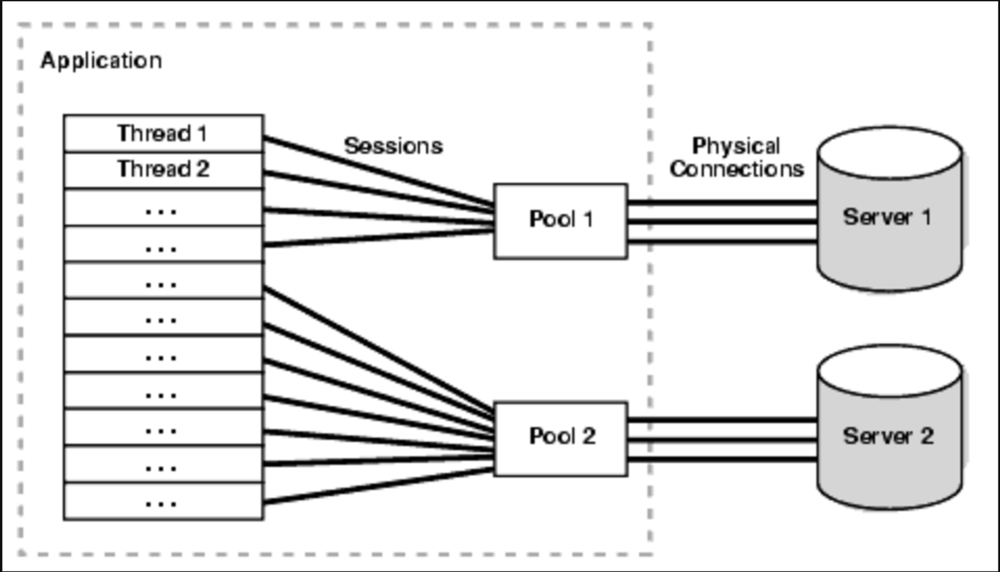
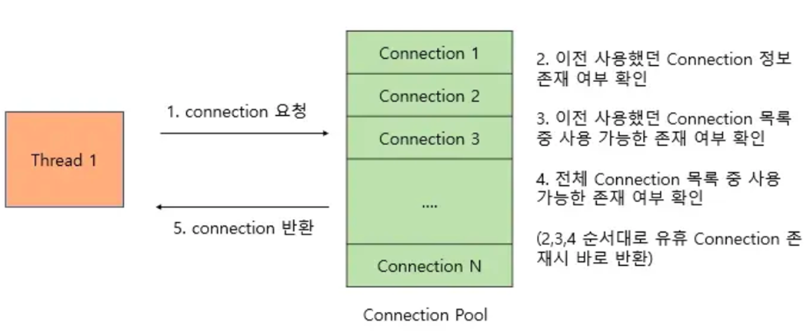
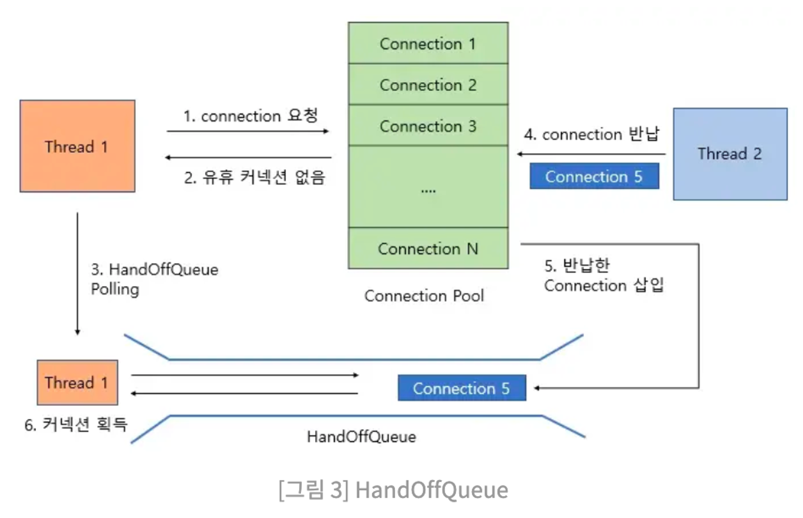
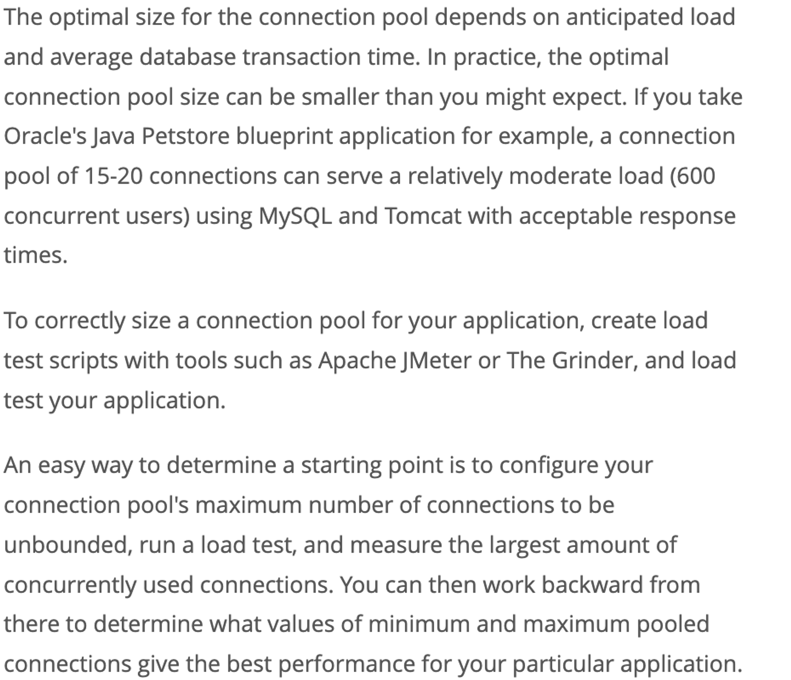

# ConnectionPool

## 요약

## DB Connection Pool
- 웹 컨테이너(WAS)가 실행되면서 DB와 미리 연결해 놓은 객체들을 Pool에 저장
- 클라이언트 요청이 옹면 Connection을 빌려주고, 처리가 끝나면 실행된 상태로 다시 Connection을 반납받아 Pool에 저장하는 방식

### 사용 이유
- MySQL 8.0 기준 INSERT 문 수행 시 필요 비용(괄호 안에 숫자가 비율을 의미)
  1. Connection(3)
  2. Send query to server(2)
  3. Parsing query(2)
  4. Insert row(1)
  5. Insert index(1)
  6. Close(1)
- 위를 보면 알듯이, Connection 비용이 가장 큶을 알 수 있음 -> Connection Pool은 이를 보완하는 방식

### DBCP 과정

1. WAS 실행, Connection 객체를 미리 Pool에 생성
2. Http 요청에 따라 Pool에서 Connection 객체를 쓰고 반환
---
- 이 같은 방식으로 물리적인 DB Connection 부하를 줄이고 연결을 관리
- Pool에 미리 Connection 생성되어 있기 때문에 Connection 생성에 드는 요청마다 연결 시간 소모 X
- Connection을 계속해서 재사용하므로 생성되는 Connection 수를 제한적으로 설정

### HikariCP
- 가벼운 용량과 빠른 속도를 가지는 JDBC의 CP Framework -> Spring Boot에서 사용됨

#### 동작 방식
- 남은 연결(Idle Connection)이 있는 경우

- 남은게 없는 경우

3. HandOfQueue를 Polling, 다른 Thread가 Connection 반납할 때까지 대기
4. Thread가 Connection 반납
5. CP는 handOffQueue에 반납된 Connection 삽입
6. HandOffQueue를 Polling한 Thread는 Connection 획득
---
- CP 크기가 너무 작으면 Connection 획득을 위한 대기 Thread가 많아질 것
- 이러한 문제는 CP 크기를 늘려주면 해결 가능

#### Connection Pool 크기 및 성능
- Connection 사용 주체인 Thread의 개수보다 CP 크기가 크면 사용되지 않고 남는 Connection이 생겨 메모리 낭비 발생
- 따라서 WAS의 Thread 개수가 DBCP 개수보다 많아야 함 
- 애플리케이션에 대한 모든 요청이 DB에 접근하는 것은 아니기 때문

- 공식 레퍼런스 기준 600여명 유저 동시 대응 시 15~20개 CP만으로도 충분
- 실제론 최대 연결 수를 무제한으로 설정 후 부하 테스트를 진행해서 최적화된 값을 찾는 것을 추천 -> `Apache JMeter`, `nGrinder`
- 
##### Connection Pool 선호 개수
1. 일반적인 캐이스
   - WAS의 Thread는 CP 개수보다 여유롭게 설정
   - 보통 CP 4~50개로 지정 시, Thread는 이보다 +10개 정도로 지정
2. 우아한 형제들 테크 블로그 기준

    
   - `Tn`: 전체 Thread 개수
   - `Cm`: 하나의 Task 동시에 필요한 Connection 개수
   ---
   - DB와 WAS의 context switching 역시 한계가 존재
   - Thread Pool의 크기는 CP 크기 결정에 매우 중요

# Reference
[DB 커넥션 풀(Connection pool)이란? HikariCP란?](https://code-lab1.tistory.com/209)

[MySQL :: MySQL Connector/J 8.0 Developer Guide :: 8 Connection Pooling with Connector/J](https://dev.mysql.com/doc/connector-j/8.0/en/connector-j-usagenotes-j2ee-concepts-connection-pooling.html)

[HikariCP Dead lock에서 벗어나기 (실전편) | 우아한형제들 기술블로그](https://techblog.woowahan.com/2663/)

[커넥션 풀(DBCP)은 왜 쓰는가?](https://velog.io/@mooh2jj/커넥션-풀Connection-pool은-왜-쓰는가)