# 정규화(Normalization)와 반정규화(Denormalization)

## 요약
- `이상 현상`은 하나의 relation에 두개 이상의 속성 포함 및 primary key가 아닌 속성이 결정자일 때 발생한다
- `함수 종속성`은 어떤 속성 A를 알면 다른 속성 B 값이 유일하게 정해지는 관계다
- 정규화는 이상 현상을 해결하고, 테이블 간에 중복된 데이터를 허용하지 않기 위해 하는 작업이다
  - 제 1 정규화는 테이블 열이 원자 값을 갖도록 테이블을 분해한다
  - 제 2 정규화는 완전 함수 종속을 만족하도록 테이블을 분해한다
  - 제 3 정규화는 이행적 종속을 제거하기 위해 테이블을 분해한다
  - BCNF 정규화는 모든 결정자가 candidate key가 되도록 테이블을 분해한다
- 정규화로 인해 join이 잦으면 성능저하가 발생하므로, 테이블을 합치거나 자주 연산되는 값을 특정 열에 추가하는 방식으로 반정규화를 수행한다

---

## 기본 개념

### 이상 현상(Abnormal)
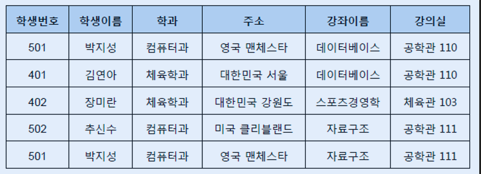

#### 삭제 이상
- 튜플 삭제 시 같이 저장된 다른 정보까지 연쇄적으로 삭제
  - ex. `장미란` 학생 정보를 삭제하면 `체육관 103`도 같이 사라져 `체육관 103` 사용 불가

#### 삽입 이상
- 튜플 삽입 시 특정 속성에 해당하는 값이 없어 NULL 입력해야하는 현상

#### 수정 이상
- 튜플 수정 시 중복된 데이터의 일부만 수정되어 일어나는 데이터 불일치 현상
  - ex. `박지성`과 `김연아` 학생이 같은 수업을 `강의실 110`에서 수강, 
    근데 독립적으로 입력된 데이터라 `박지성` 학생이 `강의실 201`로 변경되어도 `김연아` 학생은 `강의실 110` 유지 -> 같은 수업임에도 강의실이 달라짐
  
#### 이상 현상의 원인
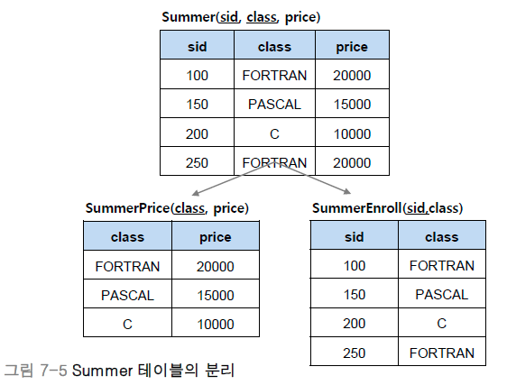

- 서로 공유하는 데이터임에도 각자의 튜플에 독립적으로 존재하기 때문
- **테이블을 분리하여 이를 통해 강의 제목이나 강의실을 참고하게끔 함**

### 함수 종속성(Functional Dependency)
- 어떤 속성 A의 값을 알면, 다른 속성 B의 값이 유일하게 정해지는 관계
- `A -> B`로 표기, A를 B의 결정자라고 함

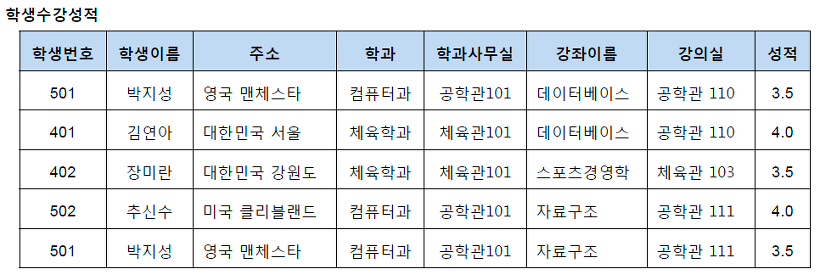
- 학생 수강 성적 relation
  - 여기서 학생과 수강 그리고 성적의 속성에는 의존성이 존재
    - `501`라는 학생 번호는 학생 이름이 `박지성`으로 정해지는 관계
      - 학생 이름은 학생 번호에 종속
      - 학생 번호는 학생 이름을 결정
      - `학생 번호 -> 학생 이름`
  - 그 외에도 `학과 -> 학과사무실`, `강좌이름 -> 강의실`같은 종속 관계가 있음
  - `학생 이름 -> 학과`는 종속하는 것처럼 보이나, 동명이인의 학생이 있는 경우 학생 이름이 학과를 결정 못함 -> 종속 관계 X

#### 함수 종속성 다이어그램
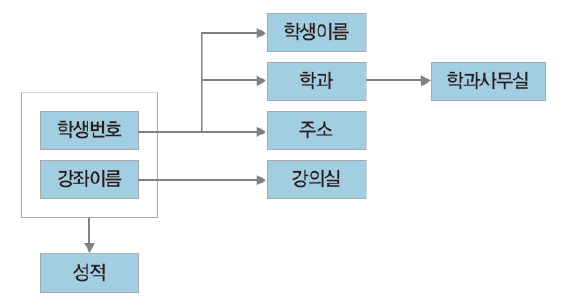
- 함수 종속성을 나타내는 표기법
  - `학생이름`, `학과`, `주소` 등과 같은 relation 속성은 직사각형으로 표기
  - 두 속성이 종속적인 관계를 가질 때 화살표로 종속성 표기
    - ex. 학생번호가 학생이름을 결정
  - 복합 속성인 경우엔 속성들을 묶어 하나의 직사각형으로 표기

#### 함수 종속성 규칙
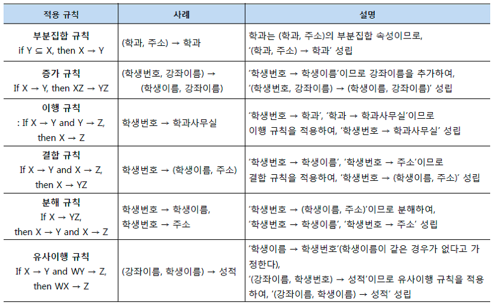

### Relationship과 Primary key
- 관계(Relatonship): 개체 사이의 연관성을 나타내는 개념
- 관계 타입: 개체 타입과 개체 타입 간의 연결 가능한 관계를 정의
- 관계 집합: 관계로 연결된 집합

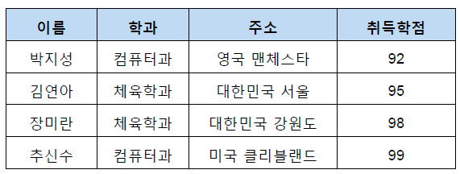
- Relation의 함수 종속성을 파악하기 위해선 primary key를 찾아야 함
  - Primary key가 함수 종속성에서 어떤 역할하는지 알면 이상 현상을 제거하는 정규화 과정 이해가 쉬움
- Primary key는 한 relation의 다른 속성들을 모두 결정할 수 있어야 함
  - ex. `이름`을 기본키로 사용하여 `어디 과`인지, `어디 사는지`, 어떤 `학점`을 받았는지 알 수 있음 => `이름` 속성이 primary key

### 이상 현상과 결정자
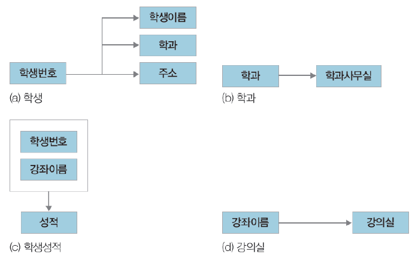
- 이상 현산은 하나의 relation에 두개 이상의 속성 포함 및 primary key가 가닌 속성이 결정자일 때 발생
  - `학생수강성적`의 경우 primary key를 지닌 `학생`(학생번호, 학생이름, 주소, 학과)와 primary key가 아니지만 결정자적 성질을 지닌 `강좌정보`(강좌 이름, 강의실)가 하나의 relation에 포함되어 이상현상 발생
  - 이 밖에도 `학과`, `학생번호`, `강좌이름`은 primary key가 아니면서 결정자
- 이 경우, 이를 해결하기 위해 총 4개의 relation으로 `학생수강성적` relation을 불리하면 됨

## 정규화
- 기본 목표는 **테이블 간에 중복된 데이터를 허용하지 않는 것**
- 이를 통해 무결성(Integrity)를 유지할 수 있으며, DB 저장 용량을 줄임

### 제 1 정규화
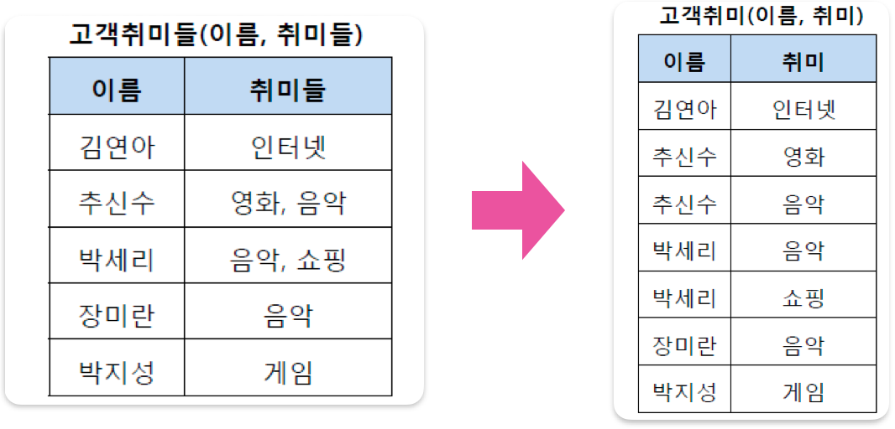
- 테이블 열이 원자 값(Atomic Value, 하나의 값)을 갖도록 테이블 분해
  - ex. `추친수`와 `박세리`는 여러 `취미`를 가짐 -> 제 1 정규형 충족 불가, 레코드 분해

### 제 2 정규화
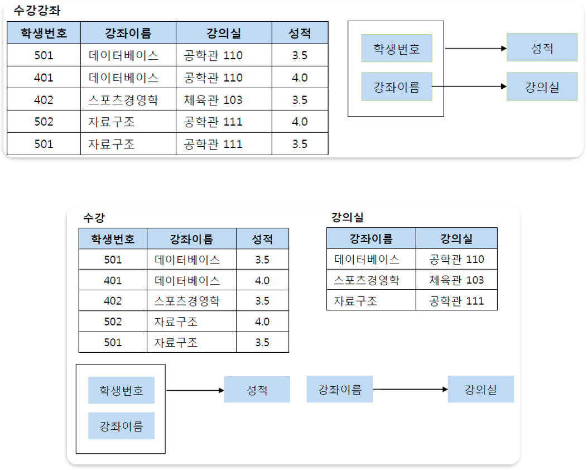
- 제 1 정규화를 진행한 테이블에 대해 **완전 함수 종속**을 만족하도록 테이블 분해
  > 💡 _완전 함수 종속: Primary key 부분 집합이 결정자가 되어선 안됨_
  - ex. Primary key가 `(학생번호, 강좌이름)`으로 복합 키, 그리고 `(학생번호, 강좌이름)`인 primary key는 성적을 결정 
    =>`(학생번호, 강좌이름) -> 성적`
    - 여기서 `강의실`이라는 열은 primary key의 부분집합인 `강좌이름`에 의해 결정 가능 => `(강좌이름) -> 강의실`
    - 즉, primary key `(학생번호, 강좌이름)`의 부분 키인 `강좌이름`이 결정자 => 기존 테이블에서 `강의실` 분리, 별도의 테이블로 관리

### 제 3 정규화
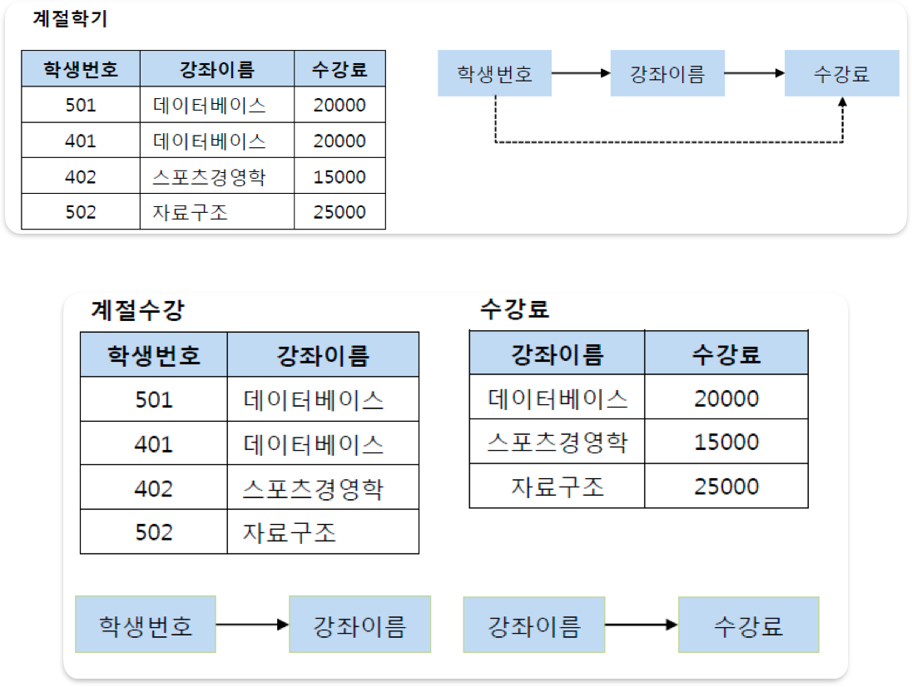
- 제 2 정규화를 진행한 테이블에 대해 **이행적 종속**을 없애도록 테이블 분해
  > 💡 _이행적 종속: `A -> B`, `B -> C` 성립 시 `A -> C`가 성립_

#### 이행적 종속 제거하는 이유
- ex. `501번 학생`이 수강하는 광제가 `스포츠경영학`으로 변경
  - 이행적 종속 존재 시 `501번 학생`은 `스포츠경영학`을 20000원이라는 수강료로 듣게 됨
  - 강좌에 맞게 수강료 변경이 가능하나, 이러한 번거로움 해소

### BCNF 정규화
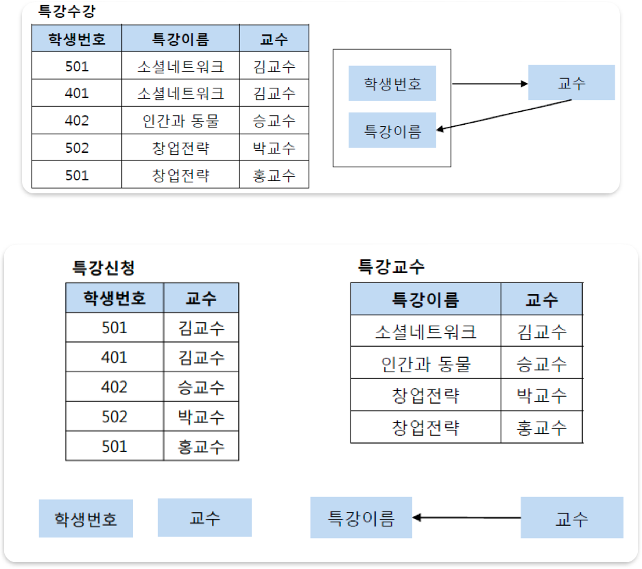
- 제 3 정규화를 진행한 테이블에 대해 모든 결정자가 candidate key가 되도록 테이블 분해
  - ex. `특강수강` 테이블에서 primary key는 `(학생번호, 특강이름)`
    - 이는 `교수`를 결정
    - 또한 `교수`는 `특강이름`을 결정
    - 문제는 `교수`가 `특강이름`을 결정하는 결정자이나, candidate key가 아님 => 위처럼 그림 분해

### 정규화하지 않는 경우
- 테이블을 많이 나누면 **join이 많아지고, 이는 성능에 악영향을 미침**
  - join은 테이블 락을 일으키고, 테이블 락은 병렬성의 큰 적 -> NoSQL이 부상하는 이유
  - join은 여러 테이블을 가로지르는 다중 disk-seeking을 일으킴 -> 데이터 국지화의 적
    > 💡 컴퓨터 하드웨어와 소프트웨어에서 많은 최적화 장치들의 작동 근거가 데이터 국지화, 이 가정이 깨질 경우 데이터 액세스 비용이 비싸짐
  - 정규화는 공간 절약 방식, 저장 공간은 저렴
  - 저장 공간을 절약하면 성능에 영향을 준다고 하나, 다수의 경우 데이터 국지화가 성능에 훨씬 큰 영향을 미침
    - 실제로 많이들 이중화(Redundancy)로 정규화를 타파해 성능 향상시킴
  - 정규화는 쓰기에 최적화, 하지만 읽기가 훨씬 중요
    - 특히 웹은 읽기 >>>>>>>>> (넘사) >>>>>> 쓰기

## 반정규화
- 성능 향상을 위해 데이터 중복을 허용, join을 줄이는 기법
- 조회(select) 속도는 빠르나 데이터 모델의 유연성이 낮아짐

### 수행 이유
- 다량의 범위를 자주 처리해야하는 경우
- 특정 범위의 데이터만 자주 처리하는 경우
- 요약/집계 정보가 자주 요구되는 경우

### 절차
1. 대상 조사 및 검토
   - 데이터 처리 범위, 통계성 등을 확인해서 반정규화 대상 조사
2. 다른 방법 검토
   - 반정규화 수행 전에 다른 방법이 있는지 검토
   - 클러스터링, 뷰, 인덱스 튜닝, 응용 프로그램, 파티션 등을 검토
      > 💡 클러스터링 인덱스(Clustering Index) 
   인덱스 정보 저장 시, 물리적으로 정렬해서 저장하는 방법, 조회 시 인접 블록을 연속적으로 읽기 때문에 성능이 향상됨
3. 반정규화 수행
   - 테이블, 속성, 관계 등을 반정규화

### 기법
### 계산된 열 추가
- 배치 프로그램으로 총 판매액, 평균 잔고, 계좌 평가를 미리 계산 후 그 결과를 특정 열에 추가
### 테이블 수직 분할
- 하나의 테이블을 두 개 이상의 테이블로 분할 → 열을 분할하여 새로운 테이블 생성
### 테이블 수평 분할
- 하나의 테이블에 있는 값을 기준으로 테이블 분할
  > 💡 _Partition 
  > DB에서 파티션(partition)을 사용하여 테이블 분할 가능 
  > 파티션 사용 시 논리적으로는 하나의 테이블이지만, 물리적으로 여러 개의 데이터 파일에 분산됨 _
  > ---
  > _**Range Partition** : 데이터 값의 범위를 기준으로 파티션 
  > **List Partition** : 특정 값을 지정하여 파티션 
  > **Hash Partition** : 해시 함수를 적용하여 파티션 
  > **Composite Partition** : 범위와 해시를 복합적으로 사용하여 파티션_

### 테이블 병합
- 1:1 관계 테이블을 하나의 테이블로 병합해서 성능 향상 ⇒ 불필요한 join 배제
- 1:N 관계 테이블을 병합하여 성능 향상, 하지만 많은 양의 데이터 중복 발생
  - 상위 타입과 하위 타입 관계가 발생 시 테이블 통합을 통해 성능 향상

  > 💡 _상위 타입/하위 타입 
  > 두 타입 관계는 배타적 관계와 포괄적 관계가 존재 _
  > ---
  > _**배타적 관계** : 고객이 개인 고객이거나 법인 고객인 경우 → 오로지 하나만 
  > **포괄적 관계** : 고객이 개인 고객일수도 있고 법인 고객일 수도 있음 → 양쪽 다_

# Reference
[[Database] 7. 정규화(Normalization)](https://mangkyu.tistory.com/28)

[[Database] 정규화(Normalization) 쉽게 이해하기](https://mangkyu.tistory.com/110)

[DB 정규화를 하지 않는 이유](https://coolspeed.wordpress.com/2017/04/15/why_not_db_normalization/)

[[SQL] 정규화(Normalization)와 반정규화(De-Normalization)](https://sodayeong.tistory.com/106)
