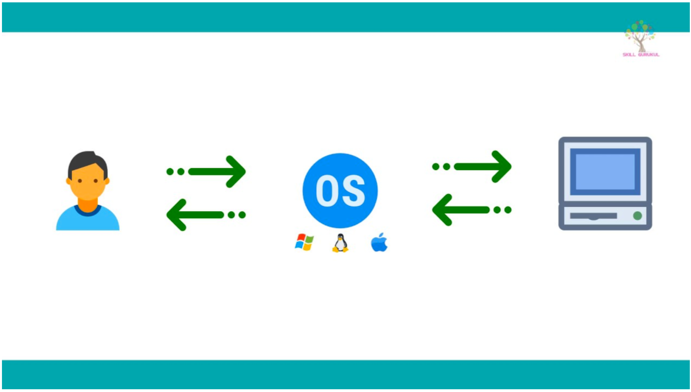
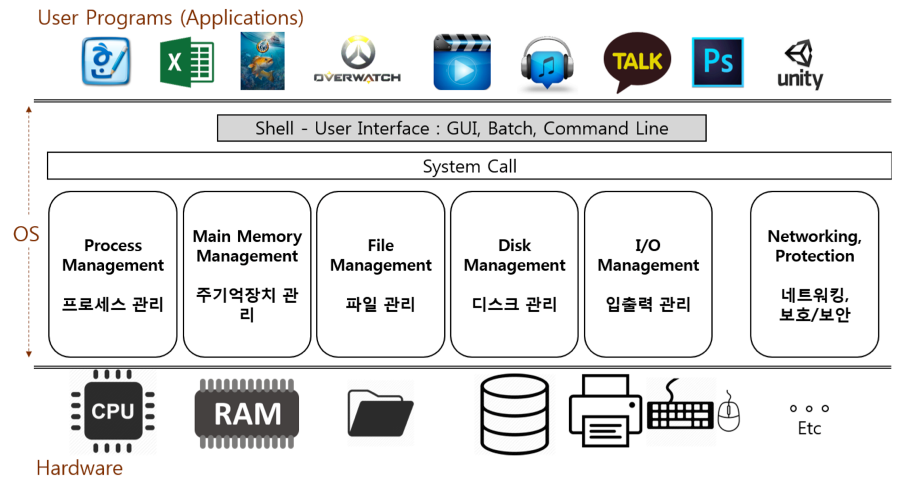

# 운영체제의 역할

## 시스템 자원(System Resource) 관리자
- `Operating System(OS)`라고도 불림
- 여기서 시스템 자원은 **컴퓨터 하드웨어**
- 컴퓨터 하드웨어는
  - 중앙처리장치라 불리는 `CPU`
  - 주기억장치 `RAM`
  - 입출력 장치인 `모니터`, `키보드`, `네트워크` 등
  - 저장 매체인 `HDD`, `SSD`
- 운영체제는 이 하드웨어 들을 관리해주는 관리자 역할을 함

## 컴퓨터는 스스로 할 수 있는게 없음
- 운영체제는 각 시스템 자원들을 활용할 수 있게 함
- 즉, 운영체제가 없으면 아무리 좋은 하드웨어가 있어도 활용할 수 없게 됨
- 운영체제의 하드웨어 활용법
  1. 각 프로그램이 얼마나 `CPU`를 사용할지 결정
  2. 각 프로그램이 Memory`RAM`에 어느 주소에 저장되어야 하는지, 어느 정도의 메모리 공간을 확보해야하는지 결정
  3. 어떻게, 어느 저장매체`SSD, HDD`에 저장할지 결정
  4. `I/O Device`를 활용할 수 있게 함

## 사용자와 컴퓨터 간 커뮤니케이션 지원

- 운영체제가 없으면 사용자가 컴퓨터에게 명령을 내릴 수단이 없음 -> 운영체제를 통해 커뮤니케이션
- 사용자가 운영체제에게 무엇갈 **요청**하면 운영체제가 시스템 자원들을 관리해서 그에 대한 **결과**를 사용자에게 표시하는 방식으로 커뮤니케이션 진행

## 컴퓨터 하드웨어와 응용 프로그램을 제어
- 운영체제는 응용 프로그램도 제어할 수 있게 함
  - 응용 프로그램: 보통 우리가 알고 있는 `Excel`, `카카오톡` 등
- 그렇기에 응용 프로그램은 운영체제 위에서 동작함

1. 사용자가 어떤 작업을 `I/O Device`를 통해 요청 => 마우스 클릭, A키 연타
2. 이를 시스템 자원들을 가지고 처리
3. 응용 프로그램에서 사용자 요청을 기반으로 결과를 표시

## 운영체제와 응용 프로그램의 관계
- 운영체제는 응용 프로그램을 실행시키고, 응용 프로그램 간의 **권한**을 관리
- 프로그램을 실행하다보면 `관리자의 권한으로 실행`이라는 기능을 접할 수 있음
  - 이는 관리자의 권한으로 실행하면 일반 응용 프로그램이 리소스 접근을 보다 더 많이 할 수 있게 해줌
  - 그리고 응용 프로그램을 사용하는 `사용자`도 운영체제가 관리 => 로그인

### 운영체제가 권한을 관리하는 이유
- 응용 프로그램은 코딩만 할 줄 알면 누구나 다 만들 수 있다는 것이 문제
- 예를 들어, 무한 루프를 발생시키는 잘못된 로직이 있다면 운영체제가 이러한 비정상적인 로직을 막아줌
  - 개발하다보면 무한루프가 발생하면 런타임 에러를 발생시키는 것이 운영체제의 역할
- 그리고 모든 파일을 삭제시켜버리는 프로그램이 있다면 운영체제가 **권한/사용자 관리**를 통해 막을 수 있음
- 혹은 응용 프로그램이 욕심이 많아서 CPU 점유량이 많을 경우 운영체제가 이를 관리해줌

#### 정리
1. 무한루프 같은 비정상적인 로직 방지
2. 모든 파일 삭제 같은 로직을 권한/사용자 관리를 통해 방지
3. 프로그램의 CPU 점유량 관리

## 운영체제 목표
1. 사용자가 사용하는 프로그램이 효율적으로, 적절하게 동작하도록 지원
2. 응용 프로그램이 요청하는 시스템 자원을 효율적으로 분배 및 지원하는 **소프트웨어**