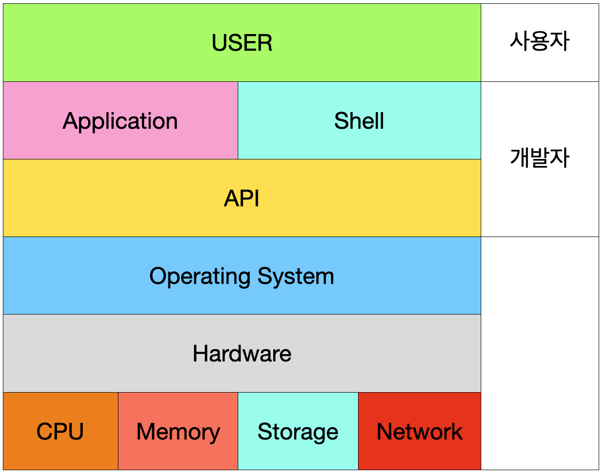

# 시스템 콜(응용 프로그램, 운영체제, 컴퓨터 하드웨어의 관계)

- `시스템 콜` 또는 `시스템 호출 인터페이스`라고 함
- 운영체제가 각 운영체제의 기능(I/O Device 제어 등)을 사용할 수 있도록 시스템 콜이라는 **명령 또는 함수**를 제공
- 일반적으로 C/C++ 같은 고급 언어로 작성된 프로그램은 시스템 콜에 직접 접근할 수 없음
- 그래서 `Application Programming Interface(API)`를 통해 운영체제의 기능을 사용할 수 있도록 함

## 응용 프로그램, 운영체제 그리고 하드웨어의 관계
- `도서관`으로 비유
  - 운영체제 -> `도서관`
  - 응용 프로그램 -> `시민`
  - 하드웨어(시스템 자원) -> `책`
- 시민`응용 프로그램`은 도서관`운영체제`에 원하는 책`시스템 리소스`을 찾아서 시민에게 빌려줌
- 책 대여 기간이 만료되면 도서관이 해당 책을 회수
- **이처럼 운영체제는 응용 프로그램이 요청하는 CPU 가용 시간을 제공**
- **그리고 운영체제는 응용 프로그램이 요청하는 I/O Device 같은 시스템 리소스 사용을 허가하거나 제어**

## 쉘(Shell)
- 사용자가 운영체제 기능과 서비스를 조작할 수 있도록 인터페이스를 제공하는 프로그램
- 흔히들 터미널 환경`Command Line Interface(CLI)`과 `GUI` 환경 두 종류로 분류됨

## 응용 프로그램에서 운영체제 기능 사용

- 프로그램을 만드는 개발자는 개발을 하려면 기본적으로 운영체제가 제공하는 기능(파일 입출력 등)을 사용해야 함
- 이러한 기능들을 **시스템 콜**이라고 함