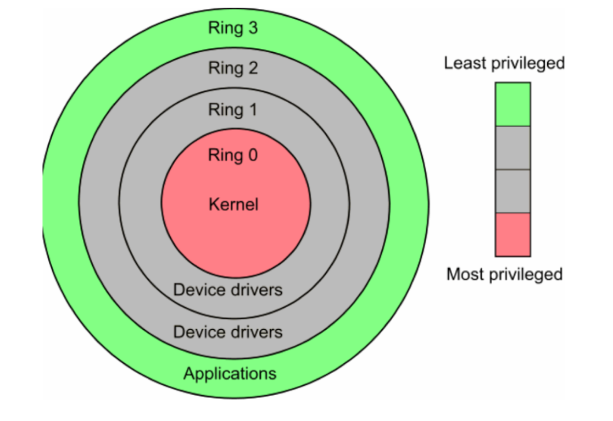

# 사용자 모드와 커널 모드

## CPU Protection Ring

- CPU에는 여러가지 명령어가 존재
- 그리고 권한 모드라는 것을 가지고 있음
- 해당 그림은 `Intel 기준 CPU 구조`
  - 지구처럼 층이 존재하고, 외부일 수록 낮은 권한 모드를 가지고 높을 수록 높은 권한 모드를 가짐
  - 그리고 가장 내부에 있는 `Ring 0`을 커널`Kernel`이라 함
- 사용자 모드User Mode는 Ring 3에 속하고, 일반적인 응용 프로그램이 사용하는 명령이 있음
- 그리고 커널 모드`Kernel Mode`는 `Ring 0`에 속하며, 운영체제에서 특권 명령어 실행과 원하는 작업 수행을 위한 자원 접근을 가능하게 함
  - `Shell`: 껍질, 껍데기
  - `Kernel`: 알맹이

## 응용 프로그램과 운영체제
- C나 Java 등으로 만든 모든 프로그램은 운영체제 위에서 작동
- 그리고 프로그램은 커널 모드에서만 실행 가능한 기능들을 사용하는 경우가 있음
- 파일을 여는 함수, `open()`이 대표적인 예
- 해당 기능들, 즉 커널 모드로 기능을 실행하려면 반드시 `시스템 콜`을 거쳐야 함 -> 응용 프로그램에선 CPU를 실행할 수 없기 때문
- 따라서 **운영체제는 응용 프로그램에서 커널 모드 기능을 실행하기 위한 시스템 콜을 제공해야 함**

### 모드를 나누는 이유
- 나눠 놓음으로써 함부로 응용 프로그램이 전체 컴퓨터 시스템을 해치지 못하게 함
  - 응용 프로그램은 프로그래밍 언어를 아는 사람이라면 누구나 만들 수 있기 때문
- 주민등록등본을 예로 들면,
  - 주민등록등본은 위조 방지를 위해 반드시 민원24시나 동사무소에 가서 특별한 신청을 해야만 발급 받을 수 있음
  - 여기서 공무원이 바로 특별한 권한을 가지고 주민등록등본 출력 명령을 수행
  - 이처럼 사용자 누구나 함부로 특수 명령을 접근하지 못하게 하여 위조 혹은 전체 삭제와 같은 문제를 막기 위해 나눔

## 예제
```c
// 1. 사용자 모드에서 프로그램 실행
#include <unistd.h>
...

int main(){
	int fd;
	fd = open("data.txt", O_READ_ONLY);
	// 2. open() 시스템 콜 호출 
	// -> 저장매체에서 가져오고 저장매체는 OS가 관리
	// 3. 커널 모드 전환
	// 4. open() 함수를 처리하는 sys_open() 커널 함수 호출
	// 5. 파일 열기의 low-level 연산 수행(CPU)
	// 6. 응용에게 데이터 전달 후 사용자 모드 전환
	// 7. open() 함수 이후의 프로그램 실행
	if(fd == -1){
		printf("Error : Cannot open file\n");	
		return 1;
	} else{
		printf("File opened no close\n");
		close(fd);
	}

	return 0;
}

```
1. 프로그램이 실행되면서 시스템 콜을 호출하는 `open()`이 호출
2. 커널 모드로 전환, `open()` 함수를 처리하는 `sys_open()` 커널 함수를 호출
3. 파일 열기의 low-level 연산을 수행
4. 연산이 완료되면 응용 프로그램에 데이터를 전달한 후 사용자 모드로 전환
5. `open()` 이후의 프로그램 전개
