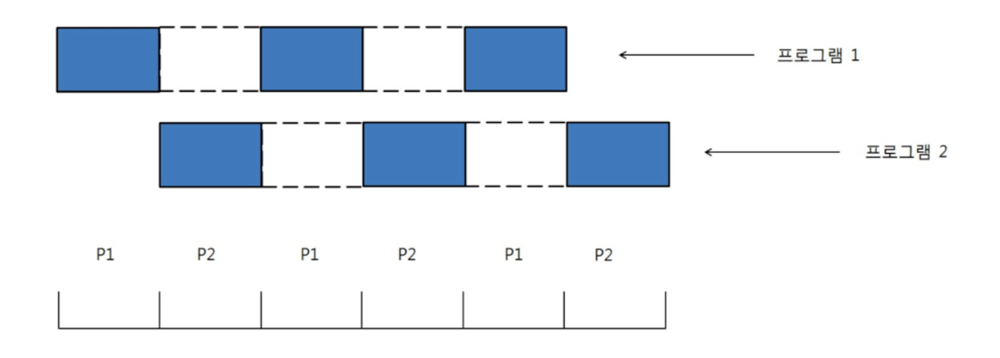
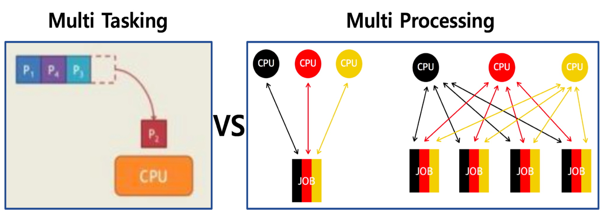
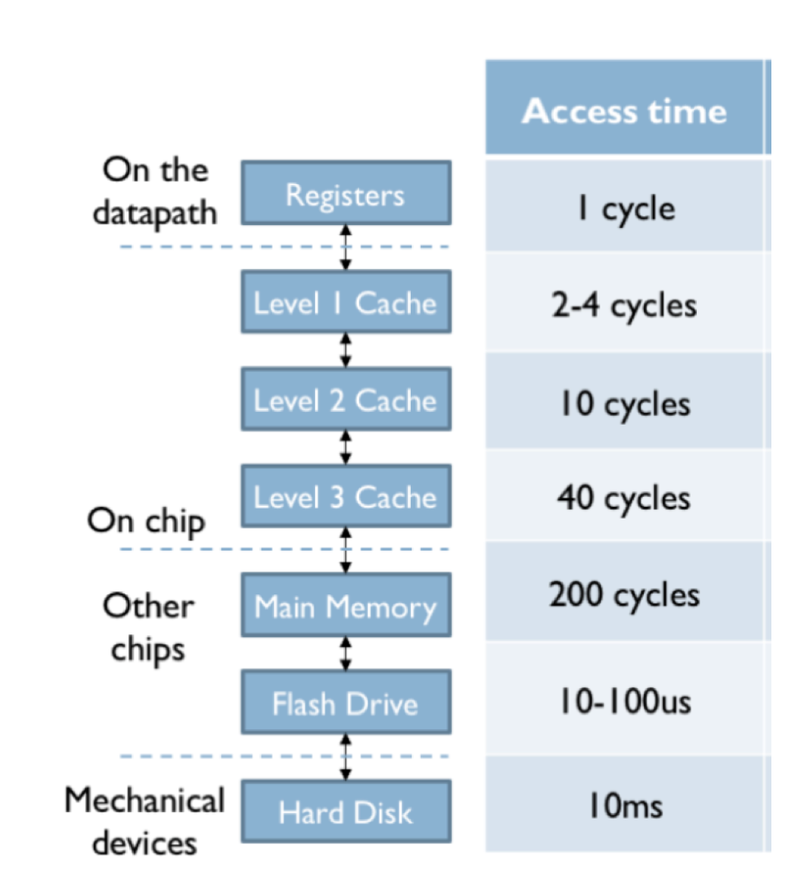
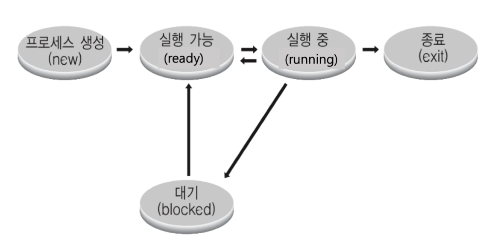
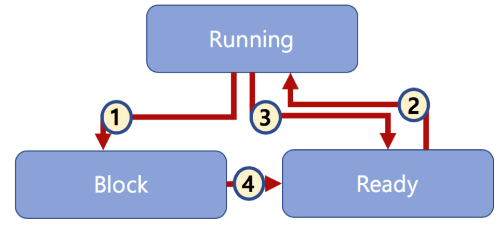

# CPU 스케쥴링

## 요약

- 시분할 시스템, 멀티 태스킹, 멀티 프로그래밍은 유사한 의미로 통용된다
  - 시분할 시스템: 다중 사용자를 지원하며, 컴퓨터 응답시간을 최소화하는 시스템이다
  - 멀티 태스킹: 단일 CPUdㅔ서 여러 응용 프로그램을 동시에 실행하는 것처럼 보이게 하는 시스템이다
  - 멀티 프로세싱: 여러 CPU에서 하나의 응용 프로그램을 병렬로 실행해서 속도를 높이는 기법이다
  - 멀티 프로그래밍: 최대한 CPU를 일정 시간당 많이 활용하는 시스템이다
- CPU 스케쥴링은 여러 응용 프로그램을 동시에 실행되는 것처럼 하면서, CPU를 쉬지 않고 응용 프로그램을 실행하도록 해, 짧은 시간에 응용 프로그램이 실행 완료될 수 있도록 한다
- 응용 프로그램은 여러 프로세스를 상호 작용하여 동작하기 때문에 프로세스와 개념이 다르다
- 프로세스를 CPU에 점유해서 자원을 효율적으로 활용하기 위해 스케쥴링 알고리즘이 존재한다
- 스케쥴링 알고리즘은 선점형, 비선점형으로 나뉘며 여러 종류의 알고리즘을 상황에 맞게 다양하게 조합하여 프로세스 CPU 사용률을 스케쥴링한다

---

- 컴퓨터가 실행되면 다양한 프로세스들이 동작
- 사람이 보기엔 이 다수의 프로세스가 한꺼번에 동작되는 것처럼 보임
- 그러나 컴퓨터는 여러가지 일을 동시에 처리해주는게 아닌, **효율적으로 프로세스에게 자원을 분배시켜 다수의 업무를 효율적으로 처리할 수 있게 지원**

## 배치 처리 시스템
- 자동으로 다음 응용 프로그램이 이어서 실행될 수 있도록 하는 시스템
- 여러 프로그램을 순차적으로 실행시킬 수 있게 해줌
- 그러나 해당 시스템은 문제점이 있음
  1. 어떤 프로그램은 실행 시간이 너무 걸려 다른 프로그램이 실행하는데 대기 시간이 큼
  2. MP3 음악을 들으며 문서 작성은 해당 시스템에선 불가능 => 동시에 여러 프로세스 실행 불가
  3. 여러 사용자가 동시에 하나의 컴퓨터를 사용하는 다중 사용자 지원이 어려움
  
## 시분할 시스템
- 배치 처리 시스템을 개선한 시스템
- 다중 사용자 지원을 위해 컴퓨터 응답 시간을 최소화하는 시스템
- **응용 프로그램이 CPU를 점유하는 시간을 잘게 쪼개서 실행할 수 있도록 하는 시스템**

## 멀티 태스킹
- 단일 CPU에서 여러 응용 프로그램이 실행되는 **것처럼** 보이도록 하는 시스템
- 이 시스템이 구성되어야만 여러 프로세스를 동시에 실행 가능
  - ex. 유튜브 보면서 기술 블로그 작성

### 실제 멀티 태스킹(Linux 기준)

- Linux 상에선 `10~20ms` 단위로 실행 응용 프로그램이 바뀜
- 아주 짧은 텀으로 컴퓨터가 CPU를 통해 작업

## 멀티 프로세싱

- 일반적으로 멀티 태스킹과 혼용됨
- 그래서 시분할, 멀티 태스킹만 알아도 충분하나 차이점을 본다면, 
  - 둘 다 시분할 시스템 방식으로 CPU 자원을 짧은 텀으로 받아 수행
  - 멀티 태스킹은 `단일 CPU` 단위로 이뤄짐
  - 멀티 프로세싱은 `다중 CPU에 하나의 프로그램을 병렬로 실행해서 실행 속도를 극대화`시킨다는 차이가 있음
    - CPU마다 여러 프로세스를 수행하게 하는 것은 

## 멀티 프로그래밍
- 최대한 많은 CPU를 활동하도록 하는 시스템
- 시스템의 목적은,
  1. 시간 대비 CPU 활용도를 높임
  2. 응용 프로그램을 짧은 시간 안에 실행 완료
- 응용 프로그램은 온전히 CPU를 쓰기 보단, 다른 작업을 중간에 필요하는 경우가 많음 -> 시스템 콜 중 하나인 파일 입출력
- 응용 프로그램이 실행 중에 파일을 읽게 되면 이는 저장 매체에 접근하기 때문에 느림

### 메모리 계층(각 메모리 접근당 수행 사이클 시간)

- 저장 매체에 접근 시 느린 이유를 참고하기 위한 그림
- 기본적으로 하드웨어 접근은 가장 아래에 위치하고, 가장 느림 -> `Flash Drive`인 `SSD`도 많이 느린 편
- 그래서 파일 읽기 같은 커널 모드 접근 기능을 다른 CPU에서 실행시키고, 그 동안 기존 CPU에선 다른 응용 프로그램을 수행하는 것이 효과적

### 예제
```c
// 1. CPU - START
#include <unistd.h>
...

int main(){
	int fd;
	// 1. CPU - END
	// 2. Kernel - START
	// (저장매체 접근 -> 오픈 -> 결과 값)
	// 'Blocking' 상태
	// open()은 다른 CPU에서 사용되고, 해당 CPU에선 
	// 그 동안 다른 프로세스를 사용하여 CPU 활용도를 높일 수 있음
	// ex. 
	// app1 - blocking * (n - 1) - app1 - app3 * n -> 활용도 낮음
	// app1 - blocking * app3 * (n - 1) - app1 - app3 -> 활용도 높음
	fd = open("data.txt", O_READ_ONLY);
	// 'Blocking' 해제
	// 2. Kernel - END
	if(fd == -1){
		printf("Error : Cannot open file\n");	
		return 1;
	} else{
		printf("File opened no close\n");
		close(fd);
	}

	return 0;
}

```
- `open()`은 대표적인 커널 모드에서 실행되는 함수
- 저장 매체에 접근하게 되면 해당 코드의 프로세스를 `blocking` 상태로 둬서 잠시 멈춰놓음
- 이 일이 마칠 동안 다른 프로세스가 CPU를 사용
- 저장 매체가 읽어 오는 것을 완료하고, CPU를 사용할 수 있는 상태면 `blocking` 상태를 해제하고 다시 수행

## 스케쥴링 알고리즘
- 프로세스 실행 순서를 정하는 알고리즘

### 프로세스
- 프로그램 실행 단위 => 메모리에 올려져 실행 중인 프로그램
- 프로세스와 응용 프로그램을 혼용하는 경우가 있는데, **프로세스와 응용 프로그램은 서로 다른 개념** -> 응용 프로그램은 여러 프로세스가 상호 작용하면서 실행될 수 있기 때문

### 프로세스와 스케쥴러와의 관계
- CPU 스케쥴러는 프로세스의 실행을 관리
- 각 프로세스가 CPU의 자원을 어떻게 사용할지에 대한 '스케쥴'을 지정

### 알고리즘 종류
- 스케쥴링 알고리즘은 어느 순서대로 프로세스를 실행시킬지 정하는 것
- 알고리즘을 정해야 하는 이유는,
  1. 프로세스의 응답 시간을 가능한 짧게 하기 위함
  2. CPU 활용도를 최대한 높여서 프로세스를 빨리 실행하기 위함

#### 그전에 알아야할 개념 - 선점/비선점, 프로세스 상태
- 알고리즘을 `선점형`과 `비선점형` 스케쥴러로 분류 가능
- 그리고 프로세스는 이러한 스케쥴러로 인해 `상태`가 바뀜

##### 프로세스 상태

1. `New, Exit`: 처음 프로세스가 생성New 상태와 종료Exit 상태가 있음
2. `Ready`: CPU에서 실행 가능 상태 => 실행 대기 상태
3. `Running`: 현재 CPU 자원을 점유한 상태 => 실행 중
4. `Block(Wait)`: 특정 이벤트 발생으로 실행 중인 상태를 멈춘 대기 상태
   - ex. 프로세스가 저장 매체에 접근하는 경우 => `open()`

##### 프로세스 상태 간 관계

1. 프로세스가 특정 작업(ex. 파일 처리)을 처리하거나 순서를 뺏기면 `Block` 상태로 진입
2. 스케쥴러는 다른 `Ready` 상태 프로세스를 `Running` 상태로 만들어 CPU에서 해당 프로세스를 수행
3. 이후 스케쥴링 알고리즘으로 인해 `Running` 상태 프로세스를 `Ready` 상태로 바꾸고 다음 프로세스를 `Ready -> Running` 상태로 만듦
4. 여기서 `Block` 상태였던 프로세스가 특정 작업을 완료하게 되거나, 본인 순서가 오면 해당 프로세스 상태를 `Ready` 상태로 변환

##### 선점형(Preemptive)
- 하나의 프로세스가 다른 프로세스 대신에 프로세서`CPU`를 차지할 수 있는 스케쥴러
- 이때 CPU 자원을 프로세스 상태를 `Running`에서 `Block` 상태로 바꿈

##### 비선점형(Non-preemptive)
- 하나의 프로세스가 끝나지 않으면 다른 프로세스는 CPU를 사용할 수 없음
- 즉, CPU 자원 점유 중인 프로세스 상태가 `Block` 또는 `Exit` 상태가 되어야만 스케쥴러가 나타나서 다른 프로세스를 점유 시킴

#### FCFS(First Come First Served)
- 프로세스가 저장 매체를 읽거나 프린팅하는 등 작업 없이 쭉 CPU를 처음부터 끝까지 사용
- 점유중인 프로세스가 종료될 때까지 계속 점유하는 알고리즘
- 배치 처리 시스템과 유사, 가장 간단한 알고리즘으로 **비선점형**

#### SJF(Shortest Job First)
- 프로세스 실행 시간이 가장 짧은 프로세스부터 실행
- **비선점형** 알고리즘, 실행 시간이 큰 프로세스는 뒤로 밀려 수행되지 않는 단점이 존재

#### 우선순위 기반 알고리즘
- 프로세스에 우선순위를 매겨, 높은 순서대로 CPU에 실행시키는 알고리즘
- 우선순위는 정의하기 나름
  1. `정적 우선 순위`: 프로세스마다 우선순위를 미리 지정하는 방식
  2. `동적 우선 순위`: 프로세스가 상황에 따라 우선 순위를 동적으로 변경
     - 응답시간이 빨라야 하는 시스템의 경우 우선순위를 높임
     - 프로세스 우선순위가 너무 낮아 응답시간이 느린 경우, 에이징`Aging` 기법을 통해 대기 시간이 길 수록 우선순위를 점진적으로 높임

#### Round Robin
- CPU 점유 시간을 지정해서 프로세스가 해당 시간 동안만 작업
- 시간이 되면 프로세스를 `RR Ready Queue`에 넣고 다음 프로세스를 해당 시간 동안만 작업하는 것을 반복 -> `시분할 시스템` 기반
- 해당 알고리즘은 점유 시간을 정할 때 주의가 필요
  - 점유 시간이 너무 길면 `FCFS`처럼 프로세스 점유 시간이 너무 길어져 비효율적
  - 점유 시간이 너무 짧으면 프로세스 교체 과정에서 발생하는 오버헤드, `Context Switching`이 자주 발생

#### 알고리즘 조합
- 스케쥴링 알고리즘은 하나만 사용하는 것이 아닌, 상황에 따라 조합해서 사용해 효율성을 높임
  - ex. 스케쥴링 정책 - Round Rogin
    - 100ms마다 다음 프로세스로 교체
    - Ready Queue, Block Queue, Running Queue 존재
    - 각 Queue는 FIFO 정책으로 동작
    - 선점형 스케쥴링 기능 지원