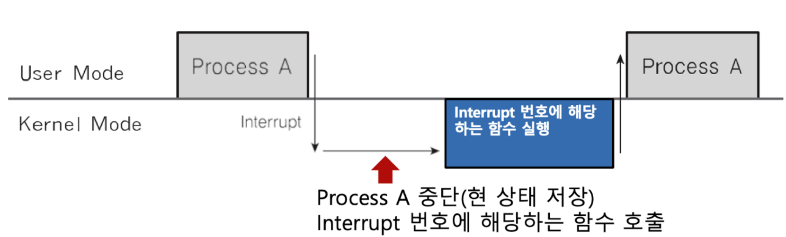

# 인터럽트

- CPU가 프로그램 실행 중일 때, I/O Device 등의 장치나 예외 상황이 발생해서 처리가 필요한 경우, CPU에 알려서 이를 처리하는 기법
- CPU는 어느 한 순간에 `Program Counter(PC)`가 가리키는 `Code`를 실행함
- 그 중에 하드웨어 같은 장치 접근을 하는 경우 이를 처리할 때까지 프로세스는 대기`Waiting` -> 장치를 통해 얻은 데이터 기반으로 프로세스 로직을 수행하기 위함

## 인터럽트의 필요성

- 프로세스가 Running 중에 스케쥴러가 이를 중단시켜 다른 프로세스를 교체하기 위해 현 프로세스를 중단시킬 필요가 있음
- 그러기 위해 스케쥴러 코드가 실행되어 현 프로세스를 중지시켜야 함 -> 이때 인터럽트를 발생

## I/O Device와 커뮤니케이션
- 저장 매체에서 데이터 처리가 완료되면 프로세스를 다시 깨울 때`Block -> Ready`도 인터럽트 발생

## 예외 상황 핸들링
- CPU가 프로그램 실행 중에 I/O Device 등의 장치나 예외 상황이 발생하면 CPU가 이 상황을 처리할 수 있도록 CPU에게 알려야할 때도 사용
- 프로세스의 `Code` 실행 중에 하드웨어에서의 이상 동작 등 외부에서 문제가 발생하면 이를 처리할 수 있게 함

## 인터럽트 처리 예
### I/O Device
1. 프로세스에서 파일 불러오기 요청`Running -> Waiting`
2. 이후 파일 불러오기가 완료되면 운영체제에게 알림
3. 운영체제를 해당 프로세스를 `Waiting -> Ready` 상태로 변경
4. 이후 `Context Switching`을 통해 `Ready -> Running`으로 변경

### Exception
```c
#include <stdio.h>

int main(int argc, char* argv[]){
    printf("Hello World");
    
    int data;
    int divider = 0;
    data = 1 / 0;	// 인터럽트 발생
    return 0;
}
```
#### 이벤트와 인터럽트의 상관 관계
- 인터럽트는 일종의 이벤트로 불림, 이벤트에 맞게 운영체제가 처리하는 것이라 보면 됨

## 인터럽트 종류
### 내부 인터럽트
- 주로 프로그램 내부에서 잘못된 명령 또는 데이터를 사용할 경우 발생
- 대표적인 예
  1. Devide-by-zero
     - 0으로 나누기 시도
  2. 사용자 모드에서 허용되지 않은 명령 또는 공간 접근
     - 리눅스를 예로 들면, 리눅스는 기본 프로세스 공간이 `4GB`정도 됨
     - 그 중 `1GB`는 커널 모드에 대한 메모리
     - 사용자 모드에서 허가되지 않은 모드에 접근하려고 하면 인터럽트 발생
  3. Overflow/Underflow
     - 계산된 결과 값이, 예를 들면 결과 값을 in 타입 변수로 초기화 시,
       - 32-bit CPU 환경 기준으로 `-2^31 ~ 2^31-1` 범위 값이 초기화 => `Overflow` 또는 `Underflow` Exception

### 외부 인터럽트
- 주로 하드웨어, 즉 프로그램 외부에서 발생하는 인터럽트 => 하드웨어 인터럽트
- 대표적인 예
  1. 전원 이상
  2. 기계 문제
  3. 키보드 등 I/O 관련 이벤트
  4. Timer 이벤트

#### Timer

- `Timer 이벤트`는 선점형 스케쥴러를 위해 필요
- 일정 주기로 하드웨어가 운영체제한테 `Timer 이벤트`를 알려서 다른 프로세스를 사용할 수 있게끔 함

## 인터럽트 내부 동작

### 시스템 콜 인터럽트
- 시스템 콜 실행을 위해서 강제로 Code에 인터럽트 명령을 넣어 CPU에게 해당 시스템 콜을 실행시켜야 함

#### 내부 Code
```bash
mov eax, 0x01 // 시스템 콜 번호
mov ebx, 0x00 // 인자 값
int 0x80 // 소프트웨어 인터럽트 명령(CPU op code + 인터럽트 번호)
```
- 위 언어는 어셈블리어
- 내부 설명
  1. `eax` 레지스터에 호출할 시스템 콜 번호를 넣음(각 시스템 콜은 번호가 등록되어 있음)
     - `eax` 레지스터를 통해 어떤 시스템 콜을 호출할지 정함
  2. `ebx` 레지스터에 시스템 콜에 해당하는 인자 값을 넣음
     - `open()` 함수 인자의 `O_READONLY`가 여기에 속함
  3. 소프트웨어 인터럽트 명령, `int`를 호출하면서 `0x80` 값을 넣어줌
     - `int`: CPU Opcode(명령 코드)
     - `0x80`는 인터럽트 정보를 관리하는 `Interrupt Descriptor Table(IDT)`에서 `system_call()`이라는 함수가 있는 주소`Code`를 의미
     - 이 과정에서 `0x80(Opcode)`을 CPU에 넘겨주면서,
       1. CPU는 사용자 모드를 커널 모드로 변경
       2. `IDT`에서 0x80에 해당하는 주소`Code`(함수)를 찾아내 실행, 이 과정에서 `eax`와 `ebx` 값도 함께 넣어줌
       3. 이때 `eax` 레지스터를 확인해서 시스템 콜 번호를 확인하고, 이 번호에 해당하는 시스템 콜을 호출
       4. 그리고 `ebx`에서 시스템 콜 함수의 인자를 넘겨주고 함수를 실행
       5. 함수의 결과를 프로세스에 보내고 커널 모드에서 다시 사용자 모드로 돌아가 프로세스를 실행

#### IDT에서 관리되는 시스템 콜 함수 목록(간략화)


## 사용자/커널 모드와 프로세스 그리고 인터럽트


1. 프로세스가 실행됨
2. 실행 도중에 시스템 콜이 호출됨 => `int 0x80 -> mov eax 시스템 콜 번호 -> mov ebx 시스템 콜 인자` 순으로 CPU에게 인터럽트를 알림
3. 이후 작업이 완료되면 다시 프로세스를 재개
4. 선점형 스케쥴러로 인해 타이머가 완료되면 프로세스가 `Running -> Waiting` 상태로 돌아가고, 다음 프로세스 실행

### 하나의 인터럽트 흐름 예


## 인터럽트와 IDT
- 인터럽트는 `IDT`에 컴퓨터가 부팅되었을 때 운영체제가 미리 정의해서 각 번호와 실행 코드를 가리키는 주소가 기록됨
  - What: Code의 주소
  - Where: `IDT`
  - When: 컴퓨터 부팅
  - Who: 운영체제
- `IDT`에 정의된 인터럽트 정보는 운영체제에 따라 다름
- 리눅스 기준으로,
  - `0~31`: 예외 상황 인터럽트(내부 인터럽트)
  - `32~47`: 하드웨어 인터럽트(외부 인터럽트)
  - `128`: 시스템 콜
