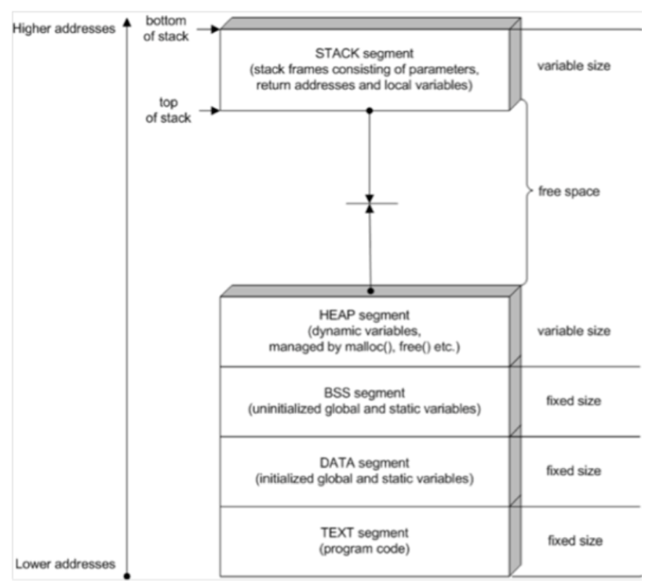
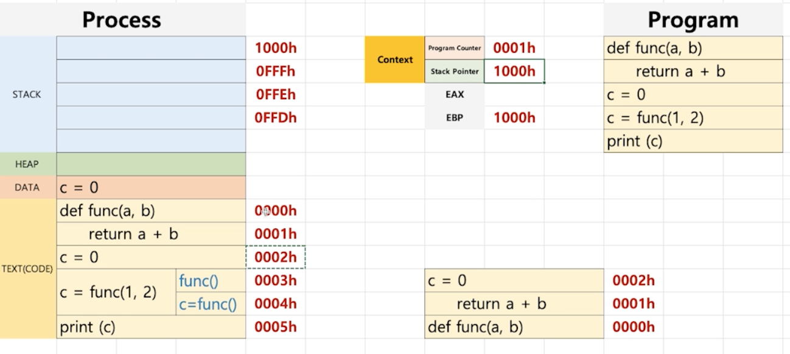
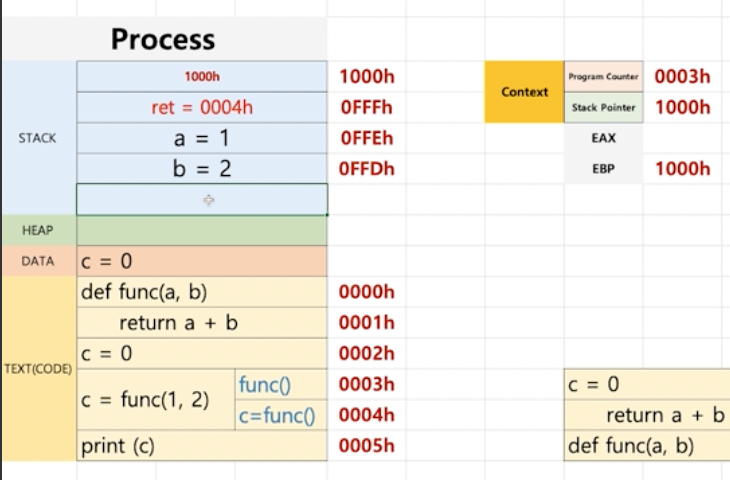
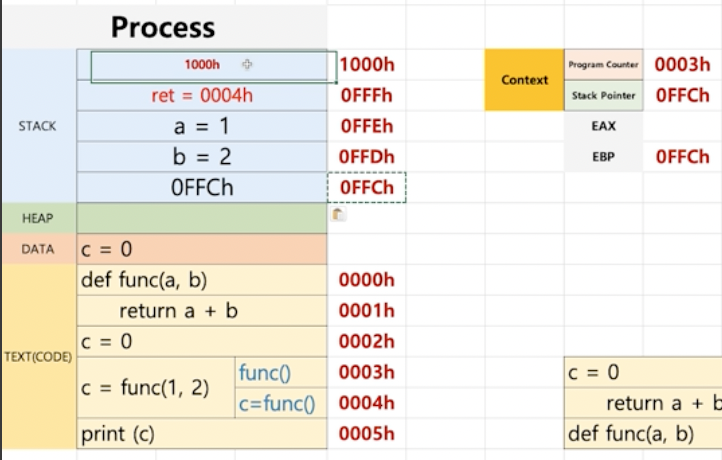
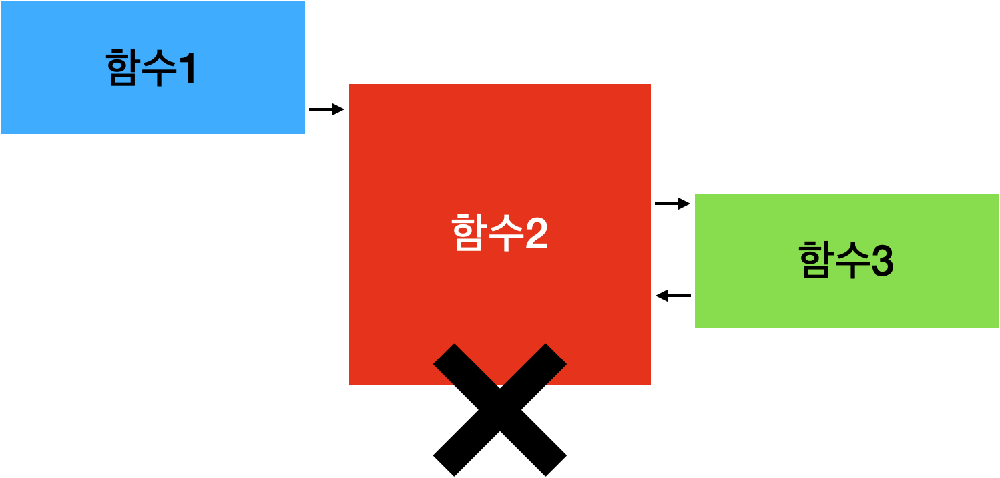

# 프로세스 구조

1. Text`Code`: 프로세스의 프로그래밍 코드, 기계어로 번역되어 적재됨
2. Data: 정적 및 전역 변수 적재, `DATA`(초기화된 데이터)와 `BSS`(초기화되지 않은 데이터)로 나뉨
3. Heap: 메모리 할당된 변수들을 관리, C언어의 `malloc`을 통해 할당된 변수가 적재
4. Stack: 지역 변수 및 함수 호출 같은 임시 데이터들을 관리

- 프로세스에서 `Text`, `Data`, `BSS`는 실행되자마자 **고정된 메모리**를 가짐
- 하지만 `Stack`은 **위 -> 아래**, `Heap`은 **아래 -> 위**로 메모리 적재량이 유동적으로 바뀜

## 내부 동작
- 그전에 사전 개념인 `PCB`를 알아야할 필요가 있음

### Process Control Block(PCB)
- 특정 프로세스를 관리할 필요가 있는 정보를 포함하는 운영체제 커널의 **자료구조**
- 프로세스 스케쥴링을 위해 프로세스에 관한 중요한 정보를 담고 있는 자료
- 프로세스가 생성될 때마다 고유의 PCB가 생성되고, 프로세스가 종료되면 제거됨

#### PCB에서 관리하는 정보
> 1. Process ID`PID`: 프로세스를 식별하는 ID
> 2. 프로세스 상태: 생성`Create`, 준비`Ready`, 실행`Running`, 대기`Waiting`, 완료`Terminated`를 가짐
> 3. 프로그램 계수기`Program Counter`: 코드 한 줄을 가리키는 주소 레지스터, **다음에 실행할 명령어의 주소**를 가리킴
> 4. CPU 레지스터 및 일반 레지스터
> 5. CPU 스케쥴링 정보: 우선순위, 최종 실행시간, CPU 점유 시간 등
> 6. 메모리 관리 정보: 해당 프로세스의 주소 공간
> 7. 프로세스 계정 정보: 페이지 테이블, 스케쥴링 큐 포인터, 소유자, 부모 등
> 8. 입출력 상태 정보: 프로세스에 할당된 입출력 장치 목록, 열린 파일 목록 등
> 9. 포인터`Stack Pointer`: 부모 프로세스에 대한 포인터, 자식 프로세스에 대한 포인터, 프로세스가 위치한 메모리 주소에 대한 포인터, 그리고 할당된 자원에 대한 포인터 정보
>    - **함수 실행 시 Stack 최상단 주소 레지스터**

- 프로세스는 프로그램 계수기`PC`와 포인터`SP`를 통해 프로세스가 다음에 어떤 `Code`를 수행하고, 어디 `Stack`의 주소에 데이터를 메모리에 적재할지 구분
- 이 두 개념은 `PCB`에서 관리하고 있음 -> 내부 동작을 알기 위한 선수 지식인 이유
- 그리고 이 두 정보를 사용할 땐 `PCB`에서 가져다 쓰는 것이 아닌, **`CPU 레지스터`에서 따로 관리함**
  - `Context Switching`이 일어나서 CPU 레지스터에 있는 `Running -> Waiting` 상태의 프로세스의 두 정보를 PCB에 저장
  - `Running` 상태가 된 다른 프로세스의 `PC`와 `SP`를 `CPU 레지스터`에 적재해서 실행

### 내부 동작 예

- `EAX`: 함수의 반환 값 저장하는 레지스터
- `EBP`: Stack의 최상단 주소를 담은 레지스터

> 1. 컴파일 후 코드는 Text 영역에 들어감
>    - 원래 Text는 위 그림과 달리 기존에 짠 코드와 반대 형식, Stack 형식으로 적재
>    - 좌측 코드가 정확히 적재된 예
> 2. `0000h`: 함수 선언부, 아무 일도 일어나지 않음
>    - `PC`=`0000h`, `SP`=`1000h`
> 3. `0001h`: 함수 구현부, 아무 일도 일어나지 않음
>    - `PC`=`0001h`, `SP`=`1000h`
> 4. `0002h`: `c = 0`를 `DATA` 영역에 적재
>    - `PC`=`0002h`, `SP`=`1000h`
> 5. `0003h`: `c = func(1,2)` 실행, **실행 -> 결과 값을 c에 초기화**하기 때문에 두개로 나눠짐
>    - `PC`=`0003h`, `SP`=`1000h`
>    5-1. `1000h`: 이 떄 `Stack`과 `EBP`에 `SP` 값 적재
>      - push `1000h`, `EBP`=`1000h`
>    5-2. `0FFFh`: Stack에 해당 함수가 끝날을 때 수행할 다음 주소 적재
>      - push `0004h`(ret=0004h)
> 6. `0FFEh` & `0FFDh`: `a=1, b=2`, 각 인자를 넣어줌
>    - `PC`=`0000h`, `SP`=`00FCh`
> 7. `return` 호출, 반환 값은 `EAX` 레지스터에 적재
>    - `PC`=`0001h`, `SP`=`00FCh`
> 8. 여태 Stack에 적재된 `func()` 관련 메모리를 pop
>    - `PC`=`0004h`, `SP`=`1000h`
>    - `ret=0004h`를 통해 다음에 실행할 코드 주소를 알게됨
>    - 이를 기반으로 다음 코드 실행
> 9. `0004h`: `EAX`에서 결과 값 확인, `c = func()` 결과 값 초기화
> 10. `0005h`: `print(c)` 수행

### 내부 동작 예2(함수 재귀 호출)

- 위 그림은 예제의 5번까지 수행한 시점
- 만약 func(a,b) 안에 다른 함수가 호출되면 아래같은 결과가 나옴

- `0FFCh`에 `0FFCh`가 적재
- `EBP` 값도 `0FFCh`로 변경됨
- **이러한 방식을 통해 문제 발생 시 추적`Tracking`하기 쉬워짐**
  
  - 이때 `EBP`는 **`함수2`의 최상단 SP**를 가지게 됨
  - `함수2`에서 문제가 발생하게 되면 `EBP`를 통해 어느 시점에 문제가 발생했는지 알 수 있음
  - 추가로 `함수1`이 수행된 시점까지도 알 수 있어 여러 로직으로 얽혀 있는 코드 이슈를 추적할 수 있게 됨

# Reference

[PCB(Process Control Block)란?](https://jwprogramming.tistory.com/16)