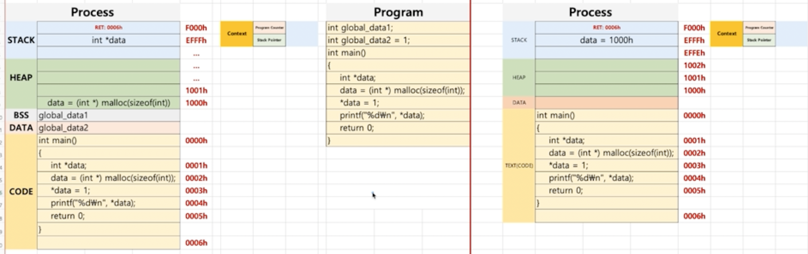

# Context Switching
- CPU에서 작업 중인 프로세스를 `Waiting` 상태로 돌려 멈추게 하고 다른 프로세스를 `Running` 상태로 만들어 수행시키는 작업
- 즉, **CPU에 실행할 프로세스 정보를 교체하는 기술**
- 해당 작업은 캐시 초기화 등 큰 작업 있어 자주 발생하면 오버헤드`Overhead`가 발생
  - 오버헤드`Overhead`: 어떤 처리를 하기 위해 들어가는 간접적인 처리 시간, 메모리 등

## 전개 방식

- 실행 중인 프로세스가 여럿 있다고 가정
- 실행할 프로세스의 `PCB`에서 `PC`와 `SP`를 `CPU 레지스터`에 등록해서 프로세스 실행
- 그리고 인터럽트로 인해 `Context Switching` 발생 시 해당 프로세스의 `PC`와 `SP`를 `PCB`에 저장하고 `Waiting` 상태로 들어감
- 그 다음에 수행할 프로세스의 `PC`와 `SP`를 `CPU 레지스터`에 적재시켜 다음 프로세스 수행

### 정리

1. 실행 중지할 프로세스 정보를 해당 프로세스의 `PCB`에 업데이트
2. 다음 실행할 프로세스 정보를 메인 메모리에 있는 해당 `PCB` 정보를 `CPU 레지스터`에 넣고 실행 -> `Dispatch`
   - `Dispatch`: `Ready -> Running` 상태로 바꾸는 작업

## 기타
- `Context Switching`도 코드의 일종
- 대량 `10ms`의 수행시간을 가지며, 그만큼 작업이 많을 수록 오버헤드`Overhead`가 잦아짐
- 어떠한 언어로 작성했냐에 따라 Trade-off가 발생
  - C언어 등 컴파일러가 있는 언어로 작성 시 어셈블리어로 작성하는 것보단 느림, 대신 CPU 아키텍처에 따라 컴파일러만 만들면 되서 이식하기 용이
  - 어셈블리어로 작성 시 매우 빠름, 대신 어셈블리어는 각 CPU 아키텍처마다 상이하기 때문에 새로운 CPU 아키텍처가 나타날 때마다 만들어줘야 함
- 참고로 `Linux`는 **각 CPU에 대응하는 `Context Switching` 코드가 존재**