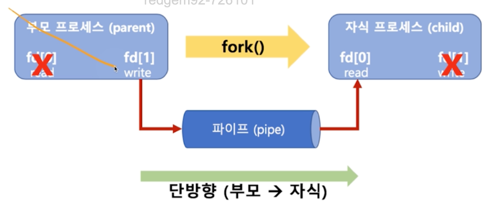
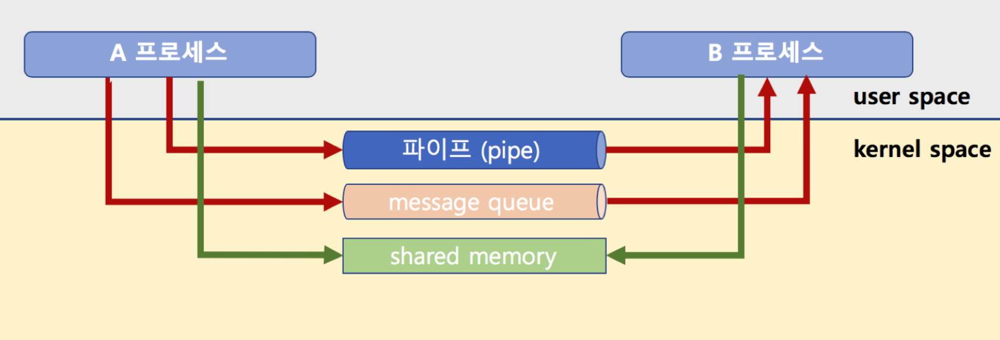
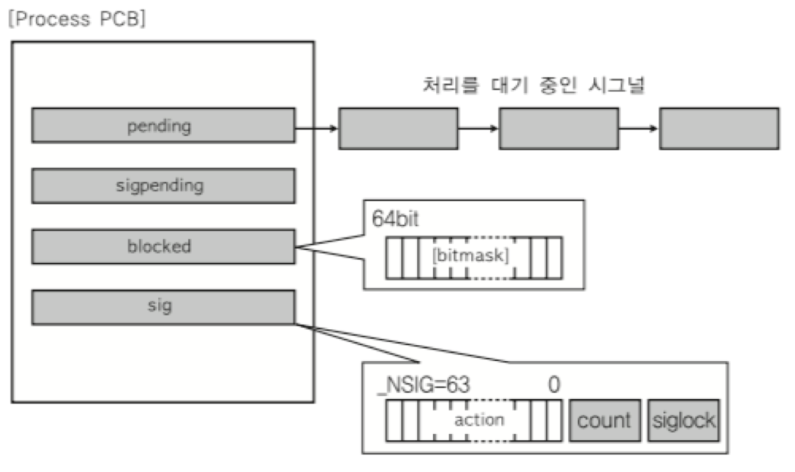
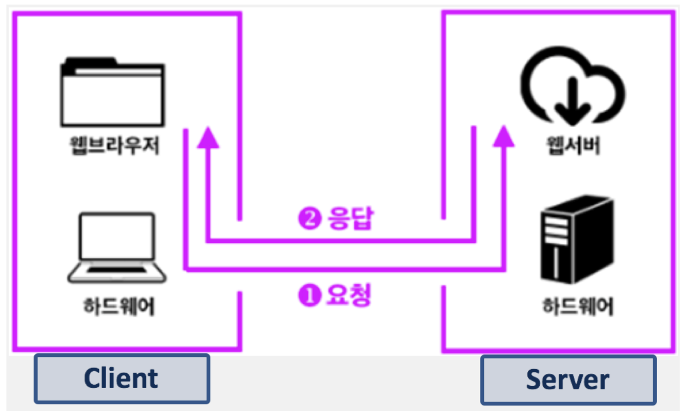
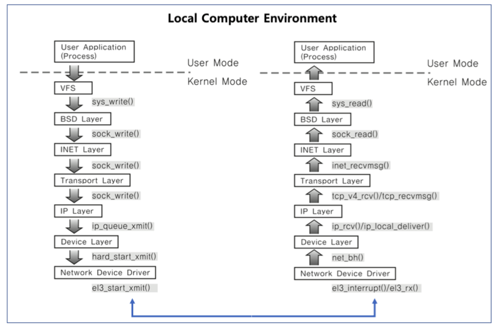

# Inter-process Coummunication(IPC) 기법
- 프로세스 간에 통신하여 상호 커뮤니케이션하는 기법
- 프로세스끼리 직접 대화하는 방법은 존재하지 않음
  - 해커의 코드 조작 방지를 목적으로 직접적으로 통신할 수 없으며 서로의 공간을 접근할 수 없음
- 그럼에도 프로세스 간의 커뮤니케이션이 필요하기 때문에 나온 기법

## 통신(커뮤니케이션)의 필요성
- 성능을 높이기 위함
- 어떤 로직을 수행하냐에 따라 하나의 프로세스로만 수행하는 대신 여러 프로세스가 수행해서 보다 빠른 성능을 기대
- 이를 위해 당연히 그 로직을 수행하는 고자ㅓㅇ에서 필요한 데이터들을 서로 공유할 수 있어야 함

## IPC 종류

### 1. File 사용
- 텍스트 파일(혹은 다른 포맷 파일)을 통해 데이터를 주고 받는 기법
- 이 방식은 실시간으로 직접 원하는 프로세스에 데이터 전달이 어려움
- 디스크에서 데이터 파일을 읽고 프로세스에 적재`load`되는 과정에서 `Context Switching`, `인터럽트` 등 여러 일을 처리하기 때문

### 2. 파이프`Pipe`

- 단방향 통신
- `부모 프로세스 -> 자식 프로세스`에게 일방적으로 통신하는 기법
- `fork()`를 통해 자식 프로세스를 만들고 나서 부모의 데이터를 자식에게 보냄

#### 예제
```c
#include <stdio.h>
#include <stdlib.h>
#include <unistd.h>

char* msg = "Hello Child Process";
int main()
{
	char buf[255];
	int fd[2], pid, nbytes;
	if(pipe(fd) < 0) 			      // pipe(fd)로 파이프 생성
            exit(1);
	  
	pid = fork(); 				      // 이 함수 실행 다음 코드부터 부모/자식 프로세스로 나눠짐
	if(pid > 0){ 			              // 부모 프로세스는 pid에 실제 프로세스 ID가 들어감
		write(fd[1], msg, MSGSIZE);           // fd[1]에 씀(write 파일 디스크립터)
	} else{                                       // 자식 프로세스는 pid가 0이 들어감
		nbytes = read(fd[0], buf, MSGSIZE);   // fd[0]으로 읽음(read 파일 디스크립터)
		printf("%d %s\n", nbytes, buf);
		exit(0);
	}
	return 0;
}
```

### 3. 메시지 큐`Message Queue`
```c
// A 프로세스
// key는 1234(예), msgflg는 옵션
msqid = msgget(key, msgflg);
msgsnd(msqid, &buf, buf_length, IPC_NOWAIT);

// B 프로세스
// key는 A에서 지정한 것과 동일하게 해야 해당 큐의 msqid를 얻을 수 있어요.
msqid = msgget(key, msgflg);
msgrcv(msqid, &rbuf, MSGSZ, 1, 0);
```
- `FIFO` 정책으로 데이터가 전송되는 기법
  - `msgget(key, msgflg)`: key 값의 메시지 큐를 가져옴
  - `msgsnd(msqid, &buf, buf_length, IPC_NOWAIT)`: `msgget`의 ID를 통해 얻은 메시지 큐 ID에 버퍼를 `push`
  - msgrcv(msqid, &rbuf, MSGSZ, 1, 0): 해당 ID 메시지 큐의 버퍼에서 데이터를 받음

> **파이프 vs. 메시지 큐<br>**
> 파이프는 부모-자식간 통신만 가능한 반면, 메시지 큐는 어떤 프로세스 간이라도 통신 가능 => **단방향과 양방향의 차이가 있음**

### 4. 공유 메모리
- 그전에 알아야할 점이, 리눅스Linux는 프로세스 공간이 완전히 분리되어 있음
- 어떤 프로세스는 하나당 `4GB` 공간을 관리, 사용자 공간을 `0~3GB` 주소까지 지정하고 커널 공간을 `3~4GB` 주소까지 지정
  - 이는 실제 물리 메모리`RAM`가 아닌 가상 메모리


- `공유 메모리` 기법은 커널 공간에 메모리 공간을 만들고, 해당 공간을 변수처럼 쓰는 방식
- 데이터를 버퍼에 넣어 처리하는 메시지 큐와 달리, **해당 메모리 주소를 변수처럼 접근해서 사용**
- 공유 메모리 key를 통해 여러 프로세스가 접근 가능하게 함

#### 예제
```c
// 1. 공유 메모리 생성 및 메모리 주소 얻기
shmid = shmget((key_t)1234, SIZE, IPC_CREAT|0666 /* 접근권한*/));
shmaddr = shmat(shmid, (void*)0, 0);

// 2. 공유 메모리에 쓰기
strcpy((char*)shmaddr, "Linux Programming");

// 3. 공유 메모리 읽기
printf("%s\n", (char*)shmaddr);
```

### 5. 시그널`Signal`
- 커널 또는 프로세스에서 다른 프로세스에 이벤트가 발생되었는지 알려주는 기법
  - 프로세스 관련 코드에 관련 시그널 핸들러를 등록
  - 해당 시그널 처리를 실행하는 방식으로 공유
- 가장 많이 사용되는 기법 중 하나, IPC 기법을 위해 존재하는 것은 아니나 이를 활용할 수 있음

#### 알고리즘
1. 시그널 무시
2. 시그널 Block
3. 등록된 시그널 핸들러로 특정 동작 수행
4. 등록된 시그널 핸들러가 없으면 커널에서 기본 동작 수행

#### 주요 시그널
- 운영체제에서 정의되며, 보통 64개 정도 됨
- CLI에서 `kill -l` 명령어로 확인 가능, MacOS 기준 시그널 목록은 아래와 같은
  
  - `SIGKILL`: 프로세스를 죽임, 슈퍼 관리자가 사용하는 시그널로 어떤 경우든 프로세스를 죽임
  - `SIGALARM`: 알람을 발생시킴
  - `SIGSTP`: 프로세스를 멈춤 -> Ctrl+Z
  - `SIGCONT`: 멈춘 프로세스를 재실행
  - `SIGSEGV`: 프로세스가 다른 메모리 영역 침범을 알림
  - `SIGUSR1 & 2`: 기본 동작이 정의되지 않은 시그널
    - 프로그램으로 프로세스를 만들 때프로그램에서 특정 시그널은 기본 동작 대신 특별한 동작을 하도록 정의
    - MacOS 기준으로 `USR1`, `USR2`로 정의됨

#### 예제
```c
static void signal_handler(int signo){
	printf("Catch SIGINT!\n");
	exit(EXIT_SUCCESS);
}

// 시그널 핸들러 함수 호출
int main(){
	// SIGINT를 받으면 signal_handler 함수 호출
	if(signal(SIGINT, signal_handler) == SIG_ERR){
		printf("Can't catch SIGINT!\n");
		exit(EXIT_FAILURE);
	}
	for(;;){
		pause();
	}
	return 0;
}

// 시그널 핸들러 무시
int main(){
	// SIGINT를 받으면 무시
	if(signal(SIGINT, SIG_IGN) == SIG_ERR){
		printf("Can't catch SIGINT!\n");
		exit(EXIT_FAILURE);
	}
	for(;;){
		pause();
	}
	return 0;
}
```

#### 시그널과 프로세스

- PCB는 해당 프로세스가 blocking 또는 처리해야 하는 시그널도 관리함
  - `pending`: 처리 대기 중인 시그널
  - `sigpending`: 받은 시그널 유무
  - `blocked`: 블록된 시그널 -> 비트마스트 형식
  - `sig`: 각 시그널에 대한 동작 처리에 대한 핸들러

### 6. 소켓`Socket`

- 본래 소켓`Socket`은 네트워크 통신을 위한 기법
- 기본적으로 클라이언트와 서버 등 두 개의 다른 컴퓨터 간의 네트워크 기반 통신을 위한 기술
  - 네트워크 디바이스를 사용할 수 있는 시스템 콜이기도 함
- 소켓은 이렇게 클라이언트와 서버 뿐만 아니라, 하나의 컴퓨터 안에서 프로세스 간의 통신 기법으로 활용하는 경우도 있음


- 소켓을 사용하면 로컬 컴퓨터 간의 통신 시 계층을 타고 내려가면서 송신, 아래 계층부터 위로 올라가면서 대상 프로세스가 수신하는 방식을 취함