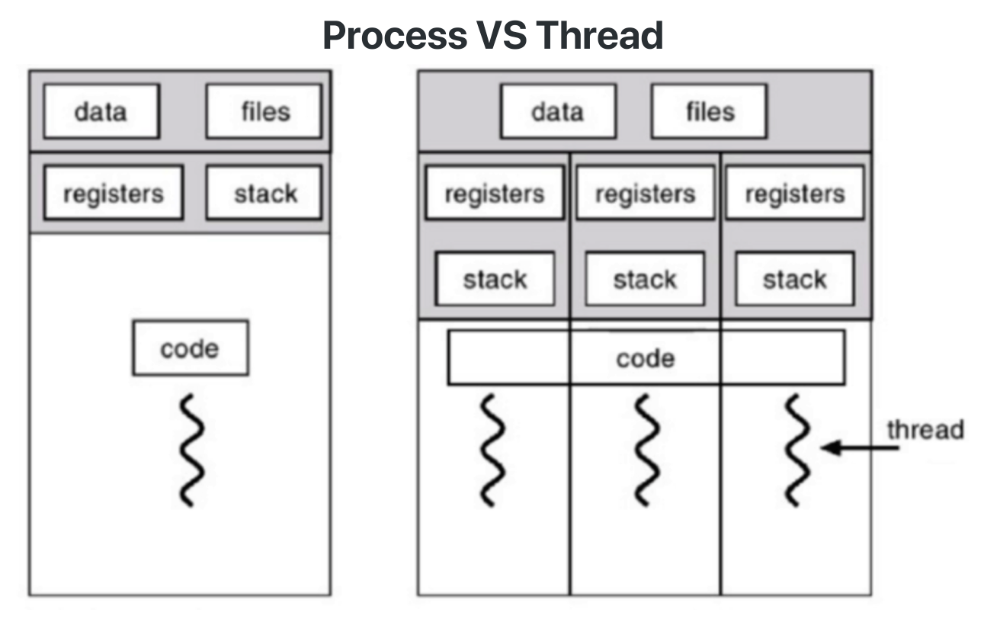
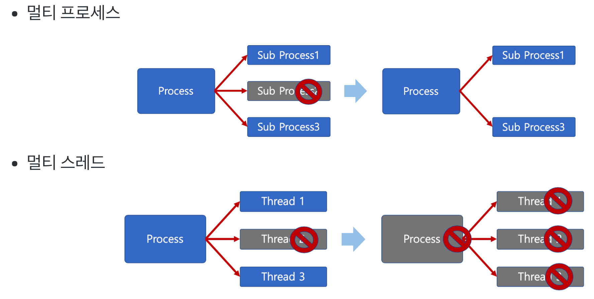
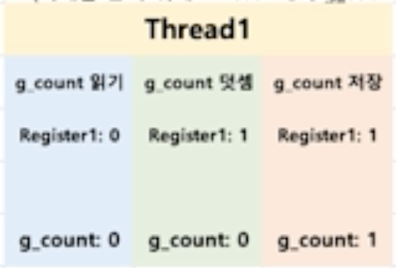
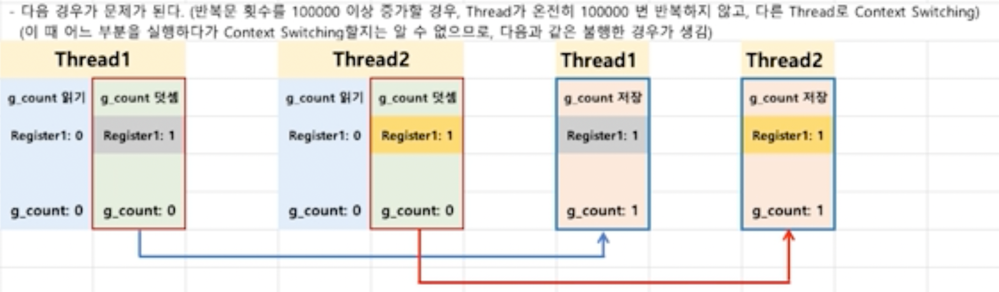
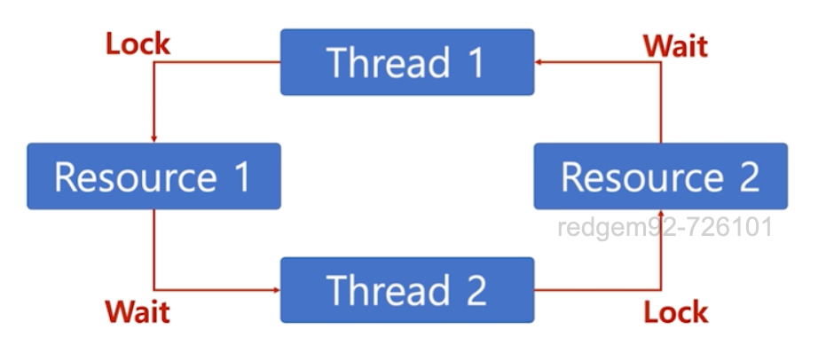

# Thread
- `Light Weight Process`라고도 불림
- 프로세스 간에는 각 프로세스의 데이터를 접근하려면 DB 같은 외부 프로그램이나 `IPC` 기법을 활용해야 함
- 어떠한 방식을 사용하던 외부에서의 방식으로 접근하기 때문에 `Context Switching`이 일어나 자원 공유가 원할한 것은 아님
- 그래서 **하나의 프로세스 안에서 자원을 공유하면서 여러 프로그램 실행 흐름을 실행할 수 있게 하는 기능**이 있고, 이를 `Thread`라 함
- 이는 프로세스 안에 있어 프로세스의 데이터를 모두 접근이 가능


- 프로세스의 메모리 구조는 크게 `Text`, `Data`, `Heap`, `Stack`으로 나뉨
- `Thread`는 `Stack`만을 **독립적**으로 가지고, `Data`와 `Heap` 그리고 `Text` 영역을 **공유**할 수 있음
- 이러한 방식 덕분에 여러 CPU에 프로세스를 적재시켜 작업 가능해짐 => **멀티 코어 환경으로 멀티 프로세싱 작업이 가능**

## 멀티 프로세스와 멀티 태스킹
1. `1-process, 1-thread`: 프로세스는 하나의 메인 Thread를 가짐 -> 초소형 시스템에서 주로 사용
2. `1-process, Many thread`
3. `Many process, 1-thread`: `Thread`를 사용하지 않는 경우
4. `Many process, Many thread`: 선호되는 방식

## 프로세스 vs. Thread
1. 프로세스는 독립적, Thread는 프로세스의 일부
2. 프로세스는 자신만의 주소 영역을 가지고, Thread는 주소 영역을 일부(Code, Heap, Data) 공유

## Thread 장단점
### 장점
1. 자원 공유 효율성
   - IPC 기법처럼 프로세스 간 자원 공유를 위한 번거로운 작업이 불필요
   - 프로세스 내부에 있어서 프로세스의 데이터를 모두 접근 가능함
2. 작업이 분리되어 코드가 간결해짐
   - 코드 작성하기 나름이나, 작업을 나누는 것만큼 코드도 그만큼 간결해짐

### 단점
1. Thread 중 하나라도 문제 발생 시, 전체 프로세스에 영향을 줌
    
   - 멀티 프로세스 환경에선 프로세스가 하나 죽더라도 다른 프로세스가 영향 받지 않음
   - 그러나 Thread는 모든 Thread 작업이 정상적으로 수행된다는 전제 하에 진행되기 때문에, 하나라도 문제가 발생하면 작업 흐름 전체가 영향을 받음
   - 그래서 Thread를 활용한 코드 작성 시 매우 주의해야 하고, 활용법도 굉장히 어려움
2. `Context Switching`으로 인한 성능 저하
   - 프로세스처럼 `Thread`도 마찬가지로 Thread 간 `Context Switching`이 발생
   - `Thread`를 많이 생성할 수록 모든 `Thread`를 스케쥴링해야하기 때문에 그만큼 발생 빈도가 많음
   - 프로세스 간 `Context Switching`보다 오버헤드가 적은 편이나, 수가 많다면 아무리 CPU가 연산을 빠르게 수행해도 성능 저하는 피할 수 없음

## 동기화(Synchronization) 이슈
- 프로세스 안에는 다수의 Thread가 만들어지며, 프로세스의 데이터를 공유할 수 있음
- 그리고 Thread는 실행 순서가 정해져 있지 않음
- 그래서 만약 Thread끼리 변수 값을 바꾸면 의도하지 않은 결과를 낼 수 있는데, 이를 `동기화 이슈`라고 함
  - **동일 자원을 여러 Thread가 동시 수정 시, 각 Thread 결과에 영향을 주는 것**
  - 이러한 이슈 때문에 동기화 관리가 필요

### 예제

- 하나의 Thread는 `g_count`라는 전역 변수`DATA`를 1 증가시키는 로직을 수행한다 가정
- 여기서 Thread의 실행 흐름은,
  1. 전역 변수를 읽어들여 **레지스터에 등록**
  2. 전역 변수를 1 더함
  3. 더한 값`레지스터`을 전역 변수에 저장


1. `2개의 Thread`를 생성시켜 이를 수행, 처음에 생성 순서에 관계 없이 `Thread`가 실행됨
2. 이때 처음 실행하는 `Thread`가 전역 변수를 읽고 전역 변수 값을 더하는 중, `Context Switching` 발생하면서 2번째 Thread가 Running 상태가 됨
3. 마찬가지로 1번째 Thread처럼 더하기 수행
4. 그 다음에 `Context Switching`이 발생하면서 1번째 `Thread`가 **레지스터 값에 있는 값을 전역 변수에 저장**, 값이 1이 됨
5. 그리고 다시 `Context Switching`이 발생하면서 2번째 `Thread`가 저장을 수행
   - **이때 레지스터에 이전에 수행한 결과를 전역 변수에 저장**
   - **이미 다른 Thread에서 한번 더했음에도 전역 변수의 결과가 1이 되어 버림**

### 예제2(코드)
```c
#include <stdio.h>
#include <stdlib.h>
#include <pthread.h>
#include <unistd.h>

int g_count = 0;

void* func(void* ptr){
    for(int i = 0 ; i < 1000; ++i){
        ++g_count;
    }
}

int main()
{
    pthread_t thread1, thread2;
    pthread_create(&thread1, NULL, func, 0);
    pthread_create(&thread2, NULL, func, 0);

    printf("%d\n", g_count);

    return 0;
}
```
- 결과 값을 `2000`으로 기대할 수 있으나, 다른 결과가 뜸


- 해결법은 존재, 1번 Thread가 수행되는 동안 다른 Thread가 접근하지 못하도록 막는 것
    ```c
    #include <stdio.h>
    #include <stdlib.h>
    #include <pthread.h>
    #include <unistd.h>
    
    int g_count = 0;
    
    void* func(void* ptr){
        for(int i = 0 ; i < 1000; ++i){
            ++g_count;
        }
    }
    
    int main()
    {
        pthread_t thread1, thread2;
        pthread_create(&thread1, NULL, func, 0);
        pthread_create(&thread2, NULL, func, 0);
        pthread_join(thread1, 0);	// 이 스레드가 끝날 때까지 다른 스레드는 접근 못해요!
        pthread_join(thread2, 0);	// 이 스레드가 끝날 때까지 다른 스레드는 접근 못해요!
    
        printf("%d\n", g_count);
    
        return 0;
    }
    ```
    

- 그러나 이 방법은 Thread를 사용하는데 의미가 없음(단일 Thread로 돌리는 것이나 마찬가지)
- 중요한 점은, 그만큼 Thread는 효율성과 동기화 이슈를 고려해서 작성해야 제대로 활용할 수 있는 것
- 이런 동기화 이슈를 해결하기 위한 기법이 있음 => 상호 배제`Mutual Exclusive`

## 상호 배제(Mutual Exclusive)
- 동기화 이슈 해결 방안
- Thread는 프로세스의 모든 데이터를 접근해서 문제가 발생
- 그래서 여러 Thread가 변경하는 공유 변수에 대해 배제적 접근`Exclusive Access`이 필요
  - 한 Thread가 공유 변수를 갱신하는 동안 다른 Thread가 동시 접근하지 못하도록 막는 것
- 이렇게 `Exclusive Access`가 존재하는 자원을 **임계 자원**이라 하고, 코드 영역을 **임계 영역`Critical Section`**이라 함
- 임계 영역에 대한 접근을 막기 위한 `Locking` 알고리즘도 존재

### 세마포어(Semaphore)
- 임계 영역에 여러 Thread가 들어갈 수는 있되, `Counter`를 둬서 동시에 자원을 접근할 수 있는 **가용 Thread 개수를 제어**하는 방식
- 해당 기법은 수도 코드`Pseudo-code` 형식으로도 표기가 가능

#### 수도 코드
```shell
P(S) : wait(S){
    while S <= 0;  // 대기
    S--;  // 다른 프로세스 접근 제한
}

V(S) : signal(S){
    S++;  // 다른 프로세스 접근 허용
}
```
- `P` - 검사(임계 영역 접근): `S` 값이 `1이상`이면 영역 진입 후 `S` 값 1이 차감, `S` 값이 `0`이면 대기 상태
- `V` - 증가(임계 영역 해제): `S` 값을 1 더하고 임계 영역에서 나옴
- `S` - 세마포어 값: 초기 값 만큼 여러 프로세스가 동시에 임계 영역에 접근 가능

#### 세마포어 - 바쁜 대기(Busy Waiting)
- `wait()`의 `S`가 `0`일 경우, 임계 영역에 들어가기 위해 반복문을 수행하는데, 이를 바쁜 대기`Busy Waiting`이라 함
- 이는 결국 루프문을 임계 영역에 들어갈 때까지 계속 돌기 때문에 CPU 성능 문제를 야기함

#### 세마포어 - 대기 큐
```shell
wait(S){
    S->count--;
    if (S->count < 0){
        add this process to S->queue
        block()		
    }
}

signal(S){
    S->count++;
    if (s->count < 0){
        remove a process P from S->queue;
        wakeup(P);
    }
}
```
- 바쁜 대기로 인한 CPU 성능을 해결하기 위해 나온 개념
- 운영체제처럼 임계 영역에 접근할 Thread를 대기 큐 안에 넣어서 관리
- `wait(S)`에서 루프문 방식과 달리 **S -> count를 먼저 감소 시킴**
- 만약 이 감소로 인해 `S->count < 0`이 되면, 즉 현재 Thread가 `wait`를 불렀지만 세마포어 빈 자리가 없는 상태였다면 현재 Thread를 `blocking`해서 대기시킴
- 이후에 세마포어를 먼저 획득한 Thread가 `signal(S)`를 불러 접근 허용 Thread를 하나 증가`(s->count)++`시키면, 두가지 상황 발생
  1. 기다리던 Thread가 **없었고**(증가 이전에 `s->count >= 1`), 하나의 Thread가 더 접근할 수 있는 경우
     - `wait(s)`를 호출하는 Thread들은 `(s->count)--` 시키며 `block` 없이 진행
     - 따로 `signal(S)`에서 `wakeup`을 불러올 필요가 없게 됨
  2. 기다리던 Thread가 **있었고**(증가 이전에 `s->count < 0`), 하나의 Thread가 더 접근할 수 있는 경우
     - 기다리던 Thread가 있었고 `s->count 증가 이후`에도 `wait(S)`를 호출하는 함수들은 다시 `s->count를 음수로 만들면서 block할 예정`
     - `Signal(S)`에서 `wakeup`을 통해 기다리던 Thread들을 깨워줌
- 쉽게 말하면, **기다리는게 없으면 따로 block된 Thread 살릴 거 없이 들어온 Thread를 접근 허용, 있으면 그 Thread를 block 상태를 해제해주는 방식으로 Thread 실행**

### 뮤텍스(Mutex, Binary Semaphore)
- 이진 세마포어`Binary Semaphore`라고도 불림
- 기존 세마포어와 동일하나, 임계 구역에 오직 하나의 Thread만 접근 가능하게 함 => `s->count == 1 or 0`

## 교착 상태(Deadlock)

- Locking 알고리즘으로 인해 발생하는 문제
- 두 개 이상의 작업이 서로 상대방의 작업이 끝나기만을 기다리고 있어 다음 단계로 진행 못하는, **무한 대기 상태**

### 발생 조건
1. `Mutex(Mutual Exclusive)`: 프로세스들이 필요하는 자원에 대해 배타적인 통제권을 요구하는 경우
2. `점유 대기(Hold and Wait)`: 프로세스 할당된 자원을 가진 상태에서 다른 자원을 기다리는 경우
3. `비선점(Non-preemptive)`: 프로세스가 어떤 자원의 사용을 끝날 때까지 그 자원을 못 뺏는 경우
4. `순환 대기(Circular Wait)`: 각 프로세스가 순환적으로 다음 프로세스가 요구하는 자원을 가지는 경우

### 해결 방법
1. `예방`: 4가지 조건 중 일부를 제거
2. `회피`: 자원 할당 순서를 정하지 않는 방식으로 **순환 대기**만 제거 -> 나머질 제거하면 성능 저하 문제가 있기 때문
3. `발견`: 수시로 Thread를 점검해서 `Deadlock` 상태에 있는 것을 발견
4. `회복`: `Deadlock` 상태에 있는 Thread가 있다면 해제하거나 선점

## 기아 상태(Starvation)
- 특정 프로세스의 우선순위가 너무 낮아서 원하는 자원을 계속 할당 받지 못하는 상태
- Locking 알고리즘 사용 과정 중 발생할 수 있는 두번째 이슈
- `Starvation`과 `Deadlock`을 비교하자면, 
  - `Deadlock`은 여러 프로세스가 동일한 자원을 점유 요청할 경우 발생
  - `Starvation`은 여러 프로세스가 부족한 자원을 점유하기 위해 경쟁할 때 특정 프로세스는 영원히 할당 안되는 경우

### 해결 방안
- 우선순위가 낮아서 발생한 문제이므로 우선순위를 높여주면 됨
- 공평하게 우선순위가 낮았던 프로세스도 우선순위를 수시로 높여줘 높은 우선순위를 가질 기회를 주는 것
- 에이징`Aging` 기법을 통해 오래 기다린 프로세스에게 시간이 지날 수록 우선순위를 높이는 방법이 있음
- 아니면 우선순위가 아니라 요청한 순서대로 처리하는 선입선출`FIFO` 기법으로 처리하면 됨