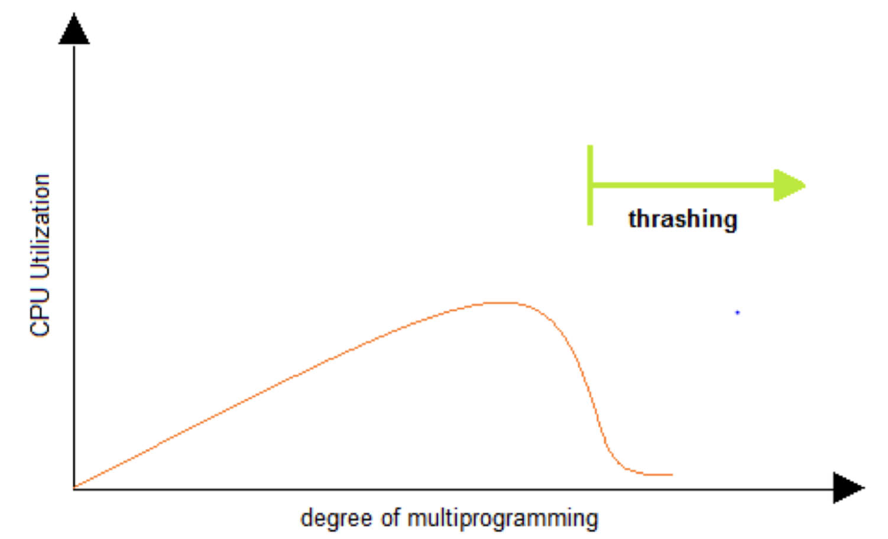

# 가상 메모리
- 폰 노이만 아키텍처 기반으로 된 코드들은 반드시 메모리`RAM`에 적재되어 실행되어야 함
- 이 말대로라면 실제로 각 프로세스마다 메모리를 할당하기에는 메모리 크기에 한계가 있음
  - 일반적으로 컴퓨터엔 16~32GB의 RAM을 컴퓨터에 장착
  - 그러나 컴퓨터 사용자는 게임을 실행시키고, 유튜브를 검색하면서 음악도 듣거나, 중간에 넷플릭스를 틂
  - 그럼에도 컴퓨터는 이를 전부 끊김없이 실행시킴
- 이러한 한계점을 극복하고 모든 프로그램을 실행시키도록 하는 것이 가상 메모리`Virtual Memory` 시스템
  - 가상 메모리는 적은 메모리로 여러 프로세스를 실행시키기 위한 시스템
  - 이는 메모리가 실제 메모리보다 많아 보이게 하는 기술
  - 프로세스 크기 자체는 엄청나나, 실제로 프로세스가 사용하는 메모리는 작다는 점을 착안해서 고안됨
  - 프로세스 간 공간 분리로 프로세스 이슈가 전체 시스템에 영향을 주지 않게 할 수 있음

## 작동 매커니즘
- 프로세스는 `가상 주소`를 사용해서 실제 해당 주소에서 데이터를 읽고 쓸 때만 `물리 주소`로 바꿔줌
  - `가상 주소`: 프로세스가 참조하는 주소
  - `물리 주소`: 실제 메모리`RAM` 주소

### Memory Management Unit(MMU)

- 가상 메모리 시스템을 작동하기 위해 `MMU`에서 가상 메모리 주소와 물리 주소를 관리함
- CPU는 가상 메모리를 다루고 실제 해당 물리 주소를 접근할 때 `MMU` 장치를 통해 가상 주소와 매칭된 물리 주소를 접근함
- 여기서 `MMU`는 하드웨어 장치 -> 소프트웨어 방식보단 하드웨어 장치가 주소 변환이 빠르기 때문
  - 별도의 장치를 통해 주소 변환이 이뤄짐

### 페이징 시스템(Paging System)
- 크기가 동일한 페이지로 가상 주소 공간과 매칭하는 물리 주소 공간을 관리
- **프로세스가 실행될 때 전체 메모리를 적재시킬 필요가 없음**
  - 그때마다 필요한 공간만 적재시켜 실행
  - 적재가 안된 부분을 실행해야 하면 그때 메모리에 적재시켜 실행함
  - 이러한 공간을 페이지`Page` 단위로 나눠서 메모리에 적재시키고 프로세스를 실행시켜 물리 메모리를 효율적으로 사용
- 이렇게 페이지를 관리하는 시스템을 `페이징 시스템`이라 함
- 페이징 시스템은 하드웨어의 지원이 필요
  - `Intel x86(32-bit) CPU` 기준 하나의 페이지 단위는 `4KB`, `2MB`, `1GB`
  - 소프트웨어인 리눅스`Linux`는 `4KB`로 페이징 -> 페이지 번호를 기반으로 가상 주소 및 물리 주소 매핑 정보를 기록하고 사용

#### 예시(리눅스)

- 리눅스는 프로세스 크기를 `4GB`로 고정
- 프로세스의 `PCB`에 페이지 테이블`Page Table` 구조체를 가리키는 주소가 들어 있음

##### 수도 코드

- `p`: 가상 메모리 페이지
- `d`: `p` 안에서 참조하는 위치
- 페이지 크기가 `4KB` 예,
  - 가상 주소의 0-bit에서 11-bit가 변위`d`를 나타냄
  - 12-bit 이상이 페이지 번호가 될 수 있음

#### 프로세스가 4GB를 사용하는 이유
- 32-bit 시스템에선 2^32-bit, 즉 4GB의 시스템에서 다 표현할 수 있기 때문

### 페이지 테이블(Page Table)
- 물리 주소에 있는 페이지 번호와 해당 페이지의 첫 물리 주소 정보를 매핑한 표
- 해당 프로세스에서 특정 가상 주소를 접근하기 위해선,
  1. 해당 프로세스의 페이지 테이블에 해당 가상 주소가 포함된 페이지 번호가 있는지 확인
  2. 페이지 번호가 있다면, 이 페이지가 매핑된 첫 물리 주소를 알아낼 수 있음 -> `p'`
  3. **`p'` + 변위`d`**가 실제 물리 주소가 됨
- 프로세스의 페이지는 항상 물리 메모리에 적재될 필요가 없음
- 그래서 적재되지 않은 페이지는 페이지 테이블에 `Valid/Invalid bit`로 적재 여부 정보를 담음

### 페이징 시스템과 MMU

1. CPU는 가상 주소 접근 시 MMU 장치를 통해 물리 메모리 접근
2. 프로세스가 생성되면 페이지 테이블 정보가 생성됨
   1. PCB 등에서 해당 페이지 테이블 접근이 가능하고, 관련 정보는 물리 메모리에 적재
   2. 프로세스가 구동되면, 해당 페이지 테이블 base 주소가 별도 레지스터`CR3`에 저장
   3. CPU가 가상 주소를 접근하면 MMU가 페이지 테이블 base 주소를 접근해서 물리 주소를 가져옴

### 다중 단계 페이징 시스템
- 실제로 프로세스는 4GB를 넘는 경우가 거의 없음 -> 대부분 프로세스는 4GB까지 공간을 필요하지 않음
- 따라서 하나의 프로세스가 4GB를 모두 차지하는 것은 비효율적
- 그래서 페이지 정보를 단계로 나눠서 생성함
- 필요 없는 페이지를 생성하지 않으면 그만큼 공간 절약이 가능

>**32-bit 시스템에서 4KB를 위한 페이징 시스템** 
> 하위 12-bit는 오프셋, 상위 20-bit는 페이징 번호이므로, 2^20(1048576)개의 페이지 정보가 필요

- 공간 절약을 위해 위와 같이 페이지 번호를 나타내는 bit를 구분해서 단계를 나눔
- 본래 상위 20-bit를 페이지 정보로 활용했으나, 이렇게 단계를 나눠 상단의 10-bit는 페이지 경로`Page Directory`, 그 다음 10-bit는 실제로 사용하는 페이지 테이블`Page Table`로 나눠 효율적인 공간 관리하는 시스템을 구축
  1. CR3 레지스터에 페이지 디렉토리 시작 주소를 등록하여 찾아감
  2. 페이지 디렉토리엔 페이지 테이블의 시작 주소를 가지고 있음
  3. 페이지 테이블을 접근해 실제 물리 메모리의 프레임 주소를 찾아 데이터를 가져옴

### MMU와 Translation Lookaside Buffer(TLB)
- 실제 물리 주소를 접근할 때 `MMU`를 활용
- 추가적으로 하드웨어 보조장치를 활용해서 접근하는 경우도 있음 => `Translation Lookaside Buffer(TLB)`
- 이렇게 하는 이유는 **메인 메모리 접근 시간 속도보다 레지스터 접근 시간이 현저히 빠르기 때문**
- 그래서 데이터 접근마다 메인 메모리 보단 과거에 사용한 적이 있다면 이를 따로 레지스터에 캐싱`Caching`해서 접근 속도를 높이는 보조장치, `TLB`를 사용

#### TLB를 활용한 페이징 매커니즘

1. 가상 주소 요청 -> `MMU`
2. `MMU`는 `TLB`에서 최근에 가상 주소에서 물리 주소로 변환된 정보가 있는지 확인, 있다면 해당 정보를 활용
3. `TLB`에 없다면 `CR3`에 등록된 base 주소로 접근해 메인 메모리에서 데이터를 찾음
4. 찾았다면 메인 메모리는 `MMU`에 물리 주소를 반환
5. `MMU`는 해당 정보를 `TLB`에 캐싱하고 이 물리 주소를 기반으로 메인 메모리에 접근
6. 메인 메모리는 해당 데이터를 CPU에 적재시켜 프로세스를 수행

### 페이징 시스템과 공유 메모리

- 프로세스는 동일한 물리 주소를 가리킬 수 있음
- 실행 중이 프로세스들이 서로 동일한 로직을 수행한다면 굳이 따로 메모리에 적재되서 실행될 필요 없이 동일한 공간에서 프로세스 수행 -> 메모리 절약
  - `fork()`는 실행 중인 프로세스에게 동일한 자식 프로세스를 만들어줌
  - 동일하기 때문에 로직도 같으니 `read`만 수행한다면 메모리 공간을 따로 할당시킬 필요가 없어, 동일한 공간에서 로직을 수행
  - 이를 통해 공간 절약과 동시에 메모리 할당 시간도 절약

- 다만 특정 프로세스에서 write, 물리 주소에서 데이터가 변경되면 두 프로세스는 서로 다른 루직을 수행함
- 그래서 이때 물리 주소 복사를 수행해서 필요한 공간 할당을 수행해서 효율성을 높임 => `Copy-on-write`

## 요구 페이징(Demand Paging)
- 가상 메모리는 프로세스의 모든 데이터를 메모리에 적재하지 않고 실행 중에 필요한 시점에만 적재

> 이는 미리 프로세스와 관련된 모든 데이터를 메모리에 올려 놓고 실행하는 선행 페이징`Anticipatory Paging`과는 다른 개념

- 그렇다면 더이상 필요하지 않은 페이지 프레임은 다시 저장매체에 저장해야 함
- 이를 위한 **페이징 교체 알고리즘**도 필요

### 페이지 폴트(Page Fault)

- 어떤 페이지가 실제 물리 메모리에 없을 때 일어나는 인터럽트`Interrupt`
- 운영체제가 페이지 폴트를 발생시키면 해당 페이지를 물리 메모리에 올리는 방식
- 페이지 폴트가 발생하면 운영체제한테 `Trap`을 요청하고 이를 저장 매체에서 불러와 메모리에 적재하는 작업을 수행
- 메인 메모리에 접근하는 시간은 비교적 비용이 큰 편
- 따라서 향후 실행 및 참조될 코드와 데이터를 미리 물리 메모리에 올린다면 효율적으로 프로세스를 실행할 수 있음

## 페이지 교체 정책
- 운영체제가 특정 페이지를 물리 메모리에 올리려할 때, 물리 메모리가 다 차면,
  1. 기존 페이지 중 하나를 물리 메모리 -> 저장 매체로 내림
  2. 새로운 페이지를 해당 공간에 올림
- 여기서 어떤 메모리를 내릴 것인가를 정하는 것이 바로 **페이지 교체 알고리즘**

### FIFO 알고리즘
- 처음에 들어온 페이지를 내리고, 새 페이지를 해당 공간에 올림

### 최적 교체 알고리즘(Optimal Replacement Algorithm, OPT)
- 앞으로 가장 오랫동안 사용하지 않을 페이지를 내림
- 이상적이나 구현이 어렵고 일반적인 운영체제에선 구현할 수 없음

### Least Recently Used(LRU) 알고리즘
- 가장 오랫동안 사용하지 않은 페이지를 교체
- 계속 사용 안했으니 또 사용할 일은 없을 것이라는 전제 하에 수행

### Least Frequently Used(LFU) 알고리즘
- 가장 적게 사용한 페이지를 교체
- 처음에 초기화한 중요 데이터가 있는 페이지를 교체할 가능성이 있음

### Not Used Recently(NUR)
- 페이지마다 참조 비트`R`, 수정 비트`M`를 쌍으로 묶어서 정보를 유지
- `참조 여부 -> 수정 여부` 순으로, (0, 0), (0, 1), (1, 0), (1, 1) 순으로 페이지를 교체

#### 예제

- 처음에 1, 2, 3번 페이지가 존재 -> (1, 1), (1, 0), (1, 1)로 구성되어 있음
- 마지막에 4번 페이지를 참조하였는데, 물리 메모리에 공간이 없음
- 교체 순서 로직에 따라 **2번 페이지가 교체**

## 데이터 지역성(Data Locality)
- 캐시 메모리에 적재된 데이터는 접근하기 빠르나 공간도 작아서 어떤 데이터를 유지시킬건지 결정하는 일종의 논리가 필요

### 시간적 지역성(Temporal Locality)
- `for`나 `while` 같은 반복문에 사용하는 조건 변수처럼 한번 참조된 데이터는 잠시 후에 또 참조될 가능성 높다는 원리

### 공간 지역성(Spatial Locality)
- A[0], A[1] 같은 데이터 배열에 연속적으로 접근할 때 참조된 데이터 근처에 있는 데이터가 잠시 후에 사용될 가능성이 높다는 원리
- 여기서 `LRU` 알고리즘은 `공간 지역성` 특성을 잘 활용한 케이스, `OPT`를 대체하는 교체 알고리즘으로 자주 사용됨

## 스레싱(Threshing)

- 반복적으로 페이지 폴트가 발생해, 과도하게 페이지 교체 작업이 일어나 실제로 아무일도 하지 못하는 상황

## 세그멘테이션(Segmentation) 기법
- 가상 메모리를 서로 크기가 다른 논리적 단위인 세그먼트`Segment`로 분할 -> 같은 크기 블록으로 분할하는 페이징 기법과 상이
- 페이징 시스템과 비교되는 기법 중 하나 -> 실제론 페이징 시스템을 더 많이 사용

## 페이징 vs. 세그멘테이션
- 각 기법마다 Trade-off가 존재

### 내부 단편화(페이징 기법)
- 블록만큼 데이터가 딱 맞게 채워져 있지 않으면 공간 낭비 발생
- 4KB로 페이지를 나눴는데 프로그램이 3KB는 그만큼 1KB를 낭비

### 외부 단편화(세그멘테이션 기법)
- 물리 메모리가 원하는 연속된 크기의 메모리를 제공 못하게 되는 경우
- 세그멘테이션 기법으로 인해 메모리에 남는 찌꺼기 데이터로 인해 공간이 충분히 있음에도 적재할 수 없는 상황이 발생

> `세그멘테이션`, `페이징` 모두 하드웨어 지원이 필요, 다양한 컴퓨터 시스템 이식성을 중시하는 **리눅스는 페이징 기법을 기반으로 구현되어 있음**