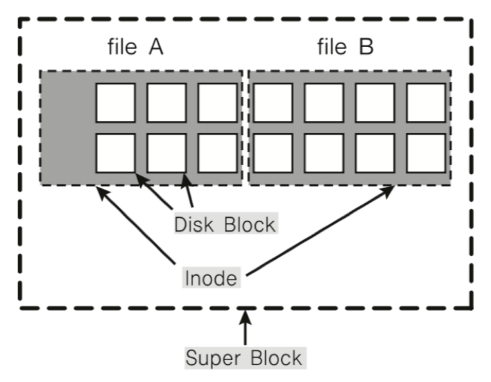
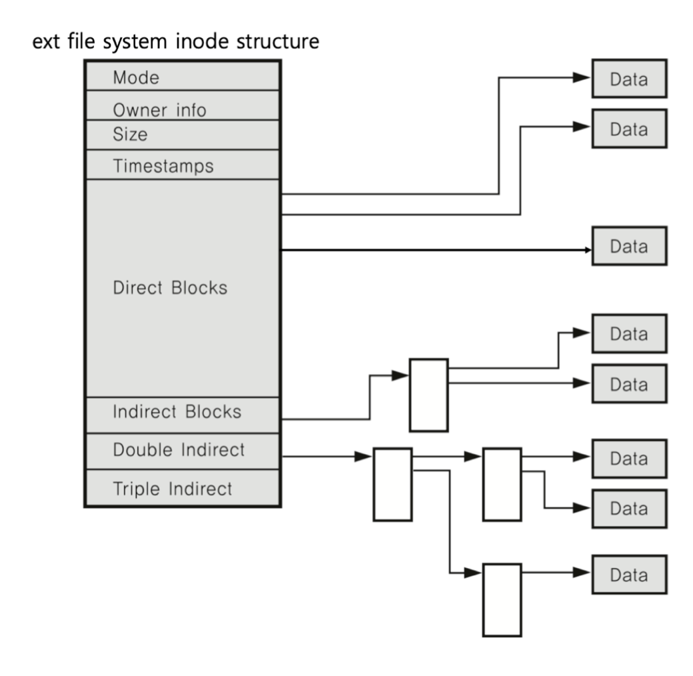
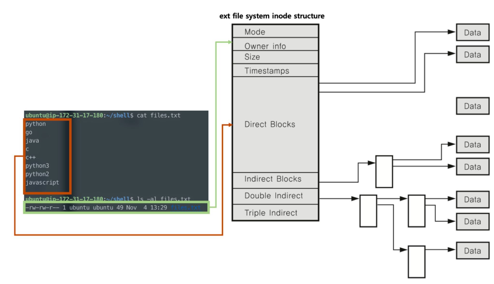
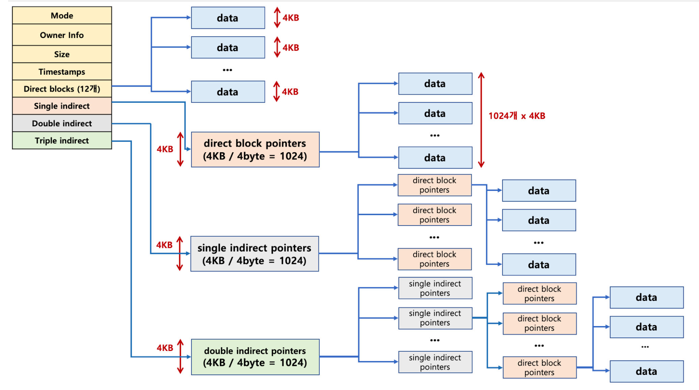

# 파일 시스템
- 운영체제가 저장 매체에 파일 쓰기 위한 자료구조 또는 알고리즘

## 파일 시스템 배경
- 컴퓨터는 0과 1로된 신호를 통해 로직을 이해 -> 초기 컴퓨터에선 0과 1로 이뤄진 데이터를 어떻게 저장 매체에 저장할까는 문제부터 접근
- 특정 비트 단위로 관리해서 쓰고 읽기엔 오버헤드가 큼
  - 그래서 4KB의 블록`block` 단위로 관리해서 보다 오버헤드를 줄이는 방식을 고안
  - 그리고 블록마다 고유 번호, 즉 인덱스를 부여해서 관리해 접근을 용이하게 하기로 함
- 해당 방식도 이상적인 것은 아님
  - 데이터 수가 많아질 수록 사용자가 각 블록 고유 번호를 관리하기가 어려워짐
  - 그래서 `파일`이라는 추상적(논리적) 객체를 구상
  - 그렇게 사용자는 파일 단위로 관리 -> 파일 내부는 블록 단위로 관리

## 저장 방법
- 가능한 연속적인 공간에 파일을 저장하는 것이 좋음
- 파일 사이즈 변경 문제로 인해 불연속적인 공간에 파일을 저장하는 기능 지원이 필요했음
- 그렇게 2가지 방법이 나옴
  1. `블록 체인`: 블록을 링크드 리스트로 연결하는 방식, 끝에 있는 블록을 찾기 위해 처음 블록부터 주소를 따라가야 함
  2. `인덱스 블록 기법`: 각 블록에 대한 위치 정보를 기록해서, 한번에 끝 블록을 찾아갈 수 있게 함

## 파일 시스템 종류
- `Windows`: `FAT`, `FAT32`, `NTFS`(많이 쓰임, 블록 위치를 `FAT`이라는 자료 구조에 기록)
- `Linux(Unix)`: `ext2`, `ext3`, `ext4`, 인덱스 블록 기법의 일종인 `inode` 방식 사용

## 파일 시스템과 시스템 콜
- 시스템 콜은 응용 개발자가 해당 운영체제의 커널 모드에 접속해 시스템 제어할 수 있게 하는 API
- 이 API가 운영체제 구조가 다르기 때문에, 시스템 콜은 각 기기 및 파일 시스템에 따라 실질적인 처리를 담당하는 함수들이 구현됨
- 물론 파일을 내부적으로 어떻게 저장할지는 컴퓨터와 운영체제의 사양에 따라 달라짐

## inode
- 운영체제에서 사용하는 파일 시스템 중 하나
- 기본 구조
  1. 파일 시스템을 대표하는 `수퍼 블록`
  2. 그 파일의 상세 정보이자 PCB의 일종인 `아이노드 블록`
  3. 실제 데이터를 담은 `데이터 블록` -> `1~4KB`의 크기로 하나의 파일엔 다수의 데이터 블록이 있음

### inode와 파일의 관계

- 파일은 inode 고윳값과 자료 구조에 의해 주요 정보를 관리
- 컴퓨터를 사용하는 사람은 파일 이름으로만 인식하나, 실제 컴퓨터는 `파일이름:inode`로 파일과 inode 번호를 매칭시켜 인식
- 파일 처리 방식
  1. 파일이 생성되자마자 inode 번호가 부여
  2. inode 블록이 생성되어 상세 정보`Meta-data`가 기입됨
  3. 이를 기반으로 파일 접근

### inode 구조

- 해당 그림은 `ext`에 대한 구조
- inode 메타 데이터에는 **파일 권한, 소유자 정보, 파일 사이즈, 생성 시간 등 시간 정보 및 데이터 저장 위치 등을 담고 있음**

#### 예시

- `cat` 명렁어
  1. `inode 블록`에 접근해서 파일의 정보를 읽음
  2. `Direct Block`에 접근해서 내부 데이터를 읽어봄
- 여기서 Direct Block은 12개의 주소만 지정
- 블록의 크기는 최대 4KB, 파일의 공간은 48KB 밖에 되지 않음
- 그럼에도 모든 프로그램이나 파일은 이 크기 이상, 이를 가능하게 하는 구조가 있음

#### inode 구조와 파일 데이터

- 파일의 용량이 클 수록 데이터 정보를 담는 Direct Block의 크기를 늘리면 비효율적
- 따라서 이를 `Single Direct`, `Double Indirect`, `Triple Indirect`로 처리
  - `Single Direct`: 4KB / 4-byte = 1024개의 데이터 주소를 담음
  - `Double Indirect`: Single Direct의 주소를 1024개 담음
  - `Triple Indirect`: Double Indirect의 주소를 1024개 담음
- 이러한 구조를 통해 파일은 비교적 적은 블록을 가지고 있어도 대량의 데이터를 관리