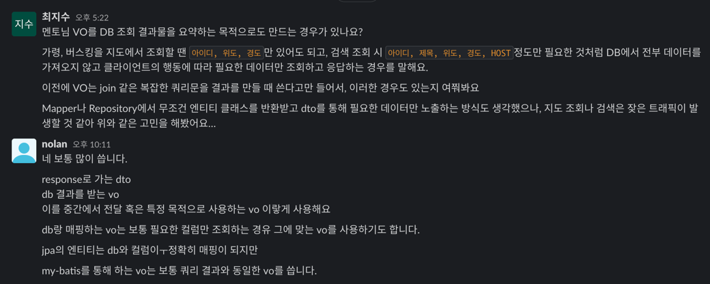
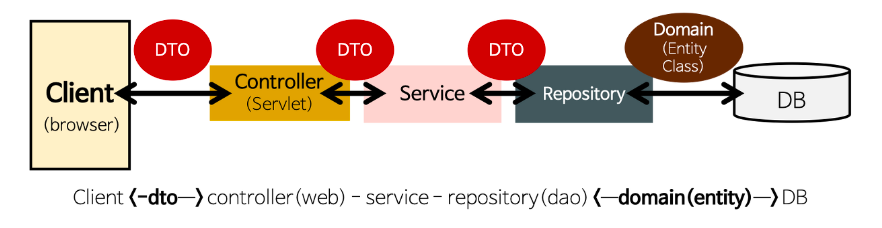

# VO, DTO, DAO

## 요약
- Value Object(VO)는 도메인에서 한 개 이상의 속성들을 묶어서 특정 값을 나타내는 객체로, 언제 어디서든 호출되든 불변성을 지닌다
- Data Transfer Object(DTO)는 계층 간 데이터 교환을 위해 도메인 모델 대신 사용하는 객체로, 순수 getter/setter만을 가져야 하며 어떠한 비즈니스 로직도 가져서는 안된다
- Data Access Object(DAO)는 데이터베이스의 데이터 접근을 위해 관련 로직을 관리하는 객체다
- DAO는 DB 접근을, DTO는 레이어 간 데이터 통신 전담을, VO는 특정 비즈니스를 담는 역할을 한다
 
## Tips for development


---

## Value Object(VO)
- 도메인에서 한 개 이상의 속성들을 묶어서, 특정 값을 나타내는 객체
  - ex. 금액, 2차원 좌표(x,y), 시작 날짜와 끝 날짜

### Primitive Possesion
- 간단한 작업을 위해 멤버 변수에 작은 객체를 사용하는 것이 아닌, 기본형 타입을 사용하는 것을 의미
- VO에선 이는 잘못된, 예를 들면 나이를 `int`로 처리
  - `int`는 음수일 수도 있고, 곱할 수도 있고 최대 21억까지 표현이 가능
  - 나이가 실제로 그런 수치가 가능한가?
  - 이 부분을 생각하면 잘못된 타입을 선언한 것
- 기본형 타입을 쓰면 해당 변수에 대한 데이터가 흩어짐
  - 이 경우 각 정보를 외부에 공개하게 됨 => 캡슐화 무너짐
- 따라서 VO는 아래와 같은 제약사항 존재

### 제약사항
1. 불변성
   - VO는 언제 어디서 호출이 되던 값이 변경되면 안됨 => setter X
   - 이를 통해 안심하고 객체를 공유
     - ex. DB에서 가져온 데이터를 VO에 담으면 항상 VO의 값을 원본으로써 신뢰
2. 동등성
   - 두 객체가 실제로 다른 객체라도, 즉 동일성을 갖지 않더라도 논리적으로 표현이 같다면 동등성을 가짐
   - 내 지갑의 만원과 남의 지갑의 만원은 다른 물체, but 동등한 가치를 지니므로 논리적으로 동등
   > #### 동일성 vs. 동등성
   > - 동일성: 비교 대상의 두 객체의 메모리 주소가 같음
   > - 동등성: 비교 대상의 두 객체가 논리적으로 동일한 값
   > ---
   > - 동일성이 보장되면 동등성이 보장하나, 반대는 아님
   > - 객체의 동등성 보장을 위해선 `equals()`와 `hashCode()` override 필수
   > - override 전엔 동일성만 보장
3. 자기 유효성 검사
   - 모든 유효성 검사는 생성 시간에 이뤄져야 하므로 유효하지 않는 값으로 VO 생성 불가
   - 따라서 VO를 사용하는 모든 클라이언트는 규칙이 깨진다는 염려 없이 심리적 안정감을 가지고 값 다루기 가능

## Data Transfer Object(DTO)



- 계층 간 데이터 교환을 위해 도메인 모델 대신 사용되는 객체
  >#### 도메인 모델
  > - 특정 문제와 관련된 모든 주제의 개념 모델
  > - 다양한 entity, entity 속성, 역할, 관계, 제약을 기술
  > - 문제에 대한 솔루션을 기술하진 않음
  > ---
  > #### 계층
  > - Presentation(View, Controller), Application(Service), Domain(Entity), Infrastructure(DAO, Repository) 등을 의미

- 순수하게 데이터를 저장하고 이에 대한 getter/setter를 가져야 함
- 어떠한 비즈니스 로직도 가져선 안됨
- 저장, 검색, 직렬화, 역질렬화 로직만을 가져야 함

### 도메인 모델 대신 DTO 활용
- 도메인 모델을 계층 간 전달에 사용하면 UI 계층에서 도메인 모델의 메서드를 호출 또는 상태 변경 가능
- 또한 UI 화면마다 사용하는 도메인 모델 정보는 다름
- 하지만 도메인 모델은 UI에 필요하지 않은 정보까지 가지고 있음
- 이런 모든 도메인 모델 속성이 외부 노출 시 보안 문제 발생 => DTO는 도메인 모델을 캡슐화해서 보호 가능
- 또한 도메인 모델을 계층 간 전송에 사용 시 Model, View가 강하게 결합될 수 있음
  - View 요구사항 변화로 도메인 코드를 변경하는 것은 좋지 않음
  - DTO를 사용해 **이러한 결합을 느슨히 할 수 있음**

## Data Access Object(DAO)
```java
@Repository
public class JdbcRoomDao implements RoomDao {
    // ...

    @Override
    public void createRoom(Room room) {
        String query = String.format("INSERT INTO %s VALUES (?, ?, ?, 'WHITE')", TABLE_NAME);
        jdbcTemplate.update(query, room.getId().getValue(), room.getRoomTitle().getValue(),
                room.getPassword().getValue());
    }
}
```
- DB 데이터에 접근하기 위해 관련 로직을 모아둔 객체
- 실제로 DB에 접근하는 객체
- 프로젝트의 서비스 모델과 실제 DB를 연결하는 역할
- JPA에서는 DB에 데이터를 CRUD하는 Repository 객체와 '비슷'함
  - Repository: 엔티티 객체를 보관하고 관리하는 저장소
  - DAO: 데이터에 접근하도록 DB 관련 로직을 모아둔 객체

## 객체 간 비교

### DAO vs. DTO
- DAO: DB 접속 및 명령 전송을 전담
- DTO: 특정 테이블의 정보를 레코드 단위로 정의해 놓은 클래스

### DTO vs. VO
- DTO: 가변적인 성격, 계층 간 데이터 전송을 위해 존재
- VO: 값 그 자체에 의미를 가진 불변 클래스
---
- DTO가 인스턴스라면, VO는 리터럴 개념
- DTO는 레이어 간의 통신 용도, VO는 특정 비즈니스 값을 담는 객체

# Reference
[Value Objects Like a Pro](https://medium.com/@nicolopigna/value-objects-like-a-pro-f1bfc1548c72)

[원시 타입 대신 VO(Value Object)를 사용하자](https://hudi.blog/value-object/)

[동일성(Identity)과 동등성(Equality)](https://hudi.blog/identity-vs-equality/)

[DTO의 개념과 사용범위](https://hudi.blog/data-transfer-object/)

[도메인 모델이란?](https://javacan.tistory.com/entry/what-is-a-domain-model)

[[Spring] DAO, DTO, VO의 개념과 차이점](https://kbwplace.tistory.com/162)