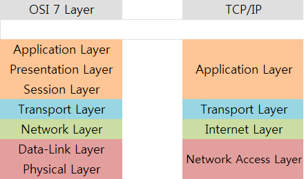

# OSI 7계층과 TCP/IP 4계층

## OSI 7 계층
- 컴퓨터 네트워크 프로토콜 디자인과 통신을 계층으로 나누어 설명한 것
- `Open Systems Iterconnection(OSI)` 모델은 국제표준화기구`ISO`에서 개발한 모델

### 계층을 나눈 이유
- 통신이 일어나는 과정을 단계별로 알 수 있음
- **어느 부분에서 이상이 발생하는지 확실히 파악하고, 그 부분만 수정하면 되기 때문에 계층을 나눔**

## TCP/IP 4 계층
- OSI 모델보다 먼저 개발된 규약
- 지속적인 표준화로 신뢰성이 우수함

### 그럼에도 OSI 7 계층을 알아야하는 이유
- 비록 `TCP/IP`가 거의 표준화로 자리 잡았으나, `OSI 모델`은 **네트워크 통신 구축 및 개발에 기본적인 개념이 됨**

## 계층
- 계층 숫자가 낮을 수록 **물리적**이고, 높을 수록 **논리적**

### 1계층 - 물리(Physical)
> 케이블, 허브, 리피터
- 하부 네트워크과 호스트를 연결하는 물리적 연결
- 장치와 통신 매체 사이의 비정형 데이터의 전송을 담당
- **전송되는 방법, 제어 신호, 기계적 속성 등**을 정의

### 2계층 - 데이터 링크(Data Link)
> 브릿지, 스위치
- 물리적 매체에 **제어 프로토콜**을 추가
- **Mac 주소**를 통해 통신
- 프레임`Frame`이라 불리는 것에 Mac 주소를 부여해서 **오류 감지 및 수정**을 담당

### 3계층 - 네트워크(Network)
> 라우터, IP, L3 스위치
- 데이터를 목적지 호스트까지 전달하기 위한 정보 제공 => **IP 지정**
- 이를 통해 **오류 제어, 흐름 제어** 그리고 패킷을 나눠 보낼 수 있게 **세그멘테이션`Segmentation`**을 담당

### 4계층 - 수송(Transport)
> TCP, UDP
- 엔드포인트 호스트`PC` 간 전송을 수행
- `TCP`와 `UDP` 중 어떤 프로토콜을 사용할 것인지 결정
- `Port`를 제어한다는 의미로 L4 로드 밸런서라는 장비가 존재

### 5계층 - 세션(Session)
> API, Socket
- 데이터 통신을 위한 논리적 연결 담당
- 오류가 발생하면 체크포인트부터 재개
- **로컬 및 원격 어플리케이션 간의 IP와 Port 연결**을 관리

### 6계층 - 프레젠테이션(Presentation)
> JPEG, MPEG, ASCII
- **데이터 암호화/복호화, 압축/해제**를 담당
- 사용자의 프로그램과 네트워크 형식 간에 데이터를 변환해서 **표현과 독립성**을 제공

### 7계층 - 응용(Application)
> HTTP, FTP, DNS, SMTP
- 데이터를 주고 받을 프로세스 계층 => **최종 목적지**
- 일반적인 응용 서비스를 수행

# Reference

[OSI 모형](https://ko.wikipedia.org/wiki/OSI_모형)

[Gyoogle 블로그 - OSI 7 계층](https://gyoogle.dev/blog/computer-science/network/OSI%207%EA%B3%84%EC%B8%B5.html)