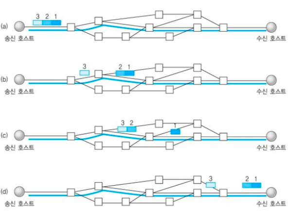
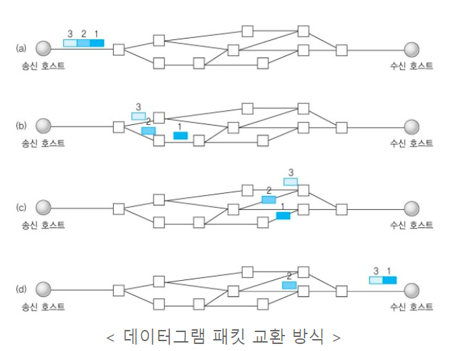
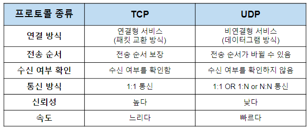
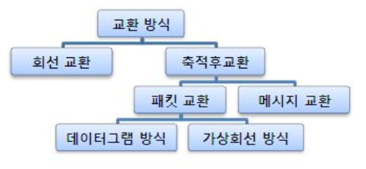
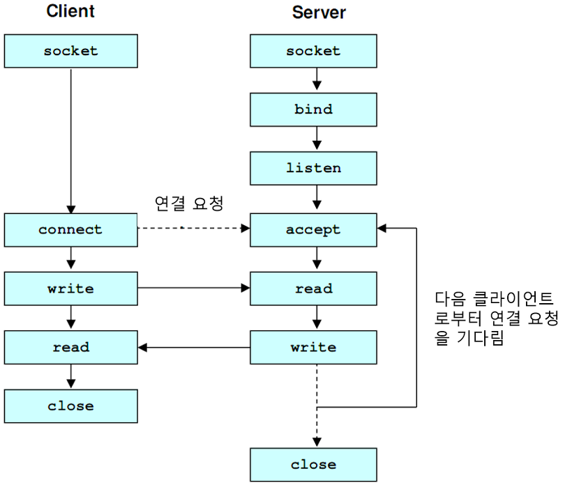
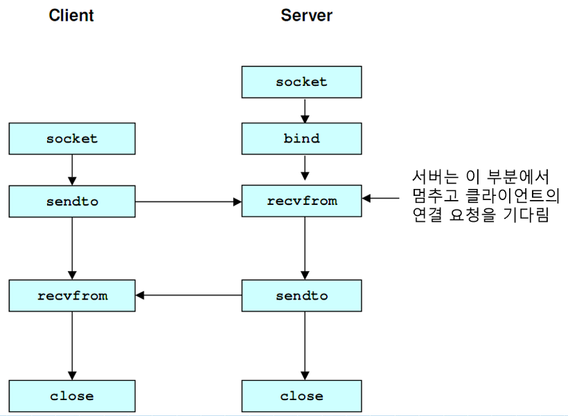

# TCP vs. UDP

## Transmission Control Protocol(TCP)
- 인터넷 상에서 데이터를 메시지 형태로 보내기 위해 IP와 함께 사용하는 프로토콜
- 일반적으로 IP와 함께 사용하는데, IP가 데이터 배달을 담당한다면 TCP는 패킷을 추적 및 관리
  - 패킷`Packet`: 인터넷 내에서 데이터를 보내기 위한 경로배정`Routing`을 효율적으로 하기 위해 데이터를 여러 조각들로 나눠 전송하는데, 이 '조각'을 일컫음

### 특징

1. 연결 지향 방식으로 패킷 교환 방식을 사용(가상 회선 방식 아님)
2. `3-way handshaking` 과정을 통해 연결을 설정하고, `4-way handshaking`을 통해 해제
3. 흐름 제어 및 혼잡 제어
   - 흐름 제어`Flow Control`
     - 데이터를 송수신하는 곳의 데이터 처리 속도를 조절해서 수신자의 버퍼 오버플로우 방지
     - 예를 들면 송신하는 곳에서 감당 안되게 데이터를 빠르게 보내면 수신자 쪽에서 문제 발생하므로 송신량을 조절
   - 혼잡 제어`Congestion Control`
     - 네트워크 내 패킷 수가 넘치게 증가하지 않도록 방지
     - 소통량 과다하면 패킷을 조금만 전송해서 혼잡 붕괴 현상이 일어나는 것을 방지
4. 높은 신뢰성 보장
5. UDP보다 속도가 느림
6. 전이중`Full-duplex`, 점대점`Point-to-point` 방식

- 연결 지향 방식이라는 것은 패킷을 전송하기 위한 논리적 경로를 배정한다는 의미
- `3-way handshaking` 과정은 목적지와 수신지를 확실히 하여 정확한 전송을 보장하기 위해 세션 수립
- 이를 통해 TCP는 연결형 서비스로 신뢰성을 보장 받음
  - 이 과정에서 데이터의 흐름 제어와 혼잡 제어 같은 기능도 제공
  - 그러나 이 기능 사용을 위해 CPU를 사용하기 때문에 속도에 영향을 줘 상대적으로 느림

### TCP 서버 특징
1. 서버 소켓은 연결만 담당
2. 연결 과정에서 반환된 클라이언트 소켓은 데이터 송수신에 사용됨
3. 서버와 클라이언트는 1:1로 연결
4. 스트림 전송으로 전송 데이터 크기가 무제한
5. 패킷에 대한 응답을 해야하기 때문에`시간 지연, CPU 소모` 성능이 낮음
6. Streaming 서비스에 불리 -> 손실된 경우 재전송 요청을 하기 때문

## User Datagram Protocol(UDP)
- 데이터를 데이터그램 단위로 처리하는 프로토콜
- 여기서 `데이터그램`이란 **독립적인 관계를 지니는 패킷**
- TCP와 달리 UDP는 **비연결형 프로토콜** 
  - 연결을 위해 할당되는 논리적 경로가 없음
  - 그렇기 때문에 각각의 패킷은 다른 경로로 전송되고, 각 패킷은 독립적인 관계를 지님
  
### 특징

1. 비연결형 서비스로 데이터그램 방식을 제공
2. 정보를 주고 받을 때 정보를 보내거나 받는다는 신호 절차를 거치지 않음
3. UDP 헤더에 `CheckSum` 필드를 통해 **최소한의 오류만 검출**
4. 신뢰성이 낮음
5. TCP보다 속도가 빠름

- `UDP`는 비연결형 서비스이기 때문에, 연결을 설정하고 해제하는 과정이 없음
- 서로 다른 경로로 독립적으로 처리함에도 패킷에 순서를 부여하여 재조립하거나 흐름 제어 또는 혼잡 제어 같은 기능도 처리하지 않음 => 속도 빠름
- 네트워크 부하가 적다는 장점이 있으나 신뢰성 있는 데이터 전송을 보장하지 못함
- 따라서 **신뢰성보단 연속성이 중요한 `Streaming` 서비스에 자주 사용됨**

### UDP 서버 특징
- UDP에는 연결 자체가 없어서 서버 소켓과 클라이언트 소켓 구분이 없음
- 소켓 대신 IP 기반으로 데이터 전송
- 서버와 클라이언트는 1:1, 1:N, N:M 등으로 연결될 수 있음
- 데이터그램`데이터` 단위로 전송되며, 크기는 65536-byte로, 크기가 초과하면 잘라서 보냄
- 흐름 제어가 없어서 패킷이 제대로 전송되었는지, 오류가 없는지 확인할 수 없음
- 파일 전송과 같은 신뢰성이 필요한 서비스보다 성능이 중요시 되는 경우에 사용

## TCP와 UDP 비교

## 기타 자료

### 교환 방식

### TCP Flow

### UDP Flow

# Reference

[[TCP/UDP] TCP와 UDP의 특징과 차이](https://mangkyu.tistory.com/15)