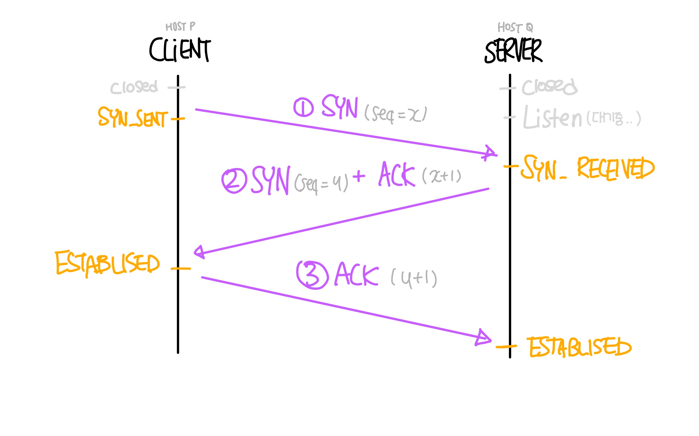
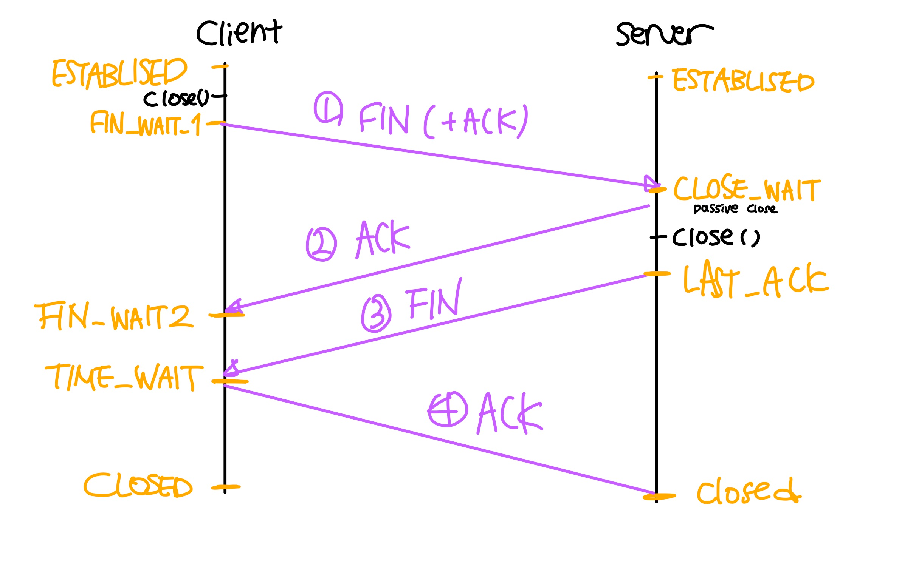

# 3-way handshaking과 4-way handshaking

## 3-way handshaking
- `TCP` 통신을 사용해 데이터를 전송하기 위해 네트워크 연결을 설정`Connection Establishment`하는 과정
- 양쪽 모두 데이터를 전송할 준비가 되었다는 것을 보장하고, 실제로 데이터 전달 시작 전에 상호 준비되었다는 것을 알 수 있도록 함

### 작동 방식

#### 1. SYN
- 클라이언트는 서버와 연결하기 위해 `SYN(seq: x)`을 보냄
  - 송신자가 최초로 데이터 전송 시 `Sequence Number`를 임의의 랜덤 숫자로 지정하고, SYN 플래그 비트를 1로 설정한 세그먼트 전송
  - PORT 상태
    - 클라이언트: `CLOSE -> SYN_SENT`
    - 서버: `LISTEN`

#### 2. SYN + ACK
- 서버가 `SYN(seq: x)`를 받고 클라이언트에게 받았다는 신호인 `SYN+ACK(seq: y, ACK: x + 1)` 패킷을 보냄
  - `ACK Number 필드`를 `Sequence Number + 1`로 지정하고 `SYN`과 `ACK` 플래그 비트를 1로 설정한 세그먼트 전송
  - PORT 상태
    - 클라이언트: `SYN_SENT`
    - 서버: `SYN_RECEIVED`

#### 3. ACK
- 클라이언트는 서버의 응답`SYN+ACK(seq: y, ACK: x + 1)`을 받고 `ACK(y + 1)`를 서버로 보냄
  - 이때 전송할 데이터가 있으면 이 단계에서 데이터를 전송할 수 잉홌음
  - PORT 상태
    - 클라이언트: `ESTABLISHED`
    - 서버: `SYN_RECV` -> ACK -> `ESTABLISHED`

## 4-way Handshaking
- `TCP` 연결을 해제하는 과정
- 여기서는 `FIN` 플래그 사용

### 연결 해제 종류
- TCP는 대부분의 연결 지향의 프로토콜과 같은 두 가지 연결 해제 방식이 있음

#### 갑작스런 연결 해제(Abrupt Connection Release)
- `RST(TCP reset)` 세그먼트가 전송되면 갑작스러운 연결 해제가 수행됨
- 다음과 같은 경우에 `RST`를 보냄
  1. 존재하지 않는 TCP 연결에 대해 `Non-SYN 세그먼트`가 수신된 경우
  2. 열린 커넥션에서 일부 TCP 구현은 잘못된 헤더가 있는 세그먼트가 수신된 경우
     - `RST` 세그먼트를 보내 해당 커넥션을 닫아 공격을 방지
  3. 일부 구현에서 기존 TCP 연결을 종료해야하는 경우
     - 연결을 지원하는 리소스 부족
     - 원격 호스트에 연결할 수 없고 응답이 중지되었을 때

#### 정상적인 연결 해제(Graceful Connection Release)
- 연결 종료 요청 시, 연결 요청을 먼저 시도한 요청자를 클라이언트로, 요청 받은 수신자를 서버로 생각하면 됨

> **Half Close 기법** 
> 위 그림처럼 처음 보내는 종료 요청인 FIN 패킷에 실질적으로 ACK가 포함되는 기법
> - 연결 종료 시 완전히 종료하지 않고 `반만 종료`
> - 이 기법을 사용하면 종료 요청자가 처음 보내는 FIN 패킷에 승인 번호를 함께 담아서 보내게 됨
>   - 이때 승인 번호의 의미는 **일단 연결은 종료하나, 이 승인 번호까지 처리했으니까 더 보낼 것이 있으면 보내라**는 의미가 됨
> - 이후 수신자가 남은 데이터를 모두 보내고 나면 다시 요청자에게 `FIN` 패킷을 보냄
>   - 모든 데이터가 처리되었다는 신호`FIN`을 보냄
>   - 그럼 요청자는 그때 나머지 반을 닫으면서 보다 안전하게 종료할 수 있게 됨

##### 1. FIN(+ACK)
- 서버와 클라이언트가 연결된 상태에서 클라이언트가 `close() `호출해 접속을 해제를 시도
- 이때 클라이언트는 서버에게 연결을 종료한다는 플래그`FIN`을 보냄
  - 이때 `FIN` 패킷에 실질적으로 `ACK`도 포함
- PORT 상태
  - 클라이언트: `FIN_WAIT_1`
  - 서버: `ESTABLISHED`

##### 2. ACK
- 서버는 `FIN`을 받고, 확인했다는 `ACK`를 클라이언트에 보냄
  - 서버는 ACK Number 필드를 `Sequence Number + 1`로 지정하고 ACK 플래그 비트 1로 설정한 세그먼트 전송
- PORT 상태
  - 클라이언트: `FIN_WAIT_2`(ACK 수신 후)
  - 서버: `CLOSE_WAIT`(아직 남은 데이터가 있다면 전송을 마친 후에 `close()` 호출)

##### 3. FIN
- 데이터를 모두 보냈다면 서버는 연결 종료에 합의한다는 의미로 `FIN` 패킷을 클라이언트에게 보냄
- PORT 상태
  - 클라이언트: `TIME_WAIT`
  - 서버: `LAST_ACK`(승인 번호를 보내줄 때까지 기다림)

##### 4. ACK
- 클라이언트는 `FIN`을 받고 확인했다는 `ACK`를 서버에게 보냄
- PORT 상태
  - 클라이언트: `TIME_WAIT`(아직 서버로부터 받지 못한 데이터가 있을 수 있기 때문) -> `CLOSED`(시간이 끝나면)
    - 이때 `TIME_WAIT` 상태는 의도치 않은 에러로 인해 연결이 데드락되는 것을 방지
    - 에러로 인해 종료가 지연되다가 타임이 초과되면 `CLOSE`로 들어감
  - 서버: `CLOSED`

# Reference

[[네트워크] TCP/UDP와 3 -Way Handshake & 4 -Way Handshake](https://velog.io/@averycode/네트워크-TCPUDP와-3-Way-Handshake4-Way-Handshake#-3-way-handshake와-4-way-handshake)