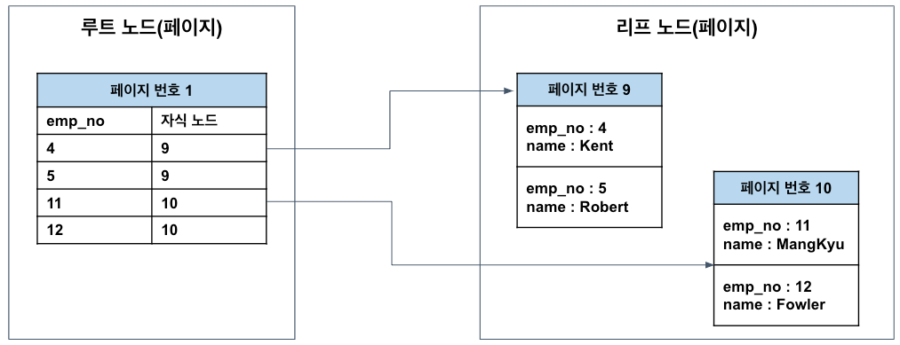
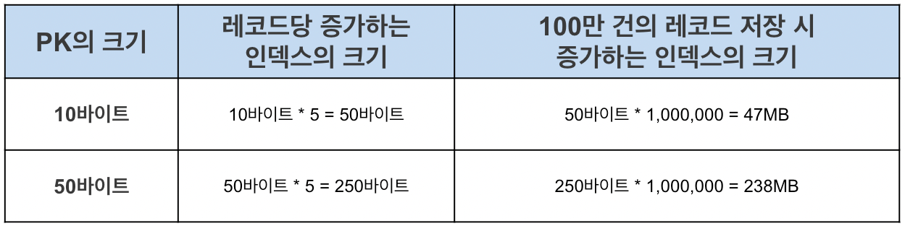
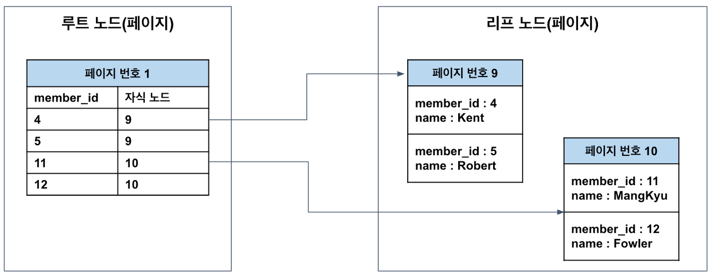
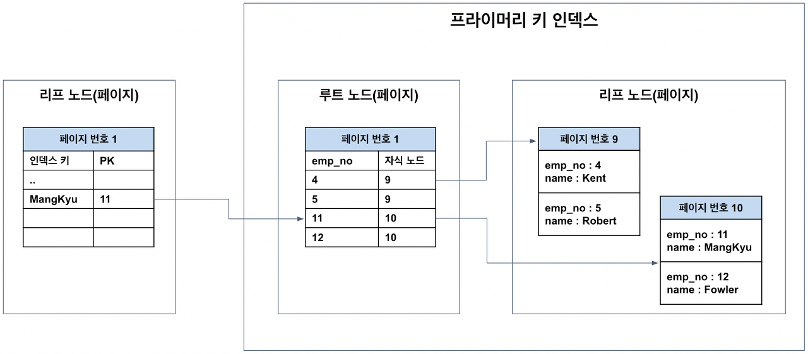
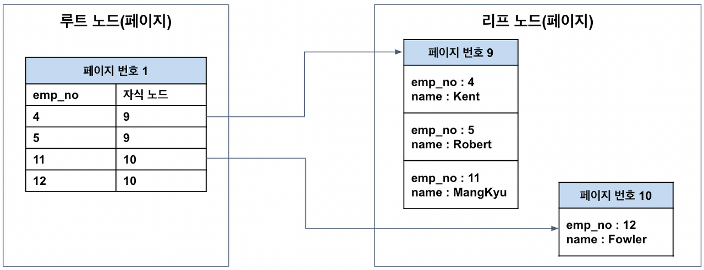

# Primary Key

## Primary Key(PK) 특성
- 각 Row를 Unique하게 구분하는 Column을 말함
  - 그렇기에 null 값을 가질 수 없고, 중복된 값을 가질 수 없음
- `RDB`에서 `PK`는 신중하게 결정되어야 함 
  - `PK`가 레코드의 저장 위치를 결정하기 때문
  - MySQL은 PK를 기준으로 유사한 값들이 함께 조회되는 경우가 많다는 점을 착안함
  - 그래서 `PK`가 유사한 레코드들끼리 묶어서 저장
  - 이 때문에 일반적으로 `PK`는 클러스터 인덱스`Clustered Index`라고도 불림
  - 그 외 일반적인 인덱스는 논클러스터 인덱스라고 함
  - 이러한 특성 때문에 `PK를 변경`하는 것은 레코드가 저장된 물리적인 위치를 변경하는 작업이 수반되 처리 속도가 느림
- 일반적인 온라인 환경에서 읽기와 쓰기 비율이 9:1, 8:2정도기 때문에 위에 언급된 특성으로 동작함

### 페이지(Page)

- 디스크와 버퍼풀`메모리`에 데이터를 읽고 쓰는 최소 작업 단위
- 일반적인 인덱스르 포함해 `PK(Clustered Index)`와 테이블 등은 모두 페이지 단위로 관리됨
  - 따라서 **쿼리를 통해 1개의 레코드를 읽고 싶더라도 결국은 하나의 블록을 읽어야 함**
- 그래서 페이지에 저장되는 개별 데이터 크기를 최대한 작게 하여, 1개의 페이지에 많은 데이터들을 저장할 수 있도록 하는 것이 상당히 중요
- 페이지에 저장되는 데이터 크기가 클수록 다음과 같은 문제가 발생할 수 있음
  1. 디스크 I/O가 많아짐
  2. 메모리에 캐싱할 수 있는 페이지 수가 줄어듦
- 만약 조회하는 레코드 건수가 많아 1개 페이지만으로 처리가 안되면 다른 페이지를 읽어야 함 -> 추가 디스크 작업으로 인한 성능 저하
- DB 성능 개선 또는 쿼리 튜닝은 **디스크 I/O 자체를 줄이는 것이 핵심**인 경우가 많음
- 디스크 I/O를 통해 페이지를 읽어오면 버퍼풀이라는 메모리에 캐싱해 둠
- 그런데 개별 데이터가 커지면 페이지 자체의 크기가 커지면서, 메모리에 캐싱해둘 수 있는 페이지 수도 줄어들고 메모리 효율이 떨어짐



- 5개의 인덱스를 갖는 테이블의 PK 크기에 따라 인덱스 크기를 비교한 표
- 레코드 건수가 `100만 건`만 되도 인덱스의 크기가 `190MB`나 증가한 것을 확인할 수 있음
- 인덱스가 커질 수록 같은 성능을 내기 위해 그만큼의 메모리가 더 필요해지므로 `PK`는 신중히 선택해야 함

### 클러스터링 테이블의 저장 방식

- `클러스터링 테이블`: 클러스터 인덱스를 갖는 테이블
  - MySQL에서는 기본적으로 `PK`가 클러스터 인덱스
  - `PK`가 없으면 내부적으로 `PK`를 만들어 내므로 모든 테이블이 클러스터링 테이블이라 볼 수 있음
- PK와 테이블의 저장 방식을 보면 위와 같음
  - 이는 리프 노드에 실제 레코드의 모든 컬럼 값이 저장되어 있다는 점을 제외하면 일반적인 인덱스와 동일

### PK와 인덱스의 관계
> 인덱스`Index`: 추가적인 쓰기 작업과 저장 공간을 활용해 DB 테이블의 검색 속도를 향상시키기 위한 자료구조

- PK가 레코드의 물리적인 저장 위치를 결정하기 때문에 인덱스는 PK에 의존함
- 그래야 인덱스를 타고 들어와 `PK`를 통해 저장된 위치에서 레코드를 읽어올 수 있기 때문
- 물론 인덱스가 `PK`가 아닌 실제 레코드의 주소를 갖게 할 수 있음
  - 그러나 그렇게 구현하면 `PK`가 변경될 때 데이터 레코드의 주소가 변경될 때마다 모든 인덱스에 저장된 레코드의 주소를 변경해줘야 함
  - 이러한 오버헤드를 피하기 위해 레코드 주소가 아닌 `PK`를 저장하도록 구현한 것
- 인덱스가 `PK`에 의존하기 떄문에 인덱스를 통해 테이블에서 데이터를 가져오려면 2번의 작업이 필요
  - 먼저 인덱스에서 인덱스 키를 통해 `PK`를 찾아야 함
  - 그 다음 `PK`를 통해 테이블로부터 데이터를 읽어와야 함
  - 이 때문에 **인덱스보다 `PK`로 읽어 오는 것이 빠름**

## PK 동작 방식
### PK가 없는 경우
- MySQL에서 테이블은 `PK` 기반으로 저장하기 때문에 PK가 필수적
- `PK`가 없다면 DB에서 별도의 처리를 통해 PK 설정
  1. 기본적으로 PK를 클러스터링 키로 선택
  2. `PK`가 없다면 NOT NULL 옵션의 유니크 인덱스 중에서 첫 번째 인덱스를 클러스터링 키로 선택
  3. 후보군이 없다면 내부적으로 자동 증가 유니크 컬럼을 추가한 후 클러스터링 키로 선택
     - 이렇게 생성된 `내부 PK`는 사용자에게 노출되지 않으며, 쿼리에서 사용할 수도 없음
     - 클러스터 인덱스는 테이블 당 하나만 가질 수 있는 혜택이므로 반드시 생성해주는 것이 좋음

### PK를 변경하는 경우
- PK는 레코드의 저장 위치를 결정 -> PK가 변경되면 레코드가 저장된 물리적 위치도 변경됨

#### 예제

- PK가 `11번`인 employee 정보가 `10번 페이지`에 저장
- 다음처럼 PK 변경 쿼리를 실행
  ```sqlite-sql
  UPDATE employee SET emp_no = 6 WHERE emp_no = 11;
  ```

- 변경되면 `PK` 값에 따라 레코드가 있어야 하는 페이지가 달라질 수 있음 -> `9번 페이지`로 옮김
- PK는 물리적인 레코드의 저장 위치를 결정하기 때문에 단순히 값만 변경해서는 안되고, `레코드를 DELETE 후에 INSERT`해줘야 함
- 따라서 2번의 디스크 I/O 작업이 필요하고, 인덱스 쪽에도 추가 작업을 유발할 수 있어 비용이 상당히 크므로 PK는 변하지 않는 값으로 설정하는 것이 중요

# Reference

[[MySQL] 프라이머리 키(PK, Primary Key)에 대해 쉽고 완벽하게 이해하기](https://mangkyu.tistory.com/285)

[[Database] 인덱스(index)란?](https://mangkyu.tistory.com/96)