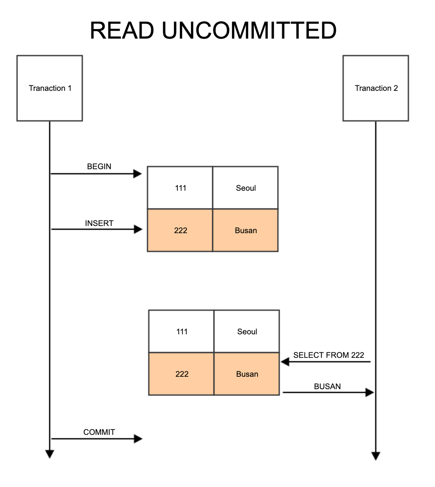
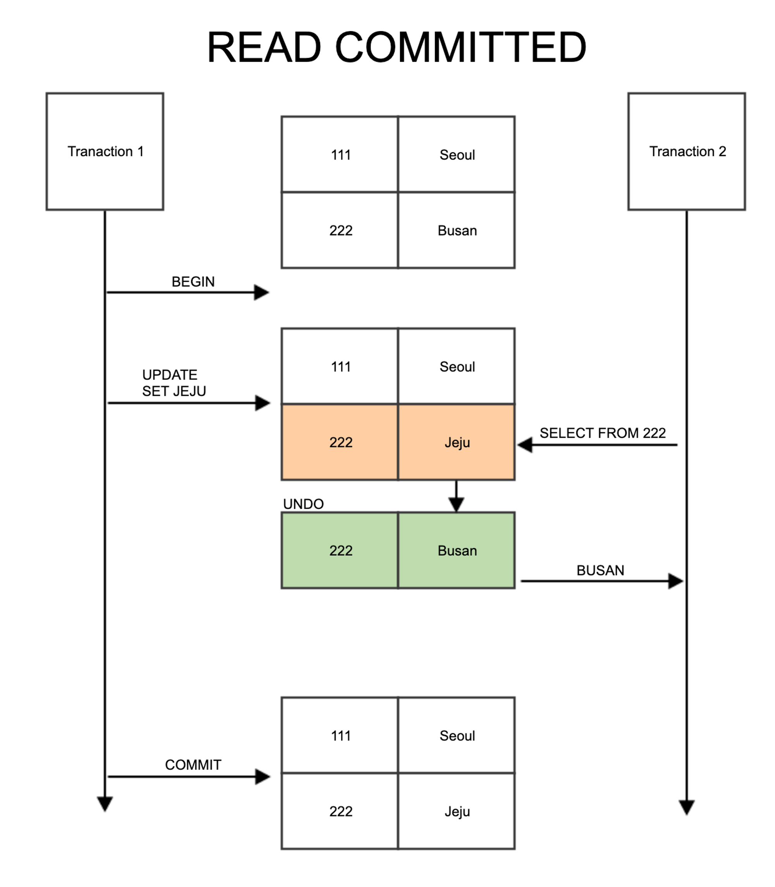
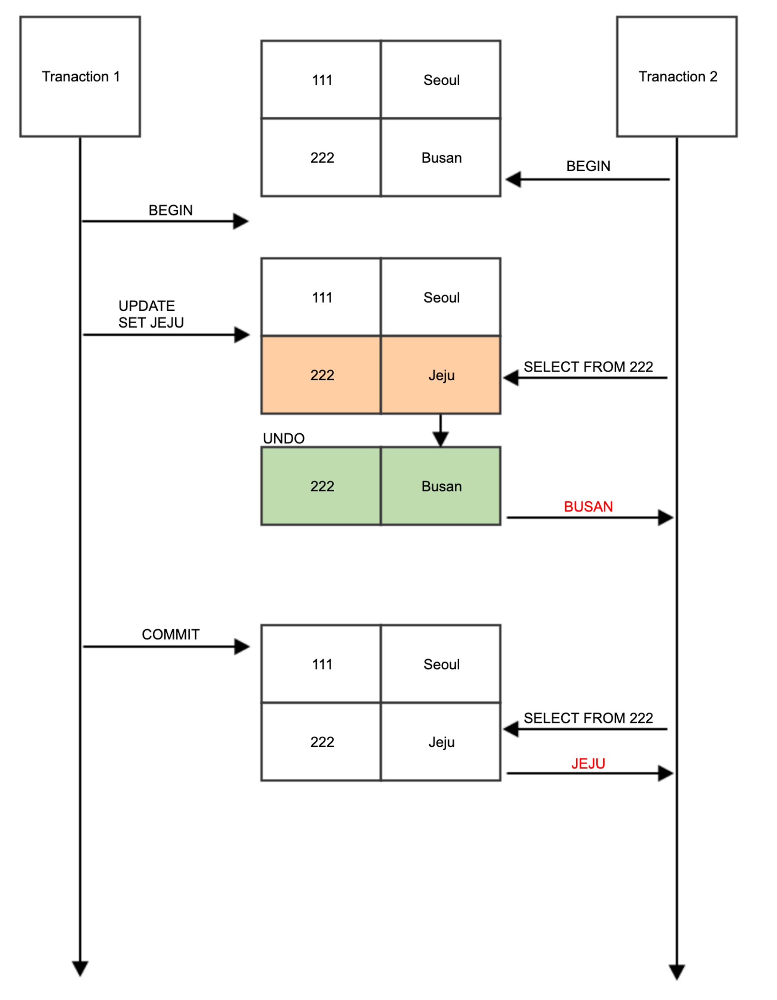
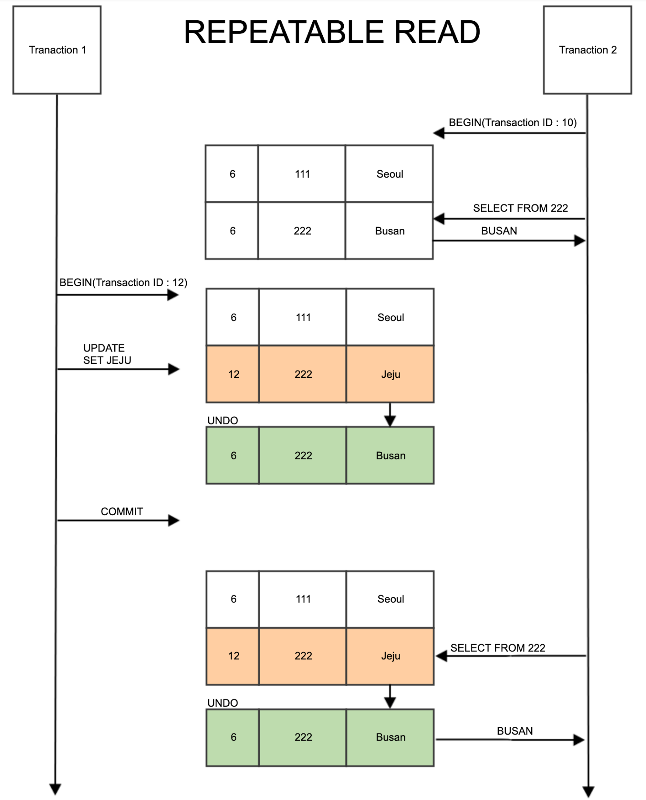
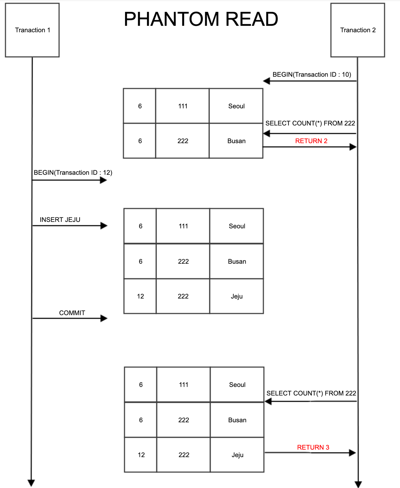

# Isolation Level

## 요약

- Isolation Level은 동시에 여러 트랜잭션이 처리 될 때, 특정 트랜잭션이 다른 트랜잭션에서 변경 및 조회 허용 여부 설정 값이다
- `READ UNCOMMITED`는 트랜잭션 변경 내용 commit/rollback 여부에 상관없이 다른 트랜잭션에서 값을 읽어 **Dirty Read** 현상이 발생해 정합성이 떨어진다
- `READ COMMITED`는 Undo 영역에 백업된 레코드에서 데이터를 가져오는 Default 격리 수준이며, 하나의 트랜잭션에서 다중 SELECT 처리 시 항상 같은 결과를 보장할 수 있는 문제가 있다
- `REPEATABLE READ`는 트랜잭션 ID보다 작은 트랜잭션 번호에서 변경한 것만 읽는 격리 수준이며, 다중 SELECT 처리 시 다른 트랜잭션에서 수행한 변경 작업에 의해 데이터가 보였다, 안 보였다하는 **Phantom Read** 현상이 있다
- `SERIALIZABLE`은 가장 엄격하고 가장 단순한 격리 수준이며, 동시 처리 성능이 가장 낮아 거의 쓰이지 않는다

---

## 트랜잭션 격리 수준(Isolation Level)

- 동시에 여러 트랜잭션이 처리 될 때, 특정 트랜잭션이 다른 트랜잭션에서 변경 및 조회 허용 여부를 결정

### READ UNCOMMITED

- 각 트랜잭션에서 변경 내용 commit 및 rollback 여부 상관 없이 다른 트랜잭션에서 값을 읽을 수 있음
- 정합성 문제가 많은 격리 수준 → Dirty Read 현상

> 💡 *정합성(Consistency) : 어떤 데이터들이 값이 서로 일치하는 상태*
>
> *Dirty Read : 트랜잭션이 작업이 완료되지 않았는데도 다른 트랜잭션에서 볼 수 있게 되는 현상*

### READ COMMITED

- 실제 테이블 값을 가져오는 것이 아닌, Undo 영역에 백업된 레코드에서 값을 가져옴
- RDB에서 기본적으로 사용되는 격리 수준

#### 문제점

- `Transaction 1`이 commit 이후 아직 끝나지 않는 `Transaction 2`가 다시 테이블 값을 읽으면 값이 변경됨을 알 수 있음
- 하나의 트랜잭션 내에서 똑같은 `SELECT` 쿼리 실행 시 항상 같은 결과를 가져와야 하는 `REPEATABLE READ`의 정합성에 어긋남
- 주로 입금, 출금 처리 같은 금전적인 처리에서 주로 발생 → 데이터 정합성은 깨지고 버그 찾기 어려움

### REPEATABLE READ

- MySQL에서는 트랜잭션 마다 트랜잭션 ID를 부여, 트랜잭션 ID보다 작은 트랜잭션 번호에서 변경한 것만 읽음
- Undo 공간에 백업해두고 실제 레코드 값을 변경
- 백업된 데이터는 불필요하다고 판단하는 시점에 주기적으로 삭제
- Undo에 백업된 레코드가 많아지면 DB 서버 처리 성능이 떨어질 수 있음
- 이러한 변경 방식을 **MVCC(Multi Version Concurrency Control)** 이라 함

#### 문제점 - Phantom Read

- 다른 트랜잭션에서 수행한 변경 작업에 의해 레코드가 보였다가 안보였다 하는 현상
- 이를 방지하기 위해 쓰기 잠금을 걸어야 함

### SERIALIZABLE
- 가장 단순하면서 엄격한 격리 수준 → Phantom Read 현상 X
- 성능 측면에서는 동시 처리 성능이 가장 낮아 거의 사용되지 않음

# Reference

[트랜잭션의 격리 수준(isolation Level)이란?](https://nesoy.github.io/articles/2019-05/Database-Transaction-isolation)