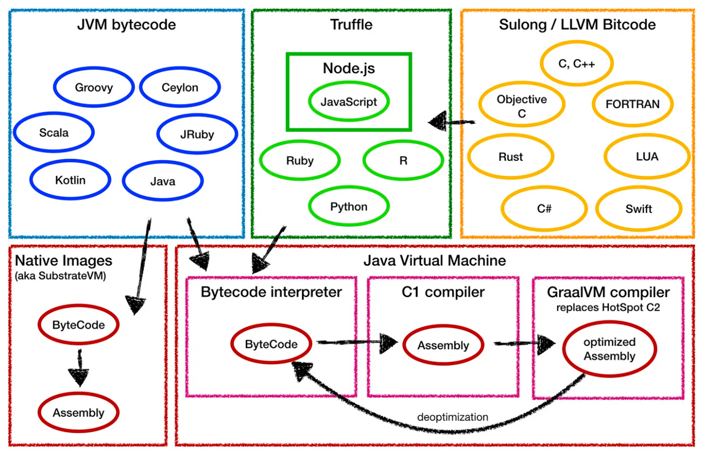
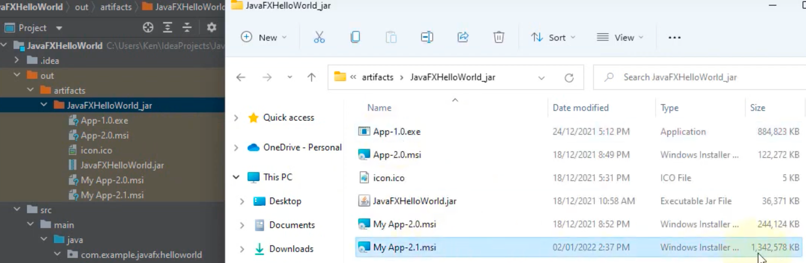
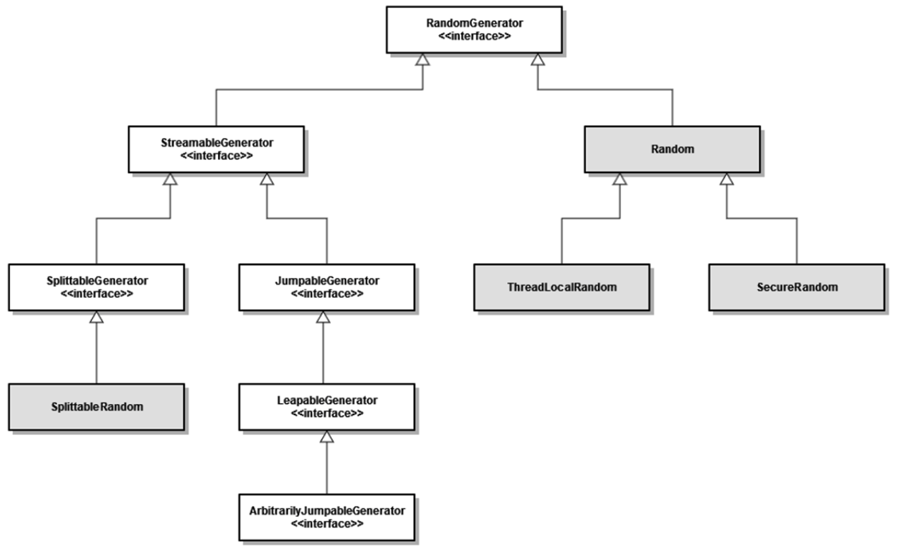

# [8~17] JDK 버전 별 주요 Feature
## 요약

- Java 8: 람다식/메서드 참조, Stream API, Optional, interface 내 default 메서드 도입
- Java 9: 모듈 시스템(+jlink), interface 내 private, JShell(REPL), 컬렉션 내 of 메서드, Streams 기능 추가, Linux/AArch64 지원
- Java 10: var, 로컬 변수로 interface 사용, 신규 JIT 컴파일러(GraalVM), 어플리케이션 Class Data Sharing, Docker 컨테이너 지원
- Java 11: 신규 HttpClient API, String & Files 신규 메서드, 컴파일 없이 소스 실행, ZGC
- Java 12: switch 신규 표현식, G1GC 최적화, Shenandoah GC, Default CDS 저장소, Unicode 11 지원
- Java 13: 텍스트 블록, yield 키워드(switch), Unicode 12.1 지원
- Java 14: switch 표현식 표준화, instanceof 패턴 매칭, record, NPE 추가 기능, jpackage
- Java 15: sealed 클래스, 텍스트 블록 표준화, record에서 클래스 상속, record/enum toString() 기능 개선, ZGC 성능 개선, Hidden 클래스, Foreign-memory Access API
- Java 16: record & sealed 클래스 조합, record equals() & hashCode() 자동 생성, record 상속 가능 클래스 선언, Vector API, Foreign Linker API 업데이트, Warnings for value-based classes, Unix 도메인 소켓 채널, Windows/AArch64 지원, Apline Linux 지원
- Java 17: sealed 클래스 표준화, Foregin Function and Memory API 업데이트, instaceof 패턴 매칭, 신규 난수 생성 API

---
## Java 8(LTS) (2014.03)
- 람다식, 메서드를 통해 함수형 프로그래밍 방식으로 코드를 더 간결하고 가독성있게 작성 가능
- `Stream API`를 통해 컬렉션을 병렬 처리가 가능하며, 많은 양의 데이터 처리 시 유용

### 람다식 및 메서드 참조 추가
```java
List<String> list = Arrays.asList("apple", "banana", "kiwi");

// 함수형 프로그래밍(FP) 방식으로 처리
list.forEach(str -> System.out.println(str));    // 람다 식(Lambda Expression)
list.forEach(System.out::println);               // 메서드 참조
```

### Stream API & Collections 내 Stream API 활용 처리
```java
List<String> list = Arrays.asList("apple", "banana", "kiwi");

long count = list.stream().filter(str -> str.length > 5).count();
SYstem.out.println(count);
```

### Optional
```java
// null-check를 보조하는 클래스
String str = null;
Optional<String> optional = Optional.ofNullable(str);
System.out.println(optional.isPresent);  // false
```

### interface 내 default 메서드 도입
```java
public interface List<E> extends Collection<E> {
    ...
    boolean contains(Object o);
    ...
	
    // default 메서드를 통해 메서드 구현체 선언 가능
    // 해당 인터페이스를 구현한 클래스에서 공통적으로 사용하기 위한 것
    // 참고로 public 외 제어자 선언할 수 없
    default void sort(Comparator<? super E> c) {
        Object[] a = this.toArray();
        Arrays.sort(a, (Comparator) c);
        ListIterator<E> i = this.listIterator();
        for (Object e : a) {
          i.next();
          i.set((E) e);
        }
  }
}
```

## Java 9 (2017.09)
- 모듈 시스템과 인터페이스 개선 기능 추가
- 모듈 시스템은 모듈 단위로 라이브러리를 관리할 수 있게 해주며, 라이브러리 간의 의존성을 더 명확하게 관리할 수 있게 해줌
- 인터페이스에 `private` 선언이 가능해지면서 코드를 더 간결하고 가독성있게 작성할 수 있게 됨

### 모듈 시스템 & Jigsaw Project
```java
// com.example.mymodule이라는 모듈을 정의,
// 이 모듈은 org.apache.commons.lang3 모듈을 사용하고,
// com.example.mypackage 패키지를 외부에 노출
module com.example.mymodule {
    requires org.apache.commons.lang3;
    exports com.example.mypackage;
}
```
- 모듈 단위로 라이브러리를 관리하는 시스템 추가
- Java 플랫폼 간소화 및 모듈화를 통한 성능 및 사이즈 향상, 유연한 이미지 구성 가능

### jlink
- 여러 모듈을 조합하서 사용자 정의 런타임 이미지를 구성하는 도구
- 포함시킬 모듈을 jdeps(JDK 11부터 생긴 것으로 추정)로 찾아서 다 기입해야 하는 번거로움이 있음
- [Webpack App](https://justinmahar.github.io/easyjre/?path=/story/home--page) 참고하여 정의 가능

### 인터페이스 개선
```java
public interface MyInterface {
    default void myMethod() {
        // public 메서드에서 private 메서드 호출
        doSomething();
    }
    
    private void doSomething() {
        // 메서드 구현	
    }
}
```
- `private` 메서드, `private` 정적 메서드, 인터페이스 내 `private` 필드 기능 추가

### Jshell
```bash
jshell
|  Welcome to JShell -- Version 17.0.7
|  For an introduction type: /help intro

jshell> System.out.println("Hello world:");
Hello world:

jshell> List<String> list = new ArrayList<>();
list ==> []
```

### Collection Factory 메서드
```java
public interface List<E> extends Collection<E> {
    ...
    /**
    * Returns an unmodifiable list containing zero elements.
    *
    * See <a href="#unmodifiable">Unmodifiable Lists</a> for details.
    *
    * @param <E> the {@code List}'s element type
    * @return an empty {@code List}
    *
    * @since 9
    */
    @SuppressWarnings("unchecked")
    static <E> List<E> of() {
        return (List<E>) ImmutableCollections.EMPTY_LIST;
    }
    ...
}

List.of("a", "b", "c", "d");
```
- 편리하게 컬렉션과 맵의 인스턴스를 생성할 수 잇는 정적 팩토리 메서드 제공

### Streams 기능 추가
- `takeWhile`, `dropWhile`, `iterate` 등의 추가 메서드 제공

### Linux/AArch64 지원
- 해당 CPU 아키텍처 지원

## Java 10 (2018.03)
- 변수 타입 추론 및 로컬 변수에 인터페이스 사용 가능

### var 키워드
```java
var str = "Hello world";
var list = Arrays.asList("apple", "banana", "orange");
```
- 변수 타입 추론, 간결하고 가독성(?) 있게 작성

### 로컬 변수에 interface 사용
```java
interface MyInterface {
    void myMethod();
}

public class Main {
    void myMethod() {
        MyInterface impl = new MyInterface {
            @Override
            public void myMethod() {
                // 메서드 구현
            }
        }		
    }
}
```
- 코드 재사용성을 높일 수 있게 해줌

### Java 기반 JIT 컴파일러(GraalVM)

- 신규 JIT 컴파일러 탑재
- 어플리케이션 성능과 효율성 개선 목적으로 나온 고성능 런타임
- 최적화 컴파일러를 추가하여 성능 최적화 및 다중 언어 어플리케이션에 대한 상호 운용성을 제공
  - `Scala`, `Kotlin`, `Groovy`, `Clojure`, `R`, `Python`, `Javascript`, `Ruby` 등 추가 지원
- 단일 어플리케이션에서 여러 언어 및 라이브러리를 효율적으로 실행 가능

#### 구성 요소
1. GraalVM 컴파일러
    - Ahead-of-Time 컴파일러
      - 어플리케이션을 실행하는 동안 네이티브 코드를 동적으로 생성
      - 공유 데이터 캐시에서 생성된 AOT 코드를 캐싱
      - JIT 컴파일 원시 코드에서 발생하는 성능저하 없이 공유 데이터 캐시에서 AOT 코드를 로드하고 사용 가능
    - JVM 기반 어플리케이션을 기본적으로 실행 가능한 바이너리로 컴파일하는데 사용
2. 다국어 프로그래밍 언어 지원
   - 프로그래밍 언어 인터프리터 제공
   - 이를 통해 Java Ecosystem에 언어 추가 가능
   - 또한 언어에 구애받지 않는 디버거, 프로파일러 및 힙 뷰어와 같은 도구 지원

#### 도입하는 이유
1. 유지보수
   - HotSpot 컴파일러는 C/C++로 작성되었으나 Java로 JVM 컴파일러를 재작성하면 새로운 기회가 열림 
     -> 수많은 Java 프로그래머가 `GraalVM`에 개선을 기여할 것을 기대
   - V8 엔진과 HotSpot 컴파일러는 모두 수십년간 최적화의 어려움을 겪고 있음 -> 개선하려면 큰 틀을 깨야 함
   - `GraalVM`은 새로운 아이디어를 바탕으로 이 문제에 대한 새로운 해석을 가짐 -> 최적화 및 확장성을 염두하고 제작함
   - 실제로 트위터가 `GraalVM` 채택 -> `Scala`(JVM 바이트 코드로 컴파일)를 이용해 서비스를 만듦
2. Truple
   - 컴파일러를 만드는 영리한 접근 방식
   - 최적화 JIT 컴파일러를 사용하면 모든 것을 컴파일 후 최적화한다는 개념
   - `GraalVM`은 Ruby를 수동으로 최적화된 어셈블리 코드와 유사한 네이티브 코드로 컴파일함
3. 클라우드
   - `GraalVM`의 핵심은 AOT 컴파일러 => Java가 어셈블리 코드로 컴파일할 수 있게 됨
   - 이를 통해 네이티브 코드가 필요한 상황에서 유용하게 쓰일 수 있음 => `AWS Lambda`
     - `Lambda`는 사용량에 따라 비용 지불 => 코드 실행되는 경우에만 지불
     - VM 기반으로 구현한다 가정하면 사용하지 않을 때 `VM 시작 -> 종료`를 반복 -> 3초 소요
     - 이런 문제를 AOT 컴파일러가 해결 가능
       - 일반적으로 Java는 수천 개의 클래스를 로드해야 하기 떄문에 느리게 시작
       - 그러나 간단한 CRUD 어플리케이션은 로드된 클래스의 극히 일부만 사용 -> GET 요청을 위해 Spring Boot의 모든 기능이 필요한 것은 아님
       - **AOT 컴파일러로 코드를 최적화하고, 컴파일 후 네이티브 코드 제공 => Quarkus, Helidon 같은 클라우드 네이티브 프레임워크 이용 시 0.005초에 응답하는 Lambda 함수 생성 가능**
4. 어플리케이션 Class Data Sharing`CDS`
   - 어플리케이션 시작 속도 및 설치 공간 개선을 위해 기존 클래스 데이터 공유 기능 확장
   - 어플리케이션 클래스를 공유 아카이브에 배치
5. Docker 컨테이너 지원(8u191)
   - Docker 환경에 맞게 수정

## Java 11(LTS) (2018.09)
### 신규 HttpCliine API(9~11)
```java
import java.net.http.*;

HttpRequest request = HttpRequest.newBuilder()
        .uri(new URI("https://postman-echo.com/get"))
        .GET()
    .build();
```
- 기존에 제공된 낮은 수준의 API를 HTTP/2, WebSocket 기반의 최신 기능들로 업그레이드

### String & Files에 신규 메서드 추가
- `String`: `strip`, `isBlank`, `lines`
  - `isBlank`: 값이 비어 있거나, 빈 공백으로만 이뤄져 있는 경우
- `Files`: `readString`

### javac 컴파일 없이 소스 파일 실행
- Java 소스 파일을 컴파일하지 않고 스크립트로 실행 가능

### ZGC
- 차세대 GC 추가

## Java 12 (2019.03)
### switch 표현식 신규 기능 추가
```java
int numLetters = switch(day) {
	case MONDAY, FRIDAY, SUNDAY -> 6;
	case TUESDAY                -> 7;
	case THURSDAY, SATURDAY.    -> 8;
	case WEDNESDAY              -> 9;
	default                     -> 0;
}
```
### 힙 메모리 최적화
- `G1GC` 최적화
  - 힙 공간을 여러 영역으로 분할하여 성능 개선
  - 사용하지 않는 힙 메모리를 빠르게 변환

### Shenandoah
- G1GC의 영역에서 영역으로 Copy를 수행하는 부분이 존재
- Copy를 사용하지 않아 STW 시간이 적은 GC

### Default CDS 저장소
- 어플리케이션 간에 공유되는 `CDS`에 대한 파일이 `classes.jsa`로 기본 저장

### Unicode 11 지원

## Java 13 (2019.09)

### 텍스트 블록
```java
String html = """
    <html>
        <body>
            <h1>Hello, world!</h1>
        </body>
    </html>
    """;
```
- 코드 문서화 용이성 개선

### yield 키워드
```java
String result = switch (day) {
    case MONDAY, FRIDAY, SUNDAY -> {
        yield "It's a good day to start coding.";
    }
    case TUESDAY -> {
        yield "It's Tuesday.";
    }
    case THURSDAY, SATURDAY -> {
        yield "It's almost the weekend.";
    }
    case WEDNESDAY -> {
        yield "It's hump day.";
    }
};
```
- `switch` 표현식에서 사용
- 이전엔 `switch` 표현식에서 반환 값을 지정할 수 없었으나, `yield` 키워드를 통해 지정 가능

### Unicode 12.1 지원

## Java 14 (2020.03)

### switch 표현식 표준화

### instanceof 패턴 매칭
```java
public void print(Object obj) {
    if (obj instanceof String s) {
        System.out.pritnln(s.toUpperCase);	
    } else if (obj instanceof Integer i) {
        System.out.pritnln(i.intValue());	
    } else {
        System.out.pritnln(obj.toString());	
    }
}
```
- 객체 캐스팅을 효과적으로 해줘, 별도의 캐스팅 작업 코드 불필요

### record 추가
```java
// name, age 필드를 가지며 불변적인 값 타입으로 동장
public record Person(String name, int age) {
    // 생성자, 메서드 등 작성 가능
}

// Constructor, Getter 자동 생성
Person person = new Person("Alice", 30);
System.out.println(person.name());
System.out.println(person.age());
```
- 불변적이며 값 타입`Value Type`으로 동작 -> 객체 상태 변경을 방지
- Java Beans와 유사하나 훨씬 간결하고 가독성이 좋음
- 불변적인 값 타입으로 동작하기 때문에 객체지향 프로그래밍 원칙에 부합

### NullPointerException 추가 기능
- `NPE` 발생 시 Exception 메시지에 어떤 변수가 null인지 알려줌

### jpackage 패키징 툴 제공

- Java 어플리케이션을 해당 OS(Windows, Linux, Mac)에 맞게 실행에 필요한 모든 라이브러리와 함께 패키징
- 엔드 유저에게 설치 가능한 패키지를 묶어 전달하기 용이 -> jar 파일 복사해서 쓸 필요가 없어짐

## Java 15 (2020.09)
### Sealed 클래스
```java
public abstract sealed class Shape 
	permits Circle, Rectangle, Square {
	
	...
}

final class Circle extends Shape {
	private final double radius;
	
	public Circle(double radius) {
		this.radius = radius;
	}

	...
}
```
- 클래스 사용 규칙을 명시적 지정할 수 있는 클래스
- 특정 클래스를 상속하거나 인터페이스를 구현하는 클래스의 종류 제한 가능
- 이를 통해 객체지향 프로그래밍의 다형성 강화

### 텍스트 블록 표준화

### ZGC 성능 개선
- Product Feature => `XX:+UnlockExperimentalVMOptions` 옵션을 사용하지 않아도 사용 가능
- 매우 큰 힙 사이즈(최대 16TB)를 가지는 어플리케이션에서도 매우 짧은 STW 보장
- STW 최소화를 위해 힙 영역을 나누지 않음, 대신 힙 영역은 `Concurrent Root Region`과 `Heap Region`을 구분해 처리
  - Concurrent Root Region: GC 수행 중 데이터를 수정할 수 있는 영역
  - Heap Region: GC 중 데이터 수정이 불가능한 영역
- 작은 힙 크기에서도 사용할 수 있게 되어 범용성 증가

### record 클래스에서 다른 클래스 상속 가능
```java
class Person {
    String name;
    int age;
    
    public Person(String name, int age) {
        this.name = name;
        this.age = age;	
    }
}

record Employee(String company, String department) extends Person {
    super(name, age);
    this.company = company;
    this.department = department;
}
```

### record 및 enum의 toString() 개선
```java
public record Person(String name, int age) { }

Person person = new Person("John", 30);
System.out.println(person.toString());
```
- `record` 및 `enum`에서 toString 호출 시 각 필드와 값을 포함하는 문자열 반환

### Hidden 클래스
```java
public class Hidden {
    // Constructor가 private으로 선언되어 있어 외부에서 객체 생성 X
    private Hidden() {
        throw new AssertionError();
    }
    
    public static void doSomething() {
        // ...
    }
    
    // ...
}
```
- 다른 클래스의 바이트 코드에서 직접 사용할 수 없는 클래스
- 일반적으로 어플리케이션 classpath에 로드되지 않고, 리플렉션으로 접근 가능
- Java 모듈 시스템에서 사용되며, 모듈 시스템은 모듈 경계를 정의하고 의존성을 명확하게 관리할 수 있게 해줌
- Hidden 클래스는 모듈 시스템에서 모듈 간의 의존성을 명확하게 관리하기 위한 목적으로 사용됨

### Foreign-momory Access API
```java
import jdk.incubator.foreign.*;

// 네이티브 메모리를 할당하고, 해당 메모리에 문자열을 저장하고 출력
public class Main {
    public static void main(String[] args) {
        try (MemorySegment segment = MemorySegment.allocateNative(1024)) {
            CLinker linker = CLinker.getInstance();
            FunctionDescriptor printfDescriptor = FunctionDescriptor.of(CLinker.C_LONG_LONG, CLinker.C_POINTER);
            MethodHandle printfHandle = linker.downcallHandle(
                    linker.lookup("printf").get(),
                    printfDescriptor
            );
            MemoryAccess.setByteAtOffset(segment, 0, (byte) 'H');
            MemoryAccess.setByteAtOffset(segment, 1, (byte) 'e');
            MemoryAccess.setByteAtOffset(segment, 2, (byte) 'l');
            MemoryAccess.setByteAtOffset(segment, 3, (byte) 'l');
            MemoryAccess.setByteAtOffset(segment, 4, (byte) 'o');
            MemoryAccess.setByteAtOffset(segment, 5, (byte) ',');
            MemoryAccess.setByteAtOffset(segment, 6, (byte) ' ');
            MemoryAccess.setByteAtOffset(segment, 7, (byte) 'W');
            MemoryAccess.setByteAtOffset(segment, 8, (byte) 'o');
            MemoryAccess.setByteAtOffset(segment, 9, (byte) 'r');
            MemoryAccess.setByteAtOffset(segment, 10, (byte) 'l');
            MemoryAccess.setByteAtOffset(segment, 11, (byte) 'd');
            MemoryAccess.setByteAtOffset(segment, 12, (byte) '!');
            printfHandle.invokeExact("Memory contents: %s%n", segment.asString());
        }
    }
}
```
- Java에서 직접 메모리 조작 가능
- 이를 통해 C++와 같은 저수준 언어에서 가능한 메모리 조작을 Java에서도 사용 가능
- jdk.incubator.foregin 모듈에서 API 활용을 위한 3개의 추상 클래스 제공
  1. MemorySegment
  2. MemoryAccess
  3. MemoryLayout

## Java 16 (2021.03)
### record 클래스 업데이트
```java
public sealed interface Shape permits Circle, Rectangle {
    record Circle(int radius) implements Shape { }
    record Rectangle(int width, int height) implements Shape { }
}
```
- sealed 클래스 조합 가능
```java
public record Person(String name, int age) { }

Person person1 = new Person("John", 30);
Person person2 = new Person("John", 30);
System.out.println(person1.equals(person2)); // true(동등성)
```
- `hashCode()`와 `equals` 자동 생성
```java
class Person {
    String name;
    int age;

    public Person(String name, int age) {
        this.name = name;
        this.age = age;
    }

    // ...
}

record Employee(String company, String department) extends Person {
    public Employee(String name, int age, String company, String department) {
        super(name, age);
        this.company = company;
        this.department = department;
    }

    // ...
}
```
- 상속 가능한 클래스 선언 가능

### Vector API(Incubator)
```java
import jdk.incubator.*;

public class Main {
    public static void main(String[] args) {
        VectorSpecies<Float> species = FloatVector.SPECIES_256;
        FloatVector a = FloatVector.broadcast(species, 1.0f);
        FloatVector b = FloatVector.broadcast(species, 2.0f);
        FloatVector c = FloatVector.broadcast(species, 3.0f);
        FloatVector d = a.mul(b).add(c);
        System.out.println(d);
    }
}
```
- SIMD(Single Instruction, Multiple Data) 연산을 수행할 수 있는 신규 API
- 선형 대수, 통계, 머신 러닝 등 같은 분야에서 성능 크게 향상
- `Vector` 클래스로 백터 데이터를 만들고, vectorOp 클래스를 사용하여 벡터 연산 수행

### Foreign Linker API 업데이트
```java
import jdk.incubator.foregin.*;

public class Main {
    public static void main(String[] args) {
        try (LibraryLookup lookup = LibraryLookup.ofDefault()) {
            FunctionDescriptor printfDescriptor = FunctionDescriptor.of(CLinker.C_LONG_LONG, CLinker.C_POINTER);
            SymbolLookup symbols = lookup.lookup("printf");
            MethodHandle printfHandle = CLinker.getInstance().downcallHandle(symbols, printfDescriptor);
            printfHandle.invokeExact("Hello, World!\n");
        }
    }
}
```
- Java와 C/C++ 간의 상호 운용성을 위한 API
- Java 어플리케이션에서 C/C++ 라이브러리 사용 가능 -> Java Native Interface`JNI` 교체

### Warning for value-based classes(JEP 390)
- VO 클래스에서 오버라이딩된 Object 메서드를 감지하는 경고 추가

### Unix 도메인 소켓 채널
- 소켓 채널 API에 유닉스 플랫폼과 Windows에서 흔히 볼 수 있는 Unix 도메인 소켓에 모든 기능에 대한 지원

### Windows/AArch64 지원

### Alpine Linux 지원
- 작은 용량 버전 Linux 지원

## Java 17(LTS) (2021.09)
### sealed 클래스 표준화
```java
public sealed class Shape permits Circle, Rectangle, Triangle {
    // ...
}

final class Circle extends Shape {
    // ...
}

final class Rectangle extends Shape {
    // ...
}

non-sealed class Triangle extends Shape {
    // ...
}
```
- 클래스 상속 계층 구조를 미리 선언할 수 있도록 함 => 클래스 확장성 및 보안성 향상

### Foreign Function and Memory API 업데이트
```java
import jdk.incubator.foreign.MemoryAddress;
import jdk.incubator.foreign.MemoryHandles;
import jdk.incubator.foreign.MemoryLayouts;

// MemoryLayouts 클래스를 사용하여 메모리 레이아웃 정의
// MemoryHandles 클래스를 사용하여 메모리 할당
// MemoryAddress 클래스를 사용하여 메모리에 데이터 CRUD
public class Main {
    public static void main(String[] args) {
        var layout = MemoryLayouts.ofSequence(10, MemoryLayouts.C_CHAR);
        var address = MemoryHandles.allocateArray(layout).address();
        var data = "Hello, world!".getBytes();
        for (int i = 0; i < data.length; i++) {
            MemoryAddress.setByteAtOffset(address, i, data[i]);
        }
        System.out.println(MemoryAddress.ofSequence(address, 0, data.length).getUtf8String());
    }
}
```

### instanceof 패턴 매칭(JEP 406)
```java
if (obj instanceof String s && s.length() > 10) {
    System.out.println(s.toUpperCase());
} else {
    System.out.println(obj);
}
```
- instanceof 연산자에서 pattern matching 사용

### RandomGenerator API

- 새로운 인터페이스 유형 및 생성기 구현으로 더 나은 전체 디자인을 제공
- 예시
    ```java
    // 모든 API 찾기
    RandomGeneratorFactory.all()
            .sorted(Comparator.comparing(RandomGeneratorFactory::name))
            .forEach(factory -> System.out.println(String.format("%s\t%s\t%s\t%s",
                factory.group(),
                factory.name(),
                factory.isJumpable(),
                factory.isSplittable())));
    
    // 알고리즘의 속성으로 Factory 쿼리
    RandomGeneratorFactory.all()
            .filter(RandomGeneratorFactory::isJumpable)
            .findAny()
            .map(RandomGeneratorFactory::create)
            .orElseThrow(() -> new RuntimeException("Error creating a generator"));
    ```
- 개선된 목적
  1. 서로 다른 알고리즘을 더 쉽게 상호 교환할 수 있도록 보장
  2. 스트림 기반 프로그래밍에 대한 더 나은 지원 사용
  3. 기존 클래스에서 코드 중복 제거
  4. 이전 Random API의 기존 동작 유지

# Reference
[Java Development Kit (JDK) 버전별 변화( 8 ~ 17까지)](https://catsbi.oopy.io/d7f0502c-5ec3-4b8b-a99b-5f61c1097093)

[Java 8부터 16까지의 신규 기능들 정리](https://blogs.oracle.com/javakr/post/java8-16)

## Java 9

[jlink 명령으로 JRE 추출을 도와주는 사이트](https://gonippet.tistory.com/45)

## Java 10

[GraalVM 소개](https://giljae.medium.com/graalvm-소개-84ac547f8df2)

## Java 11

[Exploring the New HTTP Client in Java | Baeldung](https://www.baeldung.com/java-9-http-client)

## Java 14

[A Guide to jpackage in Java 14 | Baeldung](https://www.baeldung.com/java14-jpackage)

## Java 17

[Java 17의 난수 생성기](https://recordsoflife.tistory.com/1055)