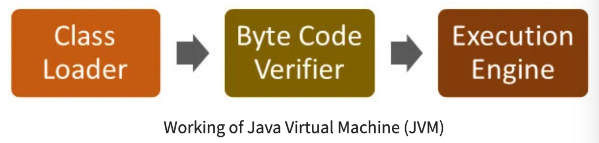
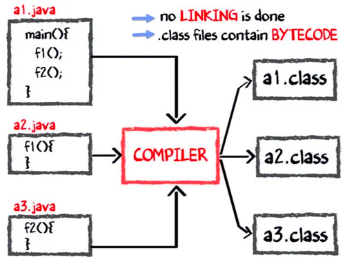
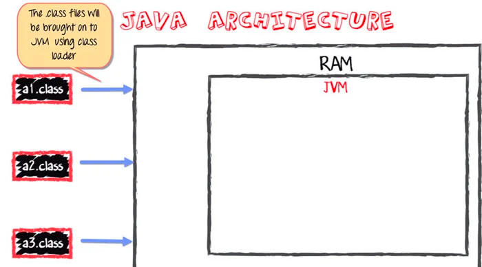
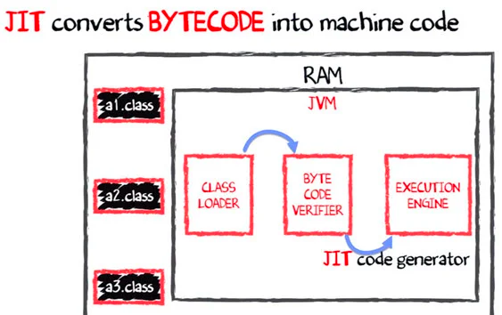

# Java Virtual Machine
자바 코드와 애플리케이션을 구동하는 런타임 환경 엔진
> #### Virtual Machine
> - 소프트웨어로 구현된 하드웨어
>   1. TV와 비디오를 소프트웨어화한 윈도우 미디어 플레이어
>   2. 오디오 시스템을 소프트웨어화한 윈앰프(Winamp)
> - JVM는 자바를 실행하기 위한 가상 기계라 생각하면 됨

- JVM은 자바 코드를 컴파일해서 바이트 코드로 변환하고 이를 실행 엔진으로 구동
- 컴파일 결과물인 바이트 코드는 시스템 중립적
- JVM이 시스템에 따라 적절한 기계어로 변환해주기 떄문에 모든 플랫폼에 적용 가능한 크로스 플랫폼 환경 제공

## JVM 아키텍처

### Class Loader
- 자바 바이트 코드, `.class` 확장명을 JVM에 적재
- 초기화, 로딩, 링크(바이트 코드 간 연결) 기능 구현
- 적재 완료 시, 바이트 코드들을 JVM Memory에 저장

### JVM Memory
1. Method Area
   > #### JDK 1.8 이후부터 삭제, `metaspace`라는 네이티브 메모리에서 관리
   > - 해당 부분은 논리적으로 이해, 실제 어디에 속하는지는 JVM 구현에 따라 다름
   > - Metaspace도 HotSpot 벤더에서 다른 JVM과 구조를 통일하기 위해 만든 것이기도 하니 자세한건 사용 벤드 사의 JVM 알아보는 것이 좋음
   > ---
   > https://stackoverflow.com/questions/50163218/is-method-area-still-present-in-java-8
   >
   > https://www.oracle.com/webfolder/technetwork/tutorials/mooc/JVM_Troubleshooting/week1/lesson1.pdf
   >
   > https://wiki.openjdk.org/display/HotSpot/Metaspace
   - 클래스가 사용될 때 해당 클래스 파일을 읽고 분석한 클래스의 인스턴스 변수, 메서드 코드 등을 저장
   - 객체 생성하고 메서드 실행하면 해당 클래스 코드에 대한 정보를 저장
   - 저장 목록
     1. 클래스와 인스턴스 정보 => Type
        1. Type 전체 이름(패키지.클래스 명)
        2. Type 직계 하위 클래스 전체 이름
        3. Type의 클래스/인터페이스 여부 modifier
        4. 연관된 인터페이스 이름 목록
     2. Runtime Constant Pool -> Type의 모든 상수 정보
        1. Type, Field, Method의 모든 Symbolic Reference 정보
        2. Constant Pool의 시작점 Entry는 배열과 같이 인덱스 번호를 통해 접근
        3. 객체 접근 등 모든 참조를 위한 핵심 요소
     3. Field Information -> 생성자를 포함한 모든 메서드
        1. Field Type
        2. Field Modifier
     4. Method Information
        1. Method 이름
        2. Method 반환 타입
        3. Method 파라미터 개수와 Type
        4. Method Modifier
        5. Method 구현부(abstract, native X)
           1. Method 바이트 코드
           2. Method Stack Frame의 Operand Stack 및 지역 변수 section 크기
           3. 예외 테이블
     5. Class Variable -> static 키워드로 선언된 변수
        - 모든 인스턴스에 공유 -> 인스턴스 없이도 접근 가능
        - 클래스에 속함
        - 클래스를 사용하기 이전에 미리 메모리를 할당받아 있는 상태
        - final 클래스 변수는 상수로 치환, `Runtime Constant Pool`에 값 복사 -> GC Scan 대상 제외로 인한 최적화
2. Heap
   - 사용자가 관리하는 인스턴스가 생성되는 공간
   - 객체를 동적 생성 시 해당 영역의 메모리에 할당되어 사용됨
   - 프로그램은 시작도리 때 미리 이 영역을 많이 할당해 인스턴스와 인스턴스 변수를 저장
   - 참조 변수는 heap에 인스턴스가 저장되는게 아닌, 포인터가 저장됨
   - GC 대상이 됨
   - JDK 1.7부터 `String Constant Pool`이 여기에 속함(1.8 이후 `Metaspace`로 이관)
3. JVM Language Stack
   - 지역 변수와 일부 결과 값을 저장
   - 자바 스레드는 생성과 동시에 하나의 JVM Stack을 할당 받음
   - 메서드 호출 때마다 하나의 프레임이 생성, 메서드 내 프로세스 종료 시 삭제됨
   > #### Frame
   > - 메서드가 호출될 때마다 만들어지고 메서드의 상태 정보를 저장
   >   1. 지역 변수
   >   2. Operand Stack -> 메서드 계산을 위한 작업 공간
   >   3. Constant Pool Reference
4. PC Registers
   - 현재 실행 중인 JVM의 명령을 저장 -> 운영체제 상의 Program Counter
   - 자바 스레드는 하나의 PC Register를 가짐

### Execution Engine
- 하드웨어, 소프트웨어 또는 완전한 시스템들을 테스트하는 소프트웨어의 일종

### Native Method Interface
- JVM에서 동작 중인 자바 코드에서 라이브러리와 네이티브 애플리케이션 호출 제공

### Native Method Libraries
- Execution Engine을 구동하는데 필요한 C/C++ 네이티브 라이브러리 집합

## 자바 컴파일 & 실행

1. 컴파일러가 a1, a2, a3 컴파일하면 바이트 코드들이 각 파일마다 하나씩 생성

2. 컴파일 완료 시 JVM이 RAM에 적재되면서 실행, Class Loader를 통해 '모든' 바이트 코드를 RAM에 적재

3. Execution engine이 바이트 코드들을 네이티브 머신 코드(해당 플랫폼의 기계어)로 변환
    - 이 덕에 자바는 모든 플랫폼에서 동작 가능한 크로스 플랫폼
    - 바이트 코드 컴파일은 JIT 컴파일 방식을 취함
   > #### Just-in-time 컴파일
   > - 프로그램 실행 시점에서 필요한 부분을 즉석으로 컴파일하는 방식
   > - 매번 같은 코드를 즉석에서 해석하는 대신 처음 실행될 때 interpret하면서 자주 사용되는 코드를 caching해서 속도 개선

## 자바가 느린 이유
### Dynamic Linking
- 번역한 소스를 연결하는 작업을 프로그램 실행 도중에 실시간 수행

### Runtime Interpreter
- 바이트 코드 변환 역시 실시간 처리
- `컴파일 -> 링크 -> 목적 파일 변환 -> 실행 파일 과정`을 한번에 처리하는 C/C++ 보다 느릴 수 밖에 없음
- 해당 언어는 프로그램 실행시키는 CPU 명령어, 기계어로 변환할 수 있어야 함
- 운영체제마다 사용할 수 있는 API를 제공해야 함 -> 이식성 저하
- 이와 달리 자바는 JVM이 알아서 모든 플랫폼에 대응할 수 있게끔 만들어졌기 때문에 이식성이 높음
