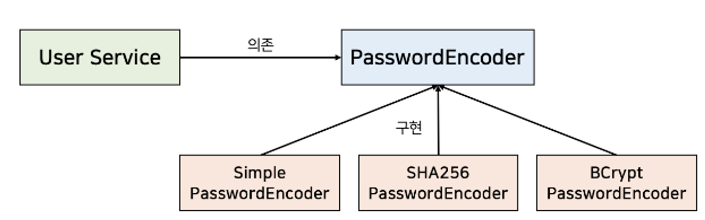

# 객체지향 5대 설계 원칙
## 요약

- SRP : 단일 책임 원칙, 클래스는 단 하나의 목적을 가져야 하며, 클래스를 변경하는 이유는 단 하나의 이유여야 한다
- OCP : 개방 폐쇄 원칙, 클래스는 확장에 열려 있으나 변경에 닫혀 있어야 한다
- LSP : 리스코프 치환 원칙, 상위 타입의 개체를 하위 타입으로 바꿔도 프로그램은 일관되게 동작해야 한다
- ISP : 인터페이스 분리 원칙, 클라이언트는 이용하지 않는 메서드에 의존하지 않도록 인터페이스를 분리해야 한다
- DIP : 의존관계 역전 원칙, 클라이언트는 추상화에 의존해야 하며, 구체화(구현된 클래스)에 의존해선 안된다
- SOLID의 핵심은 추상화와 다형성이다. 구현체 클래스에 의존하지 않고 추상 클래스나 인터페이스에 의존하여 유연하고 확장 가능한 애플리케이션을 만든다

---

## SRP

- 모듈이 변경되는 이유는 한가지여야 함
- 여기서 변경의 이유가 한가지라는 것은 해당 모듈이 여러 대상 또는 액터들에 대해 책임을 가져선 안되고, 오직 하나의 액터에 대해서만 책임을 져야 함
- 만약 어떤 모듈이 여러 대상에 대해 책임을 가지고 있다면 여러 대상에서 변경 요구가 올 수 있으므로 해당 모듈을 수정해야 하는 이유가 여럿이 될 수 있음
- 반면에 어떤 클래스가 단 하나의 책임만 가진다면 특정 대상으로 부터 변경을 특정할 수 있게 됨
- 이는 해당 클래스를 변경해야 하는 이유와 시점이 명확해짐

### 예시
- 사용자의 정보를 받아서 비밀번호를 암호화 후 데이터베이스에 저장하는 로직

 ```java
 @Service
 @RequiredArgsConstructor
 public class UserService {
 
     private final UserRepository userRepository;
 
     public void addUser(final String email, final String pw) {
         final StringBuilder sb = new StringBuilder();
 
         for(byte b : pw.getBytes(StandardCharsets.UTF_8)) {
             sb.append(Integer.toString((b & 0xff) + 0x100, 16).substring(1));
         }
 
         final String encryptedPassword = sb.toString();
         final User user = User.builder()
                 .email(email)
                 .pw(encryptedPassword).build();
 
         userRepository.save(user);
     }
 }
 ```
- 위 사용자 추가 로직에는 다음과 같은 다양한 대상으로부터 변경이 발생할 수 있음
  - 기획팀 : 사용자 추가 시 역할(role)에 대한 정의가 필요
  - 보안팀 : 사용자의 비밀번호 암호화 방식에 개선이 필요
- 이는 UserService가 여러 대상으로부터 단 하나의 책임을 갖고 있지 못하여 발생한 문제
- 따라서 이를 위해선 비밀번호 암호화에 대한 책임을 분리해야 함
- 다음과 같이 비밀번호 암호화를 책임지는 별도의 클래스를 만들어 UserService로부터 이를 추상화하고, 해당 클래스를 합성하여 접근 및 사용하면 UserService로부터 비밀번호 암호화 방식을 개선해달라는 변경을 분리할 수 있음
    ```java
    @Component
    // 비밀번호 암호화 추상화(모델링)
    public class SimplePasswordEncoder {
    
        public void encryptPassword(final String pw) {
            final StringBuilder sb = new StringBuilder();
    
            for(byte b : pw.getBytes(StandardCharsets.UTF_8)) {
                sb.append(Integer.toString((b & 0xff) + 0x100, 16).substring(1));
            }
    
            return sb.toString();
        }
    }
    
    @Service
    @RequiredArgsConstructor
    public class UserService {
    
        private final UserRepository userRepository;
        private final SimplePasswordEncoder passwordEncoder;      // 암호화 모듈을 합성하여 변경을 분리
    
        public void addUser(final String email, final String pw) {
            final String encryptedPassword = passwordEncoder.encryptPassword(pw);
    
            final User user = User.builder()
                    .email(email)
                    .pw(encryptedPassword).build();
    
            userRepository.save(user);
        }
    }
    ```
- SRP를 제대로 지키면 변경이 필요할 때 수정할 대상이 명확해짐
- 시스템이 커질 수록 효과가 커지게 되는데, 서로 많은 의존성을 갖게되는 상황에서 변경 요청이 오면 하나만 수정하면 되기 때문
- 적절하게 책임과 관심이 다른 코드를 분리하고, 서로 영향을 주지 않도록 추상화함으로써 애플리케이션 변화에 대응이 쉬워짐

## OCP
- 확장에 대해 열려있고, 수정에 대해서는 닫혀있어야 함
  - 확장에 열려있다
    - 요구사항이 변경될 때 새로운 동작을 추가하여 애플리케이션 기능을 확장
  - 수정에 닫혀있다 
    - 기존 코드를 수정하지 않고 애플리케이션의 동작을 추가하거나 변경
    - 추상화에 의존시켜 기존 코드를 바꾸지 않게함

### 예시
- 비밀번호를 강화해야 한다는 요구사항이 새롭게 들어와서 SHA-256 알고리즘을 사용하는 새로운 PasswordEncoder를 생성함
```java
@Component
public class SHA256PasswordEncoder {

    private final static String SHA_256 = "SHA-256";

    public String encryptPassword(final String pw)  {
        final MessageDigest digest;
        try {
            digest = MessageDigest.getInstance(SHA_256);
        } catch (NoSuchAlgorithmException e) {
            throw new IllegalArgumentException();
        }

        final byte[] encodedHash = digest.digest(pw.getBytes(StandardCharsets.UTF_8));

        return bytesToHex(encodedHash);
    }

    private String bytesToHex(final byte[] encodedHash) {
        final StringBuilder hexString = new StringBuilder(2 * encodedHash.length);

        for (final byte hash : encodedHash) {
            final String hex = Integer.toHexString(0xff & hash);
            if (hex.length() == 1) {
                hexString.append('0');
            }
            hexString.append(hex);
        }

        return hexString.toString();
    }
}
```

- 새로운 암호화 정책을 적용하려고 봤더니, 새로운 암호화 정책과 무관한 UserService를 다음과 같이 수정해줘야 함
```java
@Service
@RequiredArgsConstructor
public class UserService {

    private final UserRepository userRepository;
  // 	private final SimplePasswordEncoder passwordEncoder;
    private final SHA256PasswordEncoder passwordEncoder;      // 암호화 정책과 관련 없는 UserService에서 변동 발생!

    ...
    
}
```

- 이는 기존 코드를 수정하지 않아야 하는 OCP에 위배됨
- 그리고 나중에 암호화 정책을 변경해야 한다는 요구사항이 오면 다시 UserService에 변경이 필요해짐
- OCP를 지키기 위해서는 **추상화에 의존**해야 함
- 추상화는 핵심적인 부분만 남기고, 불필요한 부분은 제거하여 복잡한 것을 간단히 하는 것
- 또한 추상화를 통해 변하지 않는 부분만 남겨 기능을 구체화 및 확장이 가능함
- 예제에서,
  - 변하지 않는 것은 사용자를 추가할 때 암호화가 필요
  - 변하는 것은 사용되는 구체적인 암호화 정책
- 따라서 UserService는 구체적 암호화 정책이 사용되는지 알 필요 없이 단지 passwordEncoder 객체를 통해 암호화가 된 비밀번호를 받기만 하면 됨
- 그러므로 UserService가 구체적인 암호화 클래스에 의존하지 않고 PasswordEncoder라는 인터페이스에 의존하도록 추상화하면 OCP 원칙을 충족할 수 있음

    ```java
    public interface PasswordEncoder {
        String encryptPassword(final String pw);
    }
    
    @Component
    public class SHA256PasswordEncoder implements PasswordEncoder {
    
        @Override
        public String encryptPassword(final String pw)  {
          ...
        }
    }
    
    @Service
    @RequiredArgsConstructor
    public class UserService {
    
        private final UserRepository userRepository;
        private final PasswordEncoder passwordEncoder;   // 인터페이스를 통해 추상화하여 구체적인 것에 의존하지 않고
                                                       // 변하지 않는 부분만 남겨 기능을 구체화 및 확장이 가능해짐
                                                       // 이후 다른 정책에 대한 객체를 사용하더라도 UserService는 변경할 필요 없음
    
        public void addUser(final String email, final String pw) {
            final String encryptedPassword = passwordEncoder.encryptPassword(pw);
    
            final User user = User.builder()
                    .email(email)
                    .pw(encryptedPassword).build();
    
            userRepository.save(user);
        }
        
    }
    ```
- 추상화를 통해 **변하는 것들은 숨기고 변하지 않는 것들에 의존**하게 되면 기존의 코드 및 클래스들을 수정하지 않은 채로 애플리케이션 확장이 가능

## LSP
- 하위 타입은 상위 타입을 대체할 수 있어야 함
- 올바른 상속 관계의 특징을 정의하기 위해 발표한 것
- 해당 객체를 사용하는 클라이언트는 상위 타입이 하위 타입으로 변경되어도 차이점을 인식하지 못한 채 상위 타입의 public 인터페이스를 통해 서브 클래스를 사용할 수 있어야 함

### 예시
- 정사각형은 직사각형이다(Square is a Rectangle)
```java
@Getter
@Setter
@AllArgsConstructor
public class Rectangle {

    private int width, height;

    public int getArea() {
        return width * height;
    }

}

public class Square extends Rectangle {

    public Square(int size) {
        super(size, size);
    }
	
    @Override
    public void setWidth(int width) {
        super.setWidth(width);
        super.setHeight(width);
    }

    @Override
    public void setHeight(int height) {
        super.setWidth(height);
        super.setHeight(height);
    }
}
```
- Square는 1개의 변수만을 생성자로 받으며 width/height를 1개 만을 설정하면 모두 설정되도록 오버라이딩 됨
- 이를 사용하는 클라이언트는 당연히 직사각형의 너비와 높이가 다르다 가정할 것이고, 직사각형을 resize하기 원할 경우 다음처럼 메서드를 만들어 너비와 높이를 수정할 것임
    ```java
    public void resize(Rectangle rectangle, int width, int height) {
        rectangle.setWidth(width);
        rectangle.setHeight(height);
        if (rectangle.getWidth() != width && rectangle.getHeight() != height) {
            throw new IllegalStateException();
        }
    }
    ```
- 문제는 resize의 파라미터로 Square가 전달되는 경우
- Rectangle은 상위 클래스이므로 Square 역시 전달 가능
- Square는 너비/높이가 항상 같기 때문에 다음 같은 경우엔 문제가 발생함
    ```java
    Rectangle rectangle = new Square();
    resize(rectangle, 100, 150);
    ```
- 이러한 케이스는 명백히 클라이언트 관점에서 상위 클래스와 하위 클래스의 행동이 호환되지 않아 LSP를 위배하는 경우
- LSP가 성립한다는 것은 서브 클래스가 상위 클래스 대신 사용할 수 있어야 하기 때문
- LSP는 하위 클래스가 상위 클래스를 대체하기 위해선 상위 클래스에 대한 클라이언트의 가정을 준수해야한다는 것을 강조
- 여기서 대체 가능성을 결정해야 하는 것은 해당 객체를 이용하는 클라이언트임을 반드시 잊지 말아야 함
- 클라이언트가 예상할 수 있도록 추상화 레벨을 맞춰서 메서드 호출이 불가능하도록 하거나 해당 추상화 레벨에 맞게 메서드를 오버라이딩하는게 합리적
- Square는 resize를 호출하지 못하게 하기

## ISP
- 객체가 충분히 높은 응집도의 작은 단위로 설계되었더라도, 목적과 관심이 다른 클라이언트가 있다면 인터페이스를 통해 적절히 분리해줘야 함
- 즉, 클라이언트의 목적과 용도에 적합한 인터페이스만을 제공하는 것
- 이로써 모든 클라이언트가 자신의 관심에 맞는 public 인터페이스, 외부에서 접근 가능한 메시지만을 접근하여 불필요한 간섭을 최소화함
- 기존 클라이언트에 영향을 주지 않은 채로 유연하게 객체의 기능을 확장하거나 수정할 수 있음
- 어떤 구현체에 부가 기능이 필요하다면 이 인터페이스를 구현하는 다른 인터페이스를 만들어서 해결 가능

### 예시
- 사용자가 비밀번호 변경 시 입력한 비밀번호가 기존과 동일한지 검사하는 로직을 다른 Authentication 로직에 추가한다 가정
- 다음처럼 isCorrectPassword라는 public 인터페이스를 SHA256PasswordEncoder에 추가

```java
@Component
public class SHA256PasswordEncoder implements PasswordEncoder {

    @Override
    public String encryptPassword(final String pw)  {
        ...
    }

    public String isCorrectPassword(final String rawPw, final String pw) {
        final String encryptedPw = encryptPassword(rawPw);
        return encryptedPw.equals(pw);
    }
}
```
- UserService에선 암호화를 위한 encryptPassword만을 필요로 함, isCorrectPassword를 알 필요는 없음
- 현재 UserService는 PasswordEncoder를 주입받아 encryptPassword에만 접근 가능, 분리가 잘된 것처럼 보임
- 하지만 Authentication 로직에서는 isCorrectPassword 접근을 위해 구체 클래스인 SHA256PasswordEncoder를 주입받아야 함
- 이러면 불필요한 encryptPassword에도 접근가능해지고 ISP를 위배함
- 물론 PasswordEncoder에 isCorrectPassword 인터페이스를 추가할 수 있지만, 클라이언트 목적과 용도에 적합한 인터페이스만을 제공한다는 ISP 원칙을 지키기 위해서라도 이미 만든 인터페이스는 건드리지 않는 것이 좋음
- 따라서 비밀번호를 검사를 의미하는 별도의 인터페이스(PasswordChecker)를 만들고, 해당 인터페이스로 주입받도록 하는 것이 적합
    ```java
    public interface PasswordChecker {
        String isCorrectPassword(final String rawPw, final String pw);
    }
    
    // UserService에선 isCorrectPassword가 필요 없으므로 PasswordEncoder에 의존하면 되고,
    // Authentication에선 isCorrectPassword만 필요하므로 PasswordChecker에 의존하여
    // 둘 다 SHA256PasswordEncoder를 주입받을 수 있음과 동시에 서로 사용하지 않는 메서드를 알 필요가 없음
    // 이는 변경에 대한 영향을 더욱 세밀하게 제어가 가능하게 함
    @Component
    public class SHA256PasswordEncoder implements PasswordEncoder, PasswordChecker {
    
        @Override
        public String encryptPassword(final String pw)  {
            ...
        }
      
        @Override
        public String isCorrectPassword(final String rawPw, final String pw) {
            final String encryptedPw = encryptPassword(rawPw);
            return encryptedPw.equals(pw);
        }
    }
    ```
- 클라이언트에 따라 인터페이스를 분리하면 변경에 대한 영향을 더욱 세밀하게 제어가 가능
- 이렇게 인터페이스를 클라이언트의 기대에 따라 분리하여 변경에 의한 영향을 제어하는 것을 ISP라고 부름

## DIP

- 고수준 모듈은 저수준 모듈의 구현에 의존해서는 안되며, 저수준의 모듈이 고수준의 모듈에 의존해야 함
  - 고수준 모듈 : 입출력으로부터 먼(비즈니스와 관련된) 추상화 모듈
  - 저수준 모듈 : 입출력으로부터 가까운(HTTP, 데이터베이스, 캐시 등과 관련된) 구현 모듈
- 결국 비즈니스와 관련된 세부 사항에는 의존하지 않는 설계 원칙을 의미함
- SRP 예시인 SimplePasswordEncoder는 변하기 쉬운 암호화 알고리즘과 관련된 구현체 클래스임 
- UserService가 SimplePasswordEncoder에 직접 의존하는 것은 DIP에 위배되는 것
- 따라서 UserService가 변하지 않는 추상화에 의존하도록  변경이 필요했고, 예시에선 PasswordEncoder 인테페이스를 만들어 이에 의존하도록 변경함
- UserService가 추상화된 PasswordEncoder에 의존하므로 비밀번호 암호화 정책이 변경되어도 다른 곳들로 변경이 전파되지 않아 유연한 애플리케이션이 됨



- DIP는 OCP와 밀접한 관련이 있음, DIP가 위배되면 OCP 역시 위배될 가능성이 높음
- DIP에서 주의할 점이 있는데, DIP에서 **의존성이 역전되는 시점은 컴파일 시점** 
- 런타임 시점에서는 UserService가 SHA256PasswordEncoder라는 구현체 클래스에 의존함
- DIP는 컴파일 시점 또는 소스 코드 단계에서 의존성이 역전되는 것을 의미함
- 코드에서는 UserService가 PasswordEncoder라는 인터페이스에 의존함

## 결론

- 객체지향 5대 설계 원칙인 SOLID가 이야기하는 핵심은 **추상화와 다형성**
- 구현체 클래스에 의존하지 않고 추상 클래스(또는 인터페이스)에 의존함으로써 유연하고 확장 가능한 애플리케이션을 만들 수 있음

# Reference

[[OOP] 객체지향 프로그래밍의 5가지 설계 원칙, 실무 코드로 살펴보는 SOLID](https://mangkyu.tistory.com/194)

[[기술면접] CS 기술면접 질문 - 프로그래밍 공통 (1/8)](https://mangkyu.tistory.com/88)