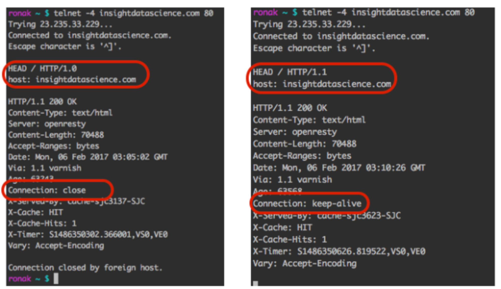
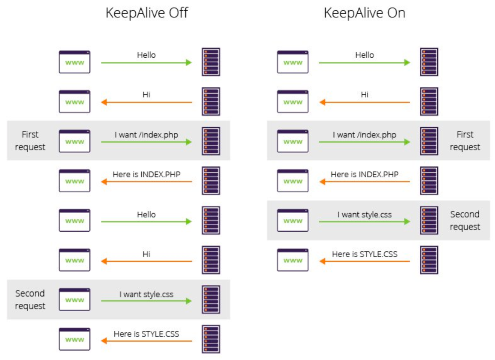
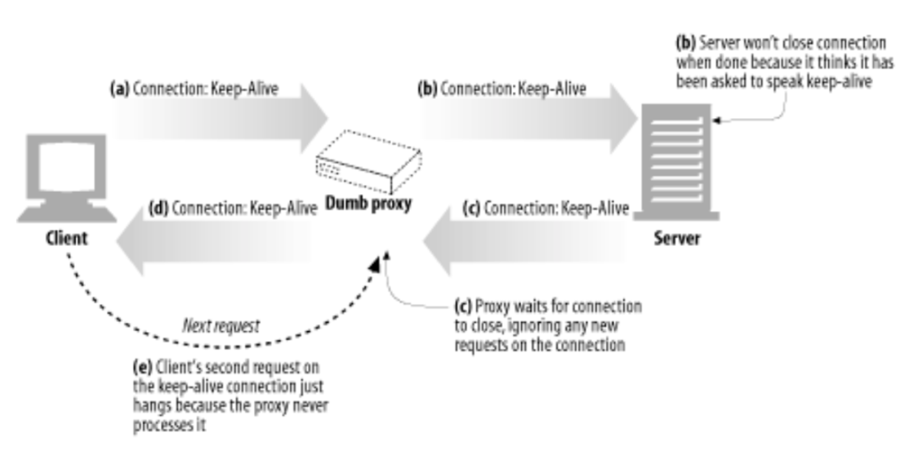
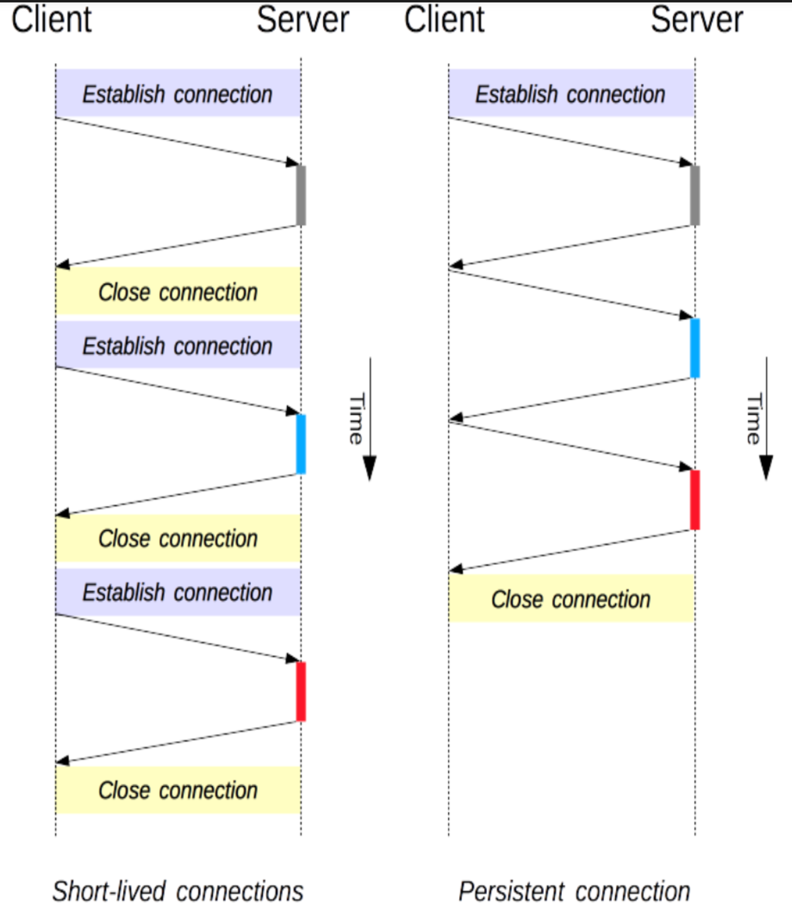
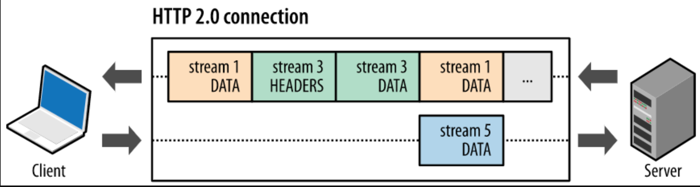

# keep-alive

## 요약

- keep-alive는 Persistent TCP Connection을 제공하고, Connection을 재사용하여 성능 향상을 높혀주는 옵션이다
- 웹에선 특정 페이지를 보여주기 위해 여러 요청을 보내듯이 서버에 연속적으로 같은 클라이언트가 여러 요청을 보낼 가능성이 높은 site locality 문제 때문에 매 요청마다 Connection을 Close하지 않고 재사용하는 방법을 제공한다
- keep-alive 옵션을 명시하여 클라이언트가 이를 사용한다는 것을 인지하게 된다
- HTTP/1.1에선 pipelining 방식으로 인한 Head of Blocking 문제로 인해 HTTP/2.0부턴 Stream 방식으로 성능을 개선시켰다

---

## HTTP keep-alive

- `Persistent Connection`을 맺는 기법으로 `HTTP/1.0+`부터 지원
  - `Persistent Connection`: 요청이 처리된 후에도 connection을 유지하는 것을 말함 
- 하나의 TCP Connection을 활용해 여러 HTTP Request/Response를 주고 받을 수 있도록 함


- 실제로 HTTP/1.1은 Persitent Connection을 지원하는 반면, HTTP/1.0은 하나의 Request에 응답할 때마다 Connection을 Close
- 이로 인해 매 요청마다 Connection Open -> Close를 반복하기 때문에 부하 발생


- 그래서 `keep-alive` 옵션을 활용하면 불필요한 Open -> Close를 최소화시켜 위와 같이 네트워크 부하를 줄일 수 있음

### Persistent Connection
- 요청이 처리된 후에도 connection을 유지하는 것을 말함
- TCP Connection을 요청할 때마다 close하지 않고 재사용할 수 있는 방법을 제공
- 사용하는 대표적 이유는 `Site Locality`
  - Web에서 특정 페이지를 보여주기 위해 연속으로 이미지 Request를 보냄
  - 즉, 서버에 연속적으로 동일한 클라이언트가 여러 요청을 보낼 가능성이 높음
  - 이러한 니즈가 지속되면서 HTTP/1.1부터 매 요청마다 Connection을 Close하지 않고 재사용하는 방법을 제공
- 이를 사용하게 되면 TCP Connection을 맺기 위해 SYN과 ACK를 주고 받는 3-ㅈay handshaking을 매 요청마다 맺을 필요가 없어짐
  1. 네트워크 혼잡 감소: TCP, SSL/TCP Connection Request 감소
  2. 네트워크 비용 감소: 여러 Connection으로 하나의 Client를 서빙하는 것보다 하나의 Connection으로 요청을 처리하는게 효율적
  3. Latency 감소: `3-way handshaking`을 맺으면서 필요한 round-trip 감소
- 이 밖에도 `Parallel Connection`이 존재
  - 병렬적으로 동시에 여러 Connection을 맺는 것을 의미, 그러나 문제점 존재
    1. 매 요청마다 새로운 Connection을 Open -> Close를 반복하기 때문에 더 많은 연결 시간과 대역폭`Bandwidth`이 소모
    2. TCL slow start로 인한 성능 저하
    3. Parallel Connection을 맺을 수 있는 수 제한
  - 그래도 Connection Estblishment에 소모되는 비용을 줄이면서 위와 같은 문제 완화 가능
  - 그래서 적절히 혼용해서 사용할 수 있어야 함
  - 실제로 많은 웹 어플리케이션들은 적은 수의 `Parallel Connection`을 Persistent하게 유지

### keep-alive 옵션 사용 방법
- HTTP header를 아래와 같이 입력
```shell
HTTP/1.1 200 OK
Connection : Keep-Alive
Keep-Alive: timeout=5, max=1000   # timeout : Connection이 idle 상태로 얼마동안 유지할 것인지를 의미
                                  #           이 시간이 지날 동안 request가 없을 경우 connection은 close
                                  # max : Keep-alive connection을 통해 주고 받을 수 있는 request 최대 갯수
								  #       이 수보다 많은 요청을 주고 받을 경우 connection은 close
```
- 만약 서버에서 `keep-alive connection`을 지원하는 경우 동일한 헤더를 response에 담아 보냄
- 지원하지 않는 경우 헤더에 담아 보내주지 않음
- 만약 서버의 응답에 해당 헤더가 없으면 Client는 지원하지 않는다고 가정하고 Connection을 재사용하지 않음

#### keep-alive 옵션 관련 규칙
1. Persistent한 Connection을 유지하기 위해선 Client 측에서 모든 요청을 위에 언급한 헤더를 담아 보내야 함, 만약 한 요청이라도 생략될 경우 서버는 연결을 Close
2. 서버 또한 Persistent하게 요청을 주고 받다가 Response에 keep-alive 관련 헤더가 담겨오지 않을 땐 Client 측에서 서버가 Persistent Connection을 맺고 있지 않다고 판단할 수 있음
3. 정확한 content-lenght를 사용해야 함, 하나의 Connection을 계속 재사용해야 한느데, 특정 요청의 종료를 판단할 수 없기 때문
4. Connection 헤더를 지원하지 않는 Proxy에는 사용할 수 없음
5. Client는 언제든 Connection이 Close될 수 있기 때문에 retry 로직을 준비하는 것이 바람직

### 성능 차이

#### 매 요청마다 새로운 TCP Connection 사용

```shell
#!/usr/bin/env python

import os, json, time, logging, requests
from request.auth import HTTPBasicAuth

logging.basicConfig(level=loggin.DEBUG)
start_time = time.time()

def get_venmo_data(limit):
	url = "https://venmo.com/api/v5/public?limit={}"
	for i in range(50):
		response = requests.get(url.format(limit))
		response_dict = json.loads(response.text)
		for transaction in response_dict["data"]:
			print(unicode(transaction["message"])
		url = response_dict["paging"]["next"] + "&limit{}"

if __name__ == "__main__":
	limit = 1
	get_venmo_data(limit)
	print("--- %s seconds ---" % (time.time() - start_time))
```
- 22초 걸림

#### 매 요청마다 동일한 TCP Connection 사용
```shell
#!/usr/bin/env python

import os, json, time, logging, requests
from request.auth import HTTPBasicAuth

logging.basicConfig(level=loggin.DEBUG)
start_time = time.time()

def get_venmo_data(limit):
	session = request.Session() # Persistent Connection
	url = "https://venmo.com/api/v5/public?limit={}"
	for i in range(50):
		response = session.get(url.format(limit))
		response_dict = json.loads(response.text)
		for transaction in response_dict["data"]:
			print(unicode(transaction["message"])
		url = response_dict["paging"]["next"] + "&limit{}"

if __name__ == "__main__":
	limit = 1
	get_venmo_data(limit)
	print("--- %s seconds ---" % (time.time() - start_time))
```
- `22초 -> 7초` 단축

### keep-alive와 proxy 문제 => Blied Relays
- 서버와 클라이언트가 proxy 없이 직접 통신할 땐 정상 작동
- Blind Relays, keep-alive 옵션을 지원하지 않는 proxy는 Connection Header를 이해 못하고 Extension Header로 인식하는 경우 동작하지 않음



- Proxy(Bline Relays)가 keep-alive 헤더를 서버에 그대로 보냄
- 서버는 proxy가 지원하는 걸로 착각하고 응답에 keep-alive 헤더를 붙여 보냄
- Proxy는 헤더를 그대로 보내지만 keep-alive 옵션을 이해 못해, 서버가 Close하기를 대기함
- 클라이언트는 keep-alive 응답이 왔기 때문에 Persistent Connection가 맺어진 줄 알고 Close하지 않음
- 이때, **Proxy가 Connection이 Close될 때까지 hang이 걸리게 됨**
- 또한 **클라이언트는 동일한 Connection에 Request를 보내지만 Proxy는 이미 Close -> 해당 요청 무시**
- 이를 위한 대안으로 `Proxy Connection 헤더`를 활용하여 Proxy에서 자체적으로 keep-alive를 사용

### HTTP/1.1 vs. HTTP/2.0

#### HTTP/1.1

- HTTP/1.1부터는 기본적으로 요청에 대한 연결을 일정 시간 동안 끊지 않도록 유지 -> 기본적으로 keep-alive가 있어 사용할 필요 없음
- Pipelining
  - 응답을 기다리지 않고 요청을 연속적으로 보내는 기능 제공
  - 기본적으로 요청은 순차적이므로 요청에 대한 응답을 받고 나서야 새로운 요청을 보내나, HTTP/1.1에선 연속으로 보냄
  - GET, HEAD, DELETE, PUT과 같은 멱등성이 보장되는 요청에만 적용
- Head of line blocking
  - Pipelining도 문제점은 존재
  - 응답 순서는 보장되어야 하기 때문에 앞에 요청 처리에 많은 시간이 소요되면 뒤 요청들이 늦게 응답 받음
- HTTP/1.1은 연결당 하나의 요청과 응ㄷ바을 처리하기 때문에 동시 전송 문제와 다수의 리소스를 처리하기엔 속도와 성능 문제 있음
- 또한 요청과 응답 순서는 동기화되어야 하기 때문에, 특정 요청을 처리하는데 많은 시간이 걸리면 다른 요청 처리 시 지연 발생
- 헤더도 큼(특히 쿠키), 매 요청마다 중복되는 헤더를 보내게 되어 비효율적

#### HTTP/2.0
- 새로운 기능 도입보단 HTTP/1.1 성능 개선에 중점을 둠
- Multiplexed Stream
  
  - 한 Connectiondㅔ서 여러 메시지를 주고 받을 수 있으며, 응답은 순서에 상관 없이 Stream으로 주고 받음 -> Connection keep-alive, pipelining 개선판
  - 하나의 Connection에서 여러 병렬 스트림(3개)이 존재할 수 있음
  - Stream이 뒤섞여서 전송될 경우 Stream Number를 이용해 수신측에서 재조합
- Server Push`PUSH_PROMISE`
  - 서버는 클라이언트 요청에 대해 요청하지도 않은 리소스를 마음대로 보낼 수 있음
  - HTTP/1.1에는 클라이언트(브라우저)가 HTML 문서를 요청 시 HTML에 여러 리소스(ex. CSS, Image)가 포함된 경우, 요청한 HTML 문서를 해석하면서 필요한 리소스를 재요청함
  - 그러나 HTTP/2.0에선 Server Push를 통해 클라이언트가 요청하지도 않은 HTML에 포함된 리소스를 Push해 클라이언트의 요청을 최소화 => 성능 향상
- Header Compression
  - Header의 내용과 중복되는 필드를 재전송하지 않도록 함 => 데이터 절약
  - 과거엔 Header가 평문이었으나, HTTP/2.0에선 Hash Table과 Huffman Coding을 사용하는 `HPACK` 압축 방식 사용 => 전송 효율 향상

# Reference

[[HTTP] keep alive란? (persistent connection에 대하여)](https://etloveguitar.tistory.com/137)
