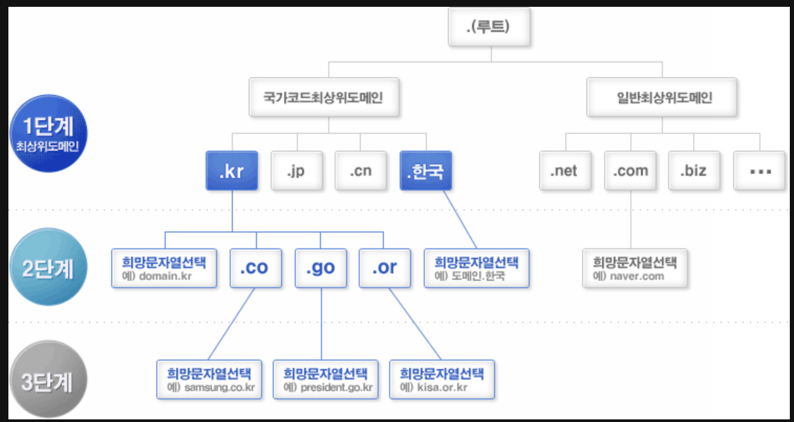
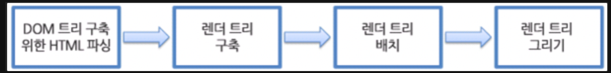

# 웹브라우저에 URL 입력하면 어떤 일이 일어나는가?

## 1. 웹사이트를 호스팅하는 웹서버의 위치 조회
- 로컬 PC의 `hosts` 파일에 해당 도메인을 매핑한 IP가 있는지 확인

## 2. 매핑 정보를 찾지 못하면 DNS 서버에서 조회하여 실제 IP 주소를 찾음
1. DNS 쿼리는 브라우저 캐시를 확인, 이전에 방문한 적이 있는 DNS 기록을 일정 시간 저장
2. OS 캐시 확인, OS에 시스템 호출을 통해 DNS 기록을 가져옴
3. 라우터 캐시 확인
4. ISP 캐시 확인, ISP는 DNS 서버를 가지고 있는데, 해당 서버에서 DNS 기록 캐시를 검색
>캐시를 많이 두는 이유는 네트워크 트래픽 규제와 데이터 전송 시간 개선을 위함

## 3. 요청한 URL이 캐시에 없다면 ISP의 DNS 서버가 DNS 쿼리로 해당 URL의 IP 주소 찾음

- DNS 쿼리 목적은 웹사이트에 대한 올바른 IP 주소를 찾을 때까지 여러 DNS 서버에서 검색하는 것
- 필요한 IP 주소를 찾거나 못 찾아서 오류 응답 반환할 때까지 한 DNS 서버에서 다른 DNS 서버 검색이 반복적으로 계속됨
  - 이러한 유형의 검색을 재귀적 질의(Recursive Query)라 함
  - 이러한 상황에서 ISP의 DNS 서버를 `DNS Recursor`라 부름 -> 인터넷의 다른 DNS 서버에 답변을 요청, 의도된 도메인 이름의 적절한 IP 주소를 찾는 일을 담당

### 예시(www.naver.com)
1. DNS Recursor가 루트 네임 서버에 연결
2. `.com` 도메인 네임 서버로 리디렉션
3. `.com` 네임 서버는 `naver.com` 네임 서버로 리디렉션
4. `naver.com` 네임 서버는 www.naver.com과 일치하는 IP 주소를 찾아 DNS Recursor로 반환
5. Recursor는 이를 브라우저로 다시 보냄

## 4. 브라우저는 해당 서버와 TCP 연결을 시작
- 브라우저는 IP를 사용해서 연결을 구축
- 일반적으로 HTTP 요청에서는 TCP라는 전송 제어 프로토콜을 사용
- 3-way handshaking 연결 과정을 통해 TCP 연결이 이뤄짐
  1. 클라이언트는 서버에 `SYN` 패킷을 보내 연결 가능 여부를 물음
  2. 서버는 `SYN/ACK` 패킷을 통해 `SYN` 패킷의 `ACK`로 응답
  3. 클라이언트는 `SYN/ACK`를 수신하고 `ACK` 패킷을 전송하여 승인

## 5. 브라우저가 웹 서버에 HTTP 요청을 보냄
- 웹 페이지를 요청하는 GET 요청을 보냄
- 자격 증명이나 form 제출 시 POST 요청 사용
- 아래와 같은 정보가 포함
  1. User-Agent Header: 브라우저 식별
  2. Accept Header: 수락 시 유형
  3. 추가 요청을 위해 TCP 연결을 유지하라는 연결 헤더
  4. 도메인에 대해 저장한 쿠키에서 가져온 정보

## 6. 서버가 요청을 처리하고 응답을 보냄
- 서버에는 웹 서버(IIS)가 포함 -> 요청을 수신하고 해당 내용을 request handler에 전달하여 응답을 읽고 생성
- Request Handler는 요청, 요청의 헤더 및 쿠키를 읽고 필요한 경우 서버 정보를 업데이트하는 프로그램
- 응답을 특정 포맷으로 작성 -> json, xml, html

## 7. 서버가 http 응답을 보냄
- 상태 코드, 압축 유형, 페이지 캐싱 방법, 설정 쿠키, 개인 정보 등이 포함됨
- 상태 코드
  - 1xx: 정보 메시지
  - 2xx: 서버 요청 성공
  - 3xx: 리다이렉션
  - 4xx: 클라이언트 요청 문제가 있음
  - 5xx: 서버 측의 오류로 요청을 처리할 수가 없음

## 8. 브라우저가 html 컨텐츠를 보여줌

1. html 문서를 파싱
2. 콘텐츠 트리 내부에서 태그를 모두 DOM 노드 변환
3. 외부 css 파일과 함께 포함된 스타일 요소를 파싱, 스타일 정보와 html 표시 규칙은 렌더 트리라는 또 다른 트리 생성
4. 생성된 렌더 트리는 정해진 순서대로 화면에 표시됨
5. UI 백엔드에서 렌더 트리의 각 노드를 가로지으며 형상을 만드는 그리기 과정 진행
6. 전송을 받고 기다리는 동시에 받은 내용은 먼저 화면에 표시

## Reference

[브라우저에 url을 입력하면 어떤일이 벌어질까?](https://velog.io/@khy226/브라우저에-url을-입력하면-어떤일이-벌어질까)

[[웹개발 기초] 윈도우 Hosts (호스트) 파일이란?](https://goddaehee.tistory.com/90)

[[Web] 브라우저 동작 방법](https://velog.io/@redgem92/Web-브라우저-동작-방법)