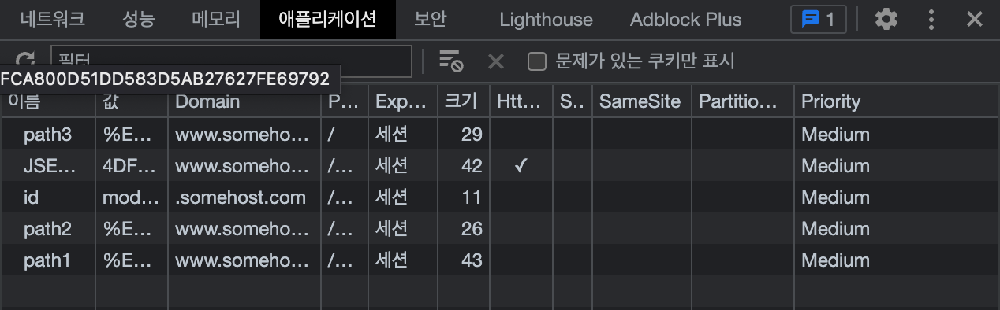

# 쿠키와 세션

## 비교
|       | 쿠키                                                                                                                                                                             | 세션                                                                                    |
|:------|:-------------------------------------------------------------------------------------------------------------------------------------------------------------------------------|:--------------------------------------------------------------------------------------|
| 저장 위치 | 웹 브라우저                                                                                                                                                                         | 서버                                                                                    |
| 보안    | 브라우저에 저장 및 네트워크를 통해 전달 Http 프로토콜의 경우 제 3자가 데이터를 볼수 있음                                                                                                                       | 서버에만 저장됨 중요한 데이터 저장하기 알맞음                                                          |
| 용량    | 한 도메인 당 20개, 한 쿠키 당 4KB 도메인 당 쿠키 20개 초과 시 가장 적게 사용된 쿠키부터 삭제(LFU) 4KB 이상 쿠키 생성 시 400 Error, 클라이언트 단에서 캐시 및 쿠키 비우기로 해결                                                     | 제한 없음                                                                                 |
| 지원 여부 | 브라우저에서 지원하지 않거나 막을 수 있음                                                                                                                                                        | 쿠키 설정 여부 상관 없이 사용 가능                                                                  |
| 공유    | 도메인을 사용해 여러 도메인 주소에 공유 가능                                                                                                                                                      | 여러 서버에 공유 불가능                                                                         |
| 활용처   | 1. 세션 관리: 로그인 정보 -> 도메인 주소 공유 활용 2. 개인화: 개인에게 적절한 페이지 표시 3. 트래킹: 사용자 행동 및 패턴 분석  1. ID 저장 및 로그인 상태 유지 2. 일주일 간 다시 보지 않기 3. 최근 검색 상품들 광고 추천 4. 비회원 쇼핑몰 바구니 | 1. 로그인 상태  사용자나 다른 누군가에게 노출되면 안되는 중요한 정보 남발 시 서버 과부하가 일어나므로 웹 설계 시 적절한 판단 필요 |

## 쿠키 옵션
### 요약
- 쿠키 옵션에는 이름, 값, Domain, Path, Expires, HttpOnly, Secure, SameSite 옵션이 있다
- SameSite는 동일한 도메인으로만 쿠키를 보낼지 여부를 정하는 옵션으로, XSS, CSRF 같은 수동적 공격을 방지하는데 필수로 알아야 하는 개념이다

---

### 쿠키와 헤더

- `HttpResponse.addCookie`로 쿠키를 추가하면 실제로 `Set-Cookie` 헤더를 통해 전달됨(JSP)
- 하나의 헤더는 하나의 쿠키를 전달

#### 구성

1. 이름
   - 쿠키 이름
2. 값
   - 쿠키 값
3. Domain
   - 쿠키가 적용되어야 하는 호스트
   - 미지정 시 현재 문서 URI을 기준으로 적용하나, 서브 도메인 미포함
   - 지정 시 서브 도메인도 포함됨
4. Path
   - 헤더를 보내기 전에 요청된 리소스에 있어야 하는 URL 경로
   - 특정 경로(+하위 경로)에서만 쿠키가 활성화되기를 원할 때 사용
5. Expires
   - Http 타임스탬프, 기록된 쿠키의 최대 생존 기간
   - 옵션 미지정 시 `세션 쿠키`로 지정됨 -> 클라이언트가 종료될 때 파기
   - `setMaxAge(0)` 쿠키 즉시 삭제
6. HttpOnly
   - JS의 API로 접근 불가, 오직 해당 쿠키 데이터가 전송만 가능하도록 함
   - XSS 방지를 위한 속성
   > #### XSS(Cross-site Scripting)
   > - 공격자가 상대 브라우저 내 스크립트가 실행되도록 함
   > - 세션을 가로채거나, 웹사이트 변조 및 악의적 콘텐츠 삽입을 통한 피싱 공격을 진행
7. Secure
   - 옵션 적용 시 Https 프로토콜 사용 시에만 전송됨
8. SameSite(중요)
   - 서버가 사이트 간 요청과 함께 쿠키를 보내선 안되는 경우도 있음
   - 사이트 간 요청 위조 공격에 대한 일부 보호 기능 제공
   > #### CSRF(Cross Site Request Forgery)
   > - 쿠키를 이용해 사용자 인증을 진행하는 웹사이트가 대상이 될 수 있는 수동적 공격 기법
   >   1. 유저는 공격 대상이 되는 사이트에 쿠키를 이용해 사이트 인증
   >   2. 인증을 했으므로 브라우저에는 쿠키가 남아 있는 상태
   >   3. 공격자는 피해자에게 공격 대상과 다른 도메인 사이트 링크를 누르도록 유도
   >   4. 링크를 눌러 받게 되는 HTML에는 공격 대상 사이트에 HTTP 요청을 보내는 부분이 존재
   >   5. 이 요청은 공격 대상이 되는 사이트에 관한 쿠키를 3-rd party 쿠키로 사용하게 되므로, 유저의 사용자 인증 관련 쿠키가 멋대로 사용됨
   >      - 3-rd party 쿠키: 사용자가 접속한 페이지와 다른 도메인으로 전송하는 쿠키(ex. `ex.com`의 `ex.com/domain`으로 보내는 쿠키)
   - 속성
     1. None
        - SameSite 미적용, 3-rd party 쿠키도 전송됨
     2. Strict
        - 1-st party 쿠키만 전송됨
     3. Lax
        - 보통 3-rd party 쿠키 미전송하나 몇가지 예외적 상황 존재
        - `Top Level Navigation`
          - Redirect 가능
          - img, iframe 태그에 삽입되어 보내지는 Http 요청
        - `안전한 Http`
          - 서버의 상태를 바꾸지 않을 것이라 기대되는 것
          - GET 가능
          - POST, DELETE 불가능
   - 관련 정책
     - 크롬은 SameSite를 가장 적극적으로 적용
       - 원래 명시하지 않은 쿠키는 None으로 동작
       - 20/02/04 크롬 80 버전 이후 Default가 Lax로 변경
     - 이로 인해 온라인 결제나 OAuth처럼 구현에 크로스 사이트 간 페이지 전환이 필요한 경우, 이러한 변경사항으로 인해 원래 제공하던 기능이 동작하지 않았음
     - `SameSite=None`으로 사용하려면 반드시 해당 쿠키는 Secure 쿠키여야함 -> Https 프로토콜로 동작
     - 크롬은 장기적으로 3-rd party 쿠키에 대한 지원을 단계적으로 제거할 예정
       - 모든 쿠키는 `SameSite=Strict`로 설정된 것처럼 동작하게 될 것
       - 어떤 서비스가 `ex1.com`, `ex2.com`로 동작한다 가정,
         - 브라우저는 두 도메인을 다른 도메인으로 인식
         - 모든 3-rd party 쿠키가 전송되지 않으면 이 두 도메인 사이를 왔다갔다 할 때마다 전송되지 않는 쿠키로 인해 문제 발생
     - 구글은 이로 인해 발생하는 문제 해결 방법으로 1-st party sets라는 표준 제안
       - 여러 개의 도메인을 동일한 사이트로 다룰 수 있도록 만드는 기술
       - 브라우저에게 `ex1.com`, `ex2.com`는 같은 서비스를 제공한다고 알려주면 이후에는 그 도메인을 같은 사이트로 관리
       - 아직까진 반대가 많아 표준 합의되진 않음

# Reference

[[Web] 쿠키와 세션](https://velog.io/@redgem92/Web-쿠키와-세션)

[[Network] 쿠키(Cookie)와 세션(Session)의 차이](https://sdevstudy.tistory.com/27)

[[Network] 쿠키 옵션의 역할](https://velog.io/@sms8377/Network-쿠키-옵션의-역할)

[쿠키란?](https://velog.io/@gonnnnn/쿠키란)

[브라우저 쿠키와 SameSite 속성 / seob.dev](https://seob.dev/posts/브라우저-쿠키와-SameSite-속성/)
