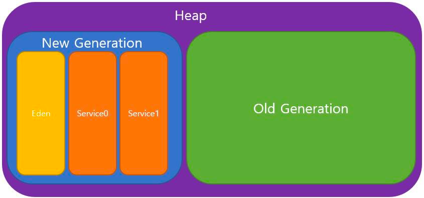

# Garbage Collector

## 요약
- Garbage Collector(GC)는 JVM에서 자동으로 heap 메모리를 관리하는 기능이다
- GC는 기본적으로 Mark and Sweep Compact 알고리즘을 거친다
  - Marking: GC Root로부터 참조되는 객체와 그 reachable 객체가 참조한느 객체를 찾는다
  - Sweep: Marking 이후 marking되지 않은 unreachable 객체를 메모리에서 해제한다
  - Compact: 살아 있는 영역을 조각 모음한다
- GC Root 대상은 heap 영역 내 다른 객체 참조가 있는 경우 stack 영역의 지역 변수, method 영역에 static 변수에 대한 참조가 있는 경우 그리고 JNI에 의해 생성된 객체에 의한 참조가 있는 경우다
- Heap 영역은 `Young`(Eden, Service0/1), `Old` Generation 영역으로 구성된다
  - MinorGC는 `Young` Generation에서 발생한다
  - MajorGC는 `Old` Generation에서 발생한다
- Stop-the-world(STW)는 GC 수행을 위해 모든 애플리케이션 스레드가 일시정지하는 현상이다
- GC 튜닝의 목적은 MajorGC의 STW 시간 단축이다
- GC 종류
  1. Serial GC: 싱글 스레드로 동작하는 GC
  2. Parallel GC: MinorGC에서만 멀티 스레드로 동작하는 GC
  3. Parallel Old GC: MajorGC에서도 멀티 스레드로 동작하는 GC
  4. Concurrent Mark and Sweep(CMS) GC: MajorGC에서 동시적으로 mark/sweep/compact를 거치며, 시스템 자원 소모가 커 JDK 1.14부터 사장되었다
  5. G1 GC: Heap 영역 전체를 1~32MB의 '동일한' 크기의 region으로 나눠 처리하는 GC다
  6. ZGC: Heap 영역을 small(2MB), medium(32MB), larg(2 * n MB)로 동적으로 region(ZPage)를 나눠 처리하는 GC다

---

- GC는 JVM에서 자동으로 heap 메모리를 관리하는 기능

## Mark and Sweep Compact

### 1. Marking
- GC Root로부터 참조되는 객체와 그 reachable 객체가 참조하는 객체를 찾음

### 2. Sweep
- Marking 과정이 끝나면 marking되지 않은 unreachable 객체를 메모리에서 해제

### 3. Compact
- 살아 남은 영역을 조각 모음

## GC Root 대상

1. Heap 영역 내 다른 객체 참조가 있는 경우
2. Stack 영역의 지역 변수, 파라미터에 대한 참조가 있을 경우
3. Method 영역의 static 변수에 의한 참조가 있을 경우
4. JNI(Java Native Interface)에 의해 생성된 객체에 의한 참조가 있을 경우

## GC 실행 과정

- Heap 여역은 Young Generation(Eden, Service 0, Service 1) 그리고 Old Generation으로 구성
  - MinorGC: Young Generation에서 발생하는 GC
  - MajorGC: Old Generation에서 발생하는 GC
---
1. 객체가 인스턴스화되면 `Eden` 영역에 생성
2. `Eden` 영역이 한계치 초과
   1. MinorGC 발생
   2. `Eden`에서 살아남은 객체들은 `Service0` 영역으로 이동
   3. 만약 `Eden` 영역의 살아있는 객체가 `Service`보다 클 경우 바로 `Old` 영역으로 이동
3. `Service 0` 영역의 한계치 초과
   1. MinorGC 발생
   2. 살아남은 객체들은 Service 1 영역 이동
   3. `Service` 영역 간 살아 남은 객체들의 이동이 반복되며, `Service` 영역 중 한 영역은 항상 비어 있게 됨
   4. 이처럼 MinorGC 발생 시 살아남은 객체들은 영역을 이동하면서 age-bit가 1씩 증가
4. `Promotion`: Age-bit가 MaxTenuringThreshold 설정 값 초과 시 Old Generation 이동

## Stop-the-world
- GC 발생 시 GC를 실행하는 스레드를 제외한 모든 애플리케이션의 스레드가 GC 종료 전까지 일시정지하는 것을 말함
- 모든 스레드가 GC 종료 전까지 일시정지되기 때문에 성능에 많은 영향을 끼침
  - MinorGC보다 실행 속도가 느린 MajorGC에서 문제가 발생
- MajorGC의 STW 시간을 줄이기 위한 알고리즘이 나오고 있음
- 보통의 경우, GC 튜닝은 **MajorGC의 STW 시간을 단축하는 작업**

## GC 종류

### Serial GC

- 싱글 코어에서 사용된 GC
- 싱글 스레드로 동작하기 때문에 STW 시간이 길고 느림
- 대신 시스템 자원을 덜 사용
- Mark and Sweep Compact 알고리즘 사용

### Parallel GC(JDK 1.7 ~)

- Minor GC에서만 멀티 스레드로 동작 => 속도 개선
- Mark and Sweep Compact 알고리즘 사용

### Parallel Old GC

- Major GC에서도 멀티 스레드로 동작
- Minor GC는 Mark and Sweep Compact 알고리즘 사용
- Major GC는 Mark and Summary Compact 알고리즘 사용
  > #### Sweep vs. Summary
  > - `Sweep`: 싱글 스레드가 old 영역 전체를 훑어 살아있는 객체만 찾아냄
  > - `Summary`: 멀티 스레드가 old 영역을 분리하여 훑음

### Concurrent Mark and Sweep(CMS) GC

- STW 방식이 매우 짧다는 장점이 있으나 그만큼 시스템 자원(메모리, CPU)를 많이 사용
- 더이상 메모리 할당이 어려울 때까지 Compaction을 미루기 때문에 더 긴 STW 발생
- JDK 1.14부터 사용 중지
---
1. Young Generation에선 Parllel GC와 동일
2. Old Generation에선 다음 과정을 거침
   1. Intial Mark`STW`
      - GC Rootdㅔ서 가장 가까운 객체 중 살아있는 객체를 찾아 marking -> `STW` 짧음
   2. Concurrent Mark
      - Initial Mark 단계에서 살아남은 객체의 참조를 따라가며 살아있는 객체를 찾음
      - 이때 여러 개의 스레드가 동작
   3. Remark`STW`
      - Concurrent Mark를 수행하는 동안 객체의 참조가 끊기거나 새롭게 생긴 객체가 없는지 다시 한번 확인
   4. Concurrent Sweep
      - 참조되지 않는 객체를 메모리에서 해제
      - 애플리케이션 스레드와 동시에 진행
   5. Compact`STW`
      - 최대한 미루다 더이상 메모리 할당이 어려울 경우 실행

### G1 GC(JDK 1.9 ~)

- Heap 영역 전체를 1~32MB의 동일한 크기의 region으로 나눔
- 각 region이 Eden, Survivor, Old, Available/Unused 역할 수행
  1. Eden: 다른 GC의 Eden과 동일, 새로 생긴 객체들 할당
  2. Survivor: 살아 있는 객체들이 할당
  3. Old: 오래 살아있는 객체들이 할당
  4. Humongous: region 크기의 50%가 넘는 큰 객체들 할당
  5. Available/Unused: 아직 사용되지 않는 영역
- Garbage가 꽉 찬 지역을 우선적으로 GC가 동작하게 됨
- Multi-core CPU, 대용량 메모리 시스템을 위한 GC
- 성능 튜닝
  - 튜닝의 목적은 GC에 걸리는 시간을 최소화하는 것
  - `-XX:InitiatingHeapOccupancyPercent`: IHOP(Marking에 해당하는 최저 임계치) 조절
  - `-XX:G1HeapRegionSize`: 지역당 하나의 사이즈(Default: 최대 heap / 2048)
  - `-XX:G1ReservePercent=10`: 공간 overflow 위험을 줄이기 위해 항상 여유 공간을 유지할 예비 메모리(백분율)
  - `-XX:G1HeapWastePercent=10`: 낭비할 heap 공간에 대한 백분율
---
1. G1 Young GC
   - 이저 GC들과 마찬가지로 객체는 제일 처음 Eden 지역에 생성
   - Minor GC를 거쳐 살아남은 객체들은 Survivor 지역으로 이동된 후 Eden 지역은 Available/Unused로 변경됨
2. G1 Old GC

   
   1. Initial Mark`STW`
      - Old region의 객체들이 참조하는 객체를 Survivor region에서 찾음
   2. Root Region Scan
      - 1번 과정에서 살아남거나 old generation의 객체로부터 참조되거나 참조된 객체로 mark된 객체가 있는 survivor region을 스캔
      - 애플리케이션 스레드와 동시 실행
   3. Concurrent Mark
      - 전체 heap에서 GC 대상이 될 region을 mark
   4. Remark`STW`
      - 3번 과정에서 GC 대상이라 판단된 region 메모리 해제 -> Available/Unused로 변경
   5. Clean up`STW`
      - 살아남은 객체가 가장 적은 region의 미사용 객체를 제거
   6. Copy`STW`
      - 5번 과정에서 완전히 비어지지 않은 region의 살아남은 객체들을 Available/Unused 지역으로 복사하여 Compaction 수행
      > #### Shenadonah GC
      > G1 GC에서 Copy 과정을 배제해 최적화 수행하는 GC로 보임. JDK 1.14부터 나왔으며 아직까진 Experimental 단계
      
### ZGC(JDK 1.11 ~)
- 대용량 메모리(8MB ~ 16TB)를 효율적으로 처리하기 위한 GC
  - STW 시간 10ms 미만
  - G1에 비해 애플리케이션 처리량이 15%이상 감소하지 않음
  - 즉, G1보다 짧은 레이턴시를 가지면서 부족하지 않은 처리율을 가짐

#### JDK별 버전 변화
- JDK 1.11: Linux/x64에 Experimental(최초 도입)
- JDK 1.14: 윈도우와 MacOS에 Experimental
- JDk 1.15: Production Ready

#### 동작 방식

- G1 GC와 유사, region 대신 ZPage라는 동적으로 사이즈(2의 배수 MB)를 생성 및 삭제하여 나눔
  
    
    - Small ZPage: 265K 이하 크기 객체 저장
    - Medium ZPage: 4MB 이하 크기 객체 저장
    - Large ZPage: 그 초과 크기, 하나의 객체만 저장(Large pages can only store exactly one object)
      - 이로 인해 Medimum ZPage 보다 작은 사이즈가 될 수 있음
      - ex. 6MB -> 4MB 이상이므로 6MB Large ZPage, 32MB의 Medium ZPage 보다 작음
- ZGC에서 compact 과정은 기존 ZPage의 빈 곳을 찾아 넣지 않음, 새로운 ZPage 생성 후 살아 있는 객체를 채움
  - 일반적으로 GC가 수행되면 heap 영역을 비우기 위해 살아있는 객체를 이동
  - 이때 위치시키기 위해 빈 공간을 찾아야하는데, 이는 새로운 영역을 할당해서 채우는 것보다 비용이 크므로 위 방식을 사용
  - 이때 이러한 생성 -> 이동 과정으로 인해 문제 발생
    
    
    - `Region 2`가 GC 대상이 되어 내부 객체를 `Region 3`로 이동
    - GC 진행 후 `Region 2` 영역 삭제, `Region 1`에서의 최초 `f` 참조 변수는 `Region 3`의 새로 생성된 객체를 가리켜야 함(remapping)
    - 이 때 만약 remapping 완료 전에 `f` 객체의 상태가 변경(f = 3)되면 값 불일치가 나타남
    - 이러한 compact 과정에서의 문제 해결을 위해 몇 가지 전략을 사용
      1. **Colored Pointers**: Concurrent GC를 사용한 객체의 GC 메타데이터를 객체 주소에 저장
          
         - GC 메타데이터를 객체의 메모리 주소에 표시
         - ZGC는 64-bit를 활용, 메모리의 주소 파트로 42-bit(4TB)를 사용하고 다른 4-bit를 GC 메타데이터를 저장하는 용도로 씀
           - `Finalizable`: finalizer를 통해서만 참조되는 객체의 garbage
           - `Remapped`: 재배치 여부 판단 Mark
           - `Marked 0/1`: Live Object
      2. **Loaded Barrier**: JIT 컴파일러를 사용해 GC를 돕기 위해 작은 코드 주입
         - 애플리케이션 스레드는 heap 메모리 내 객체 참조 시 만나게 됨
         - 주소의 Colored Pointer가 `bad color`인지 확인, 객체를 상황에 따라 mark/relocate/remapping 처리
         > 참조 시 항상 `loaded barrier`를 거쳐 최대 4%까지 성능저하가 있으나, 전체적으로 다른 GC 성능을 보면 결과적으로 크게 이득
- 진행 과정
  
  - 크게 `Marking`(ZPhaseMark, ZPhaseMarkCompleted) 그리고 `Relocating`(ZPhaseRelocate) 2단계를 거침
---
  1. Mark Start`STW`
     - STW 발생, 각 스레드마다 가진 로컬 변수 스캔
     - GC Root Set 생성
     - 일반적으로 GC Root 개수는 적어서 STW가 짧음
  2. Concurrent Marking
     
     - Root Set에서 시작해 객체 그래프를 탐색하여 도달할 수 있는 객체는 살아 있는 것으로 표시(Mark)
     - 도달하지 못한 객체는 garbage로 판단
       - ZGC는 각 page의 livemap이라 불리는 곳에 살아있는 객체 정보를 저장
         - Livemap: 주어진 인덱스 객체가 strongly-reachable하거나 final-reachable 등의 정보를 비트맵 형태로 저장
       - 이 단계에서 `loaded barrier`를 통해 객체 참조에 대해 테스트 진행
       - 참조가 `bad color` 시 show_path로 진입 후 markingdㅡㄹ 위해 thread-local marking buffer(큐)에 추가
         - 이 버퍼가 가득차면 GC 스레드가 이 버퍼의 소유권을 가져옴
         - 버퍼에서 도달할 수 있는 모든 객체를 재귀적으로 탐색
     - 즉, marking은 주소로 버퍼로 넣기만 하고 GC 스레드가 객체 그래프를 탐색하고 livemap을 업데이트하는 역할을 함
     - 이 과정이 끝나면 살아 있는 객체와 garbage 객체로 나뉨
  3. Mark End`STW`
     - STW 발생 후 thread-local의 bmarking buffer를 탐색하여 비움
     - 이 때 아직 marking하지 않은 참조들 중에 큰 하위 객체 그래프 발견 시, 처리해야하는 시간이 많음 -> STW 오래 걸림
     - ZGC는 1ms 후에 이 단계를 끝내고 Concurrent marking 단계로 돌아간 다음 다시 Mark End 단계로 진입
       - 전체 그래프가 모두 통과할 때까지 반복
  4. Concurrent Processing(ZPhaseRelocating)
     1. Concurrent Reset Relocation Set
     2. Concurrent Destroy Detached Pages
        - 비어 있거나 garbage로 가득찬 Page는 메모리를 해제, 불필요한 클래스는 unload
     3. Prepare Relocation Set
        
         - `Relocation Set`에 들어 있는 page 내 객체 대상으로 `forwarding table` 할당
           - `Relocation Set`: Garbage 대상이라 비워져야 하는 Page들의 Set
           - `Forwarding table`: 기본적으로 객체가 재배치된 주소를 저장하는 hash map
  5. Relocation Start`STW`
     - STW 발생시키고 relocation set의 page에 있는 객체 중 GC Root에서 참조되는 것들은 일괄 relocation/remapping
  6. Concurrent Relocation
     
     - GC 스레드는 relocation set에 살아있는 객체를 탐색
     - 아직 relocate 되지 않은 모든 객체를 새로운 ZPage로 재배치
       - `Loaded Barrier`를 통해 일어날 수 있음
     - 어떤 객체는 순간적으로 GC 스레드 및 애플리케이션 스레드에 의해 동시에 재배치되는 경우가 있음
     - 이 경우, 처음 재배치한 스레드가 win -> Atomic CAS Operation을 통해 winner 결정
     - Relocation 단계는 GC 스레드가 relocation set을 마지막까지 모두 따라가는 것을 마치는 즉시 완료
  7. Concurrent Remapping
     - Relocation이 완료되었으니 old 객체가 아닌 새로운 객체로 참조를 변경(Remapping)
     - Remapping은 애플리케이션 스레드의 `loaded barrier`에 의해 진행되나, 다음 GC cycle 전까지 모두 완료되지 않을 수 있음
       - 즉, 다음 GC Cycle의 marking 단계에서도 진행될 수도 있기에 GC Marking 단계에서 필요 시 remapping을 위한 `forward table`까지 확인해야 함
     - 이러한 흐름은 객체 참조의 두개의 marking bit(`Marked 0`, `Marked 1`)와 관련됨
       - Marking 단계는 `Marked 0` 또는 `Marked 1`을 번갈아 사용
       - Relocation 단계 이후에 아직 remapping 되지 않은 참조가 존재할 수 있음
       - 마지막 marking wㅜ기 세트의 bit가 여전히 남아 있을 수 있음
     - ZGC가 초기화되었을 땐 Marked 0을 먼저 사용하고, address view는 `remapped`를 사용

# Reference

[Java GC Gargabe Collection 알짜만 빼먹기 / 알고리즘 / 종류 / 모니터링 VisualVM](https://aljjabaegi.tistory.com/636)

[JAVA의 Garbage Collection을 소개합니다](https://preamtree.tistory.com/118)

[ZGC에 대해서](https://www.blog-dreamus.com/post/zgc에-대해서)

[JVM과 Garbage Collection - G1GC vs ZGC](https://huisam.tistory.com/entry/jvmgc)
