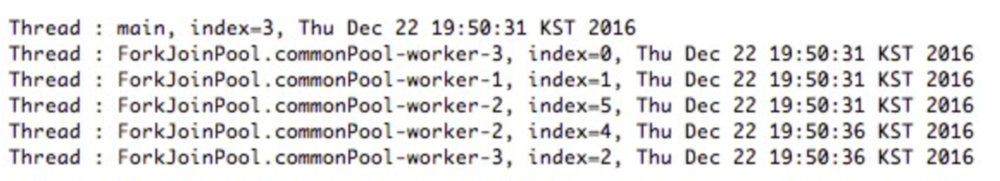

# Lambda & Stream & Optional

## 요약

- Lambda는 메서드를 하나의 식`expression`으로 표현한 것이다
  - 코드가 간결해지고, 불필요한 로직 삭제가 가능하며, 필요한 정보만 사용하는 방식을 통해 퍼포먼스를 향상시킨다
  - 그러나 매개변수를 가진 코드 블록으로, 런타임 시 익명 구현 객체를 생성하며, 이는 특성 상 함수 외부의 캡처를 위한 시간적, 논리적 제약적 요소를 고려해야 한다
- Stream은 다양한 데이터 소스를 표준화된 방법으로 다루기 위한 라이브러리로, 데이터 소스를 추상화하고 데이터를 다룰 때 자주 쓰는 메서드를 정의해 놓았다
  - 여러 연산을 조립해서 사용할 수 있으며 병렬로 처리가 가능하기 때문에 성능이 좋다
  - 하지만 분할이 잘 이루어질 수 있는 데이터 구조 또는 연산 작업이 독립적이면서 CPU 사용이 높은 작업에 적합하다
- Optional은 null이 올 수 있는 값을 감싸는 래퍼 클래스다
  - 참조 시 NPE가 발생하지 않도록 도와준다
  - null 반환 시 오류 발생 가능성이 매우 높을 때, '결과 없음'을 명시하기 위해 메서드 반환 타입으로 사용되도록 제한적인 경우로 설계되었다

---

## Lambda
- 메서드를 하나의 식`expression`으로 표현한 것
- 객체지향 언어보다는 함수형 프로그래밍에 가까움
- 함수르 간략하면서도, 명확한 식으로 표현할 수 있도록 해줌
- 메서드를 람다식으로 표현하면 메서드의 이름 및 반환 값이 없어짐 => 익명 함수
- 람다 식의 형태는 매개변수를 가진 코드 블록, **런타임 시에는 익명 구현 객체를 생성**

### 사용하는 이유
1. 코드의 간결성
2. 효율적인 람다 식을 통해 불필요한 루프 문 삭제 가능
3. 동일한 함수를 재활용할 수 있는 여지가 커짐
4. 필요한 정보만을 사용하는 방식을 통해 퍼포먼스 향상
   - 지연 연산 방식(Stream, Chaining)을 통해 효율적 퍼포먼스 기대
   - 이 경우 메모리 상의 효율성 및 불필요한 연산 배제 가능

### 주의점
1. 모르는 사람에겐 가독성이 떨어질 수 있음
2. 어떤 방법으로 만들어도 모든 원소를 순회하나는 경우 조금 느릴 수 있음
   - 최종 출력되는 바이트 코드나 어셈블리 코드는 단순 반복문보다 몇 단계를 더 거침
3. 익명 함수 특성 상, 함수 외부의 캡처를 위해 캡처하는 시간 제약, 논리 제약적인 요소도 고려해야 함
   - 디버깅 시 함수 콜스택 추적이 어려움

## Stream
- 다양한 데이터 소스를 표준화된 방법으로 다루기 위한 라이브러리
- 데이터 소스를 추상화하고, 데이터를 다루는데 자주 사용되는 메서드들을 정의해 놓았음
- 예시
  ```java
  // 이전 방식
  Arrays.sort(strArr);
  Collections.sort(strList);
  
  for(String str : strArr) {
  System.out.println(str);
  }
  
  for(String str : strList) {
  System.out.println(str);
  }
  
  // 스트림 방식
  Stream<String> strStreamArr = Arrays.stream(strArr);
  Stream<String> strStreamList = strList.stream();
  
  strSteramArr.sorted().forEach(System.out::println);
  strStreamList.sorted().forEach(System.out::println);
  ```
- Stream이 제공하는 다양한 연산을 이용해 복잡한 작업들을 간단하게 처리 가능
  - `중간 연산`: 연산 결과가 스트림, 연속해서 수행 가능
    ```java
    Strineg[] strArr = {"a", "b", "c"};
    
    Stream<String> stream = Stream.of(strArr);
    Stream<string> distinctedStream = stream.distinct();
    ```
   - `최종 연산`: 연산 결과가 Stream이 아님, Stream 요소를 소모하기 때문에 '단 한번만'  가능
  
    | 최종연산                                                                                                   | 설명 |
    |--------------------------------------------------------------------------------------------------------| --- |
    | void forEach(Consumer<? super T> action)                                                               | 각 요소에 지정된 작업 수행 |
    | long count()                                                                                           | 스트림 요소 개수 |
    | Optional<T> max(Comparator<? super T> comparator)                                                      | 스트림 최댓값 |
    | Optional<T> min(Comparactor<? super T> comparator)                                                     | 스트림 최솟값 |
    | Optional<T> findAny()                                                                                  | 아무거나 하나 |
    | Optional<T> findFirst()                                                                                | 첫번째 요소 |
    | boolean allMatch(Predicate<T> p)                                                                       | 모두 만족 여부 |
    | boolean anyMatch(Predicate<T> p)                                                                       | 하나라도 만족 여부 |
    | boolean noneMatch(Predicate<T> p)                                                                      | 모두 만족하지 않는지 여부 |
    | Object[] toArray()                                                                                     | 스트림의 모든 요소를 Object 타입 배열로 반환 |
    | T reduce(T identity, BinaryOperator<T> accumulator)                                                    | 스트림 요소를 하나씩 줄여가면서 계산 |
    | <R, A> R collect(Collector<? super T,A,R> collector)                                                   |요소 수집, 그룹핑이나 결과를 컬렉션에 담아 반환하는데 사용|
    | <R, A> R  collect(Supplier<R> supplier, BiConsumer<R,? super T> accumulator, BiConsumer<R,R> combiner) |  |

### 장점
1. 여러 연산을 조립해서 사용할 수 있으며, 병렬로 처리하기 때문에 성능이 좋음
2. 분할이 잘 이루어질 수 있는 데이터 구조 또는 연산 작업이 독립적이면서 CPU 사용이 높은 작업에 적합

### 주의점
1. 스트림 대표적 특징으로 병렬 연산이 있으나, 공유된 Thread Pool을 사용하기 때문에 성능 장애 유발 가능성 존재
     ```java
     dealmaxList.parallelStream().forEach(index -> {
         System.out.prinltn("Thread : " + Thread.currentThread().getName() + ", index=" + index + ", " + new Date();
                
         try {
            Thread.sleep(5000);
         } catch(InterruptedException e) {}
         });
     ```
     
   - 내부적으로 Paralled Stream이 `Common ForkJoinPool`을 사용하게 됨 -> 프로세서 당 1개의 Thread를 사용하도록 되어 있음
   - 이는 `ForkJoinPool`을 사용하는 다른 Thread에 영향을 줄 수도 있고, 받을 수도 있게 됨
   - `ForkJoinPool` 특성 상 나눠지는 Job은 균등하게 처리되어야 함
     - `ForkJoinPool`은 분할 정복 알고리즘과 유사한 방식으로 동작
     - 병렬로 처리되는 작업이 독립적이지 않으면, 수행 성능에 영향이 있을 수 있음 -> `sorted`, `distinct`
       - 내부적으로 상태에 대한 변수를 각 Job이 동기화될 수 있음 => 엄청난 성능 저하 야기

## Optional

> _Optional is intended to provide a limited mechanism for library method return types where there needed to be a clear way to represent “no result," and using null for such was overwhelmingly likely to cause errors. - Brian Goetz(Java Architect) -_
>
> ---
> Optional은 null을 반환하면 오류가 발생할 가능성이 매우 높은 경우에 '결과 없음'을 명확하게 드러내기 위해 메서드의 반환 타입으로 사용되도록 매우 제한적인 경우로 설계되었다.

- `null` 반환 시 오류가 발생할 가능성이 매우 높음
- 이때 '결과 없음'을 명확하게 드러내기 위해 메서드의 반환 타입으로 사용되도록 매우 제한적인 메커니즘으로 제공되도록 함

### 장점
1. 코드가 `null-safe`
2. 가독성도 좋아지며, 애플리케이션이 안정적여짐

### 주의점

1. `Optional` 목적에 맞게 사용해야 함 -> 남발 시 부작용 발생
2. `NPE` 대신 `NoSuchElementException` 발생 -> 이전에 없었던 새로운 문제 발생
---
- 대표적인 문제가 직렬화
- `Optional`은 직렬화를 지원하지 않음 -> 캐시, 메시지 큐 등과 연동 시 문제 발생
  ```java
  public class User implements Serializable {
    Optional<String> name;           // 직렬화 안됨!!
  }
  ```
- 코드 가독성을 떨어뜨림
  ```java
  // 다시 NPE를 유발...!
  public void temp(Optional<User> optionalUser) {
    User user = optionalUser.orElseThrow(IllegalStateException::new);
  }
  
  // 다음과 같이 수정해야 하나, 오히려 값 유무를 2번 검사하게 되어 단순 null 사용했을 때보다 코드가 복잡해짐
  public void temp(Optional<User> optionalUser) {   
    if(optionalUser != null && optionalUser.isPresent()) [
        // 후처리 진행
    }
    throw new IllegalStateException();
  }
  ```
- 시간, 공간적 비용 증가
  - 공간적 비용: `Optional`은 객체를 감싸는 컨테이너, 이 자체를 저장하기 위한 메모리가 추가로 필요
  - 시간적 비용: `Optional` 안에 있는 객체를 얻기 위해선 Optional 객체를 통해 접근해야함 -> 접근 비용 증가

### 사용법

> *It was not to be a general purpose Maybe type, as much as many people would have liked us to do so. Our intention was to provide a limited mechanism for library method return types where there needed to be a clear way to represent “no result”… - Brain Goetz-*
>
> ---
>
> `Optional`은 많은 사람들이 우리(자바 언어 설계자)에게 기대했던 범용적인 `Maybe` 타입과 다르다. 우리의 의도는 라이브러리 메서드 반환 타입으로 “결과 없음”을 표현할 필요가 있는 곳에서 제한적으로 사용할 수 있도록 하는 것이었다.

#### 요약본
> 1. `isPresent()-get()` 대신 `orElse()`, `orElseGet()`, `orElseThrow()`
> 2. `orElse(new ...)` 대신 `orElseGet(() -> new ...)`
> 3. 값 얻을 목적이라면 `Optional` 대신 `null` 비교
> 4. `Optional` 대신 비어있는 컬렉션 반환
> 5. `Optional`을 필드로 사용 금지
> 6. `Optional`을 생성자나 메서드 파라미터로 사용 금지
> 7. `Optional`을 컬렉션 원소로 사용 금지
> 8. `of()`, `ofNullable()` 혼동 주의
> 9. `Optional<T>` 대신 `OptionalInt`, `OptionalLong`, `OptionalDouble`

---

#### 1. `isPresent()-get()` 대신 `orElse()`, `orElseGet()`, `orElseThrow()`

```java
// 안 좋음
Optional<Member> member = ...;
if (member.isPresent()) {
    return member.get();
} else {
    return null;
}

// 좋음
Optional<Member> member = ...;
return member.orElse(null);


// 안 좋음
Optional<Member> member = ...;
if (member.isPresent()) {
    return member.get();
} else {
    throw new NoSuchElementException();
}

// 좋음
Optional<Member> member = ...;
return member.orElseThrow(() -> new NoSuchElementException());
```

#### 2. `orElse(new ...)` 대신 `orElseGet(() -> new ...)`
```java
// 안 좋음
Optional<Member> member = ...;
return member.orElse(new Member());  // member에 값이 있든 없든 new Member()는 무조건 실행됨

// 좋음
Optional<Member> member = ...;
return member.orElseGet(Member::new);  // member에 값이 없을 때만 new Member()가 실행됨

// 좋음
Member EMPTY_MEMBER = new Member();
...
Optional<Member> member = ...;
return member.orElse(EMPTY_MEMBER);  // 이미 생성됐거나 계산된 값은 orElse()를 사용해도 무방
```
- `orElse(new ...)`에서 `...`는 `Optional` 값에 있든 없든 무조건 실행됨
- 따라서 `...`가 새로운 객체를 생성하거나 새로운 연산을 수행하는 경우에 `orElseGet()`을 사용
  - `orElse()`의 매개변수는 객체 그 자체이므로 생성이 일어남
  - `orElseGet()`의 매개변수인 `Supplier`는 함수이며, `Optional`에 값이 없을 때만 실행되어 객체가 생성

#### 3. 값 얻을 목적이라면 `Optional` 대신 `null` 비교
```java
// 안 좋음
return Optional.ofNullable(status).orElse(READY);

// 좋음
return status != null ? status : READY;
```

- `Optional`은 비용이 큼
- 단순히 값 또는 `null`을 얻을 목적이라면 `null` 비교

#### 4. `Optional` 대신 비어있는 컬렉션 반환
```java
// 안 좋음
List<Member> members = team.getMembers();
return Optional.ofNullable(members);

// 좋음
List<Member> members = team.getMembers();
return members != null ? members : Collections.emptyList();
```
- `Optional`은 비용이 큼
- 그리고 컬렉션은 `null`이 아니라 비어있는 컬렉션을 반환하는 경우가 좋을 때가 많음
- 따라서 컬렉션은 `Optional`로 감싸서 반환하지 말고 비어있는 컬렉션 반환

#### 5. `Optional`을 필드로 사용 금지
```java
// 안 좋음
public class Member {

    private Long id;
    private String name;
    private Optional<String> email = Optional.empty();
}

// 좋음
public class Member {

    private Long id;
    private String name;
    private String email;
}
```
- `Optional`은 필드에서 사용할 목적으로 만들어지지 않음
- `Serializable`을 구현하지 않았으므로 사용 금지

#### 6. `Optional`을 생성자나 메서드 파라미터로 사용 금지
```java
// 안 좋음
public class HRManager {
    
    public void increaseSalary(Optional<Member> member) {
        member.ifPresent(member -> member.increaseSalary(10));
    }
}
hrManager.increaseSalary(Optional.ofNullable(member));

// 좋음
public class HRManager {
    
    public void increaseSalary(Member member) {
        if (member != null) {
            member.increaseSalary(10);
        }
    }
}
hrManager.increaseSalary(member);

```
- `Optional`을 생성자나 메서드 인자로 사용 시, 호출할 때마다 `Optional`을 생성해서 인자로 전달해줘야 함
- 하지만 호출되는 쪽(API, 라이브러리 메서드)에서는 인자가 `Optional`이든 아니든 언제나 null 체크하는 것이 안전
- 따라서 굳이 비싼 `Optional`을 인자로 사용하지 말고 호출되는 쪽에 `null` 체크 책임을 두는 것이 좋음

#### 7. `Optional`을 컬렉션 원소로 사용 금지
```java
// 안 좋음
Map<String, Optional<String>> sports = new HashMap<>();
sports.put("100", Optional.of("BasketBall"));
sports.put("101", Optional.ofNullable(someOtherSports));
String basketBall = sports.get("100").orElse("BasketBall");
String unknown = sports.get("101").orElse("");

// 좋음
Map<String, String> sports = new HashMap<>();
sports.put("100", "BasketBall");
sports.put("101", null);
String basketBall = sports.getOrDefault("100", "BasketBall");
String unknown = sports.computeIfAbsent("101", k -> "");
```
- 컬렉션에는 많은 원소가 들어갈 수 있음
- 따라서 비싼 `Optional` 사용보단 원소 꺼낼 때나 `null` 체크하는 것이 좋음
  - 특히 `Map`은 `getOrDefault()`, `putIfAbsent()`, `computeIfAbsent()`, `computeIfPresent()` 처럼 `null` 체크가 포함된 메서드 제공
  - 차라리 `Map`이 제공하는 메서드를 사용하는 것이 좋음

#### 8. `of()`, `ofNullable()` 혼동 주의
```java
// 안 좋음
return Optional.of(member.getEmail());  // member의 email이 null이면 NPE 발생

// 좋음
return Optional.ofNullable(member.getEmail());


// 안 좋음
return Optional.ofNullable("READY");

// 좋음
return Optional.of("READY");
```
- `of(X)`는 `X`가 `null`이 아님을 확신할 때만 사용해야 함 -> `X`가 `null`이면 `NPE` 발생
- `ofNullable(X)`는 `X`가 `null`일 수도 있을 때만 사용

#### 9. `Optional<T>` 대신 `OptionalInt`, `OptionalLong`, `OptionalDouble`
```java
// 안 좋음
Optional<Integer> count = Optional.of(38);  // boxing 발생
for (int i = 0 ; i < count.get() ; i++) { ... }  // unboxing 발생

// 좋음
OptionalInt count = OptionalInt.of(38);  // boxing 발생 안 함
for (int i = 0 ; i < count.getAsInt() ; i++) { ... }  // unboxing 발생 안 함
```
- `Optional`에 담길 값이 `int`, `long`, `double` 시, Boxing/Unboxing이 발생하는 `Optional<T>` 사용하지 않아야 함

# Reference

[Chapter 14 람다와 스트림 | Java Study Group](https://rebeccacho.gitbooks.io/java-study-group/content/chapter14.html)

[java8 lambda, stream(람다,스트림) 란? 장점, 단점?](https://devharam.tistory.com/14)

[](https://namu.wiki/w/람다식)

[자바8 Streams API 를 다룰때 실수하기 쉬운것 10가지](https://hamait.tistory.com/m/547)

[Java8 Parallel Stream, 성능장애를 조심하세요!](https://m.blog.naver.com/tmondev/220945933678)

[[Java] 언제 Optional을 사용해야 하는가? 올바른 Optional 사용법 가이드 - (2/2)](https://mangkyu.tistory.com/203)

[Java Optional 바르게 쓰기](https://homoefficio.github.io/2019/10/03/Java-Optional-바르게-쓰기/)