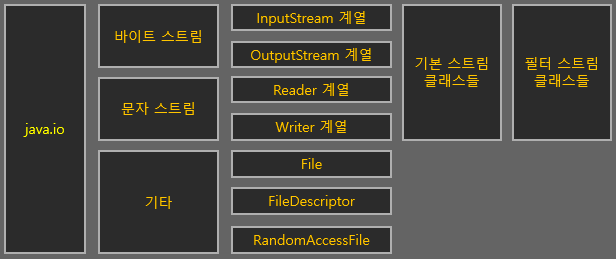
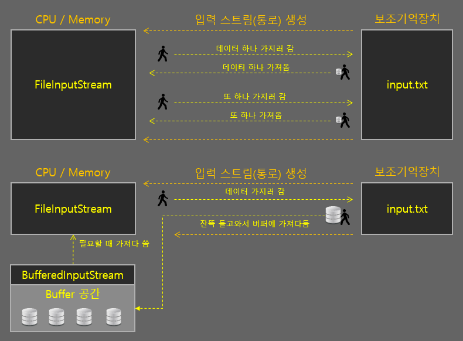
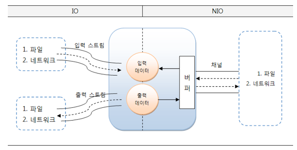
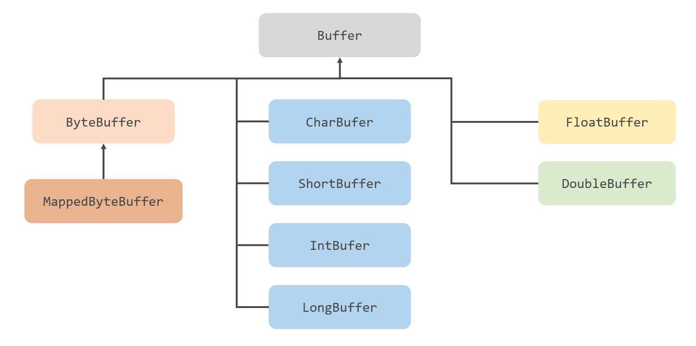
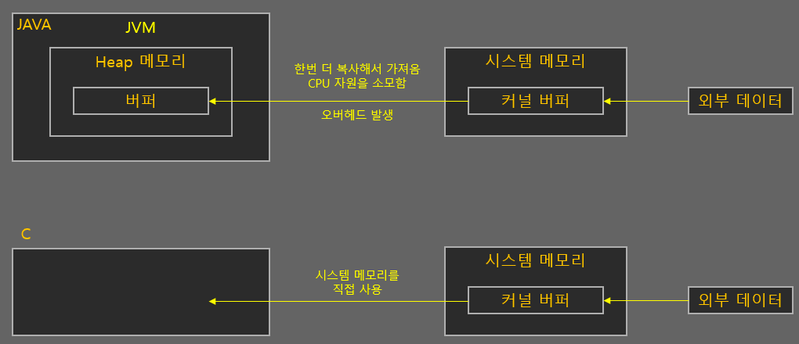
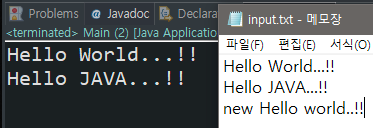
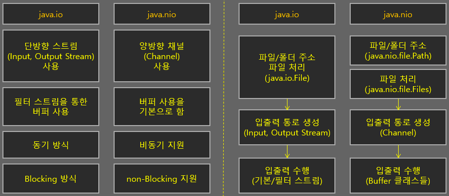

# io vs. nio vs. nio2

## 요약

---

## java.io

- 스트림`Stream`이라는 단방향 통로를 생성해서 외부 데이터와 통신하는 구버전 입출력 패키지
- 입력과 출력 스트림이 구분되어 있음 -> 데이터를 읽기 위해 입력 스트림, 쓰기 위해 출력 스트림을 생성

### 스트림
> 💡스트림`Stream`: 하나의 '흐름', 데이터를 앞뒤로 왔다갔다하며 필요한 데이터를 뽑는게 아닌, 0~데이터의 끝`EOF`까지 순서대로 이동하여 가져옴, 즉 한번 읽고 나면 다시 되돌아갈 수 없음
- 읽은 데이터를 즉시 처리하기 때문에 스트림으로부터 입력된 전체 데이터를 별도로 저장해야 함
- 그렇지 않으면 입력된 데이터의 위치를 이동해 가면서 자유롭게 이용할 수 없음
- 또한 스트림 종류마다 특정 단위로 입출력을 수행할 수 밖에 없음
  - `ByteStream`: 1-byte 단위로 데이터 입출력 수행 => `InputStream`, `OutputStream`
  - `CharacterStream`: 문자 단위`2-byte`로 데이터 입출력 수행 => `Reader`, `Writer`

### 블로킹(Blocking) 방식
- 입력 스트림의 `read()`를 호출하면 데이터가 입력되기 전까지 Thread는 대기 상태`Blocking`가 됨
- 출력 스트림의 `write()`를 호출하면 데이터 출력 전까지  Thread는 대기 상태`Blocking`가 됨
- 대기 상태가 되면 다른 일을 할 수 없고, 이를 빠져나오기 위한 인터럽트`Interrupt`도 할 수 없음
- 대기 상태를 빠져나오는 유일한 방법은 **스트림을 닫는 것**

### 필터 스트림의 버퍼 클래스

- 기본 스트림은 특정 단위로 밖에 읽지 못해 스트림은 처리 속도가 느림
- 이를 해결하기 위해 버퍼`Buffer` 개념을 도입, 기본 스트림에 필터 스트림의 버퍼 클래스를 사용해 속도를 높임
    - 버퍼링`Buffering`: **임시 공간에 데이터를 한번에 담고 한번에 처리하는 것**
    - CPU의 연산 속도는 입출력 속도보다 빠르기 때문에 입출력 속도에 맞춰 움직이면 비효율적임
    - 따라서 여러 입출력 연산을 하는 것보다 입출력 한번에 여러 데이터를 버퍼에 쌓아 가져오는 것이 빠름  
- 이미 기존 클래스로 만들어진 프로그램에 영향을 주지 않기 위해 해당 기능들은 새로운 패키지나 클래스로 만듦

### 기본 스트림과 버퍼 스트림 예시
```java
public class Main {
    
    public static void main(String[] args) {
        File file = new File("input.txt");
        // 기본 스트림
        try (FileInputStream fis = new FileInputStream(file)) {
            System.out.println((char)fi.read());
        } catch (Exception e) {
            e.printStackTrace();
        }
        
        // 버퍼 스트림, 기본 스트림을 인자로 받음
        try (BufferedInputStream bfs = new BufferedInputStream(new FileInputStream(file))) {
            System.out.println((char)bfs.read());
        } catch (Exception e) {
            e.printStackTrace();
        }
    }
}
```

## java.nio
- Java 4부터 새로운 입출력`New Input/Output`이라는 의미로 포함됨
- 이후 Java 7부터 `io`와 `nio` 사이 일관성 없는 클래스 설계를 바로 잡고 비동기 채널 등의 네트워크 지원을 강화한 `nio2`가 추가됨
- `nio2`로 패키지를 따로 만들지 않고 `nio` 하위 패키지에 통합됨 -> `nio`와 `nio2`를 나눠서 생각하지 않아도 됨

### 채널(Channel)
- 스트림을 사용하는 io와 달리 채널`Channel` 기반으로 동작
  - 채널: 양방향으로 입출력이 가능한 통로, 입력과 출력을 위한 별도의 채널을 만들 필요가 없음
  - 저레벨 언어가 가진 기술을 적용해서 속도도 기존 대비 빨라짐



- `nio`는 기본적으로 버퍼를 사용하여 입출력을 수행
- 채널은 버퍼에 저장된 데이터를 출력하고, 입력된 데이터를 버퍼에 저장함 => 버퍼 내에서 데이터 위치를 이동해가며 필요한 부분만 읽고 쓸 수 있음

### 블로킹(Blocking), 넌블로킹(Non-blocking)
- `nio` 패키지는 블로킹과 넌블로킹 방식을 둘 다 지원
- 블로킹의 경우 Thread를 인터럽트해서 빠져나올 수 있음
- 넌블로킹 시 입출력 작업 시 Thread가 블로킹되지 않음
  - 입출력 작업 준비가 완료된 채널만 선택해서 작업 Thread가 처리하기 때문에 블로킹되지 않음
  - `nio` 넌블로킹의 핵심 객체는 멀티플렉서`Multiplexor`와 셀렉터`Selector`
    - 셀렉터: 복수 개의 채널 중에 준비완료된 채널을 선택하는 방법을 제공
- 이러한 특성상, nio은 파일 입출력보단 **네트워킹**에서 더 효율적
  - 파일 입출력은 어차피 논블로킹이 지원되지 않음, 버퍼를 사용하는 정도의 효과밖에 없음

### java.nio.Buffer

- java.io 필터 스트림의 버퍼 클래스와 같이 버퍼를 사용해서 파일 입출력을 사용한다고 볼 수 있음
- 여기서 `ByteBuffer.allocateDirect(int capacity)` 생성한 버퍼는 `시스템의 커널 버퍼`를 사용 -> 입출력 속도 향상


- 커널 버퍼: OS가 관리하는 메모리 영역에 생성되는 버퍼 공간
  - Java 특성상 외부 데이터를 가져올 땐 `OS의 메모리 버퍼 -> JVM 내 버퍼` 과정으로 데이터를 옯겨야 함 => C에 비해 입출력 속도 느림
  - 이러한 단점 개선을 위해 나온 기능
  - 내부적으로 C언어를 호출, 시스템 메모리 영역을 사용
  - 하지만 내부적 과정이 복잡해서 버퍼 공간 생성 후 해제 속도가 느려, **한번 만들어서 오래 사용해야할 때 활용하는 것이 좋음**

#### ByteBuffer.allocateDirect() 예시
```java
public class Main {
    
    public static void main(String[] args) {
        String str = "";
        
        Path input = Paths.get("input.txt");
        try (FileChannel in = FileChannel.open(input, StandardOption.READ, StandardOption.WRITE)) {
            // ByteBuffer 생성
            ByteBuffer buf = ByteBuffer.allocateDirect(100);
            
            // 파일 내용 끝날 때까지 파일 내용 읽기
            int count = 0;
            while (count >= 0) {
                count = in.read(buf);
                buf.flip();
                str += Charset.defaultCharset().decode(buf).toString();
                buf.clear();
            }
            
            // 파일 쓰기
            String str2 = "\nnew Hello World..!!";
            buf = Charset.defaultCharset().encode(str2);
            count = in.write(buf);
        } catch (Exception e) {
            System.out.println("예외 발생");
        }

        System.out.println(str);
    }
}
```



## io, nio 정리



# Reference

[[Java] IO와 NIO의 차이점? / IO와 NIO의 선택](https://dev-coco.tistory.com/42)

[외부 데이터 입출력_io / nio / nio2 [1/3]](https://codevang.tistory.com/154)

[[Java] NIO - 버퍼](https://velog.io/@mmy789/Java-NIO-3)