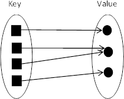
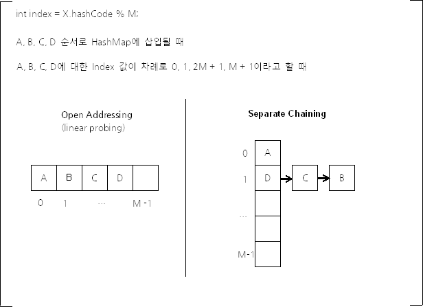
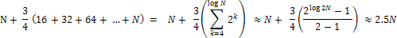

# Hashtable vs. HashMap vs. ConcurrentHashMap

## 요약

- Hashtable, ConcurrentHashMap은 동기화 과정을 거쳐 thread-safe하고, 키와 값을 null로 가질 수 없다
- HashMap은 동기화 과정을 거치지 않기 때문에 thread-safe하지 않으나 성능상 이점이 있으며, 키와 값을 null로 가질 수 있다
- HashMap은 보조 해시 함수를 통해 내부 associate array에 균등하게 데이터를 분포하면서, 해시 충돌을 대비해 데이터 수에 따라 링크드 리스트 또는 트리 구조로 데이터를 저장하기 때문에 충돌 방지 및 속도를 개선시킨다

---

## 공통점
- Java의 `Map` 인터페이스를 상속한 구현체 -> `<Key, Value>`로 묶어서 관리하는 자료구조
- 배열이 인덱스`Index`를 통해 데이터를 찾는다면, 이는 키`Key`를 통해 데이터를 찾음

## Hashtable
```java
public class Hashtable<K,V> extends Dictionary<K,V> implements Map<K,V>, Cloneable, java.io.Serializable {
    ...
    public synchronized V put(K key, V value) {
        if (value == null) {
            throw new NullPointerException();
        }
        
        Entry<?,?> tab[] = table;
        int hash = key.hashCode();
        int index = (hash & 0x7FFFFFFF) % tab.length;
        @SuppressWarnings("unchecked")
        Entry<K,V> entry = (Entry<K,V>)tab[index];
        for(; entry != null ; entry = entry.next) {
            if ((entry.hash == hash) && entry.key.equals(key)) {
                V old = entry.value;
                entry.value = value;
                return old;
            }
        }

        addEntry(hash, key, value, index);
        return null;
    }

    ...
}
```
- 키와 값에 null을 허용하지 않음
- Thread-safe하기 때문에 동기화를 보장 -> Multi-thread 환경에서 사용할 수 있음
  - 데이터를 다루는 메서드(`get()`, `put()`, `remove()`)에 `synchronized` 키워드가 붙어있음
  - 해당 키워드는 메서드를 호출하기 전에 Thread 간 동기화 락을 걺
  - 그렇기 때문에 Multi-thread 환경에서도 데이터의 무결성을 보장
  - 하지만 **동기화 락은 매우 느린 동작이라는 단점이 있음**

## HashMap
- 키와 값에 null을 허용
- Thread-safe하지 않기 때문에 동기화를 보장하지 않음 -> Single-thread 환경에서 사용하는 것이 좋음
- 동기화 처리를 하지 않기 때문에 데이터 탐색 속도가 빠름 -> 속도를 대가로 신뢰성과 안정성이 떨어짐

### 해시 분포와 해시 충돌



- `HashMap`은 기본적으로 각 객체의 hashCode() 메서드가 반환하는 값`Integer`을 키로 사용
- 32-bit 정수 자료형으로 중복되지 않는 키 값을 반환하는 해시 함수를 구할 순 없음(논리적으로 생성 가능한 객체 수가 2^32보다 많을 수 있기 때문)
- 따라서 `HashMap`을 비롯한 해시 함수를 이용하는 `associative array 구현체`에선 메모리 절약을 위해 실제 해시 함수의 표현 정수 범위`N`보다 작은 `M`개의 원소가 있는 배열만 사용

```java
int index = X.hashCode() % M;  
```

- 위와 같은 방식을 사용하면 서로 다른 해시 코드를 가지는 서로 다른 객체가 `1/M 확률`로 같은 해시 버킷을 사용
- 이렇게 해시 충돌이 발생해도 키-값 데이터를 잘 저장하고 조회할 수 있는 방식이 존재



1. Open Addressing
   - 데이터를 삽입하려는 버킷이 이미 사용중이면 다른 해시 버킷에 해당 데이터를 삽입
   - 버킷을 찾을 땐 인덱스 한칸씩 이동해 찾는 `Linear Probing`, 1제곱, 2제곱 ... 순으로 찾아가는 `Quadratic Probing` 방식이 있음

2. **Seperate Chaining(HashMap에서 사용)**
   - 각 배열의 인자는 인덱스가 같은 해시 버킷을 연결한 링크드 리스트의 첫 부분

- 둘 모두 `O(M)`의 처리 속도를 보임
- `Open Addressing`은 연속된 공간에 데이터를 저장하기에 캐시 효율이 높음
  - 데이터 개수가 충분히 적으면 해당 방식이 효율적
  - 하지만 배열 크기`M`가 커질수록 이 장점은 사라짐 -> L1, L2 캐시 히트율이 낮아지기 때문
- 그래서 Java의 `HashMap`은 `Seperate Chaining` 방식을 사용
  - `remove()`이 빈번할 수 있기 때문(배열 내 데이터 삭제를 생각)
  - 저장된 키-값 쌍 개수가 일정 개수 이상으로 많아지면 `Seperate Chaining` 검색 속도가 빠름

### Seperate Chaining(Java 8)
- Java 4부터 개선된 방식은 링크드 리스트를 사용, 이는 `키 -> 해시 -> 값을 찾기 위한 링크드 리스트 순회` 과정을 거침
- Java 8버전부터 하나의 해시 버킷에 데이터 개수가 많아지면 `Red-black Tree`를 사용해 `log` 단위 속도로 검색해 성능에 이점을 가짐

```java
static final int TREEIFY_THRESHOLD = 8;

static final int UNTREEIFY_THRESHOLD = 6;
```
- `HashMap` 내부 변수를 보면, 버킷 내 데이터 개수가 8개 이상이 되면 `링크드 리스트 -> 트리`로 변경
- 데이터를 삭제하여 6개에 이르면 `트리 -> 링크드 리스트`로 변경
- 이렇게 하는 이유는 트리는 링크드 리스트보다 메모리 사용량이 많고, 데이터 개수가 적을 때 트리와 링크드 리스트의 Worst Case 수행 시간 차이가 의미 없기 때문
- 8과 6으로 2이상 차이를 둔 것은, 차이가 1이면 어떤 한 키-쌍이 반복되어 삽입, 삭제 되는 경우 불필요한 변경 과정이 반복되어 이를 방지하기 위함

```java
transient Node<K,V>[] table;

static class Node<K,V> implements Map.Entry<K,V> {
    // 클래스 이름은 다르지만, Java 7의 Entry 클래스와 구현 내용은 같다. 
    final int hash;
    final K key;
    V value;
    Node<K,V> next;
    ...
}

static final class TreeNode<K,V> extends LinkedHashMap.Entry<K,V> {
    TreeNode<K, V> parent;  // red-black tree links
    TreeNode<K, V> left;
    TreeNode<K, V> right;
    TreeNode<K, V> prev;    // needed to unlink next upon deletion
    boolean red;
    ...
}
```
- 이러한 이유로 `Entry` 클래스 대신 `Node` 클래스를 사용
- `Entry`와 내용은 같으나 트리도 같이 사용할 수 있도록 하위 클래스인 `TreeNode`가 있다는 점에서 이전 버전의 것과 다름

### 해시 버킷 동적 확장
- 해시 버킷의 개수가 적다면 메모리 사용을 아낄 수 있으나, 해시 충돌로 인해 성능상 손실이 발생
- 그래서 `HashMap`은 키-값 쌍 데이터 개수가 일정 개수 이상이 되면 버킷 개수를 2배 늘림
- 해시 버킷의 기본 개수는 16이고, 임계점이 다다르면 2배를 늘림 -> 최대 버킷 개수 2^30개
- 문제는 버킷 증가로 인해 모든 키-값 데이터를 읽어 새로운 Seperate Chaining을 구성해야 함

```java
// 인자로 사용하는 newCapacity는 언제나 2a이다.
void resize(int newCapacity) {  
        Entry[] oldTable = table;
        int oldCapacity = oldTable.length;

        // MAXIMIM_CAPACITY는 230이다.
        if (oldCapacity == MAXIMUM_CAPACITY) {
            threshold = Integer.MAX_VALUE;
            return;
        }

        Entry[] newTable = new Entry[newCapacity];


        // 새 해시 버킷을 생성한 다음 기존의 모든 키-값 데이터들을
        // 새 해시 버킷에 저장한다.
        transfer(newTable, initHashSeedAsNeeded(newCapacity));
        table = newTable;
        threshold = (int)Math.min(newCapacity * loadFactor, MAXIMUM_CAPACITY + 1);
    }


    void transfer(Entry[] newTable, boolean rehash) {
        int newCapacity = newTable.length;
        // 모든 해시 버킷을 순회하면서
        for (Entry<K,V> e : table) {
            // 각 해시 버킷에 있는 링크드 리스트를 순회하면서
            while(null != e) {
                Entry<K,V> next = e.next;
                if (rehash) {
                    e.hash = null == e.key ? 0 : hash(e.key);
                }
                // 해시 버킷 개수가 변경되었기 때문에
                // index 값(hashCode % M)을 다시 계산해야 한다. 
                int i = indexFor(e.hash, newCapacity);
                e.next = newTable[i];
                newTable[i] = e;
                e = next;
            }
        }
    }
```
- 따라서 `HashMap` 객체에 저장될 데이터의 개수가 어느정도인지 예측이 가능하면 이를 생성자의 인자로 지정하면 불필요한 Seperate Chaining 재구성을 방지할 수 있음
- 여기서 해시 버킷 크기를 2배로 확장하는 임계점은 `현재 데이터 개수 >= load factor * 현재 해시 버킷 개수`
  - `load factor` = 0.75
  - 해당 속성도 `HashMap` 생성자에서 지정 가능

#### 기본 생성자 vs. 해시 버켓 개수 지정

- `load factor`가 `0.75`, `3/4`라 가정
- 임계점에 이르면 항상 해시 버킷 크기를 2배로 확장하므로, N개의 데이터 삽입 시 키-값 쌍 데이터 접근 횟수는 위와 같음
- 결과적으로 약 2.5배로 더 많이 접근해야 함 => 수행 시간 2.5배 증가
- 따라서 **성능을 높히려면 HashMap 객체 생성 시 적정한 해시 버킷 개수를 지정해야 함**
- 하지만 이렇게 2배 확장하는 것도 문제가 있음
  - 버킷의 개수`M`이 `2^a` 형태일 수밖에 없음
  - 따라서 `index = X.hashCode() % M` 결과는 **X.hashCode()의 하위 a개의 비트(즉 2^a 아래 값)만 사용**
  - 해시 함수가 32 비트 영역을 고를 수 있게 해도 골고루 분포되지 않기 때문에 충돌이 쉽게 발생
- 이를 해결하기 위해 **보조 해시 함수**가 필요

### 보조 해시 함수(Supplement Hash Function)
```java
static final int hash(Object key) { int h; return (key == null) ? 0 : (h = key.hashCode()) ^ (h >>> 16); }  
```
- 키의 해시 값을 변형하여 해시 충돌 가능성을 줄임
- Java 8부터 상위 16-bit 값을 XOR 연산하는 단순한 형태의 함수를 사용
- 사용하는 이유는,
  1. 충돌이 많이 발생하면 링크드 리스트 대신 트리를 사용해 충돌 시 발생하는 성능 문제 완화
  2. 최근의 해시 함수는 균등 분포가 잘되게 만들어지는 경향이 많아, Java 7까지 사용했던 보조 해시 함수 효과가 크지 않기 때문
     - 개념상 해시 버킷 인덱스 계산 시 `index = X.hashCode() % M`처럼 나머지 연산을 사용하는 것이 맞음
     - 하지만 `M`이 2^a라면 해시 함수의 하위 a비트만 취한 것과 값이 같음
       - `1 << a - 1`랑 비트 논리 곱(AND, &) 연산을 사용하면 수행 속도가 훨씬 빠름

## ConcurrentHashMap

- 키와 값에 null을 허용하지 않음
- Thread-safe해서 Multi-thread 환경에서 사용 가능
- 해당 구현체는 `HashMap 동기화 문제`를 보완하기 위해 나타남
- 동기화를 처리할 때 어떤 Entry를 조작하는 경우에 해당 Entry에 대해서만 락을 걺
- 그래서 `HashTable`보다 데이터를 다루는 속도가 빠름 => Entry 아이템 별로 락을 걸어 Multi-thread 환경에서의 성능을 향상

## 정리
|                     | HashTable    | HashMap       | ConcurrentHashMap |
|:--------------------|:-------------|:--------------|:------------------|
| key, value에 null 허용 | X            | O             | X                 |
| 동기화 보장(Thread-safe) | O            | X             | O                 |
| 추천 환경               | Multi-thread | Single-thread | Multi-thread      |

# Reference

[HashMap vs HashTable vs ConcurrentHashMap](https://tecoble.techcourse.co.kr/post/2021-11-26-hashmap-hashtable-concurrenthashmap/)

[Java HashMap은 어떻게 동작하는가?](https://d2.naver.com/helloworld/831311)