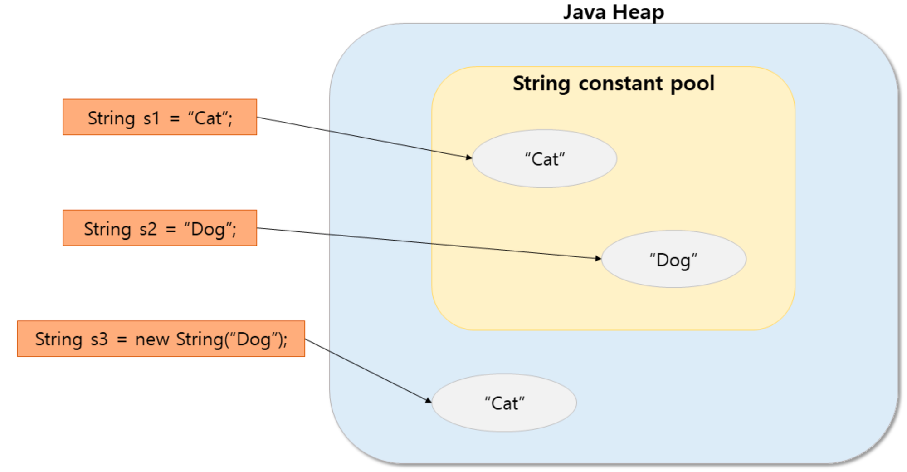
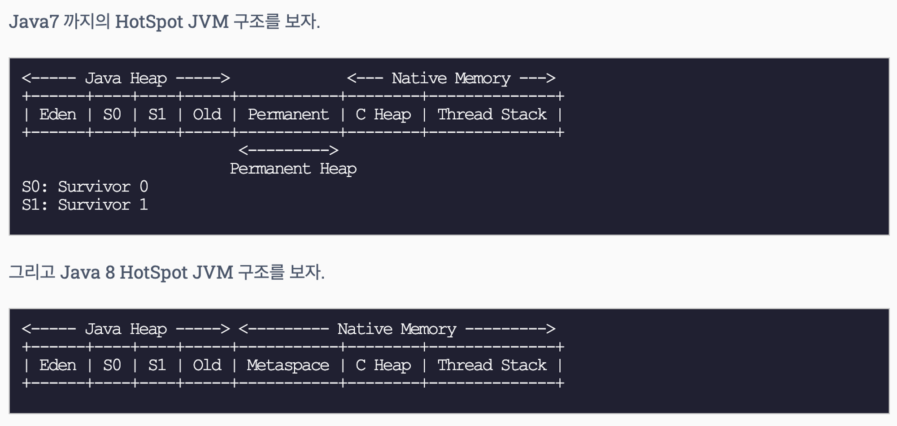

# String

## 요약

---

## String은 불변(Immutable)하다
- 불변은 말그대로 변하지 않는 것
- 하지만 Java에서 String 값을 변경할 수 있음
  ```java
  String str = "Hi";
  str = "Bye!";
  ```
- 변수에 있는 값을 못 바꾸게 하려면 아래처럼 해야 함
  ```java
  final String str = "Hi";
  str = "Bye!";            // Error!
  ```
- 여기서 주요점은 String은 기본 타입이 아닌 참조 타입 => String은 클래스
- String은 특별히 Heap 영역의 String Constant Pool에서 관리됨
  
  - 기본 타입 변수 num은 스택 메모리에 값을 바로 저장하고 있기 때문에 10에서 20으로 바꿔도 변수가 가진 메모리에서 값을 변경
  - String 변수 str은 문자열 데이터는 스택 메모리에 직접 저장되는 것이 아님
  - Heap 영역 중에서 **String Constant Pool이라는 곳에 메모리 할당 받아 거기에 값을 저장하고, str는 그 주소를 참조**
  - 따라서 **str = "abc" 후에 str = "def"가 실행되어 str 변수가 갖는 참조 값이 0x11에서 0x22로 바뀌어도 str 변수가 갖는 참조 값이 바뀐 것이지, 실제 "abc"가 저장되어 있는 0x11 주소의 데이터가 바뀐 것이 아님**
  - 이 때문에 Java에서 String은 불변한 것

### String 관리 방식
- String은 new 키워드와 생성자 또는 큰 따옴표를 통해서도 객체 생성 가능
- 다만 여기서 두 방식으로 객체를 생성할 때 차이가 있음
  ```java
  String s1 = "Cat";
  String s2 = "Dog";
  String s3 = new String("Cat");
  ```
- 위 코드를 내부적으로 보면 아래와 같음
  
  - 큰 따옴표를 사용한 경우 String Constant Pool의 메모리를 가리킴
  - 반면, 생성자를 통해 생성된 경우 String Constant Pool이 아닌 일반 객체처럼 Heap 영역에 할당된 메모리를 가리킴
    ```java
    String s1 = "Cat";
    String s2 = "Cat";
    String s3 = new String("Cat");
    String s4 = new String("Cat");
    
    System.out.println(s1 == s2);  // true, String pool 안의 동일한 주소
    System.out.println(s1 == s3);  // false, String pool 주소와 heap 영역의 주소를 비교
    System.out.println(s3 == s4);  // false, 서로 다른 heap 영역의 주소를 비교
    ```
    
#### Flyweight 패턴
- 공유(Sharing)을 통해 대량의 객체들을 효과적으로 지원하는 패턴
- String Constant Pool은 Flyweight 패턴을 잘 적용한 사례
- 이를 통해 많은 양의 String 객체를 생성하더라도 많은 양의 메모리 공간 절약 가능
- 큰 따옴표를 통해 String 객체 생성 시, String Constant Pool에 생성하고자 하는 값과 같은 값의 String 객체 유무를 판단함
  - 만약 있다면 새로운 객체를 생성하지 않고 찾은 주소 값을 반환
  - 없으면 새로운 객체를 생성해 String Constant Pool에 할당 후 그 주소를 반환
- new 키워드를 통해서 생성하게 되면,
  - String 객체를 강제로 Heap 영역에 생성하고 그 주소 값을 반환
    ```java
    String str = new String("Cat");  // 이 때 Pool에 "Cat"이 있다면 Heap에서 한 번만 객체 생성
							         // 없으면 Heap에도 하나, String Pool 영역에도 하나 총 2개의 객체 생성
    ```
- 어떠한 선언 방식을 하더라도 String은 String Constant Pool에 반드시 생성하게 됨
- 여기서 `intern()` 함수를 통해 String Constant Pool의 주소를 가져올 수 있음
  ```java
  String s1 = new String("Cat");
  String s2 = s1.intern();
  String s3 = "Cat";
    
  System.out.println(s1 == s2);  // false
  System.out.println(s2 == s3);  // true
  System.out.println(s1.intern() == s3);  // true
  ```

### String이 불변으로 설계된 이유
1. Java는 String을 String Constant Pool에서 관리 -> 이게 가능한 이유는 Java가 불변하기 때문
   - Pool을 통해 관리하여 Runtime에서 Heap 여역에 많은 메모리 절약이 가능해짐 -> 같은 값을 갖는 String에 대해 같은 메모리를 참조하기 때문
   - String이 가변적이었으면 해당 메모리 값이 언제 바뀔지 알 수 없게 되므로 Pool에서 관리할 수 없음
   - String이 변수 a, b, c가 같은 메모리를 가리킬 때 a를 바꾸면 b, c도 바뀌게 됨
2. String 불변성을 통해 보안성 강화
   - DB의 ID와 비밀번호나 소켓 통신에서 host와 port의 정보가 String으로 다뤄짐
   - String이 불변이어야 해커의 공격으로부터 값이 변경되는 것을 막을 수 있음
3. 멀티쓰레드 환경에서 안전
   - 값 변경 가능성이 없기 때문에 멀티쓰레딩 환경에서 동기화 문제에 걱정할 필요가 없음
4. Java는 String의 hashcode 생성 단계에서부터 캐싱하므로 String의 hashcode는 쓰일 때마다 계산되지 않음
   - 이는 hashcode를 key로 사용하는 HashMap에서 효과 발휘
   - 다른 객체는 키로 쓰일 때마다 hashcode를 계산하는 반면, String은 캐싱
   - 따라서 다른 객체를 key로 쓸 때보다 String을 key로 했을 때 더 빠른 속도로 사용 가능
   - hashcode를 캐싱할 수 있는 이유가 String이 불변하기 때문

### String 클래스는 상속이 불가능하다
- String은 불변하다는 전제를 유지하기 위해 해당 클래스는 final 선언을 통해 상속을 막음

## Java 버전 별 String & Constant Pool

### Java 7 이전
- String Constant Pool을 Permanent Generation`PermGen` 영역에서 관리
- 참조되지 않는 String value를 해제함으로써 OutOfMemory`OOM` 문제를 해소
- 다양한 옵션으로 Pool 크기 관찰 가능
  ```shell
  -XX:+PrintFlagsFinal
  -XX:+PrintStringTableStaticstics
  ```
- Pool 크기를 늘리고 싶다면 아래와 같은 옵션으로 최적화
  ```shell
  -XX:StringTableSize=4901. // 자바 7u40 이전엔 기본 사이즈가 1009(버켓)
                            // 버켓 : 문자열 개수
                            // 7u40 ~ 11까지는 60013, 현재는 65536까지 늘림
                            // 잘 안쓰임, 잘못 건들이면 문제가 됨 그래서 default를 씀
                            // 어떤 문제가 나올지 아무도 모름
  ```
- Pool 크기를 늘리면 더 많은 메모리를 차지하고, 그만큼 String value를 테이블에 적재하는 속도가 빨라짐
- String Constant Pool의 확장은 Heap 공간을 사용하므로 JVM이 실행 중인 동안 얼마든지 확장 가능
- 실시간으로 확장되기 때문에 성능 저하 발생, 미리 큰 사이즈를 확보해야 한다면 지정할 필요가 있음
  1. 대용량 문자열 처리
  2. 다국어 처리
  3. 멀티쓰레드 환경
- 실제로 잘못 건드리면 문제가 되므로 default 값을 사용
- 필요하다면 다중 서버 호나경에서 하나씩 적용해가며 테스트, 이후 점진적으로 다른 서버에 적용하는 방식으로 최적화 수행

### Java 8 이후
- `PermGen` 영역 삭제 -> String Constant Pool은 Heap으로 빠져서 상관 없음
  
  - 버전 7에서의 Java Heap
    - `PermGen`에 있는 클래스의 인스턴스 저장
    - `-Xms(min)`, `-Xmx(max)`로 사이즈 조정
  - 버전 7에서 Java PermGen
    - 클래스와 메서드의 메타 데이터 저장
    - Constant pool 정보
    - JVM, JIT 관련 데이터
    - `-XX:PermSize(min)`, `-XX:MaxPermSize(max)`로 사이즈 조정
  - `PermGen`은 메타데이터 저장 영역이라고도 함
  - 해당 영역은 Java 8부터 Native 영역으로 이동하여 `Metaspace` 영역으로 변경되었음
    - 다만 기존 `PermGen`에 존재하던 Static Object는 Heap 영역으로 옮겨져서 GC 대상이 최대한 될 수 있도록 함

#### PermGen -> Metaspace 이유
1. Native 영역 사용으로 영역 확보의 상한을 크게 의식할 필요 없음
   - Metaspace 영역은 Heap이 아닌 Native 메모리 영역으로 취급하게 됨
     - Heap 영역은 JVM에 의해 관리되는 영역이며, Native 메모리는 OS 레벨에서 관리하는 영역으로 구분됨
   - Metaspace가 Native 메모리를 이용함으로써 개발자는 영역 확보의 상한을 크게 의식할 필요가 없어짐
2. JRockit과 HotSpot 통일
   - JRockit의 가상머신에는 PermGen이 없음
   - 메모리 관리 구조를 통일하기 위한 이유도 존재

### Java 9 이후
- Java 8에서는 String이 UTF-16으로 인코딩된 char[] 배열 형태로 구현 => 모든 글자가 2-byte 차지
- Java 9부터 Compact String 지원
- 저장된 내용에 따라 char[] 또는 byte[] 배열 중 다른 형식으로 인코딩 방식을 선택
  - UTF-8 방식으로 1~3 bytes의 크기가 가변적인 인코딩도 활용
- 이를 통해,
  1. Heap 메모리 양이 줄어들고 GC 오버헤드 감소
  2. 통신 시 전송/응답 데이터 크기를 줄여 처리 속도를 개선

# Reference

### String은 불변

[Java의 String 이야기(1) - String은 왜 불변(Immutable)일까?](https://readystory.tistory.com/139)

[Immutable String in Java - javatpoint](https://www.javatpoint.com/immutable-string)

### String Constant Pool

[String Constant Pool이란? | Java String Pool](https://starkying.tistory.com/entry/what-is-java-string-pool)

[Guide to Java String Pool | Baeldung](https://www.baeldung.com/java-string-pool)

[Java의 String 이야기(2) - String pool이란 무엇인가?](https://readystory.tistory.com/140)

### PermGen

[[JVM] PermGen?](https://namocom.tistory.com/283)

[JDK 8에서 Perm 영역은 왜 삭제됐을까](https://johngrib.github.io/wiki/java8-why-permgen-removed/)