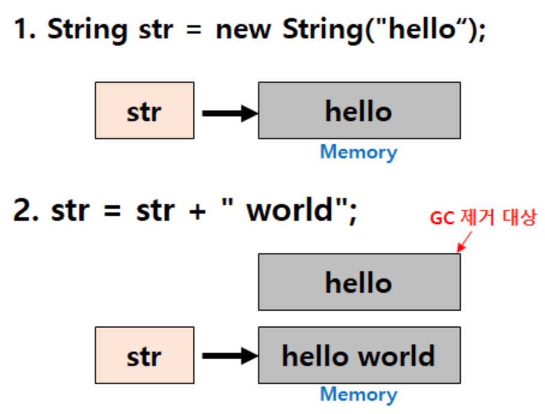

# StringBuffer vs. StringBuilder
## 요약
- String과 StringBuffer/StringBuilder의 차이는 불변 및 가변 여부이다
- 문자열 추가, 삭제, 변경이 자주 일어나면 heap 영역에 메모리가 많이 쌓이게 되므로, 이 경우 StringBuffer 및 StringBuilder를 사용해야 한다
- StringBuffer는 동기화 처리를 하고 StringBuilder는 그렇지 않다. 따라서 해당 타입 인스턴스가 공유되지 않는다면 StringBuilder를 사용한다
- 백엔드에선 대규모 트래픽 처리가 발생하기 때문에 동기화를 크게 고려하지 않는다, 하지만 애플리케이션 로그, 대규모 DB 연산, 쿼리 실행 등 한정적인 경우에 쓴다

---

# String
- Java에서 문자열을 다루는 대표적인 클래스는 `String`, `StringBuffer`, `StringBuilder`가 있음
- 여기서 `String`은 불변 객체
  ```java
  String str = "hello";
  str = str + " world"; // hello world 
  ```
- 위를 보면 str라는 변수를 통해 hello라는 문자열은 hello world로 보일 수 있으나, 그렇지 않음
- 아래와 같이 동작함

  
    1. `hello`라는 값이 String Pool에 적재
    2. `hello world` String Pool에 적재(`hello`랑 다른 인스턴스)
    3. 불필요한 `hello`는 GC에 의해 처리

- 불변성으로 인해 변하지 않는 문자열을 자주 읽는 경우 `String` 사용하는 것이 좋음
- 하지만 문자열 추가, 수정, 삭제가 요구될 때 `String` 사용 시 heap에 임시 가비지가 많이 생성됨 => 메모리 부족으로 성능에 치명적

# StringBuffer vs. StringBuilder
- 이를 위해 해결하는 것이 가변적으로 문자열을 처리하는 `StringBuffer`와 `StringBuilder`
- 동일한 객체 내에서 문자열 변경이 가능해짐
- 둘의 차이는 thread-safe 여부, `StringBuffer`는 thread-safe, `StringBuilder`는 그렇지 않음
- `StringBuffer`는 동기화 처리 때문에 싱글 쓰레드 환경에서 느린 반면, `StringBuilder`는 동기화 처리가 없어 빠름

## 백엔드는 멀티 쓰레드 환경, StringBuilder 못 쓰나?
- `StringBuilder`가 여러 쓰레드에서 공유하지 않는 환경이면 사용 가능
- 기본적으로 로직을 처리할 땐 메서드를 활용
- 비즈니스 로직을 처리하는 메서드가 상태(state)를 유지하지 않는, 즉 `StringBuilder`가 공유되지 않는 특정 영역에서만 사용된다면 동기화할 필요가 없음
- 따라서 stateless한 경우엔 멀티 쓰레드 환경에서 `StringBuilder`를 사용해도 됨

### 백엔드는 멀티 쓰레드 환경이지만 동기화는 고려하지 않는다
- 대규모 트래픽이 발생하기 때문, 더 많은 트래픽을 처리하기 위해 동기화를 고려하지 않음
- 따라서 항상 stateless를 유지하고 단일적으로 움직이도록 설계

### 그래도 결국 멀티 쓰레드 환경이라 StringBuffer가 쓰이는 경우는 반드시 있음
1. 웹 애플리케이션 로그
   - 여러 쓰레드가 동시에 로그를 기록하는 경우가 있음
   - 정상적 로그 처리를 위해 thread-safe 환경 필수
2. 대규모 데이터베이스 연산
   - 많은 사용자가 동시에 DB에 접근 및 수정할 수 있음 -> 데이터 일관성 유지 어려움
   - DB 연산에 대한 동시성 제어를 위해 필요
3. 쿼리 실행
   - DB 연산은 많은 시간이 소요
   - 이 때, 여러 쓰레드가 동시에 동일한 쿼리를 실행해서 조작하면 잘못된 실행 결과 발생
   - 심플한 예로, DAU 집결하려는데 여러 유저가 접근할 때 thread-safe하지 않으면 잘못된 DAU가 집계됨<br>
     (static int 변수를 여러 쓰레드에서 +1씩 처리한다고 생각해보자)