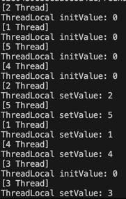
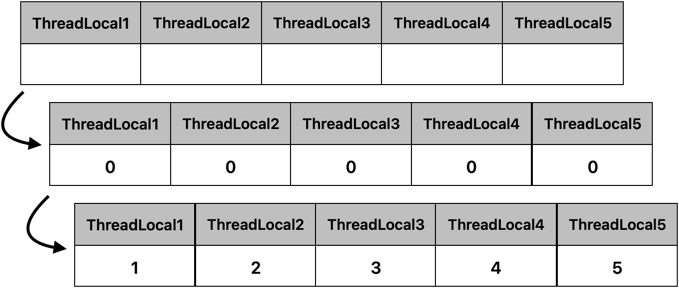
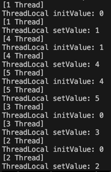
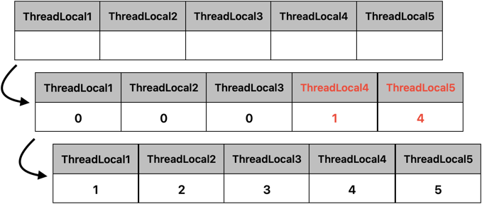
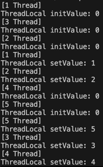
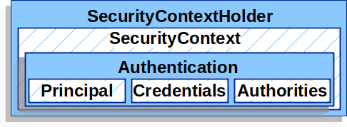

# ThreadLocal

## 요약

- 기본적인 정의는 다음처럼 요약
  1. 각 Thread에 대한 로컬 변수를 제공
  2. 각 Thread가 변수에 대해서 독립적으로 접근할 수 있음
- Thread 단위로 로컬 변수를 사용할 수 있어 마치 전역변수처럼 여러 메서드에서 활용 가능
- 다만 잘못 사용 시 부작용이 발생할 수 있으므로, 다른 Thread와 변수가 공유되지 않도록 주의

---

## ThreadLocal 구성

### ThreadLocal, ThreadLocalMap, Entry
```java
public class ThreadLocal<T> {
    // ...생략
    static class ThreadLocalMap {
        // ...생략
        ThreadLocalMap(ThreadLocal<?> firstKey, Object firstValue) {
            table = new Entry[INITIAL_CAPACITY];
            int i = firstKey.threadLocalHashCode & (INITIAL_CAPACITY - 1);
            table[i] = new Entry(firstKey, firstValue);
            size = 1;
            setThreshold(INITIAL_CAPACITY);
        }
        
        static class Entry extends WeakReference<ThreadLocal<?>> {
            Object value;

            Entry(ThreadLocal<?> k, Object v) {
                super(k);
                value = v;
            }
        }
    }
}
```
- `ThreadLocal` 클래스에 `ThreadLocalMap`이라는 정적 내부 클래스가 존재
- `ThreadLocal`은 Thread의 정보를 키 값으로 하여 값을 저장하는 Map 구조`ThreadLocalMap`를 가짐 
- 그리고 `Entry`라는 타입의 배열 형태로 구성되어 있음

### get(), set()
```java
public T get() {
    Thread t = Thread.currentThread();
    ThreadLocalMap map = getMap(t);
    if (map != null) {
        ThreadLocalMap.Entry e = map.getEntry(this);
        if (e != null) {
            @SuppressWarnings("unchecked")
            T result = (T)e.value;
            return result;
        }
    }
    return setInitialValue();
}

public void set(T value) {
    Thread t = Thread.currentThread();
    ThreadLocalMap map = getMap(t);
    if (map != null) {
        map.set(this, value);
    } else {
        createMap(t, value);
    }
}
```
- 데이터 호출과 저장을 위해 `get()`, `set()` 메서드가 제공됨
- 두 메서드 모두 현재 진행 중인 Thread를 Key 값으로 `getMap()`을 사용해 `ThreadLocalMap`을 불러옴
  - `get()`: Map이 null 아닐 경우 내부에 `Entry`를 불러오고 `ThreadLocal`에 저장한 값을 불러옴
  - `set()`: `ThreadLocal` 객체를 key로 사용해 `ThreadLocalMap`에 값 초기화 -> 내부적으로 `ThreadLocal`이 가진 hash code 사용

### getMap(), createMap()
```java
class Thread implements Runnable {
    ThreadLocal.ThreadLocalMap threadLocals = null; 
    ...
}
```
```java
ThreadLocalMap getMap(Thread t) {
    return t.threadLocals;
}

void createMap(Thread t, T firstValue) {
    t.threadLocals = new ThreadLocalMap(this, firstValue);
}
```
- `Thread` 클래스 내부에 `ThreadLocal`의 `ThreadLocalMap`을 참조하는 것을 볼 수 있음
- `getMap()`에서 `Thread`를 받아와 해당 `Thread`에서 사용될 참조할 `ThreadLocalMap` 값을 반환
- `createMap()`은 `Thread` 내부 `ThreadLocalMap` 값을 새로 생성함

### remove()
```java
public void remove() {
    ThreadLocalMap m = getMap(Thread.currentThread());
    if (m != null) {
        m.remove(this);
    }
}
```
- 현재 수행 중인 Thread를 기준으로 getMap()에서 `ThreadLocalMap`을 가져옴
- 그리고 안에 있는 `ThreadLocal` 값 제거

### withInitial()
```java
public static <S> ThreadLocal<S> withInitial(Supplier<? extends S> supplier) {
    return new SuppliedThreadLocal<>(supplier);
}

// 예시: 초깃값을 0으로 초기화
ThreadLocal<Integer> threadLocal = ThreadLocal.withInitial(() -> 0);
```
- `Supplier` 람다식 메서드로 로컬 변수를 생성하면서 특정 값으로 초기화

## 예시
```java
public class Main {

    static class CustomThread extends Thread {

        private static final ThreadLocal<Integer> threadLocal = ThreadLocal.withInitial(() -> 0);

        private final Integer number;

        public CustomThread(Integer number) {
            this.number = number;
        }

        @Override
        public void run() {
            int initValue = threadLocal.get();
            System.out.println("[" + number + " Thread]\nThreadLocal initValue: " + initValue);

            threadLocal.set(number);

            int setValue = threadLocal.get();
            System.out.println("[" + number + " Thread]\nThreadLocal setValue: " + setValue);
        }
    }

    public static void main(String[] args)  throws Exception {
        for(int i = 1; i <= 5; ++i) {
            final ThreadForThreadLocal threadLocal = new ThreadForThreadLocal(i);
            threadLocal.start();
        }
    }
}
```

- `CustomThread`에선 `Integer` 형식을 받는 `ThreadLocal` 생성, `withInitial`을 통해 초깃값을 0으로 설정
- 오바라이딩된 run()에서 초깃값과 세팅값을 출력



## 예시2(ThreadPool)
- 사용 시 주의가 필요
- `ThreadLocal`은 Thread의 정보를 키로 하여 Map 형식으로 데이터를 저장 후 사용
- 따라서 ThreadPool로 Thread 재사용 시 이전에 사용한 ThreadLocal의 정보가 남아 의도하지 않은 동작을 할 수 있음

```java
public class Main {

    static class CustomThread extends Thread {

        private static final ThreadLocal<Integer> threadLocal = ThreadLocal.withInitial(() -> 0);

        private final Integer number;

        public CustomThread(Integer number) {
            this.number = number;
        }

        @Override
        public void run() {
            int initValue = threadLocal.get();
            System.out.println("[" + number + " Thread]\nThreadLocal initValue: " + initValue);

            threadLocal.set(number);

            int setValue = threadLocal.get();
            System.out.println("[" + number + " Thread]\nThreadLocal setValue: " + setValue);
        }
    }

    private static final ExecutorService executorService = Executors.newFixedThreadPool(3);
    
    public static void main(String[] args)  throws Exception {
        for(int i = 1; i <= 5; ++i) {
            final CustomThread threadLocal = new CustomThread(i);
            executorService.execute(threadLocal);
        }
        executorService.shutdown();
    }
}
```


- ThreadPool 개수를 3개로 하면 2개의 Thread를 재사용하게 되어 초깃값이 0이 아닌 경우가 있음



- 이 경우엔 Thread가 끝나는 시점에 `remove()`로 값을 제거해줘야 함
  ```java
  @Override
  public void run() {
        int initValue = threadLocal.get();
        System.out.println("[" + number + " Thread]\nThreadLocal initValue: " + initValue);

        threadLocal.set(number);

        int setValue = threadLocal.get();
        System.out.println("[" + number + " Thread]\nThreadLocal setValue: " + setValue);
        
        // remove() 추가
        threadLocal.remove();
  } 
  ```
  

## ThreadLocal을 static으로 사용하는 이유
- `ThreadLocal`은 `static` 없이도 사용할 수 있음 => 스레드 인스턴스 당 하나의 변수 개념
- 그러나 ThreadLocal 인스턴스는 일반적으로 Thread 마다 상태를 연관 짓기 위한 목적으로 설계
  - ex. 웹 페이지에서의 유저 ID 또는 트랜잭션 ID
- 그렇기에 사용은 가능하나 `non-static`의 경우 설계 의도와 벗어난다고 할 수 있음
- 이에 대한 대표적 사례는 아래와 같음

## 활용 사례
### Spring Security - ContextHolder
```java
final class ThreadLocalSecurityContextHolderStrategy implements SecurityContextHolderStrategy {
    private static final ThreadLocal<SecurityContext> contextHolder = new ThreadLocal<>();
    ... (생략)
}
```

- 각 Thread가 독립적으로 데이터를 처리해야 하는 곳에서 활용한 사례
- `ContextHolder`의 내부에는 `Authentication` 정보를 담음 -> 여러 `Thread` 요청에도 꼬이지 않는 `ThreadLocal`만의 장점이 적용됨

# Reference

[Thread의 개인 수납장 ThreadLocal](https://dev.gmarket.com/62)

[자바 ThreadLocal: 사용법과 주의사항](https://madplay.github.io/post/java-threadlocal)