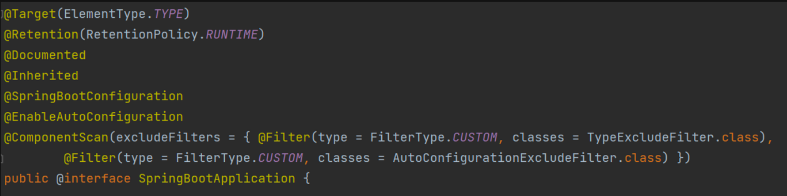
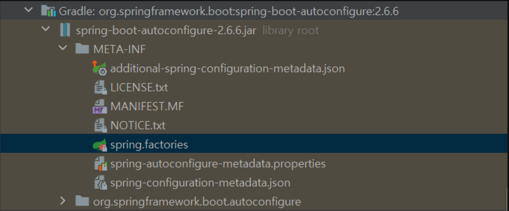
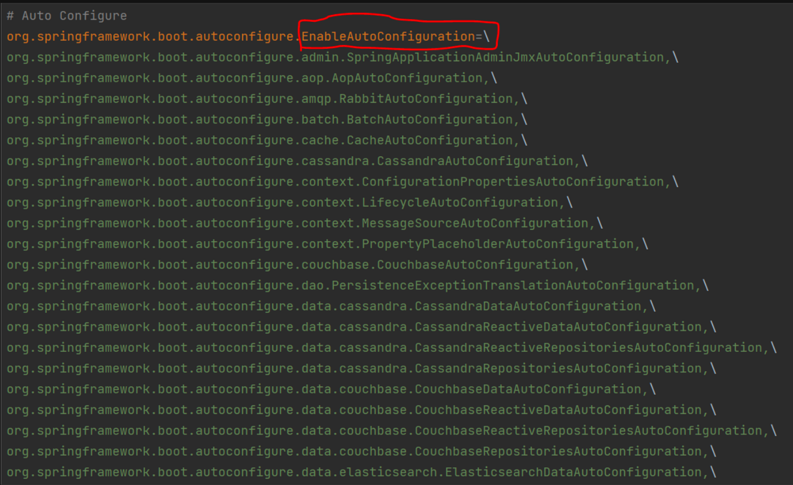

# Spring Framework vs. Spring Boot

## 요약
- Spring Framework는 과거 EJB에 의존적인 개발에서 벗어나, POJO 방식을 통해 객체지향 개발을 하기 위해 나온 경량 엔터프라이즈 프레임워크이다
- Spring Boot는 Spring Framework의 dependency, configuration에 있어 보다 편리한 기능을 제공해준다
- Spring Boot는 AutoConfiguration을 통해 외부 라이브러리를 가져오고, 톰캣 기반 내장 서버를 가진 애플리케이션을 만들 수 있다

---

## Spring Framework
- 과거 EJB를 대체하는 도구
- 많은 부분이 발전된 형태지만 Spring Framework 역시 프로젝트 만드는데 설정할 것이 ㅁ낳음
- 그럼에도 Java 대표 프레임워크인 이유는,
  1. IoC
     - 개발자가 가지고 있던 제어권과 객체 생명 주기 권리 권한이 Framework로 넘어감
       - 모든 객체에 대한 제어권이 바뀐 것을 의미
     - 기존에도 Java 코드 작성 시 객체 생성, 의존 관계 설정 등을 개발자가 했으나 이를 framework가 대신 함
  2. DI
     - Framework에 의존성을 주입하여 객체간 결합을 느슨화
     - 코드 재사용성 증가 및 단위 테스트 용이
  3. AOP
     - 핵심 기능을 제외한 부수적 기능을 framework가 제공
       - Security 적용, logging 추가
     - 기존 비즈니스 로직을 건들이지 않고 AOP로 추가 가능
  4. 다른 framework와의 통합
     - JUnit, Mockito 같은 테스트 framework와 통합이 간단 => 코드 품질 향상

## Spring Boot
- 단독적이며, 상용화 수준의 '실행만 하면 되는' spring 기반 애플리케이션 제작에 용이
- 최소한의 작ㅇ버으로 spring 기반 프로덕션 급 애플리케이션 및 서비스 제작 가능

## Spring Framework vs. Spring Boot

### Dependency
#### Spring Framework
- Dependency 설정 시 설정 파일이 매우 긺
- 모든 dependency에 대해 버전 관리도 하나하나 해줘야 함
    ```xml
    <dependency>
        <groupId>org.springframework</groupId>
        <artifactId>spring-web</artifactId>
        <version>5.3.5</version>
    </dependency>
    <dependency>
        <groupId>org.springframework</groupId>
        <artifactId>spring-webmvc</artifactId>
        <version>5.3.5</version>
    </dependency>
    ```
- Test framework 추가 시 Spring Test, JUnit, Mockito 등 모든 라이브러리 추가 필요
#### Spring Boot
- Dependency 설정 용이, 버전 관리도 자동화
  ```xml
  <dependency>
    <groupId>org.springframework.boot</groupId>
    <artifactId>spring-boot-starter-web</artifactId>
    <version>2.4.4</version>
  </dependency>
  ```
- Groovy 사용 시 더 간단함
  ```groovy
  implementation 'org.springframework.boot:spring-boot-starter-web'
  ```
  - 위처럼 `build.gradle` 파일에 dependency 추가 시 Spring Boot 개발에 필요한 모든 dependency를 자동 추가 및 관리
  - Test framework 추가 시 `spring-boot-starter-test`만 추가하면 됨

### Configuration
#### Spring Framework
- 설정 시 작성 코드가 길고, 관련 Annotation 및 Bean 등록 필수
  ```java
  // Thymeleaf 사용 예
  @Configuration
  @EnableWebMvc
  public class MvcWebConfig implements WebMvcConfigurer {  
    @Autowired
    private ApplicationContext applicationContext;
    
    @Bean   
    public SpringResourceTemplateResolver templateResolver() {
        SpringResourceTemplateResolver templateResolver =
        templateResolver.setApplicationContext(applicationContext);
        templateResolver.setPrefix("/WEB-INF/views/");
        templateResolver.setSuffix(".html");
        return templateResolver;
    }

    @Bean
    public SpringTemplateEngine templateEngine() {
        SpringTemplateEngine templateEngine = new SpringTemplateEngine();
        templateEngine.setTemplateResolver(templateResolver());
        templateEngine.setEnableSpringELCompiler(true);
        return templateEngine;
    }
    
    @Override
    public void configureViewResolvers(ViewResolverRegistry registry) {
        ThymeleafViewResolver resolver = new ThymeleafViewResolver();
        resolver.setTemplateEngine(templateEngine());
        registry.viewResolver(resolver);
    }
  }
  ```
#### Spring Boot
- `application.properties` 또는 `application.yml`에서 설정
    ```YML
    <dependency>
       <groupId>org.springframework.boot</groupId>
       <artifactId>spring-boot-starter-thymeleaf</artifactId>
    </dependency>
    ```
    ```groovy
    implementation 'org.springframework.boot:spring-boot-starter-thymeleaf'
    ```

### AutoConfiguration(Spring Boot Only)
- Spring Boot에만 존재하는 기능
- `@SpringBootApplication` annotation이 존재
- 이를 제거하고 프로그램 실행 시 일반적인 Java 프로그램과 동일하게 실행
- 해당 annotation 덕에 많은 외부 라이브러리를 가져올 수 있고, Tomcat 서버를 내장한 채로 실행 가능
    
  - 일부 유용한 annotation이 존재
    - `@ComponentScan`
      - `@Component`, `@Controller`, `@Service`, `@Repository` annotation에 붙은 객체를 스캔해 자동으로 Bean에 등록
    - `@EnableAutoConfiguration`
      - `@ComponentScan` 이후 사전에 정의한 라이브러리를 Bean에 등록
      - 사전에 정의한 라이브러리들은 다음 경로에서 확인 가능
        - External Libraries/spring-boot-autoconfigure/META_INF/spring.factories
        
        - `spring.factories` 파일
        
      - `@EnableAutoConfiguration`을 key로 하는 외부 의존성 확인 가능
      - 이 의존성 모두 스캔하여 상황에 맞게 주입
        - 사전에 정의한 라이브러리라고 전부 Bean에 등록하는 것은 아님

### Server 내장 여부 + 배포 방식
#### Spring Framework
- WAR(Web Application aRchive) 파일로 배포
- 압축된 WAR 파일과 WAR 파일 프로그램 실행을 위해 설정한 WAS(Web Application Server) 필수 => 내장 서버 없음

#### Spring Boot
- Tomcat이나 Jetty 같은 내장 WAS를 가지고 있음
- 독립적으로 실행할 수 있는 jar 파일만으로 간편하게 배포 가능
- Tomcat 같은 server를 내장하면서 Servlet Container에 종속된 WebApplication이 역으로 WebApplication Servlet Container가 종속될 수 있도록 함 => IoC(제어 역전)

## Reference

[[Spring] Spring  VS Spring Boot 차이점](https://programforlife.tistory.com/68)

[Spring Framework 와 Spring Boot 비교](https://velog.io/@brucehan/Spring-vs-Spring-Boot-차이점-알아보기)