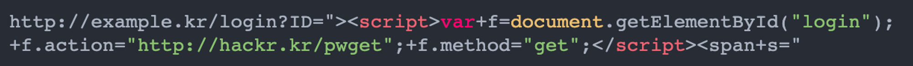
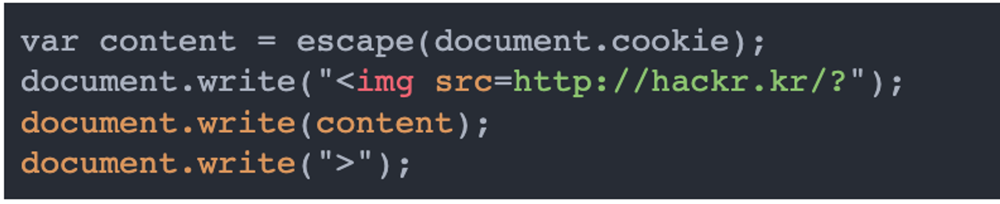

# 웹 공격 기술(XSS, CSRF, SQL Injection)

## 요약
- 웹 공격의 대상은 서버, 클라이언트 그리고 서버 상에 동작하는 웹 애플리케이션이다
- 공격 패턴은 공격자가 직접 액세스해서 코드를 보내는 능동적 공격, 그리고 함정을 이용해 유저에게 코드를 실행시키는 수동적 공격이 있다
- XSS 사용자 브라우저에 부정한 HTML 태그나 Javascript를 실행시키는 수동적 공격이다
- CSRF는 인증된 사용자의 개인/설정 정보 등을 함정으로 탈취해 상태를 갱신하는 처리를 강제하는 수동적 공격이다
- SQL Injection은 웹 애플리케이션을 이용하고 있는 데이터에빙스에 SQL를 부정하게 실행하는 능동적 공격이다

---

## 공격 대상
1. HTTP를 사용하는 서버와 클라이언트
2. 서버 상에 동작하는 웹 애플리케이션

## 공격 패턴
### 능동적 공격
> SQL Injection, OS Command Injection
- 공격자가 직접 웹 애플리케이션에 액세스해서 공격 코드를 보냄
- 서버 상의 리소스에 대해 직접 실행되기 때문에 공격자가 리소스에 접근할 필요 있음

### 수동적 공격
> XSS, CSRF
- 함정을 이용해 유저에게 공격 코드를 실행시키는 공격
- 직접 웹 애플리케이션에 액세스해서 공격하진 않음

#### 공격 방식
1. 설치한 함정에 유저를 유도 -> 함정엔 HTTP Request를 발생시키는 장치가 있음
2. 유저가 함정에 거림 -> 브라우저나 메일 클라이언트에서 함정을 엶
3. 함정에 걸리면 유저의 브라우저가 장착된 공격 코드를 포함한 HTTP request를 공격 대상인 웹 애플리케이션에 송신 및 실행
4. 공격 코드를 실행하면 취약성 있는 웹 애플리케이션을 경유한 결과로써 유저가 가진 쿠키 등 기밀 정보를 탈취 및 로그인 중인 유저의 권한 악용

## 공격 종류

### Cross-site Scripting(XSS)
- 취약성 있는 웹사이트를 방문한 사용자의 브라우저에서 부정한 HTML 태그나 Javascript 등을 동작시키는 공격
- 동적으로 HTML을 생성하는 부분에서 취약성 발생

#### 공격 방식
1. 가짜 입력 폼 등에 의해 유저의 개인정보를 도둑 맞음
   
   - 로그인 폼에 작성 시 공격자의 사이트인 `http://hackr.kr` 주소로 송신되어 탈취됨
2. 스크립트에 의해 유저의 쿠키 값이 도둑맞거나 피해자가 의도하지 않은 Request가 송신됨
   
   - XSS 취약성 있는 웹 애플리케이션에서 Javascript가 실행되면 해당 웹 애플리케이션의 도메인의 쿠키 정보에 액세스
   - `http://hackr.kr`에 보내자고 엑세스 로그에 기록됨
3. 가짜 문장이나 이미지 등이 표시

### Cross-site Request Forgeries(CSRF)
- 인증된 유저가 의도치 않은 개인 정보 및 설정 정보 등을 공격자가 설치해 둔 함정에 의해, 어떤 상태를 갱신하는 처리를 강제로 실행시키는 공격
- 이는 유저가 인증된 상태가 아니라면 함정을 실행해도 아무 일도 발생하지 않음

#### 공격 방식
1. 인증된 유저의 권한으로 설정 정보 갱신
2. 인증된 유저의 권한으로 상품 구입
3. 인증된 유저의 권한으로 게시판에 글 작성

### SQL Injection
- 웹 애플리케이션을 이용하고 있는 DB에 SQL을 부정하게 실행하는 공격

#### 공격 방식
```shell
# 정상 처리 : books 테이블에서 author='찰리'이면서 flag=1인 판매 가능한 책의 데이터를 표시
URL : http://example.com/search?q="찰리" 
SQL : SELECT * FROM books WHERE author='찰리' and flag = 1;

# SQL Injection : SQL에서 --는 주석, 즉, ' and flag = 1;'는 주석 처리 됨
URL : http://example.com/search?q=찰리'-- 
SQL : SELECT * FROM books WHERE author='찰리'--' and flag = 1;

# 주석 처리로도 끝날 수 있지만, 실제론 쿼리를 더해서 다른 데이터를 가져올 수 있음
# 'or ID = 1'라는 조건문 추가, ID = 1인 데이터가 있으면 해당 데이터도 열람 가능
URL : http://example.com/search?q=찰리'orID=1-- 
SQL : SELECT * FROM books WHERE author='찰리' or ID = 1 --' and flag = 1;
```

# Reference
[[네트워크] 웹 공격 기술 XSS, CSRF, SQL Injection](https://parkadd.tistory.com/132)