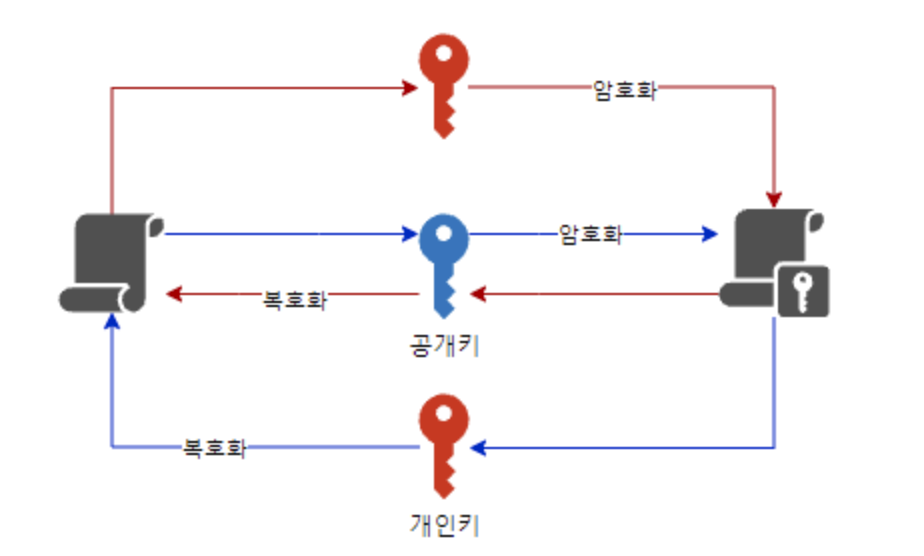

# 대칭키와 비대칭키
## 대칭키 방식
- 암복호화에 서로 동일한 키가 사용되는 암호화 방식
- 그래서 키를 **비공개**함
- 하지만 결정적으로 `키 배송`에 관한 문제가 있음
- 어떻게는 송신 측에는 수신 측에 암호 키를 전달해야하고, 이 배송 과정에서 탈취되면 아무리 뛰어난 암호화를 사용해도 평문이 드러남
- 이러한 키 배송 문제를 해결한 방식이 비대칭형 암호
- 장점: 속도가 빠름
- 단점: 키 배송 위험성이 존재, 송신 측에서 수신 측에 암호 키를 전달하는 과정에서 노출 가능성이 있음

## 비대칭키 방식

- 암복호화에 서로 다른 키가 사용되는 암호화 방식
- 하나의 키는 **공개키**로 사용
- 비대칭형 암호는 암호화 키와 복호화 키가 다름
- 두개의 키를 각 키`A`, 키`B`라 할 때,
  - 키`A`로 암호화한 암호문은 키`B`로만 복호화할 수 있음
  - 키`B`로 암호화한 암호문은 키`A`로만 복호화할 수 있음
- 따라서 이중 하나의 키만 비밀로 보호`비밀키, 개인키`, 다른 하나는 공개`공개키`
  - 공개키로 암호화한 암호문은 어차피 개인키를 가진 사람만이 풀 수 있음
  - 상호간에 공개키만 교환하고 상대의 공개키로 암호화해서 데이터를 교환하면 상대는 자신의 개인키로 복호화함
  - 이를 통해 키 배송 문제를 해결
- 하지만 비대칭형 암호는 암복호화가 대칭형 암호에 비해 현저하게 느림
  - 따라서 현실적으로는 비대칭형 암호를 이용해서 대칭형 암호의 키를 배송
  - 실제 암호문은 대칭형 암호를 사용하는 식으로 상호보완적으로 이용
- 그리고 비대칭형 암호라고 약점이 없는 것은 아님
  - 중간자 공격`Man In The Middle Attack(MITM)`에 취약
  - 해커가 중간에 통신을 가로채 수신자에게는 송신자인 척하고 송신자에게는 수신자인 척해서 양쪽의 공개키와 실제 암호화에 사용되는 대칭키를 모두 얻어냄
- 또한 개인키-공개키 관계를 역이용해서 전자 서명에 활용하기도 함
  - 특정 문서를 개인키로 암호화해서 발송하면 이 문서는 해당 발신자의 공개키로만 복호화가 가능
  - 공개키이므로 아무나 열어볼 수 있으나 해당 발신자의 공개키로만 열린다는 사실에서 이 문서가 해당 발신자에게서 온 것이라는 사실은 인증
- 장점: 키 배송 문제를 근본적으로 차단하여 안정성이 높음
- 단점: 대칭키(비공개키) 방식에 비해 느림

# Reference

[[암호화] 양방향(공개키/비대칭키, 비공개키/대칭키), 단방향](https://sudo-minz.tistory.com/181)

[암호화 양방향, 단방향, 공개키(비댕칭키), 비공개키(대칭키) 개념/분류 알고리즘 정리](https://javaplant.tistory.com/26)