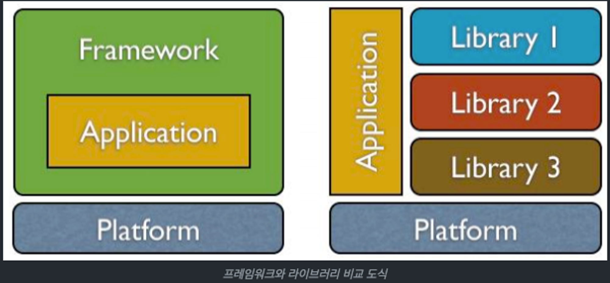

# DI/IoC

## 요약
- DI(Dependency Injection) : 객체 간의 의존성을 외부에서 주입하여 관리하는 기술
- DI 방법에는 생성자 주입/필드 주입/수정자 주입이 있다
- 스프링 프레임워크에선 생성자 주입을 아래의 이유로 권장한다
    1. 순환 참조 오류 방지
    2. 단일 책임 원칙 위배한 클래스 로직 뚜렷함
    3. 필드의 불변성
    4. DI Container와의 낮은 결합도
- IoC(Inversion of Control) : 직접 제어해야 하는 부분에 대한 권한을 프레임워크 등에 넘기는 기술
    - 개발자가 담당하던 객체의 흐름이나 외부 라이브러리를 프레임워크가 담당하여, 개발자는 핵심 비즈니스 로직에 집중할 수 있다

---

## Dependency Injection(DI)
- 말 그대로 의존성 주입을 말함
- 객체 간의 의존성을 외부에서 주입하여 관리하겠다라는 개념

### 예시
- 지하철의 라인을 관리하기 위한 LineService
- `LineSerivce`에서 DB에서 데이터를 가져오기 위해 `LineRepository`가 있다고 가정
```java
@Service
public class LineService {
    private final LineRepository repository;

    public LineService() {
        this.repository = new LineRepository();
    }

    ...

}
```

- DI 적용 이전엔 `LineRepository`를 사용하는 `LineService`에서 `LineRepository`를 생성하고 관리함 
- 위 방법은 `LineService`와 `LineRepository` 간의 의존성이 높음
- 이는 코드 재사용성이 떨어지고 변경에 유연하지 못하며 테스트 코드 작성이 어려워짐
- `@Autowired`를 사용한 DI
    ```java
    @Service
    public class LineService {
        @Autowired
        private LineRepository repository;
    
        public LineService() {
        }
    
        ...
    
    }
    ```
- 이렇게 외부에서 의존을 주입받으면 의존을 내부에서 정의하지 않기 때문에,
    1. 객체 간의 의존성을 줄여주고
    2. 코드 재사용성도 증가하며
    3. 변화에 민감하지 않을 수 있음
- 변화에 민감하다는 의미는 객체 자신이 아닌 의존하고 있는 다른 객체의 변경으로부터 민감한 정도를 말함
- 의존 정도가 작을 수록 의존 객체의 변경에 크게 영향을 받지 않음

### DI 방법

#### 1. Field Injection
- 필드에 `@Autowired` 어노테이션을 붙여 자동으로 의존성을 주입
- 편리하기 때문에 가장 많이 접할 수 있는 방법
```java
@Service
public class LineService {
    @Autowired
    private LineRepository repository;

    public LineService() {
    }
}
```

#### 2. Setter Injection
- 수정자(Setter)를 이용한 주입 방법
- 선택적인 의존성을 주입할 경우 유용함
- 만약 필수적인 의존성을 줘야하는 곳에서 Setter Injection 사용 시 null에 대한 검증 로직을 모든 필드에 추가해줘야 함

```java
@Service
public class LineService {
    private LineRepository repository;

    public LineService() {
    }

    @Autowired
    public void setRepository(LineRepository lineRepository) {
        this.repository = lineRepository;
    }
}
```

#### 3. Constructor Injection
- 별다른 어노테이션 없이 매개변수 생성자만 열어두면 됨

```java
@Service
public class LineService {
    private final LineRepository repository;

    public LineService(LineRepository repository) {
        this.repository = repository;
    }
}
```

### Spring Framework에선 Constructor Injection을 권장한다
- 대부분 코드에서 `@Autowired`를 활용한 field injection이 많음, 사용하기 편하기 때문
- 하지만 스프링 프레임워크에선 `Constructor Injection`을 권장함

> S*pring Team recommends: “Always use constructor based dependency injection in your beans. Always use assertions for mandatory dependencies”. - IntelliJ Warning Message*

- 권장하는 이유는 아래와 같음

#### 1. 순환 참조 방지
- 개발하다 보면 여러 컴포넌트 간에 의존성이 생김
- 그 중에서도 A가 B를 참조하고, B가 A를 참조하는 순환 참조도 발생할 수 있음
##### 예시
- 두 개의 서비스 레이어 컴포넌트를 정의 후 서로 참조 시킴
- 극단적인 상황을 위해 순환 참조 구조에 더불어 서로 메서드를 순환 호출
- 실제로 이런 형태가 되어서는 안되며, 직접적으로 서로를 계속해서 호출하는 코드는 더더욱 안됨
- 예시를 위해 존재하는 경우라 생각하기

    ```java
    @Service
    public class MadPlayService {
    
        // 순환 참조
        @Autowired
        private MadLifeService madLifeService;
    
        public void sayMadPlay() {
            madLifeService.sayMadLife();
        }
    }
    @Service
    public class MadLifeService {
        
        // 순환 참조
        @Autowired
        private MadPlayService madPlayService;
    
        public void sayMadLife() {
            madPlayService.sayMadPlay();
        }
    }
    ```

  실제로 실행해보면,

    ```java
    @SpringBootApplication
    // CommandLineRunner를 상속해서 실행이 가능...?
    public class DemoApplication implements CommandLineRunner {
    
        @Autowired
        private MadLifeService madLifeService;
        @Autowired
        private MadPlayService madPlayService;
    
        @Override
        public void run(String... args) {
            madPlayService.sayMadPlay();
            madLifeService.sayMadLife();
        }
    
        public static void main(String[] args) {
            SpringApplication.run(DemoApplication.class, args);
        }
    }
    ```

  실행 결과는 아래와 같음

    ```
    java.lang.StackOverflowError: null
        at com.example.demo.GreetService.sayGreet(GreetService.java:12) ~[classes/:na]
        at com.example.demo.HelloService.sayHello(HelloService.java:12) ~[classes/:na]
        at com.example.demo.GreetService.sayGreet(GreetService.java:12) ~[classes/:na]
        at com.example.demo.HelloService.sayHello(HelloService.java:12) ~[classes/:na]
        at com.example.demo.GreetService.sayGreet(GreetService.java:12) ~[classes/:na]
    ```
  - run 메서드의 내용이 수행되면서 위와 같은 오류와 함께 종료 됨
  - 컴파일러 단에서 오류 발생이 아닌 런타임 단에서 오류가 발생함
  - 이는 애플리케이션이 아무런 오류가 경고 없이 구동되는 것
  - 실제 코드가 호출되기 전까지 문제를 발견할 수 없음
  - 아래처럼 생성자 주입을 했을 경우,
    ```java
    @Service
    public class MadPlayService {
        private final MadLifeService madLifeService;
    
        public MadPlayService(MadLifeService madLifeService) {
            this.madLifeService = madLifeService;
        }
    
        // 생략
    }
    
    @Service
    public class MadPlayService {
        private final MadLifeService madLifeService;
    
        public MadPlayService(MadLifeService madLifeService) {
            this.madLifeService = madLifeService;
        }
    
        // 생략
    }
    ```
  - 아래처럼 `BeanCurrentlyInCreationException`이 발생 해서 애플리케이션이 구동되지 않음
  - 컴파일 단에서 알 수 있음!
    ```
    Description:
    The dependencies of some of the beans in the application context form a cycle:
    ┌─────┐
    |  madLifeService defined in file [~~~/MadLifeService.class]
    ↑     ↓
    |  madPlayService defined in file [~~~/MadPlayService.class]
    └─────┘
    ```

- 예시처럼 생성자 주입을 하면 사전에 순환 참조를 방지할 수 있음
- 다른 방식과 차이가 발생하는 이유는, 생성자 주입 방법은 필드 주입이나 수정자 주입과 **빈을 주입하는 순서가 다르기 때문**

수정자 주입의 빈 주입 방식

1. 우선 주입 받으려는 빈의 생성자를 호출하여 빈을 찾거나 빈 팩터리에 등록함
2. 그 후 생성자 인자에 사용하는 빈을 찾거나 만듦
3. 이후에 주입하려는 빈 객체의 수정자를 호출하여 주입

- 필드 주입의 빈 주입 방식
  1. 우선 주입 받으려는 빈의 생성자를 호출하여 빈을 찾거나 빈 팩터리에 등록
  2. 그 후 어노테이션이 붙은 필드에 해당하는 빈을 찾아서 주입 ⇒ 먼저 빈을 생성한 후에 필드에 대해서 주입

- 생성자 주입의 빈 주입 방식
  1. 생성자로 객체를 생성하는 시점에 빈을 주입 ⇒ 먼저 생성자의 인자에 사용되는 빈을 찾거나 빈 팩터리에서 만듦
  2. 그 후에 찾은 인자 빈으로 주입하려는 빈의 생성자를 호출 ⇒ 먼저 빈을 생성하지 않음

- 순환 참조는 생성자 주입에서만 문제가 됨
- 객체 생성 시점에 빈을 주입하기 때문
- 서로 참조하는 객체가 생성되지 않은 상태에서 그 빈을 참조하기 때문에 오류가 발생
- 순환 참조 오류를 피하기 위해 수정자 또는 필드 주입을 사용하면 안됨
- 순환 참조가 있는 객체 설계는 잘못된 설계
- 오히려 생성자 주입을 사용하여 순환 참조되는 설계를 사전에 막아야 함

#### 2.  단일 책임 원칙(SRP)
- `Field Injection`은 의존성 주입이 너무 편리함
- 무분별한 의존성을 주입할 수 있음
- 그 결과 하나의 클래스에서 지나치게 많은 기능을 하게될 수 있음
- 생성자 주입을 하면 그만큼 많은 의존성이 명시적으로 드러나는 장점이 있음

```java
// 필드 주입으로 한 경우, 너무 편해서 하나의 클래스가
// 많은 책임을 가지고 있다
@Component
public class MadComponent {
    // 물론 이런 경우는 거의 드물겠지만...
    @Autowired
    private FirstComponent firstComponent;
    @Autowired
    private SecondComponent secondComponent;
    @Autowired
    private NumberComponent numberComponent;
    @Autowired
    private SomeComponent someComponent;
    @Autowired
    private StrangeComponent strangeComponent;
}

// 이러면 생성자 주입에서 해당 클래스가 많은 책임을
// 가지고 있다는 것을 알 수 있다
@Component
public class MadComponent {

    private FirstComponent firstComponent;
    private SecondComponent secondComponent;
    private NumberComponent numberComponent;
    private SomeComponent someComponent;
    private StrangeComponent strangeComponent;

    public MadComponent(
        FirstComponent firstComponent,
        SecondComponent secondComponent,
        NumberComponent numberComponent,
        SomeComponent someComponent,
        StrangeComponent strangeComponent
    ) {
        this.firstComponent = firstComponent;
        this.secondComponent = secondComponent;
        this.numberComponent = numberComponent;
        this.someComponent = someComponent;
        this.strangeComponent = strangeComponent;
    }
}
```

#### 3. 필드의 불변성
- `필드 주입`과 `수정자 주입`은 해당 필드를 `final`로 선언할 수 없음 → 초기화 후에 빈 객체가 변경될 수 있음
- `생성자 주입`은 필드로 `final`을 선언할 수 있어 이로 인해 발생할 수 있는 오류를 사전에 방지할 수 있음

```java
@Service
public class MadPlayService {
    private final MadPlayRepository madPlayRepository;

    public MadPlayService(MadPlayRepository madPlayRepository) {
        this.madPlayRepository = madPlayRepository;
    }
}
```

#### 4. DI Container와의 낮은 결합도
- 필드 주입을 사용하면 의존 클래스를 바로 인스턴스화 시킬 수 없음
- 만약 DI Container 밖의 환경에서 의존성을 주입받는 클래스의 객체 참조 시, 의존을 정의해두는 Reflection 사용하는 방법 외엔 참조할 방법이 없음
- 생성자 또는 수정자가 존재하지 않으면 의존 객체 필드를 설정할 수 있는 방법이 없기 때문 
- 생성자 주입은 DI Container에 의존하지 않으며 사용할 수 있고, 그 덕에 테스트에서도 더 용이함

## Inversion of Control(IoC)
- 프레임워크 개발 없이 개발 시 객체의 생성, 설정, 초기화, 메서드 호출, 소멸을 프로그래머가 직접 관리함
- 전통적인 프로그래밍에서는 외부 라이브러리를 사용할 때, 개발자가 직접 외부 라이브러리를 호출함
- 하지만, 프레임워크를 사용하면 객체의 생명 주기를 모두 프레임워크에 위임할 수 있음
  - 즉, 외부 라이브러리가 프로그래머가 작성한 코드를 호출하고 흐름을 제어함



- 위처럼 개발자가 작성한 객체나 메서드의 제어를 개발자가 아닌 외부에 위임하는 설계 원칙을 제어의 역전(IoC)라 함
  - 스프링 프레임워크는 IoC 개념이 적용된 대표적인 기술이라 할 수 있음
- IoC에서는 오브젝트 스스로가 사용할 오브젝트를 결정하지도, 생성하지도 않음
- 원칙 이름 그대로 제어에 대한 권한이 개발자에서 외부 환경으로 역전되는 것
- 애플리케이션의 제어 책임이 프로그래머에서 프레임워크로 위임되므로 개발자는 핵심 비즈니스 로직에 더 집중할 수 있는 장점이 있음

# Reference

[[기술면접] CS 기술면접 질문 - 백엔드 (8/8)](https://mangkyu.tistory.com/95)

[왜 Constructor Injection을 사용해야 하는가?](https://tecoble.techcourse.co.kr/post/2020-07-18-di-constuctor-injection/)

[생성자 주입을 @Autowired를 사용하는 필드 주입보다 권장하는 하는 이유](https://madplay.github.io/post/why-constructor-injection-is-better-than-field-injection)