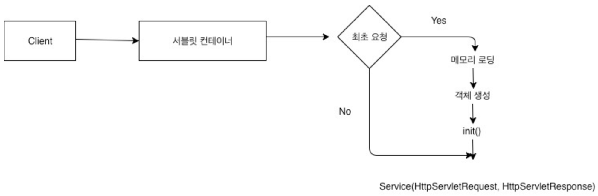
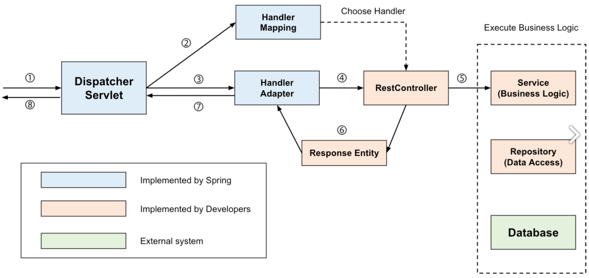
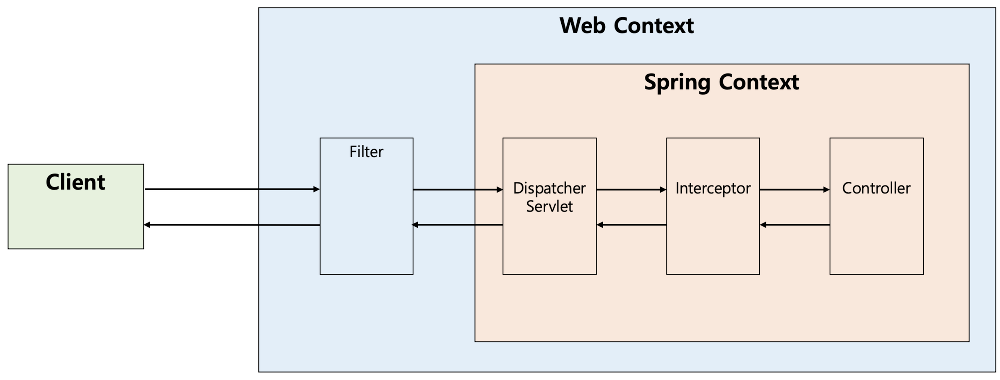
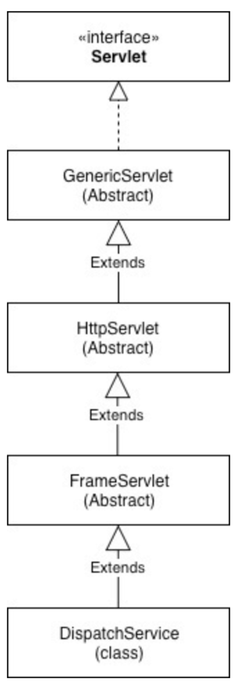
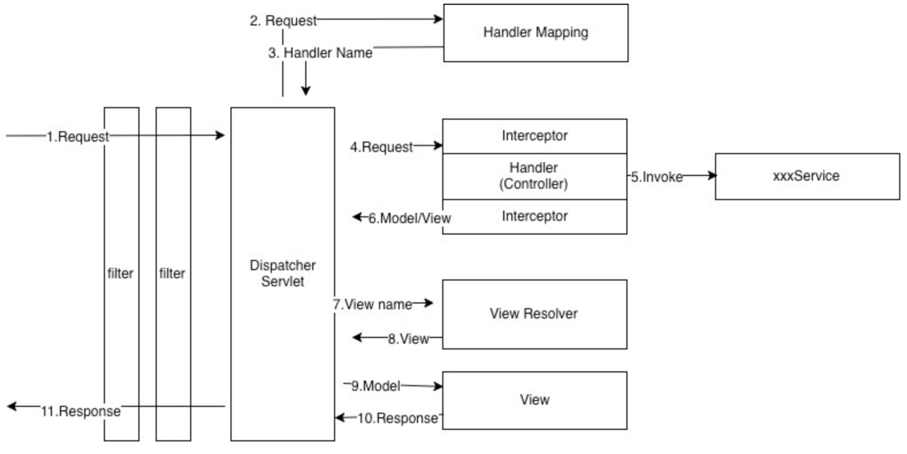
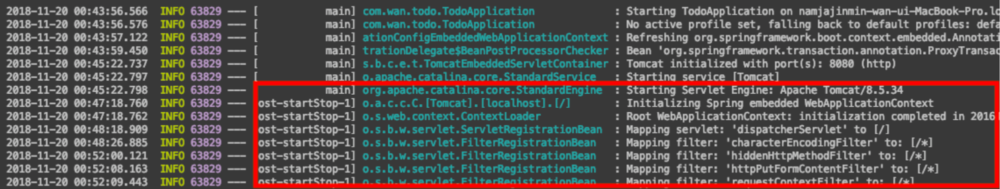
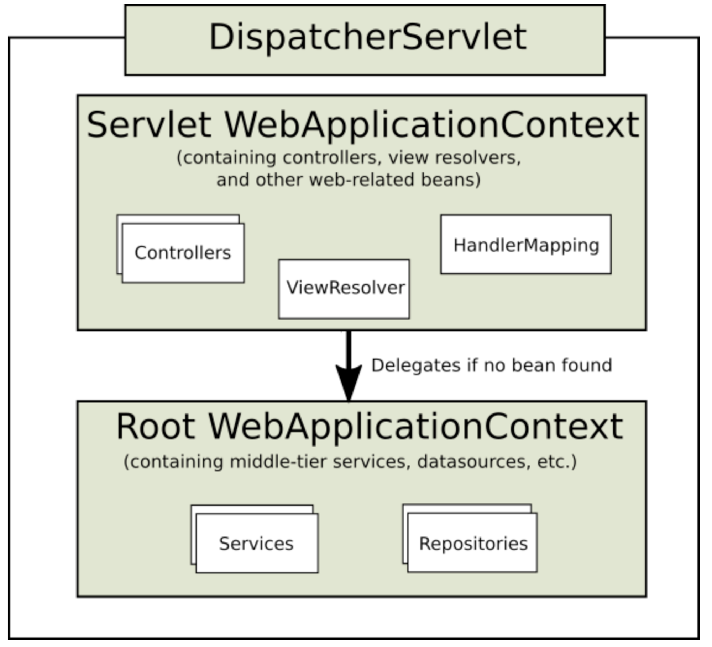

# Request 처리 방식(DispatcherServlet)

## 요약

- DispatcherServlet은 클라이언트의 요청을 받아 어댑터 핸들러를 통해 컨트롤러에게 위임하는 front controller이다
- 스프링 프레임워크는 톰캣 같은 서블릿 컨테이너(DispatcherServlet)이 요청을 받으며, 스프링 부트는 이 서블릿 컨테이너를 DispatcherServlet이라는 스프링 빈에 등록하고 이후 모든 서블릿을 스프링 빈에 등록하여 요청을 처리하는 차이가 있다. 이는 스프링 부트가 내장 톰캣을 가지고 있기 때문이다

---

## DispatchServlet

- HTTP 프로토콜로 들어오는 모든 요청을 가장 먼저 받아 적합한 컨트롤러에 위임해주는 front controller
- 클라이언트로부터 어떤 요청이 오면 tomcat 같은 서블릿 컨테이너가 요청을 받게 됨
- 그리고 이 모든 요청을 front controller, DispatcherServlet이 가장 먼저 받음
- 이후 DispatcherServlet은 공통적인 작업을 먼저 처리 후 해당 요청을 처리해야하는 컨트롤러를 찾아 작업 위임

### 서블릿 컨테이너
- 웹 애플리케이션 서버 중에서 HTTP 요청을 받아 처리하는 기초 역할을 맡음
- 대부분 웹 프레임워크가 제공하는 기능은 서블릿 컨테이너 위에서 동작하는 서블릿, 필터, 이벤트 리스너 등을 적절히 구현한 것
- 사용자가 웹 프레임워크로 작성한 웹 애플리케이션은 결국 서블릿 컨테이너 위에서 동작
- 종류로는 `apache tomcat`, `jetty` 등이 있음

#### Servlet

- 서블릿 프로그램을 개발할 때 반드시 구현해야 하는 메서드를 선언하고 있는 인터페이스

#### GenericServlet

- `Servlet` 인터페이스를 상속하여 클라이언트-서버 환경에서 서버 단의 애플리케이션으로서 필요한 기능을 구현한 추상 클래스
- `service()` 메서드를 제외한 모든 매세드를 재정의하여 적절한 기능으로 구현
- 해당 클래스를 상속하면 애플리케이션의 프로토콜에 따라 메서드 재정의 구문을 적용해야 함

#### HttpServlet
- 일반적으로 서블릿이라하면 거의 대부분 `HttpServlet`을 상속받은 서블릿을 말함
- `GenericServlet`을 상속 받아 `GenericServlet`의 유일한 추상 메서드인 `service()`를 HTTP 프로토콜 요청 메서드에 적합하게 재구현
- 이미 DELETE, GET, HEAD, OPTIONS, POST, PUT, TRAC를 처리하는 메서드가 모두 정의됨

#### 서블릿 실행 순서

1. 서블릿 컨테이너는 클라이언트로부터 처음 요청이 들어오면 현재 실행할 서블릿이 최초 요청인지 판단하고 없으면 해당 서블릿을 새로 생성 -> 해당 요청은 최초 1회
2. `init()` 메서드는 해당 사용자 서블릿이 최초 생성되고 바로 호출
3. `service()` 메서드는 최초든 상관않고 계속 호출
4. 서블릿 컨테이너 종료 시 `HttpServlet`의 `destroy()` 메서드 호출

### 장점

- Spring MVC는 `DispatcherServlet`이 등장하면서 `web.xml` 역할을 상당히 축소시킴
- 과거엔 모든 서블릿을 URL 매핑을 위해 `web.xml`에 등록해줘야 했음
- `DispatcherServlet`이 애플리케이션으로 들어오는 모든 요청을 핸들링해주고 공통 작업을 처리하면서 편리하게 이용하게 됨
- 컨트롤러를 구현해두기만 하면 `DispatcherServlet`이 알아서 적합한 컨트롤러로 위임해줌

### 정적 자원(Static Resource) 처리
- DispatcherServlet의 요청을 컨트롤러에 넘겨주는 방식은 효율적으로 보임
- 하지만 DispatcherServlet이 모든 요청을 처리하다보니 이미지, HTML, CSS, Javascript 같은 정적 파일에 대한 요청마저 모두 가로챔
- 이로 인해 정적 자원을 불러오지 못하는 상황도 발생
- 이를 위한 해결 방법으로 2가지 제시

#### 정적 자원 요청과 애플리케이션 요청 분리

1. `/apps`의 URL 접근 시 `DispatcherServlet` 담당
2. `/resources`의 URL 접근 시 `DispatcherServlet`이 컨트롤할 수 없으므로 담당하지 않음

---

- 괜찮은 방법이긴 하나, 코드가 지저분해짐 → 모든 요청에 대해 URL을 붙여줘야 하므로 직관적인 설계가 될 수 없음

#### 애플리케이션 요청을 탐색하고 없으면 정적 자원 요청으로 처리
1. `DispatcherServlet` 요청을 처리할 컨트롤러를 먼저 찾음
2. 요청에 대한 컨트롤러를 찾을 수 없는 경우에 2차적으로 설정된 자원(Resource) 경로를 탐색하여 자원 탐색

---

- 이렇게 영역 분리 시 효율적인 리소스 관리 지원 및 추후 확장 용이

### DispatcherServlet 동작 과정

1. 클라이언트 요청을 `DispatcherServlet`이 받음
    
    - Servlet Context(Web Context)에서 filter를 지나 Spring Context에서 `DispatcherServlet`이 가장 먼저 요청을 받음
    - 여기서 Interceptor가 Controller로 요청을 위임하지 않음
2. 요청 정보를 통해 요청을 위임할 컨트롤러를 찾음
    - `DispatcherServlet`은 요청을 처리할 핸들러(컨트롤러)를 찾고 해당 객체의 메서드를 호출 ⇒ 이 역할을 하는게 HandlerMapping
    - 근래엔 `@Controller`에, `@RequestMapping` 관련 에너테이션을 사용해 컨트롤러를 작성하는게 일반적
    - 컨트롤러의 구현 방법은 다양하므로 `HandlerMapping` 인터페이스를 만들어두고, 다양한 방법에 따라 요청을 처리할 대상을 찾도록 됨
3. 요청을 컨트롤러로 위임할 핸들러 어댑터를 찾아 전달
    - 이후 컨트롤러 요청을 위임해야 함
    - `DispatcherServlet`은 컨트롤러로 요청을 직접 위임하는게 아닌 `HandlerAdapter`를 통해 위임
    - 컨트롤러의 구현 방식이 다양하기 때문
    - 스프링은 오래전(2004)에 만들어졌음에도 트렌트 반영이 빠름
    - 과거엔 컨트롤러를 `Controller` 인터페이스로 구현
    - Ruby On Rails가 에너테이션 기반으로 관레를 이용한 프로그래밍을 내세워 혁신을 일으킴, 스프링도 이를 도입
    - 다양하게 작성되는 컨트롤러에 대응하기 위해 `HandlerAdapter`라는 어댑터 인터페이스를 통해 어댑터 패턴 적용
    - 컨트롤러 구현 방식에 상관 없이 요청 위임 가능하게 함
4. 핸들러 어댑터가 컨트롤러로 요청을 위임
    - 핸들러 어댑터가 컨트롤러로 요청 위임 전/후에 공통적인 전/후처리 과정이 필요, 이를 어댑터 핸들러에서 처리
      1. interceptor를 포함해 요청 시 `@RequestParam`, `@RequestBody` 등을 처리하기 위한 `ArgumentResolver`
      2. 응답 시 `ResponseEntity`의 Body를 json으로 직렬화하는 등의 처리하는 `ReturnValueHandler`
    -`ArgumentResolver` 등을 통해 파라미터가 준비되면 리플렉션을 이용해 컨트롤러로 요청을 위임
5. 비즈니스 로직 처리
    - 컨트롤러는 서비스를 호출하고, 작성한 비즈니스 로직을 진행
6. 컨트롤러가 반환 값을 처리
    - 비즈니스 로직 처리 이후 컨트롤러가 반환 값을 반환
      1. 응답 데이터를 사용하는 경우 주로 `ResponseEntity`를 반환
      2. 응답 데이터를 보여주는 경우 String으로 View의 이름을 반환
    - 요즘은 FE, BE를 분리하고 MSA로 가고 있기에 주로 `ResponseEntity`를 반환
7. 핸들러 어댑터가 반환 값을 처리
    - 핸들러 어댑터는 컨트롤러부터 받은 응답을 응답 처리기인 `ResturnValueHandler`가 후처리한 후 `DispatcherServlet`에게 돌려줌
      1. `ResponseEntity` 반환 시 `HttpEntityMethodProcessor`가 `MessageConverter`를 사용해 응답 객체를 직렬화하고 응답 상태(`HttpStatus`)를 설정
      2. View 이름 반환 시 `ViewResolver`를 통해 View 반환
8. 서버의 응답을 클라이언트로 반환
    - `DispatcherServlet`을 통해 반환하는 응답은 다시 filter를 거쳐 클라이언트에게 반환됨
      1. 응답이 데이터라면 그대로 반환
      2. 응답이 화면이라면 View의 이름에 맞는 View를 찾아서 반환해주는 `ViewResolver`가 적절한 화면을 내려줌

## 스프링 부트에서 Servlet

- 스프링 부트는 내장 톰캣(서블릿 컨테이너)을 가짐
- 스프링 부트에서 사용자 정의 프로그램을 구현한 프로그램인 서블릿은 `DispatcherServlet` → Front Controller 역할

### 실행 과정

- `ServletContainerIntializer`를 구현한 `TomcatStartter`의 `onStartup` 메서드 먼저 실행, 톰캣 실행 후 조건 만족 시 `DispatcherServlet`이 등록됨
   
    1. `DispatcherServlet`이 스프링에 빈으로 등록됨
    2. 서블릿 컨테이너 컨텍스트에 서블릿 등록
    3. 서블릿 컨테이너 필터에 등록 및 설정해놓은 filter 등록
    4. `DispatcherServlet`에 각종 핸들러 매핑(자원 URL)들을 등록
- 이후 `DispatcherServlet`이 Front Controller 역할을 하게 됨
    > 💡 서블릿 컨테이너처럼 요청이 왔을 때 객체를 생성하는 것이 아닌, 이미 컨트롤러들이 빈으로 등록되어져 있다는 것을 알아야 함

    1. `FrameworkServlet.service()` 진입
    2. `FrameworkServlet.service()`는 `dispatch.doService()`를 호출
    3. `dispatch.doService()`는 `dispatch.doDispatch()`를 실행
    4. `doDispatch()`는 `AbastractHandlerMapping`에서 핸들러(컨트롤러)를 가져옴
    5. Interceptor를 지나 해당 컨트롤러 메서드로 이동
    6. 해당 핸들러는 MV(Model, View)를 리턴
    7. `@RestController` 컨트롤러 같은 경우 컨버터를 이용해 바로 결과 값 반환
    8. View에 대한 정보가 없으면 `ViewResolver`에 들려 뷰 객체를 얻음
    9. View를 통해 렌더링

## Application Context

- `DispatcherServlet`이 생성되면서 `WebApplicationContext`가 생성됨
  1. 스프링 `ContextLoader에` 의해 생성되는 `Root WebApplicationContext`
  2. `Dispatch`에 의해 생성되는 `Servlet WebApplicationContext`
- 이 둘은 상위-하위 관계, 이를 통해 `DispatcherServlet`을 등록하면 `RootWebApplicationContext`를 공유하기 위해서 사용할 수 있음

# Reference

[[Spring] Dispatcher-Servlet(디스패처 서블릿)이란? 디스패처 서블릿의 개념과 동작 과정](https://mangkyu.tistory.com/18)

[서블릿 컨테이너, 스프링부트 동작 과정](https://wrkbr.tistory.com/520)