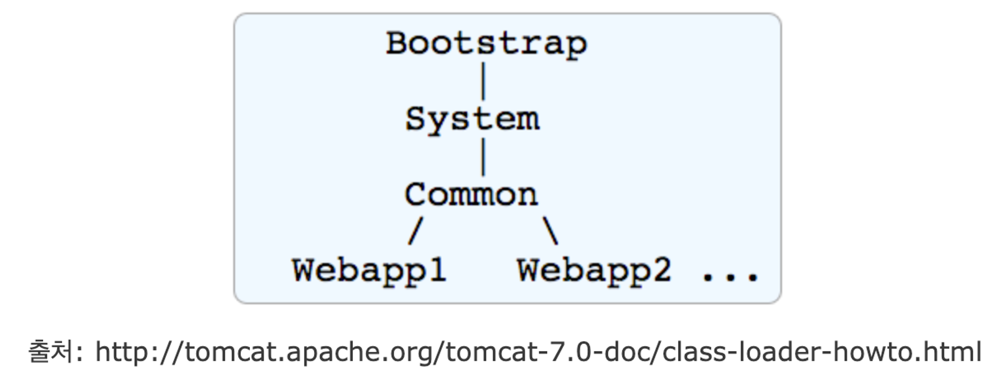
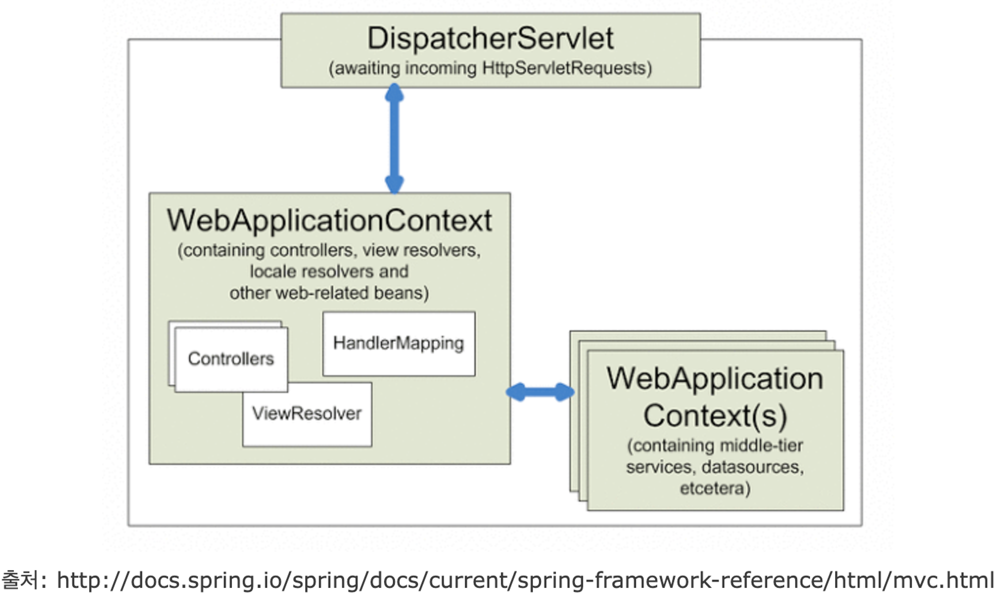

# Java Singleton vs. Spring Singleton

## 요약

- Java Singleton의 공유 범위는 classloader이다
- Spring Singleton의 공유 범위는 ApplicationContext, Spring IoC Container이다
- Spring에서 singleton을 사용하는 이유는 대규모 트래픽 처리하기 위함이다
    - 매 요청이 올 때마다 객체가 생성되면 GC 감당하기가 어렵다
    - 그래서 bean으로 등록해 요청이 오면 여러 쓰레드가 singleton을 공유해서 처리한다
- Java는 상위 classloader의 singleton을, Spring은 상위 root context의 singleton을 공유할 수 있다
- Spring singleton이 더 선호되는 이유는
    1. private, static을 사용하지 않아 객체지향적 개발이 가능하다
    2. Singleton registry에서 관리하여, 서버 환경에서 singleton이 1개만 생성됨을 보장할 수 있기 때문이다
       (Tomcat의 경우 여러 classloader를 기반으로 서버를 구동하기 때문에 같은 class의 여러 singleton이 생성될 수 있다)
    3. 테스트하기 편리하기 때문이다

---

## Java Singleton
- `static`을 이용한 Singleton 패턴
- 공유 범위는 `classloader` 기준

### Tomcat 7 기준

- JVM이 실행되면 하나의 classloader로 모든 클래스를 로딩하는 것은 착각
- Tomcat에선 classloader를 계층적으로 관리함
- 각 웹 애플리케이션(하나의 war 덩어리)마다 classloader를 따로 사용함
- 다르게 말하면 서로 다른 war 파일에 속한 클래스들끼리는 상호 참조가 불가능
- 동일한 class를 사용하더라도 static 변수를 공유하지 않음
- 상위 classloader에 있는 클래스는 하위 classloader에서 참조는 가능
- 따라서 java static기반 singleton의 사용 범위는 webapp 자신 또는 부모의 classloader임

## Spring Singleton

- Spring Singleton의 공유 범위는 Application Context(Spring Container)
- 하나의 war 파일 안에는 `web.xml`에 등록된 여러 Servlet이 있을 수 있음
- Spring은 DispatcherServlet이라는 Servlet을 사용
- DispatcherServlet은 여러 개가 등록될 수 있음

> 💡 **DispatcherServlet** 
> - HTTP에 들어오는 모든 요청을 가장 먼저 받아 적합한 컨트롤러에 위임해주는 프론트 컨트롤러(Front Controller)
> - 클라이언트로부터 요청이 오면 tomcat 같은 서블릿 컨테이너가 요청을 받고 그리고 DispatcherServlet이 가장 먼저 받음
> - DispatcherServlet은 공통적 작업을 먼저 수행 후 해당 요청을 처리해야 하는 컨트롤러를 찾아서 작업을 위임

- 일반적으로 spring-mvc에서는,
  1. contextConfigLocation으로 지정해주는 root context
  2. Servlet으로 등록해주는 DispatcherServlet context
- 가 있음
- DispatcherServlet는 각 하나의 context를 가짐
- 여러 DispatcherServlet을 서블릿으로 등록 시 개개는 독립된 context를 구성하면서 상호 참조가 불가능해짐
- 물론 상위 context인 root context는 서로 접근 가능

### Spring에서 singleton을 사용하는 이유

- ApplicationContext에 의해 등록된 bean은 기본적으로 singleton으로 관리됨
- 즉, 여러번 bean을 요청하더라도 매번 동일한 객체를 돌려줌
- Singleton으로 bean을 관리하는 이유는 대규모 트래픽을 처리할 수 있도록 하기 위함
- 최초 설계 때부터 대규모 엔터프라이즈 환경에서 요청 처리할 수 있도록 고안됨
- 그리고 그에 따라 계층적 구조(Controller, Service, Repository 등)가 나뉨
- 매번 클라이언트 요청이 올 때마다 각 로직을 처리하는 bean을 새로 만들어서 사용한다 가정
  - 요청 1번에 5개 객체가 생성
  - 초당 500번의 요청이 온다면
  - 초당 2500개의 새로운 객체 생성
- 아무리 GC 성능이 좋아졌다해도 감당하기 어려움
- 그래서 bean을 singleton 스코프로 관리하여 1개의 요청이 왔을 때 여러 쓰레드가 bean을 공유해서 처리하도록 함

## Spring Singleton이 선호되는 이유

### Java Singleton의 문제점

1. private로 생성자를 가지고 있어 상속이 불가능
2. 테스트하기 어려움
3. 서버 환경에서는 singleton이 1개만 생성되는 것을 보장할 수 없음
   - (Tomcat에서는 여러 classloader가 구동됨)
4. 전역 상태를 만들 수 있기 때문에 객체지향적이지 못함

### Singleton Registry

- Spring은 직접 singleton 형태의 오브젝트를 만들고 관리하는 기능을 제공 ⇒ `Singleton Registry`
- Spring Container는 singleton을 생성, 관리 및 공급하는 container이기도 함
- Singleton Registry의 장점은,
  1. static 메서드나 private 생성자 등을 사용하지 않아 객체지향적 개발이 가능
  2. 테스트하기 편리
- 직접 singleton을 구현한다면 상당히 많은 단점이 존재
- Spring Framework에서 직접 singleton으로 객체를 관리해주므로 보다 객체지향적 개발에 집중할 수 있음

# Reference

[[펌]Spring의 Singleton과 Java static기반 Singleton패턴의 차이](https://enterkey.tistory.com/300)

[[Spring] Dispatcher-Servlet(디스패처 서블릿)이란? 디스패처 서블릿의 개념과 동작 과정](https://mangkyu.tistory.com/18)

[[Spring] 애플리케이션 컨텍스트(Application Context)와 스프링의 싱글톤(Singleton)](https://mangkyu.tistory.com/151?category=761302)