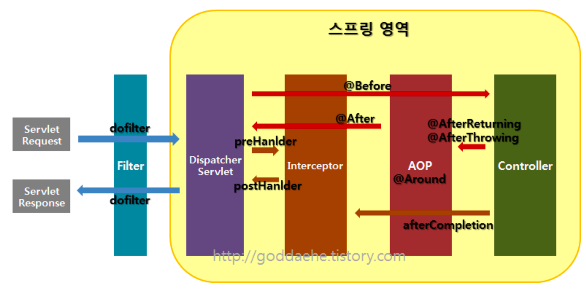

# Filter vs. Interceptor vs. AOP

## 요약
- 실행 흐름은 Filter -> Interceptor -> AOP -> Interceptor -> Filter 순이다
- Filter는 요청과 응답을 정제하는 깁버이며, 인코딩 변환 및 XSS 방어에 주로 활용된다
- Interceptor는 요청에 대한 작업을 전후로 가로채 처리하며, DispatcherServlet이 컨트롤러 호출 전후로 끼어들어 컨트롤러에 대한 요청과 응답을 처리한다
- AOP는 비즈니스 로직과 공통 로직을 분할하여 모듈화한 처리 기법이며, 비즈니스 단에서 메서드 전후를 처리한다
- 셋의 차이점은 처리 시점이며, 이에 따라 역할이 다르다
  - Filter는 Spring Context와 관련 없는 부분을 처리한다
  - Interceptor는 Spring Context에 포함되어 컨트롤러 단에서 처리한다
  - AOP는 비즈니스 로직 단에서 처리한다

---

## Overall Flow

- `Filter`와 `Interceptor`는 Servlet 단에서 실행
- `AOP`는 메서드 앞에 Proxy 패턴 형태로 실행
- 따라서 요청이 들어오면 `Filter -> Interceptor -> AOP -> Interceptor -> Filter` 순서를 거침

## Filter
- 요청과 응답을 정제하는 역할 담당 => 요청, 응답 단 처리
- DispatcherServlet 이전에 실행, 지정된 자원의 앞단에서 요청 내용을 변경하거나 유효성 검사가 가능함
- 보통 `web.xml`에 등록하고, 일반적으로 인코딩 변환, XSS 방어 등의 요청에 대한 처리로 사용됨
- ex. 필터 이름은 `encoding`, 값은 `UTF-8`인 파라미터로 정의
  ```xml
  <!-- 한글 처리를 위한 인코딩 필터 -->
  <filter>
      <filter-name>encoding</filter-name>
      <filter-class>org.springframework.web.filter.CharacterEncodingFilter</filter-class>
      <init-param>
          <param-name>encoding</param-name>
          <param-value>UTF-8</param-value>
      </init-param>
  </filter>
  <!-- url-pattern을 /*로 정의, servlet, jsp 뿐만 아니라 이미지 같은 모든 자원 요청에도 호출 -->
  <filter-mapping>
      <filter-name>encoding</filter-name>
      <url-pattern>/*</url-pattern>
  </filter-mapping>
  ```
- 실행 메서드
  - `init()`: Filter 인스턴스 초기화
  - `doFiler()`: 전후 처리
  - `destroy()`: 필터 인스턴스 종료
  
## Interceptor
- 요청에 대한 작업을 전후로 가로챔
- DispatcherServlet이 컨트롤러를 호출하기 전후로 끼어들어 Spring Context 내부에서 컨트롤러`Handler`에 대한 요청과 응답 처리
  - 반면, `Filter`는 Spring Context 외부에 존재하여 스프링과 무관한 자원을 처리
- **이는 스프링의 모든 빈 객체에 접근할 수 있음을 의미**
- `Interceptor`는 여러 개를 사용할 수 있어, 로그인 체크, 권한 체크, 프로그램 실행 시간 계산 작업, 로그 확인 동의 업무 처리
- 실행 메서드
  - `preHandler()` : 컨트롤러 메서드가 실행되기 전
  - `postHandler()` : 컨트롤러 메서드가 실행 직후 view 페이지 렌더링 되기 전
  - `afterCompletion()` : view 페이지가 렌더링된 후

## AOP
- 비즈니스 로직과 공통된 로직을 분할해, 모듈화하는 처리 기법
- 주로 로깅, 트랜잭션, 에러 처리 등 비즈니스 단의 메서드에서 세밀하게 조정하고 싶을 때 사용 => `@Transcational`이 여기 속함
- `Filter`나 `Interceptor`와 달리 메서드 전후 지점에 자유롭게 설정 가능
- `Interceptor`는 컨트롤러`Handler` 전후 처리를 담당, 주소로 대상을 구분
- `AOP`는 Proxy 패턴 기반 메서드 전후 처리를 담당, 주소 파라미터 에너테이션 등 다양한 방법으로 대상을 구분

## Filter vs. Interceptor vs. AOP
- `Filter`는 요청과 응답에 대한 처리를 담당하며 주소로 대상을 구분
- `Interceptor`는 컨트롤러Handler 전후 처리를 담당하며 주소로 대상을 구분
- `AOP`는 Proxy 패턴 기반 메서드 전후 처리를 담당하며 주소, 파라미터, 에너테이션 등 다양한 방법으로 대상을 구분

# Reference
[[Spring] Filter, Interceptor, AOP 차이 및 정리](https://goddaehee.tistory.com/154)
